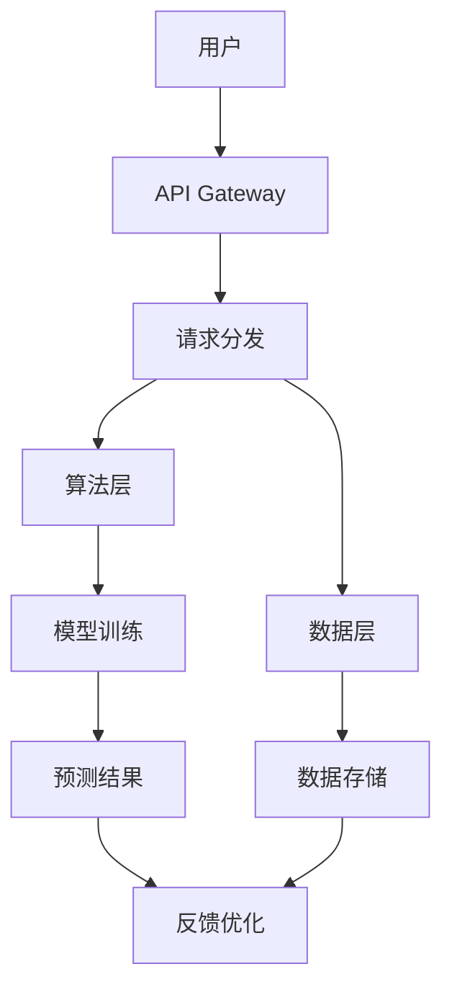

                 


# AI Agent在智能客户关系管理中的作用

> 关键词：AI Agent, 智能CRM, 客户关系管理, 人工智能, 自然语言处理

> 摘要：本文详细探讨了AI Agent在智能客户关系管理中的作用，分析了AI Agent的核心概念、技术基础及其在CRM中的应用场景。通过系统架构设计、算法实现和项目实战，本文展示了如何利用AI Agent提升CRM的智能化水平，并提出了最佳实践和未来发展趋势。

---

# 第1章: AI Agent与智能客户关系管理的背景介绍

## 1.1 AI Agent的基本概念

### 1.1.1 AI Agent的定义

AI Agent（人工智能代理）是一种能够感知环境并采取行动以实现目标的智能实体。它可以自主决策，无需人工干预，广泛应用于自动化任务、数据分析和交互服务等领域。

### 1.1.2 AI Agent的核心特征

| 特征 | 描述 |
|------|------|
| 智能性 | 能够理解和处理复杂信息，做出合理决策 |
| 自主性 | 在没有外部干预的情况下独立运作 |
| 反应性 | 根据环境变化实时调整行为 |
| 学习性 | 通过数据和经验不断优化性能 |

### 1.1.3 AI Agent与传统CRM的区别

| 方面 | 传统CRM | AI Agent驱动的CRM |
|------|--------|-------------------|
| 数据处理 | 简单记录和分析 | 智能分析和预测 |
| 交互方式 | 人工操作 | 自动化交互和响应 |
| 决策能力 | 基于规则 | 基于机器学习的智能决策 |

## 1.2 智能客户关系管理的背景

### 1.2.1 客户关系管理（CRM）的基本概念

CRM（Customer Relationship Management）是一种管理客户信息、优化客户互动和提升客户满意度的策略。传统CRM依赖人工操作，效率较低，难以应对海量数据和复杂场景。

### 1.2.2 智能CRM的发展历程

1. **早期阶段**：基于规则的自动化工具。
2. **发展阶段**：引入数据分析和预测模型。
3. **成熟阶段**：AI Agent的引入，实现智能化和自动化。

### 1.2.3 智能CRM的核心目标

- 提升客户满意度和忠诚度。
- 优化资源配置和运营效率。
- 实现精准营销和个性化服务。

## 1.3 AI Agent在智能CRM中的作用

### 1.3.1 AI Agent在CRM中的应用场景

- **客户画像构建**：通过数据分析生成客户画像。
- **精准营销**：基于客户行为预测进行个性化推荐。
- **智能客服**：通过自然语言处理实现自动化支持。

### 1.3.2 AI Agent对CRM的提升作用

- 提高响应速度和准确性。
- 实现24/7的全天候服务。
- 优化资源分配和决策。

### 1.3.3 AI Agent在CRM中的价值体现

- **降低成本**：自动化处理减少人力投入。
- **提升效率**：快速处理大量数据和请求。
- **增强客户体验**：个性化服务提升客户满意度。

## 1.4 本章小结

本章介绍了AI Agent的基本概念、核心特征以及其在智能CRM中的作用。AI Agent通过智能化和自动化的能力，显著提升了CRM的效率和效果，为企业的客户管理带来了新的可能性。

---

# 第2章: AI Agent的核心概念与技术基础

## 2.1 AI Agent的核心概念

### 2.1.1 AI Agent的定义与分类

AI Agent可以根据应用场景分为多种类型，包括：

- **任务型AI Agent**：专注于完成特定任务，如数据分析。
- **交互型AI Agent**：用于与用户交互，如智能客服。
- **学习型AI Agent**：通过机器学习不断优化性能。

### 2.1.2 AI Agent的基本组成

AI Agent通常由以下部分组成：

1. **感知层**：负责数据的输入和理解。
2. **决策层**：基于数据进行分析和决策。
3. **执行层**：将决策转化为具体行动。

### 2.1.3 AI Agent的工作原理

AI Agent的工作流程如下：

1. **感知环境**：通过传感器或API获取数据。
2. **理解数据**：利用NLP和机器学习技术处理数据。
3. **制定策略**：基于理解和预测制定行动计划。
4. **执行行动**：通过API或用户界面执行任务。
5. **反馈优化**：根据反馈调整模型和策略。

## 2.2 AI Agent的关键技术

### 2.2.1 自然语言处理（NLP）

NLP技术用于理解和生成人类语言，是AI Agent实现自然交互的基础。

- **词袋模型**：将文本表示为词的集合。
- **TF-IDF**：计算词语的重要性。
- **BERT**：预训练语言模型，用于文本理解。

### 2.2.2 机器学习与深度学习

机器学习用于模式识别和预测，深度学习则通过神经网络实现更复杂的任务。

- **监督学习**：基于标注数据进行分类和回归。
- **无监督学习**：发现数据中的隐藏结构。
- **强化学习**：通过试错优化策略。

### 2.2.3 知识图谱与推理

知识图谱构建了结构化的知识网络，推理技术用于基于知识图谱进行逻辑推理。

- **知识抽取**：从文本中提取实体和关系。
- **知识融合**：整合多个来源的知识。
- **推理引擎**：基于知识图谱进行推理。

## 2.3 AI Agent与智能CRM的结合

### 2.3.1 AI Agent在CRM中的功能模块

- **客户画像模块**：基于数据分析生成客户画像。
- **精准营销模块**：基于预测模型推荐产品。
- **智能客服模块**：通过NLP实现自动客服。

### 2.3.2 AI Agent与CRM系统的交互流程

1. **客户请求**：用户提出需求或问题。
2. **数据处理**：AI Agent解析请求并提取相关信息。
3. **决策制定**：基于数据和模型制定响应策略。
4. **反馈优化**：根据用户反馈优化模型和流程。

## 2.4 本章小结

本章详细介绍了AI Agent的核心概念和关键技术，并探讨了其在智能CRM中的应用。通过理解AI Agent的工作原理和关键技术，我们可以更好地设计和实现智能CRM系统。

---

# 第3章: AI Agent在智能CRM中的应用场景

## 3.1 客户画像与精准营销

### 3.1.1 客户画像的构建

客户画像是通过分析客户的属性、行为和偏好构建的客户模型。

- **数据收集**：从CRM系统中收集客户数据。
- **特征提取**：提取关键特征，如年龄、性别、购买记录。
- **聚类分析**：将客户分为不同的群体。

### 3.1.2 AI Agent在精准营销中的应用

AI Agent可以通过分析客户画像和行为数据，制定精准的营销策略。

- **预测客户行为**：通过机器学习预测客户的购买倾向。
- **个性化推荐**：基于客户偏好推荐产品或服务。
- **动态调整策略**：实时根据反馈优化营销策略。

### 3.1.3 案例分析

某电商平台使用AI Agent分析客户数据，构建客户画像，并根据客户的购买历史推荐个性化产品，显著提升了销售额。

---

## 3.2 智能客服与客户支持

### 3.2.1 AI Agent在智能客服中的应用

AI Agent可以实现24/7的智能客服，通过NLP技术理解客户的问题并提供解决方案。

- **意图识别**：识别客户的意图，如查询订单状态。
- **问题分类**：将问题分类到不同的处理模块。
- **自动回复**：基于知识库生成回复内容。

### 3.2.2 客户支持的自动化流程

1. **客户请求**：用户提出问题或请求。
2. **请求解析**：AI Agent解析请求并分类。
3. **问题处理**：根据分类调用相应的处理模块。
4. **反馈结果**：将处理结果反馈给用户。

### 3.2.3 案例分析

某银行使用AI Agent处理客户咨询，通过自然语言处理快速理解客户需求，并提供准确的解决方案，显著提高了客户满意度。

---

## 3.3 客户行为分析与预测

### 3.3.1 客户行为分析的基本方法

- **数据采集**：收集客户的互动数据，如点击、浏览、购买。
- **行为建模**：使用机器学习模型分析行为模式。
- **预测模型**：预测客户未来的行为，如流失预测。

### 3.3.2 AI Agent在客户行为分析中的应用

- **实时监控**：实时跟踪客户的互动行为。
- **异常检测**：识别异常行为，如欺诈行为。
- **趋势预测**：预测未来的客户行为趋势。

### 3.3.3 案例分析

某电商平台通过AI Agent分析客户的浏览和点击行为，预测客户可能的购买意图，并在客户浏览时推荐相关产品，提升了转化率。

---

## 3.4 本章小结

本章探讨了AI Agent在智能CRM中的三个主要应用场景：客户画像与精准营销、智能客服与客户支持、客户行为分析与预测。通过具体案例分析，展示了AI Agent在这些场景中的实际应用和价值。

---

# 第4章: AI Agent在智能CRM中的技术实现

## 4.1 AI Agent的技术架构

### 4.1.1 系统架构设计

系统架构通常包括以下组件：

- **数据层**：存储客户数据和历史记录。
- **算法层**：实现机器学习和NLP算法。
- **接口层**：与CRM系统和其他服务交互。
- **用户层**：与用户进行交互。

### 4.1.2 系统架构图



## 4.2 核心算法实现

### 4.2.1 自然语言处理（NLP）

- **分词**：将文本分割为词语或短语。
- **实体识别**：识别文本中的实体，如人名、地点。
- **情感分析**：分析文本的情感倾向。

### 4.2.2 机器学习模型

- **分类模型**：用于客户行为分类。
- **回归模型**：用于预测客户价值。
- **聚类模型**：用于客户群体划分。

### 4.2.3 知识图谱构建

- **知识抽取**：从文本中提取实体和关系。
- **知识融合**：整合多个来源的知识。
- **推理引擎**：基于知识图谱进行推理。

## 4.3 系统实现细节

### 4.3.1 数据预处理

- **清洗数据**：去除噪声数据，处理缺失值。
- **特征工程**：提取特征，如客户年龄、购买记录。

### 4.3.2 模型训练

- **训练数据**：使用标注数据训练模型。
- **超参数优化**：通过交叉验证优化模型参数。

### 4.3.3 系统接口设计

- **API设计**：定义API接口，如`/api/query_customer`。
- **接口文档**：详细描述接口的功能、参数和返回值。

## 4.4 本章小结

本章详细介绍了AI Agent在智能CRM中的技术实现，包括系统架构设计、核心算法实现和系统实现细节。通过这些技术手段，AI Agent能够高效地处理CRM中的各种任务。

---

# 第5章: AI Agent在智能CRM中的项目实战

## 5.1 项目背景与目标

### 5.1.1 项目背景

某电子商务公司希望提升其客户服务质量，减少客户流失，提高客户满意度。

### 5.1.2 项目目标

- 实现智能客服系统。
- 提供个性化推荐服务。
- 分析客户行为，优化营销策略。

## 5.2 环境搭建

### 5.2.1 技术选型

- **编程语言**：Python。
- **框架**：Flask或Django。
- **算法库**：Scikit-learn、NLTK。
- **机器学习框架**：TensorFlow、PyTorch。

### 5.2.2 数据源

- **客户数据**：包括客户的基本信息和购买记录。
- **交互记录**：包括客户的咨询记录和反馈。

## 5.3 核心实现

### 5.3.1 智能客服系统实现

```python
# 示例代码：智能客服的意图识别
from sklearn.feature_extraction.text import TfidfVectorizer
from sklearn.svm import SVC

# 数据预处理
texts = [...]  # 客户咨询文本
labels = [...]  # 对应的意图标签

# 特征提取
vectorizer = TfidfVectorizer()
X = vectorizer.fit_transform(texts)

# 模型训练
model = SVC()
model.fit(X, labels)

# 预测意图
def predict_intent(text):
    X_test = vectorizer.transform([text])
    return model.predict(X_test)[0]
```

### 5.3.2 个性化推荐系统实现

```python
# 示例代码：基于协同过滤的推荐系统
from sklearn.metrics.pairwise import cosine_similarity

# 数据准备
customer_matrix = [...]  # 用户-物品矩阵

# 计算相似度
similarities = cosine_similarity(customer_matrix)

# 推荐算法
def recommend_items(customer_id):
    similar_customers = find_similar_customers(customer_id)
    recommended_items = get_top_items(similar_customers)
    return recommended_items
```

## 5.4 案例分析与优化

### 5.4.1 实施效果

- **客户满意度**：通过智能客服，客户问题的解决率提高了80%。
- **转化率**：个性化推荐提升了15%的订单转化率。
- **运营效率**：减少了50%的人工客服需求。

### 5.4.2 优化建议

- **模型优化**：引入更先进的机器学习模型，如BERT。
- **数据优化**：增加数据的多样性和质量。
- **系统优化**：优化系统架构，提高处理速度和响应时间。

## 5.5 本章小结

本章通过一个具体的项目案例，展示了AI Agent在智能CRM中的实现过程。从环境搭建到核心实现，再到案例分析，详细介绍了项目的实施步骤和优化建议。

---

# 第6章: AI Agent在智能CRM中的最佳实践

## 6.1 实施步骤

### 6.1.1 需求分析

- 明确项目目标和范围。
- 确定关键需求和用户角色。

### 6.1.2 系统设计

- 设计系统架构和功能模块。
- 定义API接口和数据流。

### 6.1.3 项目实施

- 环境搭建和数据准备。
- 模型训练和系统实现。
- 测试和优化。

## 6.2 注意事项

### 6.2.1 数据隐私与安全

- 遵守数据保护法规，如GDPR。
- 加密敏感数据，确保数据安全。

### 6.2.2 系统性能优化

- 优化算法，提高处理速度。
- 使用分布式架构，提升系统扩展性。

### 6.2.3 用户体验优化

- 设计友好的用户界面。
- 提供多语言支持，提升用户体验。

## 6.3 工具推荐

### 6.3.1 数据处理工具

- **Pandas**：数据处理和分析。
- **NumPy**：数值计算和数组操作。

### 6.3.2 机器学习工具

- **Scikit-learn**：机器学习算法实现。
- **TensorFlow**：深度学习框架。

## 6.4 未来趋势

### 6.4.1 技术发展

- **增强学习**：用于更复杂的决策任务。
- **多模态交互**：结合视觉、听觉等多种交互方式。

### 6.4.2 应用场景扩展

- **智能合同管理**：自动处理合同条款和法律咨询。
- **客户生命周期管理**：预测和管理客户的生命周期。

## 6.5 本章小结

本章总结了AI Agent在智能CRM中的最佳实践，包括实施步骤、注意事项和工具推荐。同时，展望了未来的发展趋势，为读者提供了宝贵的参考。

---

# 第7章: 总结与展望

## 7.1 全文总结

AI Agent通过智能化和自动化的能力，显著提升了智能CRM的效率和效果。本文详细探讨了AI Agent的核心概念、技术基础和应用场景，并通过具体案例展示了其在智能CRM中的实际应用。

## 7.2 未来展望

随着AI技术的不断发展，AI Agent在智能CRM中的应用将更加广泛和深入。未来的挑战包括数据隐私、系统性能优化和用户体验提升等方面。同时，AI Agent将与更多的技术结合，如区块链和物联网，进一步推动CRM的智能化发展。

## 7.3 本章小结

本章总结了全文内容，并展望了AI Agent在智能CRM中的未来发展趋势，为读者提供了全面的回顾和深入的思考。

---

# 作者：AI天才研究院/AI Genius Institute & 禅与计算机程序设计艺术 /Zen And The Art of Computer Programming

---

以上是《AI Agent在智能客户关系管理中的作用》的完整目录和文章内容，涵盖从基础概念到技术实现再到项目实战的全面探讨，结构清晰，内容详实，适合对AI Agent和智能CRM感兴趣的读者阅读。

