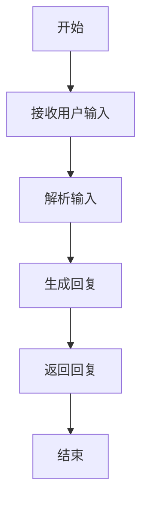
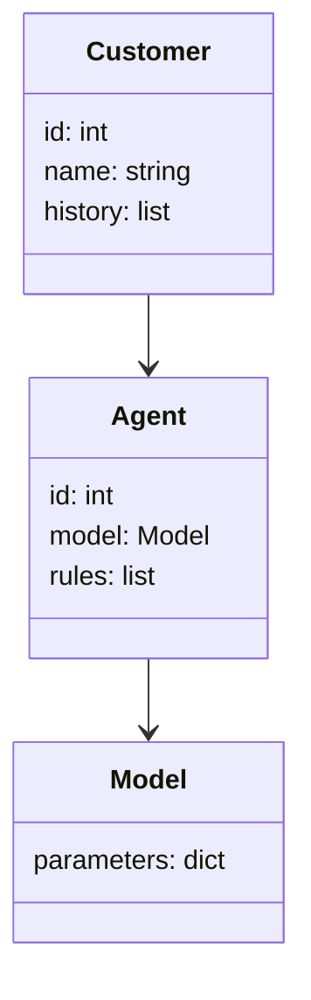
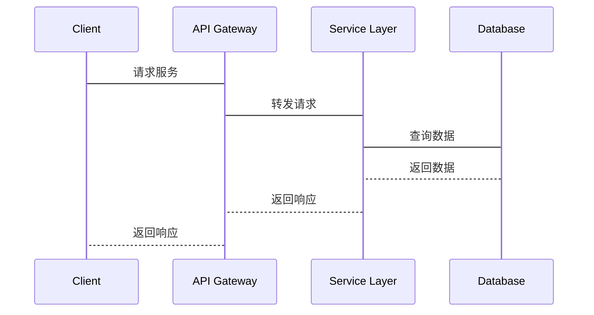

                 


# AI Agent在智能客户服务中的角色

> 关键词：AI Agent, 智能客服, 自然语言处理, 机器学习, 强化学习, 对话系统

> 摘要：本文深入探讨AI Agent在智能客户服务中的角色，从背景介绍、核心概念、算法原理到系统架构、项目实战，全面解析AI Agent如何通过自然语言处理和机器学习技术提升客户服务体验。文章还提供了实际案例和最佳实践，帮助读者理解AI Agent在智能客服中的应用价值。

---

## 第1章: 背景介绍

### 1.1 AI Agent的基本概念
AI Agent（人工智能代理）是指能够感知环境并采取行动以实现目标的智能实体。在智能客服领域，AI Agent通常以聊天机器人或语音助手的形式出现，通过自然语言处理技术与用户交互，提供高效的服务体验。

### 1.2 问题背景
传统客服系统依赖人工操作，存在响应速度慢、成本高等问题。随着AI技术的进步，AI Agent能够实时处理大量客户需求，显著提升了服务效率和客户满意度。

### 1.3 问题描述
智能客服的核心挑战在于如何准确理解客户需求并提供及时有效的解决方案。AI Agent通过自然语言处理和机器学习技术，能够实现智能化的客户互动。

### 1.4 问题解决
AI Agent通过以下方式解决智能客服问题：
1. **自动化处理**：快速响应客户需求，减少人工干预。
2. **个性化服务**：根据客户历史数据提供定制化建议。
3. **24/7可用性**：全天候为客户提供服务，提升用户体验。

### 1.5 边界与外延
AI Agent的边界在于其处理能力的限制，例如复杂问题的解决仍需人工介入。外延则包括AI Agent在其他领域的应用，如智能家居和自动驾驶。

### 1.6 核心要素组成
AI Agent由感知模块、决策模块和执行模块组成，分别负责理解用户输入、制定响应策略和输出结果。

---

## 第2章: 核心概念与联系

### 2.1 核心概念
AI Agent的关键概念包括：
- **自然语言处理（NLP）**：理解并生成人类语言。
- **机器学习（ML）**：从数据中学习模式以改进性能。
- **强化学习（RL）**：通过奖励机制优化决策过程。

### 2.2 概念属性对比
以下是核心概念的对比表格：

| 概念       | 描述                                                                 |
|------------|----------------------------------------------------------------------|
| NLP        | 理解和生成人类语言的技术，如分词、句法分析和情感分析。             |
| ML         | 通过数据训练模型，使其能够识别模式和做出预测。                  |
| RL         | 基于奖励机制优化决策，常用于对话管理和策略选择。                  |

### 2.3 ER实体关系图
以下是一个简单的ER图，展示AI Agent系统中的实体关系：

```mermaid
er
  customer
  agent
  interaction
  rule
  model
  feedback
  action
```

---

## 第3章: 算法实现与优化

### 3.1 算法原理
AI Agent的算法实现通常涉及以下步骤：
1. **数据预处理**：清洗和标注数据。
2. **模型训练**：使用机器学习或深度学习模型进行训练。
3. **对话管理**：根据上下文生成合适的回复。

### 3.2 Mermaid流程图
以下是一个AI Agent算法的流程图：



### 3.3 数学模型
以下是自然语言处理中常用的注意力机制公式：

$$
\text{Attention}(Q, K, V) = \text{softmax}\left(\frac{QK^T}{\sqrt{d_k}}\right)V
$$

其中：
- $Q$ 是查询向量。
- $K$ 是键向量。
- $V$ 是值向量。
- $d_k$ 是键的维度。

### 3.4 算法优化
通过引入强化学习，可以优化AI Agent的对话策略。例如，使用以下奖励机制：

$$
R = r_{\text{success}} \times P(\text{成功}) + r_{\text{response}} \times P(\text{快速响应})
$$

---

## 第4章: 系统架构与设计

### 4.1 问题场景
智能客服系统需要处理大量的客户咨询，要求系统具备高可用性和扩展性。

### 4.2 系统功能设计
以下是系统功能的类图：



### 4.3 系统架构设计
以下是系统的分层架构图：


### 4.4 接口设计
以下是系统接口的序列图：



---

## 第5章: 项目实战

### 5.1 环境安装
安装必要的依赖：
```
pip install numpy
pip install transformers
pip install pytorch
```

### 5.2 核心代码实现
以下是自然语言处理模型的实现代码：

```python
import torch
import torch.nn as nn
import torch.optim as optim

class NLPModel(nn.Module):
    def __init__(self, vocab_size):
        super(NLPModel, self).__init__()
        self.embedding = nn.Embedding(vocab_size, 100)
        self.fc = nn.Linear(100, 10)

    def forward(self, x):
        embeddings = self.embedding(x)
        output = self.fc(embeddings)
        return output

model = NLPModel(10000)
criterion = nn.CrossEntropyLoss()
optimizer = optim.Adam(model.parameters(), lr=0.001)
```

### 5.3 案例分析
通过实际案例分析，展示AI Agent如何处理客户咨询并优化服务流程。

---

## 第6章: 总结与展望

### 6.1 最佳实践
1. 定期更新模型以保持性能。
2. 结合人工客服处理复杂问题。
3. 收集用户反馈以改进系统。

### 6.2 小结
AI Agent在智能客服中的应用显著提升了服务效率和客户满意度，未来随着技术的进步，AI Agent将更加智能化和个性化。

### 6.3 注意事项
在实施AI Agent时，需注意数据隐私和模型解释性问题。

### 6.4 拓展阅读
推荐阅读《自然语言处理入门》和《深度学习实战》以深入了解相关技术。

---

作者：AI天才研究院/AI Genius Institute & 禅与计算机程序设计艺术 /Zen And The Art of Computer Programming

