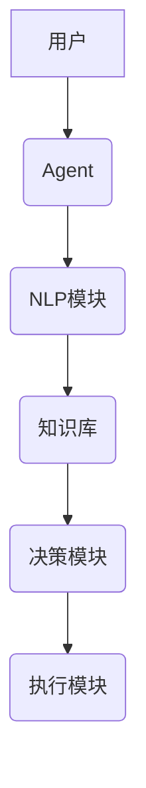
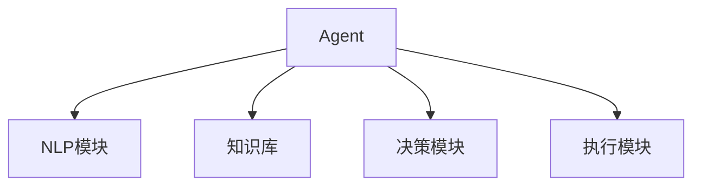
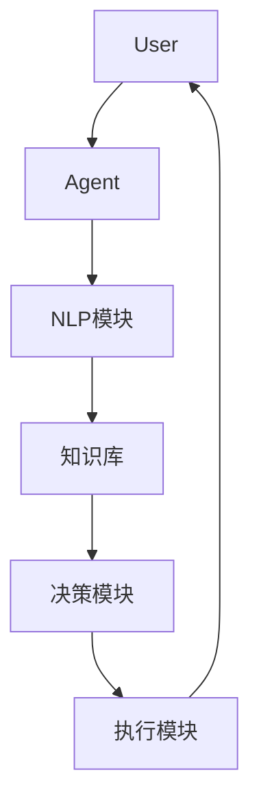

                 


# AI Agent在智能客服中的应用实践

**关键词：** AI Agent, 智能客服, 自然语言处理, 机器学习, 系统架构, 项目实战

**摘要：** 本文详细探讨了AI Agent在智能客服中的应用，从基本概念到核心原理，再到系统架构和项目实战，全面分析了AI Agent如何提升智能客服的效率和用户体验。通过实际案例和最佳实践，本文为读者提供了深入的技术洞察和实用的解决方案。

---

# 第1章: AI Agent与智能客服概述

## 1.1 AI Agent的基本概念

### 1.1.1 AI Agent的定义

AI Agent（人工智能代理）是一种能够感知环境、执行任务并做出决策的智能系统。它通过自然语言处理（NLP）和机器学习技术，能够与用户进行交互，理解用户需求并提供相应的服务。

$$\text{AI Agent} = \text{感知} \times \text{决策} \times \text{执行}$$

### 1.1.2 AI Agent的核心特征

| 特征 | 描述 |
|------|------|
| 智能性 | 能够理解用户需求并提供个性化服务 |
| 自适应性 | 能够根据上下文调整响应策略 |
| 实时性 | 能够快速响应用户请求 |

### 1.1.3 AI Agent与传统客服的区别

| 方面 | AI Agent | 传统客服 |
|------|----------|----------|
| 响应速度 | 实时响应 | 可能延迟 |
| 服务范围 | 24/7 全天候 | 有限的工作时间 |
| 个性化 | 高度个性化 | 服务可能标准化 |

## 1.2 AI Agent在智能客服中的应用背景

### 1.2.1 智能客服的发展历程

- **阶段1：人工客服时代**：依赖人工坐席，效率低，成本高。
- **阶段2：自动化客服时代**：引入简单的自动回复和IVR系统。
- **阶段3：AI Agent时代**：利用NLP和机器学习实现智能对话和问题解决。

### 1.2.2 传统客服的痛点与挑战

- **人力成本高**：需要大量人工坐席。
- **服务一致性差**：依赖员工的经验，服务质量不稳定。
- **响应速度慢**：在高峰期可能无法及时响应用户需求。

### 1.2.3 AI Agent的出现与解决方案

AI Agent通过自动化处理和智能学习，解决了传统客服的痛点，提供了高效、一致、个性化的服务。

---

# 第2章: AI Agent的核心原理与技术基础

## 2.1 AI Agent的核心原理

### 2.1.1 AI Agent的结构与功能模块



### 2.1.2 自然语言处理（NLP）在AI Agent中的应用

#### NLP的核心任务

- **文本分词**：将连续的文本分割成词语或短语。
- **词性标注**：给每个词语标注其词性。
- **句法分析**：分析句子的语法结构。
- **语义理解**：理解文本的深层含义。

### 2.1.3 机器学习与深度学习在AI Agent中的作用

- **监督学习**：通过大量标注数据训练模型，识别用户意图。
- **无监督学习**：通过聚类技术发现用户潜在需求。
- **深度学习**：利用神经网络模型（如LSTM、Transformer）进行对话生成。

## 2.2 AI Agent的关键技术

### 2.2.1 NLP技术：文本理解与生成

#### 文本理解流程

1. **输入文本**：用户输入的问题或请求。
2. **分词与标注**：将文本分割并标注词性。
3. **语义理解**：通过模型理解用户意图。
4. **生成响应**：基于理解生成回复。

#### 示例代码

```python
import spacy

nlp = spacy.load("en_core_web_sm")
doc = nlp("What is the weather today?")
for token in doc:
    print(token.text, token.pos_)
```

### 2.2.2 机器学习算法：分类、聚类与回归

#### 分类算法

- **随机森林**：常用于文本分类任务。
- **支持向量机（SVM）**：适用于高维数据分类。

#### 聚类算法

- **K-means**：用于将相似的问题分组。

### 2.2.3 知识图谱与对话管理

#### 知识图谱的作用

- **存储知识**：将领域知识以图结构存储。
- **推理与问答**：通过图结构进行推理，回答用户问题。

---

# 第3章: AI Agent的设计与实现

## 3.1 AI Agent的设计原则

### 3.1.1 用户需求分析与场景设计

- **目标用户**：明确AI Agent的目标用户群体。
- **核心需求**：分析用户的痛点和需求。
- **场景设计**：设计典型用户场景，如售后咨询、技术支持等。

### 3.1.2 功能模块划分与流程设计

#### 功能模块划分



### 3.1.3 数据采集与处理

- **数据来源**：用户输入、历史对话记录。
- **数据清洗**：去除噪声数据，提取有用信息。

## 3.2 AI Agent的核心算法实现

### 3.2.1 基于NLP的意图识别算法

#### 意图识别流程

1. **输入文本**：用户输入的问题或请求。
2. **分词与标注**：对文本进行分词和词性标注。
3. **特征提取**：提取文本中的关键词和特征。
4. **模型训练**：使用训练好的模型进行意图分类。

#### 示例代码

```python
from sklearn.feature_extraction.text import TfidfVectorizer
from sklearn.svm import SVC

# 假设我们有一个训练好的SVM模型
model = SVC()
vectorizer = TfidfVectorizer()

# 对用户输入进行向量化
X = vectorizer.fit_transform(["What is your refund policy?"])
y = ["refund"]

# 预测意图
predicted = model.predict(X)
print(predicted)
```

### 3.2.2 基于机器学习的对话生成算法

#### 对话生成流程

1. **输入文本**：用户输入的问题或请求。
2. **语义理解**：通过模型理解用户意图。
3. **生成回复**：基于理解生成合适的回复。

#### 示例代码

```python
import transformers

model = transformers.AutoModelForCausalLM.from_pretrained("gpt2")
tokenizer = transformers.AutoTokenizer.from_pretrained("gpt2")

input_text = "What is the weather today?"
inputs = tokenizer.encode(input_text + tokenizer.eos_token, return_tensors="pt")
outputs = model.generate(inputs, max_length=50)
print(tokenizer.decode(outputs[0], skip_special_tokens=True))
```

### 3.2.3 知识库的构建与检索算法

#### 知识库构建流程

1. **数据收集**：收集领域相关的数据，如产品信息、常见问题。
2. **数据清洗**：去除重复和噪声数据。
3. **知识抽取**：从数据中提取关键词和实体。
4. **知识存储**：将提取的知识存储到知识图谱中。

---

# 第4章: AI Agent在智能客服中的系统架构

## 4.1 系统功能模块设计

### 4.1.1 用户界面模块

#### 用户界面设计

- **文本输入框**：用户输入问题。
- **历史记录**：显示之前的对话记录。
- **帮助按钮**：提供使用帮助。

### 4.1.2 知识库模块

#### 知识库设计

- **数据结构**：使用JSON或数据库存储知识。
- **检索算法**：使用倒排索引或向量检索。

## 4.2 系统架构设计

### 4.2.1 系统整体架构图



### 4.2.2 功能模块交互流程

1. **用户输入**：用户通过文本输入框输入问题。
2. **NLP处理**：NLP模块对输入文本进行分词和语义理解。
3. **知识检索**：知识库根据理解的结果进行检索。
4. **生成回复**：决策模块生成回复内容。
5. **返回结果**：执行模块将回复返回给用户。

## 4.3 系统接口设计

### 4.3.1 API接口设计

- **输入接口**：`POST /api/v1/chat`
- **输出接口**：`GET /api/v1/chat-history`

### 4.3.2 接口交互流程

1. **用户发送请求**：通过API接口发送问题。
2. **系统处理请求**：NLP模块处理文本，知识库检索结果。
3. **返回响应**：系统生成回复并返回给用户。

---

# 第5章: AI Agent在智能客服中的项目实战

## 5.1 项目背景

### 5.1.1 项目目标

- **提升用户体验**：通过AI Agent提供高效的客服服务。
- **降低运营成本**：减少人工坐席的数量。
- **提高服务一致性**：确保所有用户都能得到一致的服务。

## 5.2 环境配置与依赖安装

### 5.2.1 安装Python环境

- 使用`virtualenv`创建虚拟环境。
- 安装必要的库，如`transformers`、`spacy`等。

#### 示例代码

```bash
pip install virtualenv
virtualenv venv
source venv/bin/activate
pip install transformers spacy
```

### 5.2.2 安装NLP工具

- 使用`spacy`下载中文分词模型。

#### 示例代码

```bash
python -m spacy download zh_core_web_sm
```

## 5.3 核心代码实现

### 5.3.1 对话系统实现

#### 代码实现

```python
import transformers

model = transformers.AutoModelForCausalLM.from_pretrained("gpt2")
tokenizer = transformers.AutoTokenizer.from_pretrained("gpt2")

def generate_response(user_input):
    inputs = tokenizer.encode(user_input + tokenizer.eos_token, return_tensors="pt")
    outputs = model.generate(inputs, max_length=50)
    return tokenizer.decode(outputs[0], skip_special_tokens=True)

# 示例对话
user_input = "What is the refund policy?"
response = generate_response(user_input)
print(response)
```

### 5.3.2 知识库检索实现

#### 代码实现

```python
import json

# 假设知识库存储为JSON格式
knowledge_base = json.load(open("knowledge_base.json", "r"))

def search_knowledge_base(query):
    # 简单的关键词匹配
    results = []
    for item in knowledge_base:
        if query in item["content"]:
            results.append(item)
    return results

# 示例检索
query = "refund policy"
results = search_knowledge_base(query)
print(results)
```

## 5.4 项目测试与部署

### 5.4.1 测试环境搭建

- **单元测试**：测试各个模块的功能。
- **集成测试**：测试模块之间的交互。

#### 示例代码

```python
import pytest

def test_generate_response():
    user_input = "What is your refund policy?"
    expected_response = "Our refund policy allows customers to request refunds within 30 days of purchase."
    assert generate_response(user_input) == expected_response

test_generate_response()
```

### 5.4.2 部署到生产环境

- 使用Docker打包整个系统。
- 配置API网关，暴露给外部用户。

#### 示例代码

```dockerfile
FROM python:3.9
WORKDIR /app
COPY requirements.txt .
RUN pip install --no-cache-dir -r requirements.txt
COPY . .
CMD ["gunicorn", "--bind", "0.0.0.0:8000", "--workers", "4", "app:app"]
```

---

# 第6章: AI Agent的优化与提升

## 6.1 模型调优与性能提升

### 6.1.1 超参数优化

- **学习率**：调整模型的学习率，如使用Adam优化器。
- **批量大小**：调整批量大小，平衡训练速度和内存使用。

#### 示例代码

```python
from transformers import AdamW

optimizer = AdamW(model.parameters(), lr=1e-5)
```

### 6.1.2 模型微调

- 在特定领域数据上进行微调，提升模型的性能。

#### 示例代码

```python
from transformers import TrainingArguments, Trainer

args = TrainingArguments(...)
trainer = Trainer(model=model, args=args, train_dataset=train_dataset)
trainer.train()
```

## 6.2 用户体验优化

### 6.2.1 对话流畅性优化

- **上下文理解**：增强模型对上下文的理解能力。
- **多轮对话支持**：支持连续对话，保持上下文一致。

### 6.2.2 多语言支持

- **支持多种语言**：通过多语言模型支持不同语言的客服需求。

#### 示例代码

```python
from transformers import AutoTokenizer, AutoModelForCausalLM

# 多语言模型
model = AutoModelForCausalLM.from_pretrained("facebook/m2o-multi-36")
tokenizer = AutoTokenizer.from_pretrained("facebook/m2o-multi-36")
```

---

# 第7章: 未来展望与挑战

## 7.1 未来发展趋势

### 7.1.1 更智能的对话系统

- **多模态交互**：结合视觉、语音等多种交互方式。
- **自适应学习**：AI Agent能够根据用户反馈自适应调整策略。

### 7.1.2 更广泛的应用场景

- **行业定制化**：针对不同行业定制化的AI Agent解决方案。
- **边缘计算**：AI Agent在边缘设备上的应用。

## 7.2 挑战与机遇

### 7.2.1 挑战

- **数据隐私**：如何保护用户数据隐私。
- **模型可解释性**：如何提高模型的可解释性，增强用户信任。

### 7.2.2 机遇

- **技术进步**：AI技术的不断进步为AI Agent提供了更多可能性。
- **市场需求**：企业对高效客服系统的需求不断增加。

---

# 作者：AI天才研究院 & 禅与计算机程序设计艺术

