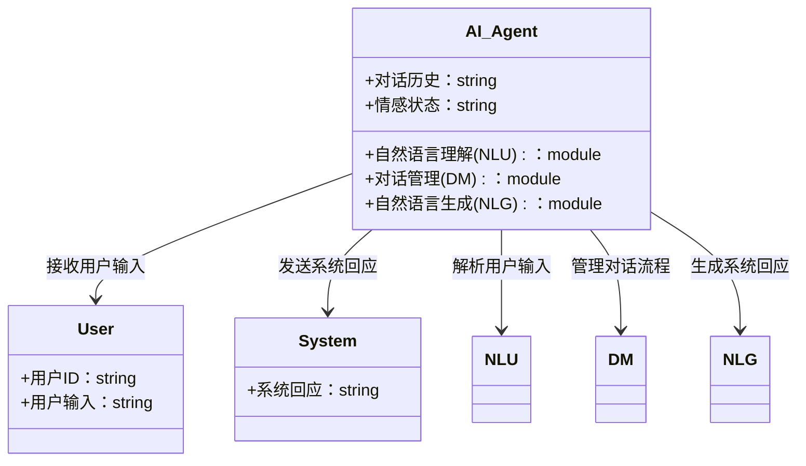
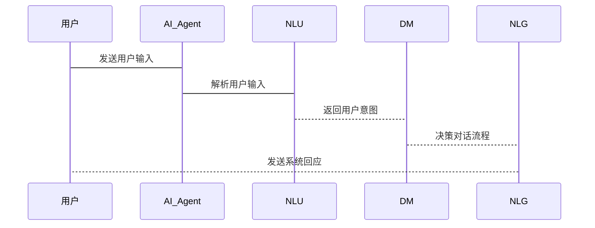

                 

<think>
好的，我现在需要根据用户的详细要求来构建《AI Agent在智能客服中的应用：多轮对话与情感理解》的技术博客文章。用户希望文章结构清晰、内容详实，涵盖背景、核心概念、算法、系统架构、项目实战等部分，并且每个部分都要有具体的子主题和详细内容。

首先，我会从背景介绍开始，解释AI Agent和智能客服的基本概念，以及多轮对话和情感理解的重要性。这部分需要简明扼要，帮助读者建立基础理解。

接下来，进入核心概念部分，详细讲解多轮对话机制和情感理解技术。这里需要包括对话系统的组成、记忆机制的作用，以及情感分析的常见方法。通过对比表格和实体关系图，帮助读者更好地理解这些概念之间的联系。

然后是算法部分，我需要详细阐述多轮对话和情感分析的具体算法，比如使用预训练模型进行对话生成，以及基于深度学习的情感分析模型。这部分需要配以数学公式和流程图，确保技术细节清晰易懂。

系统架构部分，我会介绍智能客服系统的整体架构，包括功能模块划分、系统交互流程等。通过类图和序列图，展示系统的组成和工作流程，帮助读者理解系统的设计和实现。

项目实战部分，需要提供实际案例的代码实现，从环境配置到代码编写，再到案例分析，一步步引导读者完成项目。同时，给出一些小结和注意事项，帮助读者更好地理解和应用这些技术。

最后，总结与展望部分，回顾文章的主要内容，同时指出未来的发展方向和技术趋势，激发读者进一步学习的兴趣。

在整个写作过程中，我会确保语言专业且易懂，逻辑清晰，结构紧凑，每一部分都深入浅出，满足用户对高质量技术博客的需求。
</think>

# AI Agent在智能客服中的应用：多轮对话与情感理解

## 关键词：AI Agent, 智能客服, 多轮对话, 情感理解, 深度学习, 对话系统, 人工智能

## 摘要：
本文深入探讨了AI Agent在智能客服中的应用，重点分析了多轮对话与情感理解的核心技术。文章从背景与基础出发，详细阐述了AI Agent与智能客服的基本概念、多轮对话的机制、情感理解的重要性，以及相关算法的实现。通过系统架构设计、项目实战和优化与提升等部分，展示了如何将AI Agent应用于实际的智能客服场景中，帮助提升用户体验和服务效率。

---

# 第一部分：AI Agent在智能客服中的背景与基础

## 第1章：AI Agent与智能客服概述

### 1.1 AI Agent的基本概念

#### 1.1.1 什么是AI Agent
AI Agent（人工智能代理）是指能够感知环境、执行任务并做出决策的智能实体。在智能客服中，AI Agent通常以虚拟助手的形式出现，通过自然语言处理（NLP）技术与用户进行交互，提供服务支持。

#### 1.1.2 AI Agent的核心特点
- **自主性**：能够在没有人工干预的情况下独立运行。
- **反应性**：能够实时感知用户输入并做出相应的回应。
- **学习能力**：通过机器学习算法不断优化自身的对话能力和问题解决能力。
- **可扩展性**：能够处理多种类型的任务，并适应不同的应用场景。

#### 1.1.3 AI Agent与传统客服的区别
- **效率**：AI Agent能够快速响应用户需求，减少等待时间。
- **成本**：AI Agent可以7×24小时工作，降低了人力成本。
- **一致性**：AI Agent的响应更加标准化，减少了人为错误。

### 1.2 智能客服的发展历程

#### 1.2.1 传统客服模式的局限性
传统客服主要依赖人工坐席执行任务，存在以下问题：
- **效率低下**：人工坐席执行任务效率较低，难以应对大量用户请求。
- **成本高昂**：需要大量人工坐席，运营成本高。
- **服务一致性差**：不同客服人员的服务质量参差不齐。

#### 1.2.2 智能客服的兴起背景
随着人工智能技术的快速发展，智能客服逐渐兴起。智能客服通过AI Agent实现自动化服务，能够快速响应用户需求，提高服务效率。

#### 1.2.3 智能客服的现状与趋势
目前，智能客服已经在多个领域得到广泛应用，包括电子商务、银行、医疗等。未来，随着AI技术的进一步发展，智能客服将更加智能化和个性化，能够更好地满足用户需求。

## 第2章：多轮对话与情感理解的背景

### 2.1 多轮对话的定义与挑战

#### 2.1.1 多轮对话的基本概念
多轮对话是指在对话过程中，用户和AI Agent之间进行多轮交互，以完成特定任务或解决问题。与单轮对话相比，多轮对话更加复杂，需要考虑上下文和对话历史。

#### 2.1.2 多轮对话中的常见问题
- **对话历史的管理**：如何有效地管理和存储对话历史，以便后续对话中使用。
- **上下文的理解**：如何理解对话中的上下文关系，确保对话的连贯性。
- **对话策略的选择**：如何选择合适的对话策略，以达到最佳的对话效果。

#### 2.1.3 多轮对话的难点与解决方案
- **难点**：对话历史的管理、上下文的理解、对话策略的选择。
- **解决方案**：引入记忆机制、上下文理解算法、对话策略优化算法。

### 2.2 情感理解的重要性

#### 2.2.1 情感计算的基本概念
情感计算是指通过分析用户的情感状态（如情感倾向、情感强度等），来优化人机交互体验的技术。

#### 2.2.2 情感理解在智能客服中的作用
- **提升用户体验**：通过理解用户的情感状态，提供更加个性化的服务。
- **优化对话流程**：通过情感分析，优化对话流程，提高对话效率。
- **提高服务质量**：通过情感分析，识别用户情绪波动，及时采取应对措施。

#### 2.2.3 情感分析的常用方法
- **基于规则的方法**：通过预设规则，识别文本中的情感倾向。
- **基于机器学习的方法**：利用机器学习算法，训练情感分类模型。
- **基于深度学习的方法**：利用深度学习模型（如LSTM、BERT）进行情感分析。

---

# 第二部分：AI Agent的核心概念与技术

## 第3章：多轮对话的核心概念与技术

### 3.1 对话系统的基本原理

#### 3.1.1 对话系统的组成与流程
对话系统通常由以下几部分组成：
- **自然语言理解（NLU）**：理解用户的输入。
- **对话管理（DM）**：管理对话流程，决定下一步操作。
- **自然语言生成（NLG）**：生成系统回应。

对话流程如下：
1. 用户输入：用户向AI Agent发送一条消息。
2. NLU处理：系统解析用户的意图。
3. DM决策：系统根据意图和对话历史，决定下一步操作。
4. NLG生成：系统生成回应，并发送给用户。

#### 3.1.2 常见的对话系统架构
- **基于规则的对话系统**：通过预设规则来生成回应。
- **基于模板的对话系统**：通过预设模板生成回应。
- **基于模型的对话系统**：利用机器学习模型生成回应。

### 3.2 多轮对话中的记忆机制

#### 3.2.1 短时记忆与长时记忆
- **短时记忆**：存储当前对话中的上下文信息。
- **长时记忆**：存储历史对话信息和用户偏好。

#### 3.2.2 记忆机制在多轮对话中的应用
- **上下文理解**：通过记忆机制，系统能够理解对话的上下文关系。
- **对话历史管理**：通过记忆机制，系统能够存储和管理对话历史。
- **个性化服务**：通过记忆机制，系统能够提供个性化的服务。

#### 3.2.3 记忆机制的实现方式
- **基于数据库的实现**：将对话历史存储在数据库中。
- **基于缓存的实现**：将对话历史存储在缓存中，提高访问效率。
- **基于模型的实现**：利用深度学习模型进行对话历史的表示和存储。

## 第4章：情感理解的核心概念与技术

### 4.1 情感分析的基本原理

#### 4.1.1 情感分析的定义与分类
- **定义**：情感分析是指对文本的情感倾向进行分析，通常分为正面、负面和中性。
- **分类**：情感分析可以分为二分类（正面/负面）、多分类（正面/中性/负面）等。

#### 4.1.2 基于规则的情感分析
- **规则驱动**：通过预设规则，识别文本中的情感倾向。
- **优点**：简单易懂，适用于特定场景。
- **缺点**：难以处理复杂的语境。

#### 4.1.3 基于机器学习的情感分析
- **机器学习模型**：利用支持向量机（SVM）、随机森林（RF）等模型进行情感分类。
- **优点**：能够处理复杂的语境，分类效果较好。
- **缺点**：需要大量的标注数据，计算复杂。

### 4.2 情感理解的高级技术

#### 4.2.1 基于深度学习的情感分析
- **深度学习模型**：利用LSTM、GRU、BERT等模型进行情感分析。
- **优点**：能够捕捉文本中的深层语义信息，分类效果更佳。
- **缺点**：需要大量的计算资源和数据。

#### 4.2.2 情感增强的对话模型
- **情感增强模型**：在对话模型中引入情感信息，提升对话的自然性和情感一致性。
- **实现方式**：通过情感向量表示，将情感信息融入对话生成过程中。

#### 4.2.3 情感记忆在对话系统中的应用
- **情感记忆**：将用户的情感状态存储在记忆机制中，以便后续对话中使用。
- **情感适应**：根据用户的情感状态，动态调整对话策略。

---

# 第三部分：AI Agent的算法与实现

## 第5章：多轮对话的算法实现

### 5.1 基于规则的对话算法

#### 5.1.1 规则驱动对话的实现原理
- **规则定义**：通过预设规则，定义对话的流程和回应方式。
- **规则匹配**：根据用户输入匹配对应的规则，生成回应。

#### 5.1.2 规则库的构建与管理
- **规则库构建**：根据业务需求，构建规则库。
- **规则库管理**：通过工具或平台，对规则库进行管理和维护。

#### 5.1.3 规则驱动对话的优缺点
- **优点**：实现简单，适用于简单的对话场景。
- **缺点**：难以处理复杂的对话场景，缺乏灵活性。

### 5.2 基于机器学习的对话算法

#### 5.2.1 基于序列的对话模型
- **序列模型**：利用循环神经网络（RNN）或长短期记忆网络（LSTM）进行对话生成。
- **模型训练**：通过大量的对话数据，训练模型的参数。

#### 5.2.2 基于树状结构的对话模型
- **树状结构**：通过树状结构表示对话的可能分支。
- **模型实现**：通过遍历树结构，生成对话回应。

#### 5.2.3 基于预训练语言模型的对话生成
- **预训练语言模型**：利用BERT、GPT等预训练语言模型进行对话生成。
- **微调**：在特定领域数据上对模型进行微调，提升对话效果。

## 第6章：情感理解的算法实现

### 6.1 基于传统机器学习的情感分析

#### 6.1.1 特征提取与选择
- **特征提取**：从文本中提取特征，如词袋模型、TF-IDF等。
- **特征选择**：通过统计方法或机器学习方法，选择重要的特征。

#### 6.1.2 常见的机器学习模型
- **支持向量机（SVM）**：适用于小规模数据的情感分类。
- **随机森林（RF）**：适用于中等规模数据的情感分类。

#### 6.1.3 模型的训练与评估
- **训练**：通过训练数据，训练模型的参数。
- **评估**：通过测试数据，评估模型的性能，如准确率、召回率等。

### 6.2 基于深度学习的情感分析

#### 6.2.1 基于RNN的情感分析模型
- **RNN模型**：利用循环神经网络进行情感分析。
- **模型训练**：通过反向传播算法，训练模型的参数。

#### 6.2.2 基于CNN的情感分析模型
- **CNN模型**：利用卷积神经网络进行情感分析。
- **模型训练**：通过最大似然估计，训练模型的参数。

#### 6.2.3 基于预训练模型的情感分析
- **预训练模型**：利用BERT、RoBERTa等预训练模型进行情感分析。
- **微调**：在特定领域数据上对模型进行微调，提升情感分析效果。

---

# 第四部分：系统分析与架构设计方案

## 第7章：系统功能设计

### 7.1 领域模型类图



### 7.2 系统架构设计


### 7.3 系统接口设计

- **用户接口**：提供与用户交互的界面，接收用户输入并发送系统回应。
- **API接口**：提供与其他系统或服务的接口，如数据库、第三方服务等。

### 7.4 系统交互序列图



---

# 第五部分：项目实战

## 第8章：环境安装与代码实现

### 8.1 环境安装

```bash
pip install transformers
pip install torch
pip install numpy
```

### 8.2 核心实现代码

```python
from transformers import AutoTokenizer, AutoModelForSequenceClassification
import torch

# 加载预训练模型
tokenizer = AutoTokenizer.from_pretrained('bert-base-uncased')
model = AutoModelForSequenceClassification.from_pretrained('bert-base-uncased')

# 定义情感分析函数
def analyze_sentiment(text):
    inputs = tokenizer.encode(text, return_tensors='pt')
    with torch.no_grad():
        outputs = model(inputs)
    prediction = torch.argmax(outputs.logits, dim=1).item()
    return "positive" if prediction == 1 else "negative"

# 示例
text = "The service is excellent!"
print(analyze_sentiment(text))  # 输出：positive
```

### 8.3 案例分析与解读

#### 案例1：情感分析
用户输入：“我对你们的服务非常满意。”
系统分析：情感倾向为正面。
系统回应：“感谢您的支持！有什么可以帮您的吗？”

#### 案例2：多轮对话
用户输入：“我需要帮助查询订单状态。”
系统回应：“请提供订单号，我将帮您查询。”
用户输入：“订单号是12345。”
系统回应：“您的订单已发货，预计将在5天内送达。”

---

# 第六部分：优化与提升

## 第9章：系统优化与提升

### 9.1 提升对话系统的性能
- **优化算法**：通过改进算法，提高对话系统的准确率和响应速度。
- **优化数据**：通过增加训练数据，提升模型的泛化能力。

### 9.2 提高情感分析的准确性
- **优化模型**：通过使用更先进的模型（如BERT）进行情感分析。
- **优化特征**：通过提取更有效的特征，提升情感分析的准确性。

### 9.3 提升用户体验
- **个性化服务**：根据用户的历史行为和情感状态，提供个性化的服务。
- **多语言支持**：支持多种语言，扩大用户群体。

---

# 第七部分：总结与展望

## 第10章：总结与展望

### 10.1 总结
本文详细探讨了AI Agent在智能客服中的应用，重点分析了多轮对话与情感理解的核心技术。通过理论分析和实践案例，展示了如何利用AI技术提升智能客服的服务效率和用户体验。

### 10.2 未来展望
随着AI技术的不断发展，智能客服将更加智能化和个性化。未来，可以通过引入更先进的算法（如生成式AI、多模态交互等）进一步提升智能客服的能力，为用户提供更优质的服务。

---

# 作者：AI天才研究院 & 禅与计算机程序设计艺术

