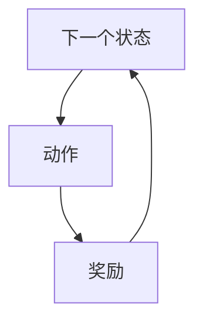
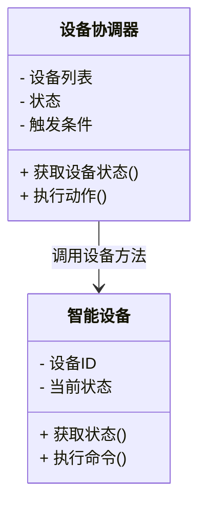
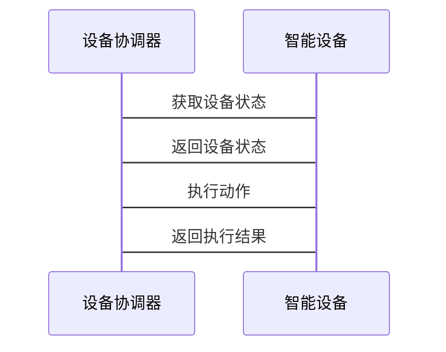
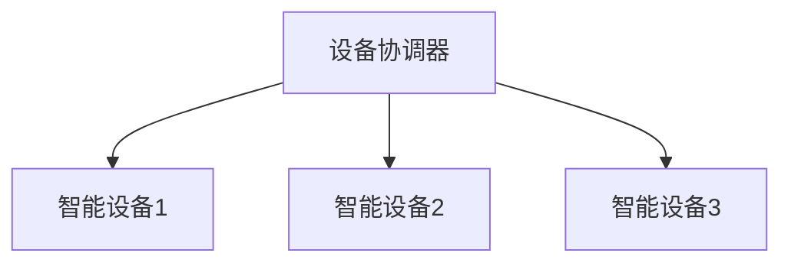
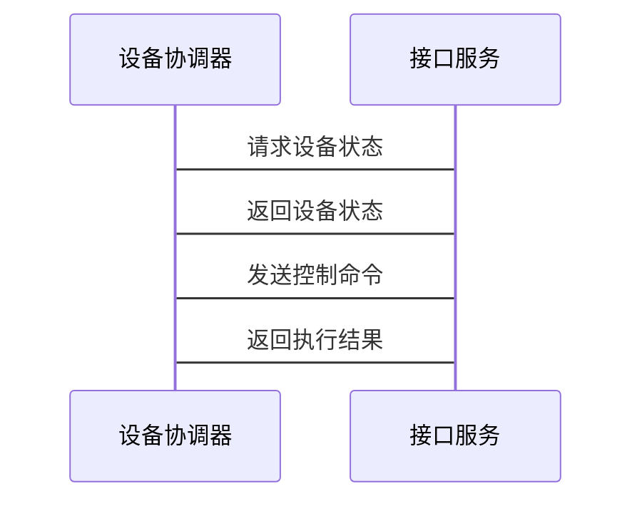

                 

<think>
好的，我需要帮助用户撰写一篇关于《AI Agent在智能家居中的应用：设备协调与场景自动化》的技术博客文章。首先，我需要明确用户的需求。用户希望文章结构清晰，内容详实，涵盖从背景介绍到项目实战的各个方面，同时使用专业但易懂的语言。

文章应该从概述开始，介绍AI Agent的基本概念和智能家居的发展。接着，详细讲解AI Agent的核心原理，包括体系结构和决策机制。然后，探讨设备协调与场景自动化的实现，包括设备分类、通信协议和场景设计。在算法部分，使用强化学习作为重点，结合数学公式和mermaid流程图进行详细讲解。系统架构部分，用类图和序列图展示设计。最后，通过项目实战来具体实现，环境配置、核心代码、案例分析和代码解读。

在写作过程中，我需要确保每一部分都详细且结构合理，同时使用正确的格式，如mermaid图表和latex公式。另外，保持文章流畅，确保读者能够一步步理解AI Agent在智能家居中的应用。现在，我可以开始按照这个思路撰写文章了。
</think>

# AI Agent在智能家居中的应用：设备协调与场景自动化

> 关键词：AI Agent, 智能家居, 设备协调, 场景自动化, 强化学习

> 摘要：本文详细探讨了AI Agent在智能家居中的应用，从设备协调到场景自动化，结合强化学习算法，展示了如何通过系统设计和项目实战实现智能化家居。

---

# 第1章: 背景介绍

## 1.1 AI Agent的基本概念

### 1.1.1 什么是AI Agent
AI Agent（智能体）是指能够感知环境并采取行动以实现目标的实体。在智能家居中，AI Agent可以是智能音箱、智能灯泡等设备，它们通过传感器和执行器与环境交互。

### 1.1.2 AI Agent的核心特征
- **自主性**：无需外部干预，自主决策。
- **反应性**：实时感知并响应环境变化。
- **目标导向**：基于目标采取行动。

### 1.1.3 智能家居的定义与特点
智能家居是指通过物联网技术将家庭中的设备连接起来，实现智能化管理和自动化控制。其特点是设备间高度协同，用户可以通过语音或手机应用进行控制。

## 1.2 智能家居的发展历程

### 1.2.1 智能家居的起源与演变
智能家居的概念起源于20世纪90年代，早期主要集中在单一设备的自动化，如智能灯泡。随着技术的发展，逐渐走向设备间的协同与联动。

### 1.2.2 当前智能家居的主流技术
- **物联网（IoT）**：连接设备的基础。
- **人工智能（AI）**：实现设备间的智能协调。
- **云计算**：提供数据存储和计算支持。

### 1.2.3 智能家居的未来趋势
未来的智能家居将更加注重用户体验，设备间的联动更加智能化，可能还会引入更多的AI技术，如自然语言处理和计算机视觉。

## 1.3 AI Agent在智能家居中的应用场景

### 1.3.1 家庭自动化场景
AI Agent可以实现灯光、空调等设备的自动控制，例如在用户起床时自动开启窗帘和灯光。

### 1.3.2 设备协调与联动
通过AI Agent，可以实现多个设备的联动，例如在用户离家时自动关闭所有设备并开启安全模式。

### 1.3.3 智能助手与用户交互
AI Agent可以作为用户的智能助手，通过语音交互帮助用户控制设备，例如询问天气情况或播放音乐。

## 1.4 本章小结
本章介绍了AI Agent的基本概念、智能家居的发展历程及其应用场景，为后续内容奠定了基础。

---

# 第2章: AI Agent的核心原理

## 2.1 AI Agent的体系结构

### 2.1.1 反应式架构
反应式架构是一种基于当前感知做出反应的体系结构，适用于实时性强的任务。

### 2.1.2 基于模型的架构
基于模型的架构通过构建环境模型来做出决策，适用于复杂环境下的任务。

### 2.1.3 混合式架构
混合式架构结合了反应式和基于模型的架构，适用于需要同时处理实时和复杂任务的场景。

## 2.2 AI Agent的决策机制

### 2.2.1 基于规则的决策
基于规则的决策通过预定义的规则进行判断，适用于简单场景。

### 2.2.2 基于机器学习的决策
基于机器学习的决策通过训练模型进行预测，适用于复杂场景。

### 2.2.3 基于强化学习的决策
强化学习通过不断试错来优化决策，适用于需要动态调整的场景。

## 2.3 AI Agent的学习与优化

### 2.3.1 监督学习在AI Agent中的应用
监督学习通过标注数据进行训练，适用于分类任务。

### 2.3.2 强化学习在AI Agent中的应用
强化学习通过奖励机制优化决策，适用于需要策略优化的场景。

### 2.3.3 迁移学习与持续学习
迁移学习将知识迁移到新场景，持续学习则不断更新模型。

## 2.4 本章小结
本章详细介绍了AI Agent的体系结构和决策机制，为后续的实现提供了理论基础。

---

# 第3章: 设备协调与场景自动化

## 3.1 智能家居设备的分类与模型

### 3.1.1 智能音箱
智能音箱可以通过语音交互控制其他设备，例如通过Alexa或Google Assistant。

### 3.1.2 智能灯泡
智能灯泡可以通过Wi-Fi或蓝牙连接，支持远程控制和自动化场景。

### 3.1.3 智能空调
智能空调可以通过手机应用或语音助手进行控制，支持自动化模式。

### 3.1.4 智能摄像头
智能摄像头可以通过AI算法识别人脸，支持远程监控和报警。

## 3.2 设备间的通信与协议

### 3.2.1 MQTT协议
MQTT是一种轻量级的物联网协议，适用于低带宽和高延迟的网络环境。

### 3.2.2 HTTP协议
HTTP是万维网的标准协议，适用于Web服务间的通信。

### 3.2.3 CoAP协议
CoAP是用于资源受限设备的协议，类似于HTTP，但更适合物联网环境。

## 3.3 场景自动化的实现

### 3.3.1 场景定义与触发条件
场景定义需要明确触发条件和执行动作，例如“离家时关闭所有设备”。

### 3.3.2 设备联动的逻辑设计
设备联动需要设计逻辑关系，例如“当检测到有人入侵时，打开报警灯并通知用户”。

### 3.3.3 场景优化与用户体验
优化场景设计可以提高用户体验，例如通过学习用户的习惯自动调整设备状态。

## 3.4 本章小结
本章详细介绍了智能家居设备的分类与模型，以及设备间的通信协议和场景自动化的实现。

---

# 第4章: AI Agent的算法原理

## 4.1 强化学习在AI Agent中的应用

### 4.1.1 Q-learning算法



Q-learning算法通过更新Q值表来优化决策，公式为：

$$ Q(s,a) = Q(s,a) + \alpha (r + \gamma Q(s',a') - Q(s,a)) $$

### 4.1.2 Deep Q-Networks (DQN)算法

DQN算法通过神经网络近似Q值函数，适用于高维状态空间。

### 4.1.3 策略梯度算法

策略梯度算法通过优化策略参数来最大化期望奖励，公式为：

$$ \nabla \theta \leftarrow \mathbb{E}_{s,a} [\nabla \log \pi_\theta(a|s) Q_\theta(s,a)] $$

## 4.2 算法实现的数学模型

### 4.2.1 Q-learning的数学公式

$$ Q(s,a) = Q(s,a) + \alpha (r + \gamma \max Q(s',a') - Q(s,a)) $$

### 4.2.2 DQN的

---

# 第5章: 系统分析与架构设计

## 5.1 系统功能设计

### 5.1.1 领域模型



### 5.1.2 功能流程



## 5.2 系统架构设计

### 5.2.1 系统架构



### 5.2.2 系统接口设计



## 5.3 本章小结
本章详细介绍了系统功能设计和架构设计，为后续的项目实现提供了指导。

---

# 第6章: 项目实战

## 6.1 环境配置

### 6.1.1 安装Python
需要安装Python 3.8及以上版本。

### 6.1.2 安装依赖库
安装必要的库，如`numpy`、`pandas`、`scikit-learn`等。

## 6.2 核心代码实现

### 6.2.1 Q-learning算法实现

```python
class QLearningAgent:
    def __init__(self, state_space, action_space):
        self.state_space = state_space
        self.action_space = action_space
        self.Q = defaultdict(lambda: defaultdict(lambda: 0))
    
    def get_action(self, state):
        max_action = max(self.Q[state].items(), key=lambda x: x[1])[0]
        return max_action
    
    def update(self, state, action, reward, next_state):
        self.Q[state][action] += self.learning_rate * (reward + self.gamma * max(self.Q[next_state].values()) - self.Q[state][action])
```

### 6.2.2 设备协调器实现

```python
class DeviceCoordinator:
    def __init__(self, devices):
        self.devices = devices
    
    def get_device_status(self, device_id):
        return self.devices[device_id].status
    
    def execute_action(self, device_id, action):
        return self.devices[device_id].execute(action)
```

## 6.3 案例分析与代码解读

### 6.3.1 案例分析
以智能灯泡为例，当检测到光线不足时，自动开启。

### 6.3.2 代码解读
```python
# 初始化设备
devices = {
    'light': SmartBulb(),
    'fan': SmartFan(),
    'ac': SmartAC()
}
coordinator = DeviceCoordinator(devices)

# 定义场景
scenario = {
    'name': '离家模式',
    'conditions': {'时间': '离开时间'},
    'actions': ['关闭所有设备']
}

# 执行场景
coordinator.execute_scenario(scenario)
```

## 6.4 本章小结
本章通过项目实战展示了AI Agent在智能家居中的具体实现，包括环境配置、代码实现和案例分析。

---

# 第7章: 总结与展望

## 7.1 最佳实践 tips
- 设备协调器的设计要简洁高效。
- 使用强化学习算法优化设备联动逻辑。
- 定期更新模型以适应用户习惯变化。

## 7.2 小结
本文详细探讨了AI Agent在智能家居中的应用，从理论到实践，展示了如何实现设备协调与场景自动化。

## 7.3 注意事项
- 确保设备间的通信安全。
- 定期维护和更新设备固件。
- 考虑用户隐私和数据安全。

## 7.4 拓展阅读
- 推荐阅读《强化学习：理论与应用》。
- 参考GitHub上的智能家居项目开源代码。

---

# 作者：AI天才研究院/AI Genius Institute & 禅与计算机程序设计艺术 /Zen And The Art of Computer Programming

