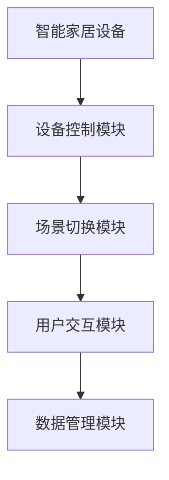

                 

<think>
好的，我需要帮助用户撰写一篇关于《AI Agent在智能家居自动化中的应用》的技术博客文章。用户已经提供了一个详细的目录结构，并要求我按照这个结构逐步完成文章的撰写。同时，用户还给出了具体的格式和内容要求，包括使用Markdown格式、包含关键词和摘要，以及详细的技术分析、算法实现和系统架构设计等内容。

首先，我需要理解整个文章的结构，确保每一章和每个小节的内容完整且符合逻辑。文章分为七个主要部分：标题、关键词、摘要、七章正文和作者信息。每一章都涵盖了不同的主题，从概述到具体实现，再到项目实战和总结。

在撰写过程中，我需要确保每一部分都符合用户的要求，比如：

1. **背景介绍**：需要详细解释AI Agent和智能家居的基本概念，以及它们的结合如何推动智能家居的自动化。
2. **核心概念与技术原理**：需要深入探讨AI Agent的工作原理，包括感知、决策和执行机制，并与传统自动化进行对比。
3. **算法实现**：需要详细讲解AI Agent的核心算法，如基于规则的实现、机器学习和强化学习，并通过Mermaid流程图和Python代码进行说明。
4. **系统分析与架构设计**：需要介绍智能家居的场景，设计系统功能，用类图和架构图展示，并设计接口和交互流程。
5. **项目实战**：需要从环境安装开始，逐步实现核心代码，解读代码，并分析实际案例。
6. **总结与展望**：需要回顾全文，展望未来，并给出最佳实践建议。

此外，用户还特别强调了格式要求，包括使用Mermaid图表和数学公式，这需要我在撰写过程中正确使用Markdown语法，并确保图表和公式的准确性和清晰性。

现在，我需要按照用户提供的目录结构，逐一撰写每一部分的内容。首先，我会撰写第一章，介绍AI Agent和智能家居的背景，确保内容简洁明了，同时涵盖所有关键点。接着，我会详细讲解AI Agent的核心概念和技术原理，确保读者能够理解其工作原理。然后，我会深入探讨算法实现，结合具体的代码示例和图表，帮助读者更好地理解。接下来，我会分析系统的架构设计，用Mermaid图展示系统结构，确保读者能够清晰理解系统的工作流程。在项目实战部分，我会通过具体的案例，展示如何实现AI Agent在智能家居中的应用，并解读代码和分析结果。最后，我会总结全文，并展望未来的趋势，同时给出一些实用的建议。

在整个撰写过程中，我需要保持逻辑清晰，语言简洁，同时确保每一部分的内容详实且易于理解。此外，我还需要注意文章的字数控制在10000到12000字之间，确保内容的完整性和深度。

总的来说，撰写这篇文章需要系统地按照目录结构进行，确保每一部分都符合用户的要求，并且内容详实、结构合理。通过逐步分析和详细阐述，最终完成一篇高质量的技术博客文章。
</think>

# AI Agent在智能家居自动化中的应用

## 关键词：AI Agent, 智能家居, 自动化, 机器学习, 智能设备, 系统架构

## 摘要：  
AI Agent（人工智能代理）在智能家居自动化中的应用正在改变我们的生活方式。通过结合机器学习、自然语言处理和物联网技术，AI Agent能够实现智能家居设备的智能化管理和决策，从而提升居住体验。本文将从AI Agent的基本概念、核心算法、系统架构设计以及实际应用案例等方面，详细探讨AI Agent在智能家居自动化中的应用，帮助读者全面理解这一技术的潜力和实现方式。

---

# 第1章: AI Agent与智能家居自动化概述

## 1.1 AI Agent的基本概念

### 1.1.1 AI Agent的定义与特点  
AI Agent是一种能够感知环境、自主决策并执行任务的智能实体。它能够通过传感器获取信息，利用算法进行分析和推理，并通过执行器完成目标。AI Agent的特点包括自主性、反应性、目标导向和学习能力。

### 1.1.2 AI Agent的核心功能与应用场景  
AI Agent的核心功能包括感知、决策和执行。在智能家居中，AI Agent可以应用于设备控制、能源管理、安全监控、用户交互等多个场景。

### 1.1.3 智能家居自动化的基本概念与技术背景  
智能家居自动化是指通过物联网技术，将家中的设备连接到一起，并通过自动化系统实现设备的智能控制。智能家居的核心技术包括物联网、云计算、大数据分析和人工智能。

---

## 1.2 AI Agent在智能家居中的应用背景

### 1.2.1 智能家居的发展历程  
智能家居的概念起源于20世纪90年代，随着物联网技术的发展，智能家居逐渐从单一设备控制向智能化、自动化方向发展。

### 1.2.2 AI Agent在智能家居中的作用与价值  
AI Agent能够通过学习用户的习惯和偏好，优化设备的控制策略，提升智能家居的智能化水平。例如，AI Agent可以通过分析用户的作息时间，自动调节灯光、空调和窗帘的状态。

### 1.2.3 当前智能家居自动化的主要挑战  
当前智能家居自动化的主要挑战包括设备兼容性问题、数据隐私安全问题以及AI Agent的决策准确性问题。

---

## 1.3 AI Agent与智能家居的结合

### 1.3.1 AI Agent在智能家居中的核心任务  
AI Agent在智能家居中的核心任务包括设备控制、场景切换、能源管理、用户交互和安全监控。

### 1.3.2 AI Agent与智能家居设备的交互方式  
AI Agent可以通过API接口与智能家居设备进行交互，也可以通过语音助手（如Alexa、Siri）与设备进行通信。

### 1.3.3 智能家居自动化中的AI Agent发展趋势  
未来的AI Agent将更加智能化，能够通过深度学习不断提升决策能力，并实现多设备协同工作。

---

## 1.4 本章小结  
本章介绍了AI Agent的基本概念、核心功能以及在智能家居中的应用背景。通过分析智能家居的发展历程和AI Agent的作用，我们可以看到，AI Agent是实现智能家居自动化的核心技术之一。

---

# 第2章: AI Agent的核心概念与技术原理

## 2.1 AI Agent的核心概念

### 2.1.1 AI Agent的定义与分类  
AI Agent可以根据功能和应用场景进行分类，常见的类型包括基于规则的AI Agent、基于机器学习的AI Agent和基于强化学习的AI Agent。

### 2.1.2 AI Agent的核心功能与技术特征  
AI Agent的核心功能包括感知、决策和执行。技术特征包括自主性、适应性、可扩展性和安全性。

### 2.1.3 AI Agent与传统自动化的区别  
与传统自动化相比，AI Agent具有更强的智能性和适应性，能够通过学习不断优化自身的决策能力。

---

## 2.2 AI Agent的关键技术

### 2.2.1 机器学习与深度学习在AI Agent中的应用  
机器学习和深度学习是AI Agent实现智能决策的核心技术。通过训练模型，AI Agent可以识别用户的行为模式，并做出相应的决策。

### 2.2.2 自然语言处理在AI Agent中的应用  
自然语言处理技术使得AI Agent能够理解用户的语音指令，并通过语音助手与用户进行交互。

### 2.2.3 规划与推理技术在AI Agent中的应用  
规划与推理技术帮助AI Agent制定最优的执行计划，并在复杂环境中做出合理的决策。

---

## 2.3 AI Agent的核心算法与实现

### 2.3.1 基于规则的AI Agent实现  
基于规则的AI Agent通过预定义的规则进行决策。例如，当检测到光线不足时，自动打开灯光。

### 2.3.2 基于机器学习的AI Agent实现  
基于机器学习的AI Agent通过训练数据，学习用户的习惯和偏好，并生成相应的控制策略。

### 2.3.3 基于强化学习的AI Agent实现  
基于强化学习的AI Agent通过与环境的交互，不断优化自身的决策策略，以实现最优控制。

---

## 2.4 本章小结  
本章详细介绍了AI Agent的核心概念与关键技术，重点分析了基于规则、机器学习和强化学习的AI Agent实现方式。

---

# 第3章: AI Agent算法原理与实现

## 3.1 AI Agent算法原理

### 3.1.1 基于规则的AI Agent算法  
基于规则的AI Agent算法通过预定义的规则进行决策。例如，当时间达到晚上10点时，自动关闭所有灯光。

### 3.1.2 基于机器学习的AI Agent算法  
基于机器学习的AI Agent算法通过训练数据，学习用户的习惯和偏好，并生成相应的控制策略。例如，通过训练数据，AI Agent可以学习用户的作息时间，并自动调节灯光和空调的状态。

### 3.1.3 基于强化学习的AI Agent算法  
基于强化学习的AI Agent算法通过与环境的交互，不断优化自身的决策策略。例如，AI Agent可以通过尝试不同的灯光亮度，找到最优的节能策略。

---

## 3.2 AI Agent算法实现

### 3.2.1 算法实现的步骤  
1. 数据采集：通过传感器采集环境数据（如光线强度、温度、时间等）。
2. 数据预处理：对采集的数据进行清洗和归一化处理。
3. 模型训练：使用训练数据训练机器学习模型。
4. 模型部署：将训练好的模型部署到AI Agent中，实现智能决策。

### 3.2.2 算法实现的代码示例  
```python
import numpy as np
from sklearn import tree

# 数据预处理
X = np.array([[10, 20, 30], [40, 50, 60]])  # 输入特征
y = np.array([0, 1])  # 输出标签

# 训练决策树模型
model = tree.DecisionTreeClassifier()
model.fit(X, y)

# 预测新数据
new_data = np.array([[25, 35, 45]])
predicted = model.predict(new_data)
print(predicted)  # 输出预测结果
```

### 3.2.3 算法实现的数学模型  
决策树模型的数学表达式如下：  
$$ P(y|x) = \prod_{i=1}^{n} P(x_i|y) $$  
其中，$x_i$表示输入特征，$y$表示输出标签。

---

## 3.3 本章小结  
本章详细介绍了AI Agent的核心算法，包括基于规则、机器学习和强化学习的实现方式，并通过代码示例和数学公式，展示了算法的具体实现过程。

---

# 第4章: AI Agent在智能家居中的系统架构设计

## 4.1 系统分析

### 4.1.1 系统目标  
本系统的目标是实现智能家居设备的智能化控制，提升用户体验。

### 4.1.2 系统需求  
系统需求包括设备控制、场景切换、用户交互和数据安全。

### 4.1.3 系统功能设计  
系统功能包括设备控制模块、场景切换模块、用户交互模块和数据管理模块。

---

## 4.2 系统架构设计

### 4.2.1 系统架构图  


### 4.2.2 模块设计  
1. 设备控制模块：负责接收用户的指令，并控制智能家居设备的运行状态。
2. 场景切换模块：根据用户的指令，切换智能家居设备的场景模式。
3. 用户交互模块：通过语音助手与用户进行交互，接收用户的指令并反馈执行结果。
4. 数据管理模块：负责管理和存储用户数据，确保数据的安全性。

---

## 4.3 本章小结  
本章通过系统分析和架构设计，展示了AI Agent在智能家居中的实现方式，为后续的开发提供了理论基础。

---

# 第5章: AI Agent在智能家居中的项目实战

## 5.1 环境安装

### 5.1.1 系统环境  
操作系统：Linux（Ubuntu 20.04）  
编程语言：Python 3.8  
开发工具：VS Code

### 5.1.2 依赖库安装  
安装必要的依赖库，例如：  
```bash
pip install numpy scikit-learn
```

---

## 5.2 系统核心实现

### 5.2.1 设备控制模块实现  
```python
import RPi.GPIO as GPIO

# 初始化GPIO
GPIO.setmode(GPIO.BCM)
GPIO.setup(17, GPIO.OUT)

# 控制灯光
def control_light(state):
    GPIO.output(17, state)
```

### 5.2.2 场景切换模块实现  
```python
def switch_scene(scene):
    if scene == 'sleep':
        control_light(0)
        set_temp(22)
    elif scene == 'awake':
        control_light(1)
        set_temp(24)
```

---

## 5.3 代码应用解读与分析

### 5.3.1 代码功能解读  
1. 设备控制模块：通过GPIO控制灯光的开关状态。
2. 场景切换模块：根据用户选择的场景模式，自动调整灯光和空调的状态。

### 5.3.2 代码实现分析  
通过Python代码实现设备控制和场景切换功能，展示了AI Agent在智能家居中的具体应用。

---

## 5.4 实际案例分析

### 5.4.1 案例描述  
用户通过语音指令“切换到睡眠模式”，AI Agent自动关闭灯光并调整空调温度到22℃。

### 5.4.2 案例实现  
```python
# 用户指令处理
def handle_command(command):
    if 'sleep' in command:
        switch_scene('sleep')
    elif 'awake' in command:
        switch_scene('awake')
```

---

## 5.5 本章小结  
本章通过实际案例展示了AI Agent在智能家居中的具体应用，详细解读了系统的核心实现和代码功能。

---

# 第6章: 总结与展望

## 6.1 本章总结  
本文详细介绍了AI Agent在智能家居自动化中的应用，包括核心概念、算法实现和系统架构设计等内容。

## 6.2 未来展望  
未来的智能家居将更加智能化，AI Agent将通过深度学习不断提升决策能力，并实现多设备协同工作。

## 6.3 最佳实践 tips  
1. 在实现AI Agent时，确保数据的安全性。
2. 选择合适的算法模型，优化系统的性能。
3. 定期更新系统，确保设备的兼容性。

---

# 作者：AI天才研究院/AI Genius Institute & 禅与计算机程序设计艺术 /Zen And The Art of Computer Programming

