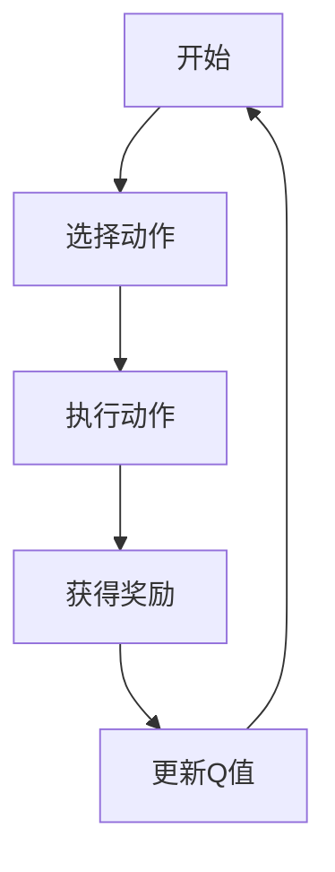
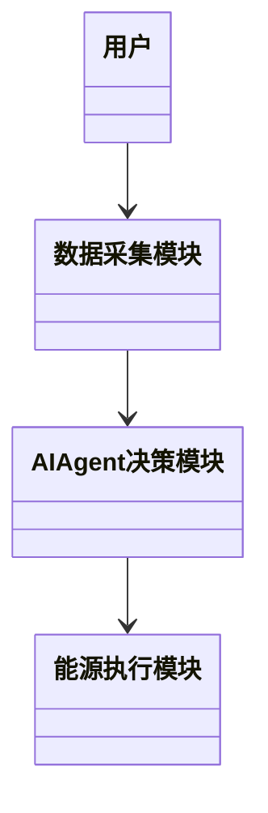
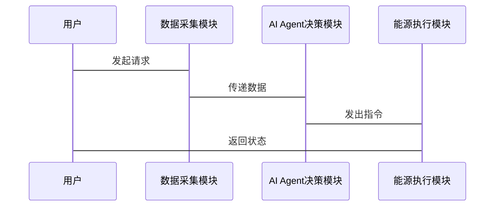

                 


# AI Agent在智能家庭能源管理中的应用

> 关键词：AI Agent, 智能家庭, 能源管理, 机器学习, 智能电网, 家庭能源优化, 能源效率

> 摘要：随着能源需求的增长和环保压力的增大，AI Agent在智能家庭能源管理中的应用日益重要。本文探讨AI Agent如何通过智能决策优化能源使用，减少浪费，降低成本。

---

## 第一部分：背景介绍

### 第1章：AI Agent与智能家庭能源管理概述

#### 1.1 问题背景与描述

- **1.1.1 智能家庭能源管理的背景**
  随着全球能源需求的不断增长和环境问题的加剧，家庭能源管理变得越来越重要。通过智能化管理，可以有效减少能源浪费，降低家庭能源消耗成本，并为智能电网提供支持。

- **1.1.2 问题的提出与描述**
  家庭能源管理的核心问题在于如何高效利用能源，减少浪费。传统管理方式依赖人工操作，效率低下且难以优化。AI Agent通过智能决策和自动化控制，能够实时优化能源使用，提升管理效率。

- **1.1.3 AI Agent在家庭能源管理中的作用**
  AI Agent能够实时监控能源使用情况，分析数据，预测需求，并根据实际情况调整能源使用策略，从而实现节能减排和成本优化。

#### 1.2 问题解决与边界

- **1.2.1 AI Agent如何解决能源管理问题**
  AI Agent通过智能算法和数据驱动的方法，实时优化能源使用策略，减少浪费，降低成本。

- **1.2.2 系统的边界与外延**
  本系统仅限于家庭能源管理，不包括工业和商业能源管理。系统边界包括家庭内部的能源设备，如空调、灯具、热水器等。

- **1.2.3 核心概念与组成要素**
  核心概念包括AI Agent、能源设备、数据采集、优化算法等。组成要素包括数据采集模块、AI Agent决策模块、能源执行模块等。

---

## 第二部分：核心概念与联系

### 第2章：AI Agent的核心原理与特征

#### 2.1 核心原理

- **2.1.1 AI Agent的基本原理**
  AI Agent通过感知环境、分析数据、制定决策并执行操作来优化能源使用。其核心原理包括知识表示、推理、学习和自适应能力。

- **2.1.2 知识表示与推理机制**
  知识表示通过符号逻辑或概率模型描述问题，推理机制基于逻辑推理或概率推理，用于制定决策。

- **2.1.3 学习与自适应能力**
  AI Agent通过机器学习算法不断优化模型，适应环境变化，提高决策准确性。

#### 2.2 核心概念对比

- **2.2.1 AI Agent与传统算法的对比**
  AI Agent具有学习和自适应能力，能够处理复杂问题；传统算法基于固定规则，适应性较弱。

- **2.2.2 机器学习与AI Agent的异同**
  机器学习是AI Agent的核心技术之一，但AI Agent还包括知识表示和推理机制，能够进行复杂决策。

- **2.2.3 概念属性特征对比表（表格形式）**

| 概念       | 特征                     | 优势                                   |
|------------|--------------------------|---------------------------------------|
| AI Agent   | 学习、推理、自适应       | 能够处理复杂问题，适应环境变化       |
| 传统算法   | 固定规则、无学习         | 简单易实现，适用于规则明确的问题     |

#### 2.3 ER实体关系图

```mermaid
erd
  能源设备 --> AI Agent
  用户 --> AI Agent
  数据采集 --> AI Agent
  优化策略 --> 能源设备
```

---

## 第三部分：算法原理讲解

### 第3章：AI Agent算法的数学模型与实现

#### 3.1 算法原理

- **3.1.1 强化学习与决策树原理**
  强化学习通过奖励机制优化决策，决策树通过划分数据进行分类。AI Agent结合两者，实现复杂决策。

- **3.1.2 Q-learning算法的数学模型**



数学公式：

$$ Q(s, a) = Q(s, a) + \alpha (r + \gamma \max Q(s', a') - Q(s, a)) $$

其中：
- $Q(s, a)$：状态s动作a的Q值
- $\alpha$：学习率
- $r$：奖励
- $\gamma$：折扣因子

---

## 第四部分：系统分析与架构设计

### 第4章：系统架构设计与实现

#### 4.1 问题场景介绍

- 家庭能源管理系统的应用场景包括智能调节家电、优化能源使用、实时监控能源消耗等。

#### 4.2 系统功能设计

- **4.2.1 领域模型（Mermaid类图）**



#### 4.3 系统架构设计

- **4.3.1 系统架构图**

```mermaid
graph TD
    用户 --> 数据采集模块
    数据采集模块 --> AI Agent决策模块
    AI Agent决策模块 --> 能源执行模块
    能源执行模块 --> 用户
```

#### 4.4 系统接口设计与交互

- **4.4.1 系统接口设计**
  用户通过家庭智能终端与系统交互，数据采集模块通过传感器采集数据，AI Agent决策模块通过算法处理数据，能源执行模块通过执行器调节设备。

- **4.4.2 交互流程（Mermaid序列图）**



---

## 第五部分：项目实战

### 第5章：家庭能源管理系统的实现

#### 5.1 环境安装

- 安装Python、TensorFlow、Scikit-learn等工具。

#### 5.2 核心代码实现

```python
import numpy as np
from sklearn.tree import DecisionTreeRegressor

# 示例数据
X = np.array([[20, 1], [22, 3], [25, 5], [18, 2]])
y = np.array([45, 55, 65, 40])

# 训练决策树模型
model = DecisionTreeRegressor()
model.fit(X, y)

# 预测
test_X = np.array([[21, 4]])
print(model.predict(test_X))
```

#### 5.3 代码解读与分析

- 数据采集模块读取能源数据，训练AI Agent模型，模型根据输入数据预测最优策略，能源执行模块根据预测结果调节设备。

#### 5.4 实际案例分析

- 案例：某家庭在电价高峰期调整家电使用，通过AI Agent优化能源使用，节省电费开支。

#### 5.5 项目小结

- 通过AI Agent优化家庭能源管理，实现了节能减排和成本优化，展示了AI技术在能源管理中的潜力。

---

## 第六部分：总结与展望

### 第6章：总结与最佳实践

#### 6.1 总结

- AI Agent在家庭能源管理中的应用前景广阔，能够有效优化能源使用，减少浪费。

#### 6.2 最佳实践

- 数据隐私保护
- 模型鲁棒性设计
- 用户教育与培训

#### 6.3 小结

- 通过AI Agent优化家庭能源管理，能够实现节能减排和成本优化。

#### 6.4 注意事项

- 数据安全
- 模型更新
- 用户体验

#### 6.5 拓展阅读

- 推荐书籍：《机器学习实战》
- 推荐论文：《强化学习在能源管理中的应用》

---

## 作者

作者：AI天才研究院/AI Genius Institute & 禅与计算机程序设计艺术/Zen And The Art of Computer Programming

