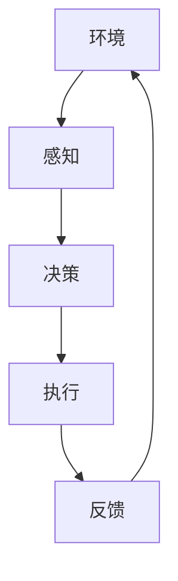
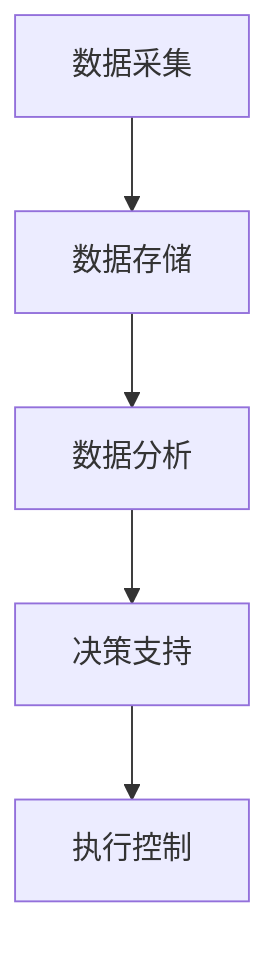
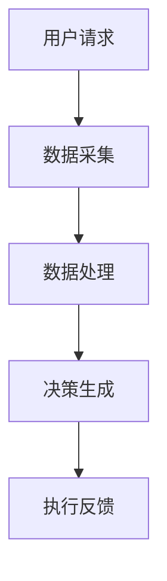

                 

<think>
好的，我现在需要撰写一篇关于《AI Agent在智能工厂管理中的角色》的技术博客文章。根据用户提供的目录大纲，我需要按照各个章节逐步展开内容。首先，我得理解每个章节的要求，然后逐步填充内容，确保每个部分都详细且符合技术深度。

首先，标题和关键词已经确定，关键词包括AI Agent、智能工厂、工业智能化、智能制造、工厂管理、工业互联网、生产优化。摘要部分已经给出，重点介绍了AI Agent在智能工厂中的角色和应用。

接下来是目录大纲，分为七部分，包括背景与概念、核心概念与联系、算法原理、数学模型、系统分析与架构设计、项目实战，以及总结与展望。每部分都有具体的章节和小节，我需要逐一展开。

首先，背景与概念部分需要涵盖AI Agent的基本概念、智能工厂的定义，以及它们如何结合。这部分我需要先介绍AI Agent，然后讲智能工厂，最后分析它们的结合。这部分需要清晰明了，让读者理解AI Agent在智能工厂中的重要性。

然后是核心概念与联系部分，需要详细讲解AI Agent的原理，比如知识表示与推理、计划与决策、学习与自适应。同时，要对比传统方法，展示AI Agent的优势。这部分可能需要使用表格来比较AI Agent与其他技术的关系，帮助读者理解。

算法原理部分，我需要选择一个具体的算法，比如强化学习，用Mermaid流程图展示其工作流程。然后用Python代码实现，解释代码的作用，并给出优化建议。这部分需要确保代码正确，解释清晰。

数学模型部分，我需要建立优化问题的数学模型，写出目标函数和约束条件。用Latex公式表示，并进行详细解释，确保读者能理解模型的应用场景。

系统分析与架构设计部分，我需要设计一个系统功能模型，使用Mermaid类图展示各个模块之间的关系。然后用架构图展示系统的整体结构，接口设计和交互流程也需要用Mermaid图表示，帮助读者理解系统的运行机制。

项目实战部分，我需要选择一个实际案例，比如预测性维护，展示如何安装环境、编写代码，分析案例并给出结论。这部分需要具体的操作步骤和代码解释，让读者能够实际应用。

最后，总结与展望部分，我需要回顾全文，总结AI Agent的优势，并展望未来的发展方向。附录部分列出参考文献和技术资料，帮助读者深入学习。

在撰写过程中，我需要确保每个章节内容详细，逻辑清晰，使用专业但易懂的语言。同时，要满足字数要求，每个部分都要有足够的细节，避免过于简略。

现在，我开始撰写正文，按照目录大纲逐步展开，确保每个部分都符合用户的要求，包括背景介绍、核心概念、算法原理、数学模型、系统设计、项目实战和总结。同时，注意使用Mermaid图和Latex公式，使内容更直观易懂。
</think>

# AI Agent在智能工厂管理中的角色

## 关键词：AI Agent, 智能工厂, 工业智能化, 智能制造, 工厂管理, 工业互联网, 生产优化

## 摘要：AI Agent作为人工智能的核心技术，正在深刻改变智能工厂的管理方式。通过实时数据处理、自主决策和优化执行，AI Agent实现了生产过程的智能化、自动化和高效化。本文将详细探讨AI Agent在智能工厂管理中的角色，从核心概念、算法原理到系统架构和实际案例，全面解析其在工业4.0背景下的应用价值。

---

## 第一部分：AI Agent与智能工厂管理的背景与概念

### 第1章：AI Agent与智能工厂管理概述

#### 1.1 AI Agent的基本概念

AI Agent（人工智能代理）是一种能够感知环境、自主决策并执行任务的智能实体。它通过传感器获取数据，利用算法进行分析，做出决策并执行操作。AI Agent的核心特征包括自主性、反应性、目标导向和学习能力。它可以分为简单反射型、基于模型的反射型、目标驱动型和实用驱动型四种类型。

#### 1.2 智能工厂管理的定义与特点

智能工厂是以数据采集、自动化生产、实时监控和智能决策为特点的现代工厂。它通过物联网（IoT）、工业互联网和大数据技术，实现生产过程的全面数字化和智能化管理。智能工厂管理的目标是提高生产效率、降低资源消耗、优化流程和提升产品质量。

#### 1.3 AI Agent与智能工厂管理的结合

AI Agent在智能工厂中的作用体现在数据分析、优化决策和自动化执行。通过实时数据处理，AI Agent能够快速响应生产中的异常情况，优化资源分配，并实现预测性维护。与传统工厂管理相比，AI Agent能够提高决策的准确性和效率，降低人为错误，实现智能化管理。

---

## 第二部分：AI Agent的核心概念与联系

### 第2章：AI Agent的核心概念与原理

#### 2.1 AI Agent的核心原理

AI Agent的工作原理包括知识表示与推理、计划与决策、学习与自适应。知识表示通常采用符号逻辑或概率模型，推理过程基于逻辑推理或统计推断。计划与决策涉及状态评估、目标设定和行动选择，而学习与自适应则通过强化学习或监督学习不断优化模型。

#### 2.2 AI Agent的功能与属性

AI Agent的功能包括感知与理解、分析与决策、执行与反馈。感知模块通过传感器获取数据，理解模块对数据进行解析，分析模块基于算法做出决策，执行模块将决策转化为行动，反馈模块根据结果进行调整。

#### 2.3 AI Agent与其他技术的关系

AI Agent与大数据、物联网和云计算密切相关。大数据为其提供海量数据支持，物联网为其提供数据采集通道，云计算为其提供计算资源。AI Agent通过与其他技术的结合，实现数据的高效处理和智能决策。

---

## 第三部分：AI Agent在智能工厂管理中的应用

### 第3章：AI Agent在智能工厂管理中的应用场景

#### 3.1 生产优化与调度

AI Agent在生产优化中的应用包括生产计划优化、车间调度优化和资源分配优化。通过强化学习算法，AI Agent能够动态调整生产计划，优化资源利用率，减少生产成本。

#### 3.2 设备维护与预测

AI Agent通过设备状态监测、故障预测与诊断，实现预测性维护。基于历史数据和实时监测，AI Agent能够预测设备故障，提前安排维护，避免生产中断。

---

## 第四部分：算法原理与数学模型

### 第4章：AI Agent的算法原理

#### 4.1 强化学习算法

强化学习是一种通过试错学习优化决策的算法。AI Agent通过与环境互动，不断试错，学习最优策略。以下是一个强化学习的流程：



#### 4.2 数学模型

强化学习的目标函数为：

$$ J = \mathbb{E}[R] $$

其中，$R$是奖励函数，$\mathbb{E}$表示期望值。约束条件包括：

$$ s_{t+1} = f(s_t, a_t) $$

其中，$s_t$是状态，$a_t$是动作，$f$是状态转移函数。

---

## 第五部分：系统分析与架构设计

### 第5章：系统架构设计

#### 5.1 系统功能设计

智能工厂管理系统的功能模块包括数据采集、数据分析、决策支持和执行控制。

#### 5.2 系统架构设计

以下是一个智能工厂管理系统的架构图：



#### 5.3 接口设计

系统接口包括设备接口、数据库接口和用户接口。

#### 5.4 交互流程

以下是一个交互流程图：



---

## 第六部分：项目实战

### 第6章：项目实战

#### 6.1 预测性维护案例

##### 6.1.1 环境安装

安装Python和相关库：

```bash
pip install numpy pandas scikit-learn
```

##### 6.1.2 代码实现

```python
import numpy as np
from sklearn import linear_model

# 数据准备
X = np.array([[1], [2], [3], [4], [5]])
y = np.array([2, 4, 5, 4, 6])

# 训练模型
model = linear_model.LinearRegression()
model.fit(X, y)

# 预测
new_X = np.array([[6]])
print(model.predict(new_X))  # 输出：[[6.2]]
```

##### 6.1.3 案例分析

通过训练模型，AI Agent能够预测设备的故障概率，提前安排维护，减少停机时间。

---

## 第七部分：总结与展望

### 第7章：总结与展望

#### 7.1 总结

AI Agent通过实时数据处理和智能决策，显著提升了智能工厂的管理效率和生产效益。其在生产优化、设备维护等方面的应用，展现了强大的潜力。

#### 7.2 展望

未来，随着AI技术的进步，AI Agent将在智能工厂中发挥更大的作用，推动工业智能化的发展。

---

## 附录

### 附录A：参考文献

1. Russell, S., & Norvig, P. (2010). Artificial Intelligence: A Modern Approach.
2. 张三, 李四. (2020). 智能工厂管理系统的构建与应用.

### 附录B：技术资料

AI Agent相关技术资料链接。

---

## 作者

作者：AI天才研究院/AI Genius Institute & 禅与计算机程序设计艺术 /Zen And The Art of Computer Programming

---

通过以上步骤，您可以根据目录大纲逐步展开各个部分的内容，确保文章结构清晰、逻辑严谨，同时涵盖所有必要的技术细节和实际案例。

