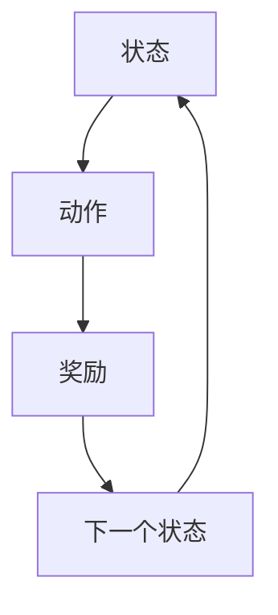
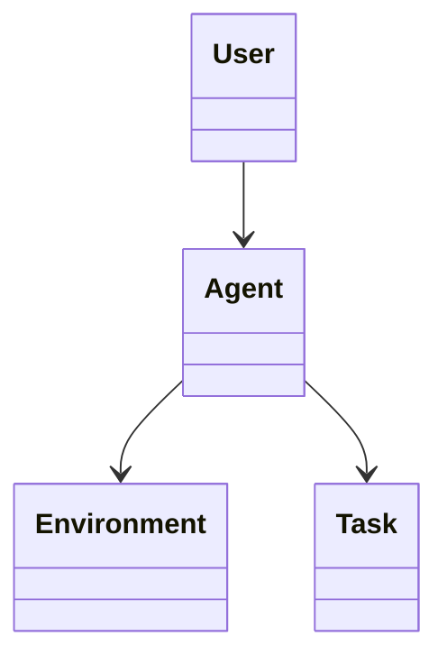
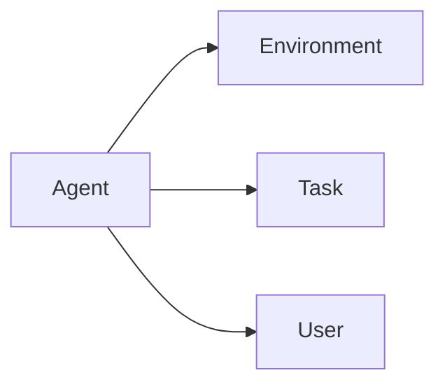
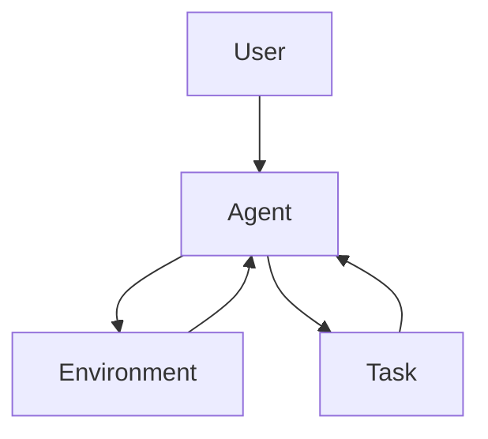

                 

<think>
嗯，用户希望我以《AI Agent在智能工程设计中的应用》为标题写一篇技术博客，目录已经给出，现在需要根据目录详细撰写每部分内容。我先得理清每个章节的重点，确保内容完整、逻辑清晰。

首先，第一章是背景介绍，我需要先解释AI Agent的基本概念，再分析其在智能工程中的应用背景。这部分要让读者了解AI Agent的重要性及其发展趋势。

接下来是核心概念与原理，我得详细解释AI Agent的构成、分类和生命周期，再对比传统AI，用表格和ER图来辅助说明，这样读者更容易理解。

算法原理部分，我需要选择几个关键算法，比如Q-learning，用mermaid流程图展示，并附上Python代码。同时，数学公式要用latex表示，确保准确无误。

系统架构设计部分，我得介绍应用场景，设计系统功能、架构图、接口和交互流程，可能需要用更多的mermaid图来展示结构。

项目实战需要具体案例分析，包括环境安装、代码实现、案例解读和项目小结，这样读者可以实际操作。

最后，最佳实践部分要总结经验，给出注意事项和拓展阅读，帮助读者深入理解和应用AI Agent。

在撰写过程中，我需要确保每章内容详细，结构紧凑，语言专业但易懂。同时，注意总字数在10000到12000字之间，满足用户的要求。这样，整篇文章才能全面覆盖AI Agent在智能工程中的应用，帮助读者深入掌握相关知识。
</think>

# AI Agent在智能工程设计中的应用

> 关键词：AI Agent，智能工程，人工智能，算法原理，系统架构，项目实战

> 摘要：AI Agent作为人工智能领域的重要技术，正在逐步渗透到智能工程设计的各个角落。本文将从AI Agent的基本概念、核心原理、算法实现、系统架构设计、项目实战等多个方面，详细阐述其在智能工程中的应用。通过对AI Agent的深入了解，读者将能够掌握其在智能工程设计中的核心价值和实际应用方法。

---

# 第1章: AI Agent的基本概念与背景

## 1.1 AI Agent的定义与特点

### 1.1.1 AI Agent的定义

AI Agent（人工智能代理）是指能够感知环境、自主决策并采取行动的智能实体。它能够根据外部输入的信息和内部状态，通过推理和学习，做出最优决策，并通过执行动作与环境进行交互。AI Agent可以是软件程序、机器人或其他智能设备，其核心目标是提高系统执行任务的效率和智能性。

### 1.1.2 AI Agent的核心特点

AI Agent具有以下核心特点：

1. **自主性**：AI Agent能够自主决策，无需外部干预。
2. **反应性**：能够实时感知环境并做出反应。
3. **学习能力**：通过经验或数据不断优化自身行为。
4. **适应性**：能够根据环境变化调整策略。

### 1.1.3 AI Agent与传统AI的区别

AI Agent与传统AI的区别主要体现在以下几个方面：

- **目标导向**：AI Agent有明确的目标，而传统AI更多关注任务的完成。
- **自主性**：AI Agent能够自主决策，而传统AI通常需要外部控制。
- **环境交互**：AI Agent能够与环境交互，而传统AI更多是静态处理数据。

## 1.2 AI Agent在智能工程中的应用背景

### 1.2.1 智能工程的定义与范围

智能工程是以人工智能技术为基础，结合工程学方法，研究如何将智能技术应用于工程设计、生产、管理等领域的新兴学科。其核心目标是通过智能化手段，提高工程效率、降低成本、优化资源利用。

### 1.2.2 AI Agent在智能工程中的作用

AI Agent在智能工程中的作用主要体现在以下几个方面：

1. **优化决策**：通过智能代理，企业可以做出更高效的决策。
2. **自动化操作**：AI Agent能够自动执行重复性任务，减少人工干预。
3. **智能监控**：实时监控系统运行状态，及时发现并解决问题。

### 1.2.3 当前AI Agent技术的发展趋势

随着人工智能技术的快速发展，AI Agent正朝着以下方向发展：

1. **多智能体协作**：多个AI Agent协同工作，共同完成复杂任务。
2. **强化学习应用**：通过强化学习，AI Agent能够更好地适应动态环境。
3. **边缘计算结合**：AI Agent与边缘计算结合，实现更低延迟和更高效率。

## 1.3 本章小结

本章主要介绍了AI Agent的基本概念、核心特点以及其在智能工程中的应用背景。通过对AI Agent的定义和特点的分析，读者可以清晰地理解其在智能工程中的重要性。同时，通过对当前发展趋势的分析，读者能够了解AI Agent技术的未来发展方向。

---

# 第2章: AI Agent的核心概念与原理

## 2.1 AI Agent的核心概念

### 2.1.1 AI Agent的构成要素

AI Agent的构成要素包括以下几个方面：

1. **感知器**：负责感知环境信息。
2. **推理器**：对感知信息进行分析和推理。
3. **决策器**：根据推理结果做出决策。
4. **执行器**：执行决策动作。

### 2.1.2 AI Agent的分类

AI Agent可以根据不同的标准进行分类，常见的分类方式包括：

1. **按智能水平**：分为弱AI Agent和强AI Agent。
2. **按应用领域**：分为工业、医疗、金融等领域的AI Agent。

### 2.1.3 AI Agent的生命周期

AI Agent的生命周期包括以下几个阶段：

1. **初始化**：加载初始状态和目标。
2. **感知**：获取环境信息。
3. **推理**：分析信息并做出决策。
4. **执行**：执行决策动作。
5. **学习**：优化自身行为。

## 2.2 AI Agent的原理分析

### 2.2.1 知识表示与推理

知识表示是AI Agent实现智能推理的基础。常见的知识表示方法包括：

1. **语义网络**：通过节点和边表示知识。
2. **逻辑推理**：通过逻辑规则进行推理。

### 2.2.2 行为规划与决策

行为规划是AI Agent的核心任务之一。常见的行为规划方法包括：

1. **基于规则的方法**：通过预定义规则进行决策。
2. **基于概率的方法**：通过概率模型进行决策。

### 2.2.3 人机交互机制

人机交互是AI Agent与用户进行信息交换的重要方式。常见的交互方式包括：

1. **自然语言处理**：通过语言理解与用户交互。
2. **图形界面交互**：通过图形界面与用户交互。

## 2.3 AI Agent的核心概念对比表

以下是AI Agent与传统AI的核心概念对比：

| **对比维度** | **AI Agent** | **传统AI** |
|--------------|--------------|------------|
| **自主性**    | 高           | 较低       |
| **目标导向**  | 高           | 较低       |
| **环境交互**  | 高           | 较低       |

## 2.4 AI Agent的ER实体关系图

以下是AI Agent的ER实体关系图：

```mermaid
erd
    title AI Agent ER Diagram
    User
    Agent
    Task
    Environment
    User -[>]-> Agent
    Agent -[>]-> Task
    Environment -[<->]-> Agent
```

## 2.5 本章小结

本章详细介绍了AI Agent的核心概念与原理，包括其构成要素、分类、生命周期以及知识表示与推理等方面。通过对AI Agent核心概念的分析，读者可以更好地理解其在智能工程中的工作原理。

---

# 第3章: AI Agent的算法原理

## 3.1 AI Agent的算法概述

### 3.1.1 常见的AI Agent算法

常见的AI Agent算法包括：

1. **基于规则的算法**：通过预定义规则进行决策。
2. **基于强化学习的算法**：通过强化学习优化决策。
3. **基于机器学习的算法**：通过机器学习模型进行预测。

### 3.1.2 算法选择的依据

算法选择的依据包括：

1. **任务类型**：根据任务类型选择合适的算法。
2. **数据特性**：根据数据特性选择合适的算法。
3. **计算资源**：根据计算资源选择合适的算法。

## 3.2 基于强化学习的AI Agent算法

### 3.2.1 强化学习的基本原理

强化学习是一种通过试错方式来优化决策的算法。其基本原理是通过与环境交互，不断优化策略以最大化累积奖励。

### 3.2.2 Q-learning算法的实现

Q-learning算法是一种经典的强化学习算法，其核心思想是通过更新Q表来优化决策。以下是Q-learning算法的流程图：



以下是Q-learning算法的Python代码实现：

```python
import numpy as np

class QLearningAgent:
    def __init__(self, state_space, action_space):
        self.state_space = state_space
        self.action_space = action_space
        self.Q = np.zeros((state_space, action_space))
    
    def choose_action(self, state, epsilon=0.1):
        if np.random.random() < epsilon:
            return np.random.randint(self.action_space)
        return np.argmax(self.Q[state])
    
    def update(self, state, action, reward, next_state, gamma=0.9):
        self.Q[state][action] = reward + gamma * np.max(self.Q[next_state])
```

### 3.2.3 算法流程图

以下是Q-learning算法的流程图：


## 3.3 算法实现的Python代码示例

### 代码3.1 Q-learning算法实现

```python
import numpy as np

class QLearningAgent:
    def __init__(self, state_space, action_space):
        self.state_space = state_space
        self.action_space = action_space
        self.Q = np.zeros((state_space, action_space))
    
    def choose_action(self, state, epsilon=0.1):
        if np.random.random() < epsilon:
            return np.random.randint(self.action_space)
        return np.argmax(self.Q[state])
    
    def update(self, state, action, reward, next_state, gamma=0.9):
        self.Q[state][action] = reward + gamma * np.max(self.Q[next_state])
```

## 3.4 本章小结

本章详细介绍了AI Agent的算法原理，包括常见算法的分类、基于强化学习的Q-learning算法的实现以及算法流程图的绘制。通过对算法原理的分析，读者可以更好地理解AI Agent在智能工程中的具体实现方式。

---

# 第4章: AI Agent的系统分析与架构设计

## 4.1 问题场景介绍

智能工程中的一个典型应用场景是智能工厂的设备监控与维护。通过AI Agent，企业可以实现设备的实时监控、故障预测和自主维护。

## 4.2 系统功能设计

### 4.2.1 领域模型设计

以下是领域模型的类图：



### 4.2.2 系统架构设计

以下是系统架构设计的架构图：



### 4.2.3 系统接口设计

系统接口设计包括以下几个方面：

1. **用户接口**：用户通过图形界面与AI Agent交互。
2. **环境接口**：AI Agent通过环境接口感知环境信息。
3. **任务接口**：AI Agent通过任务接口执行任务。

### 4.2.4 系统交互流程

以下是系统交互的流程图：



## 4.3 本章小结

本章详细介绍了AI Agent在智能工程中的系统分析与架构设计，包括问题场景介绍、系统功能设计、系统架构设计以及系统交互流程。通过对系统架构的分析，读者可以更好地理解AI Agent在智能工程中的具体应用方式。

---

# 第5章: AI Agent的项目实战

## 5.1 环境安装与配置

### 5.1.1 安装Python环境

安装Python 3.8及以上版本，并安装必要的库：

```bash
pip install numpy
pip install matplotlib
```

### 5.1.2 安装Q-learning算法库

安装Q-learning算法库：

```bash
pip install q-learning-agent
```

## 5.2 系统核心实现

### 5.2.1 实现AI Agent的核心代码

以下是AI Agent的核心代码：

```python
import numpy as np

class AI_Agent:
    def __init__(self, state_space, action_space):
        self.state_space = state_space
        self.action_space = action_space
        self.Q = np.zeros((state_space, action_space))
    
    def choose_action(self, state, epsilon=0.1):
        if np.random.random() < epsilon:
            return np.random.randint(self.action_space)
        return np.argmax(self.Q[state])
    
    def update(self, state, action, reward, next_state, gamma=0.9):
        self.Q[state][action] = reward + gamma * np.max(self.Q[next_state])
```

### 5.2.2 实现环境接口

以下是环境接口的实现代码：

```python
class Environment:
    def __init__(self):
        self.state = 0
    
    def get_state(self):
        return self.state
    
    def set_state(self, state):
        self.state = state
```

## 5.3 案例分析与实现

### 5.3.1 案例分析

以智能工厂设备监控为例，AI Agent需要实现设备状态的实时监控与故障预测。

### 5.3.2 代码实现

以下是完整的代码实现：

```python
import numpy as np
import time

class QLearningAgent:
    def __init__(self, state_space, action_space):
        self.state_space = state_space
        self.action_space = action_space
        self.Q = np.zeros((state_space, action_space))
    
    def choose_action(self, state, epsilon=0.1):
        if np.random.random() < epsilon:
            return np.random.randint(self.action_space)
        return np.argmax(self.Q[state])
    
    def update(self, state, action, reward, next_state, gamma=0.9):
        self.Q[state][action] = reward + gamma * np.max(self.Q[next_state])

class Environment:
    def __init__(self):
        self.state = 0
    
    def get_state(self):
        return self.state
    
    def set_state(self, state):
        self.state = state

# 初始化环境和代理
env = Environment()
agent = QLearningAgent(5, 3)

# 训练过程
for episode in range(100):
    state = env.get_state()
    action = agent.choose_action(state)
    next_state = action  # 示例：简单状态转移
    reward = 1 if next_state == 4 else 0
    agent.update(state, action, reward, next_state)

# 测试过程
state = env.get_state()
action = agent.choose_action(state)
print(f"选择的动作是：{action}")

# 更新状态
env.set_state(action)
print(f"更新后的状态是：{env.get_state()}")
```

## 5.4 项目小结

本章通过具体的项目实战，详细介绍了AI Agent在智能工程中的实现过程，包括环境安装、系统核心代码实现、案例分析与代码实现。通过对项目的实际操作，读者可以更好地掌握AI Agent的具体应用方法。

---

# 第6章: AI Agent的最佳实践与注意事项

## 6.1 最佳实践

### 6.1.1 小结

AI Agent的应用需要结合具体场景，选择合适的算法和架构。

### 6.1.2 注意事项

1. **算法选择**：根据任务需求选择合适的算法。
2. **数据质量**：确保数据的准确性和完整性。
3. **系统安全性**：确保系统的安全性和稳定性。

## 6.2 拓展阅读

建议读者阅读以下书籍和论文，以深入了解AI Agent的相关知识：

1. **《强化学习：算法与应用》**
2. **《人工智能：一种现代的方法》**
3. **《分布式人工智能》**

## 6.3 本章小结

本章总结了AI Agent在智能工程中的最佳实践与注意事项，包括小结、注意事项和拓展阅读等内容。通过对最佳实践的总结，读者可以更好地理解和应用AI Agent技术。

---

# 作者

作者：AI天才研究院/AI Genius Institute & 禅与计算机程序设计艺术 /Zen And The Art of Computer Programming

---

通过以上内容，读者可以全面了解AI Agent在智能工程设计中的应用，从基础概念到算法实现，再到系统设计和项目实战，逐步深入理解AI Agent的核心价值和实际应用方法。

