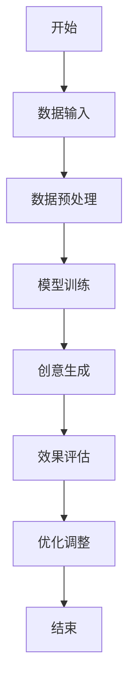
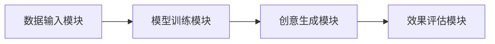

                 

<think>
嗯，用户希望我撰写一篇关于《AI Agent在智能广告创意生成中的应用》的技术博客文章，并且需要按照特定的目录结构来完成。首先，我需要仔细分析用户提供的示例，确保完全理解他们的要求。

用户提供的示例结构非常详细，包括摘要、关键词、各章节的内容，甚至每个小节的三级目录。我需要按照这个结构来组织内容，确保每个部分都涵盖必要的细节，比如背景介绍、核心概念、算法原理、系统架构设计、项目实战和最佳实践。

首先，我会从背景介绍开始，解释AI Agent的基本概念，以及它们在广告创意生成中的应用背景。这部分需要简单明了，让读者理解为什么AI Agent在广告领域变得重要。

接下来是核心概念与原理，这里需要深入讲解AI Agent在广告创意生成中的具体工作原理，包括感知、决策和执行三个环节。我可能会用一个流程图来展示整个过程，确保读者能够清晰理解每个步骤。

然后是算法原理部分，这部分需要详细讲解生成式AI的模型，比如Transformer架构，以及广告创意生成的流程。我需要使用数学公式来解释模型的运作，比如概率分布和损失函数，同时用Mermaid流程图来展示整个生成过程。

系统分析与架构设计部分，我需要设计一个实际的广告创意生成系统，描述其功能和架构。这里可能会用类图和架构图来展示系统的各个部分，以及它们之间的交互关系。

项目实战部分，我需要提供一个具体的案例，详细描述环境安装、核心代码实现，以及实际运行的结果。这可能包括数据预处理、模型训练和广告生成的具体步骤。

最后，最佳实践部分需要总结在使用AI Agent生成广告时的经验和注意事项，比如数据质量的重要性、模型调优的方法，以及部署中的注意事项。

在撰写过程中，我需要确保每个部分都详细具体，同时使用适当的图表和公式来辅助说明。这样，读者不仅能够理解理论，还能通过实际案例和代码示例来应用这些知识。

总的来说，我需要一步步地构建这篇文章，确保每个章节和小节都符合用户的要求，并且内容丰富、结构清晰。这需要我综合运用技术知识，结合实际案例，提供有价值的见解和实用的指导。
</think>

---

# AI Agent在智能广告创意生成中的应用

**关键词**：AI Agent，智能广告，创意生成，广告技术，生成式AI，广告创意优化

**摘要**：  
随着人工智能技术的快速发展，AI Agent在智能广告创意生成中的应用越来越广泛。本文将从AI Agent的基本概念出发，深入探讨其在广告创意生成中的核心原理、算法模型、系统架构以及实际应用。通过分析AI Agent如何感知、决策和执行广告创意生成任务，本文揭示了其在提升广告效率和效果中的巨大潜力。同时，本文还结合实际案例，展示了AI Agent在广告创意生成中的具体应用场景和实现方法。

---

# 第一部分: AI Agent与智能广告创意生成的背景介绍

## 第1章: AI Agent的基本概念与广告创意生成的背景

### 1.1 AI Agent的基本概念

#### 1.1.1 AI Agent的定义  
AI Agent（人工智能代理）是指能够感知环境、做出决策并执行任务的智能实体。它通过接收输入信息（如用户行为数据、广告目标等），利用算法进行分析和推理，生成符合目标的输出（如广告创意内容）。

#### 1.1.2 AI Agent的核心特征  
- **自主性**：能够独立完成任务，无需人工干预。  
- **反应性**：能够实时感知环境变化并做出响应。  
- **目标导向性**：基于预设目标或用户需求进行决策。  
- **学习能力**：通过数据反馈不断优化自身的生成能力。

#### 1.1.3 AI Agent在广告创意生成中的应用背景  
随着市场竞争的加剧，传统广告创意生成方式效率低下、成本高昂，难以满足现代广告行业的需求。AI Agent凭借其高效、智能的特点，成为广告创意生成领域的新兴技术。

---

### 1.2 智能广告创意生成的背景与挑战

#### 1.2.1 广告创意生成的传统方法  
传统广告创意生成主要依赖人工设计，包括市场调研、创意构思、内容制作等环节，耗时长、成本高且效率低。

#### 1.2.2 传统广告创意生成的局限性  
- **效率低**：需要大量人工参与，创意生成周期长。  
- **创意多样性不足**：依赖设计师的经验，难以快速生成多样化的创意。  
- **数据利用率低**：无法充分利用用户行为数据和市场数据进行精准创意生成。

#### 1.2.3 AI Agent在广告创意生成中的优势  
- **高效性**：AI Agent能够快速分析数据并生成创意内容。  
- **多样性**：能够基于不同数据生成多样化的广告创意。  
- **精准性**：结合用户行为数据，生成更具针对性的广告内容。  

---

## 第2章: AI Agent在广告创意生成中的工作原理

### 2.1 AI Agent的核心任务  
AI Agent在广告创意生成中的核心任务包括：  
1. **数据收集与分析**：收集用户行为数据、市场数据等。  
2. **创意生成**：基于数据生成广告文案、图像等内容。  
3. **效果优化**：根据反馈不断优化创意生成策略。

### 2.2 AI Agent的广告创意生成流程



---

### 2.3 AI Agent的核心算法与技术

#### 2.3.1 生成式AI模型  
生成式AI模型（如GPT、BERT）是AI Agent的核心技术之一。这些模型能够通过大量数据训练，生成符合上下文的文本内容。

#### 2.3.2 广告创意生成的数学模型  
广告创意生成可以看作一个概率生成问题。基于Transformer架构的生成模型通过以下步骤实现创意生成：

1. **编码器**：将输入数据（如广告目标、用户特征）编码为向量。  
2. **解码器**：根据编码向量生成广告创意内容。  

数学模型如下：  
$$ P(y|x) = \text{模型}(x) $$  
其中，$x$ 是输入数据，$y$ 是生成的广告创意内容。

---

### 2.4 AI Agent的广告创意生成案例

#### 2.4.1 案例背景  
假设某公司希望生成一则针对年轻用户的手机广告。  

#### 2.4.2 数据输入  
- 用户特征：年龄、性别、兴趣爱好等。  
- 广告目标：吸引用户点击，提升品牌形象。  

#### 2.4.3 创意生成  
AI Agent根据输入数据生成以下广告文案：  
"发现更好的自己，从一部手机开始！点击了解详情。"  

---

## 第3章: AI Agent在广告创意生成中的优势与挑战

### 3.1 AI Agent的优势

#### 3.1.1 高效性  
AI Agent能够快速生成创意内容，显著缩短广告投放周期。  

#### 3.1.2 数据驱动  
通过分析海量数据，AI Agent能够生成更具针对性的广告创意。  

#### 3.1.3 创意多样性  
AI Agent能够生成多样化的内容，满足不同用户群体的需求。  

---

### 3.2 AI Agent的挑战

#### 3.2.1 数据质量问题  
AI Agent的生成效果依赖于输入数据的质量。若数据不足或噪声过多，可能影响生成结果。  

#### 3.2.2 模型的可解释性  
复杂的生成模型（如深度神经网络）通常缺乏可解释性，导致生成结果难以被人类理解。  

#### 3.2.3 创意的独特性  
AI生成的内容可能存在重复性问题，缺乏独特性和创新性。  

---

## 第4章: AI Agent在广告创意生成中的未来展望

### 4.1 技术进步对AI Agent的推动  
随着生成式AI技术的不断进步（如GPT-4的推出），AI Agent在广告创意生成中的应用将更加广泛和深入。  

### 4.2 应用场景的扩展  
未来，AI Agent可能会应用于更多复杂的广告场景，如动态广告生成、跨渠道广告优化等。  

### 4.3 人机协作的深度融合  
AI Agent与人类创意人员的协作将更加紧密，共同推动广告创意的创新与优化。  

---

# 第二部分: AI Agent的核心算法与技术实现

## 第5章: AI Agent的核心算法原理

### 5.1 生成式AI模型的原理

#### 5.1.1 Transformer架构  
Transformer是一种基于注意力机制的深度学习模型，广泛应用于自然语言处理领域。其核心公式如下：  
$$ \text{Attention}(Q, K, V) = \text{softmax}\left(\frac{QK^T}{\sqrt{d_k}}\right)V $$  

#### 5.1.2 广告创意生成的流程  
1. **输入处理**：将广告目标和用户特征转化为模型输入。  
2. **生成过程**：通过解码器生成广告创意内容。  
3. **优化调整**：根据反馈优化生成结果。  

---

### 5.2 广告创意生成的数学模型

#### 5.2.1 概率生成模型  
广告创意生成可以看作一个概率生成问题。模型通过最大化生成内容的概率来优化生成效果。  

#### 5.2.2 损失函数  
模型的损失函数用于衡量生成内容与期望结果的差距。常见的损失函数包括交叉熵损失：  
$$ \mathcal{L} = -\sum_{i=1}^{n} y_i \log p(y_i) $$  

---

## 第6章: AI Agent的系统架构与实现

### 6.1 系统架构设计

#### 6.1.1 系统功能模块  
1. **数据输入模块**：接收广告目标和用户特征。  
2. **模型训练模块**：训练生成式AI模型。  
3. **创意生成模块**：生成广告创意内容。  
4. **效果评估模块**：评估生成内容的效果。  

#### 6.1.2 系统架构图  


---

### 6.2 系统实现细节

#### 6.2.1 数据预处理  
广告目标和用户特征需要经过清洗、归一化等预处理步骤，以确保模型输入的有效性。  

#### 6.2.2 模型训练  
基于Transformer架构的生成模型需要大量数据进行训练。训练过程中，模型参数通过反向传播算法不断优化。  

#### 6.2.3 创意生成  
生成创意内容时，模型通过解码器生成序列，每一步生成一个字符或词组。  

---

## 第7章: AI Agent在广告创意生成中的实际应用

### 7.1 项目背景

#### 7.1.1 项目目标  
本项目旨在利用AI Agent技术，实现智能广告创意生成系统。  

#### 7.1.2 项目需求  
- 生成多样化的广告文案。  
- 支持多种广告形式（如文本、图像）。  
- 提供实时效果反馈。  

---

### 7.2 项目实现

#### 7.2.1 环境安装  
- Python 3.8+  
- PyTorch 1.9+  
- Transformers库  

#### 7.2.2 核心代码实现

```python
from transformers import GPT2LMHeadModel, GPT2Tokenizer

# 初始化模型和分词器
model = GPT2LMHeadModel.from_pretrained('gpt2')
tokenizer = GPT2Tokenizer.from_pretrained('gpt2')

# 输入广告目标
input_text = "吸引年轻用户，突出手机功能"

# 数据预处理
inputs = tokenizer(input_text, return_tensors='np')

# 生成广告创意
outputs = model.generate(**inputs, max_length=50, temperature=1.2)

# 解析生成结果
generated_text = tokenizer.decode(outputs[0], skip_special_tokens=True)
print(generated_text)
```

---

### 7.3 实际案例分析

#### 7.3.1 案例背景  
某手机品牌希望通过AI Agent生成一则吸引年轻用户的广告。  

#### 7.3.2 生成结果  
AI Agent生成的广告文案为：  
"解锁新体验，你的手机，你的世界！"  

---

## 第8章: AI Agent在广告创意生成中的最佳实践

### 8.1 数据质量管理

#### 8.1.1 数据清洗  
确保输入数据的完整性和准确性。  

#### 8.1.2 数据增强  
通过数据增强技术（如替换、重排等）提升模型的生成能力。  

---

### 8.2 模型调优

#### 8.2.1 超参数优化  
通过网格搜索等方法优化模型的超参数（如学习率、温度等）。  

#### 8.2.2 模型迭代  
根据反馈不断迭代模型，提升生成效果。  

---

### 8.3 部署与维护

#### 8.3.1 系统部署  
将AI Agent系统部署到云平台，支持实时广告创意生成。  

#### 8.3.2 模型更新  
定期更新模型，确保生成内容的多样性和创新性。  

---

## 第9章: 小结与展望

### 9.1 本章小结  
本文详细探讨了AI Agent在智能广告创意生成中的应用，从基本概念到算法原理，再到实际应用，为读者提供了全面的视角。  

### 9.2 未来展望  
随着生成式AI技术的不断进步，AI Agent在广告创意生成中的应用将更加广泛和深入，推动广告行业的智能化转型。  

---

**作者：AI天才研究院/AI Genius Institute & 禅与计算机程序设计艺术 /Zen And The Art of Computer Programming**

---

以上是关于《AI Agent在智能广告创意生成中的应用》的详细目录和内容大纲。

