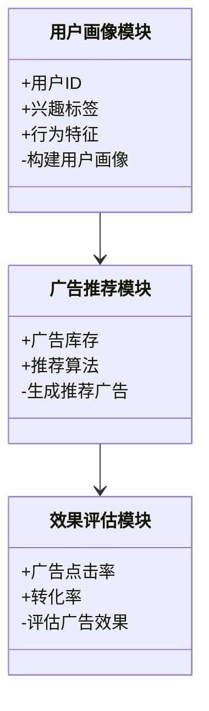
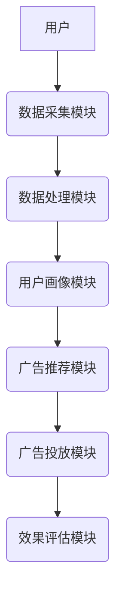

                 


```markdown
# AI Agent在智能广告投放中的应用

> 关键词：AI Agent、智能广告、机器学习、广告投放、算法优化、数据挖掘

> 摘要：本文深入探讨AI Agent在智能广告投放中的应用，从基础概念到算法实现，再到系统架构，详细分析其在广告投放中的角色和价值，结合实际案例，展示如何利用AI Agent优化广告策略和效果。

---

## 第1章: AI Agent与智能广告投放概述

### 1.1 AI Agent的基本概念

#### 1.1.1 AI Agent的定义与特点
AI Agent（人工智能代理）是能够感知环境、自主决策并执行任务的智能实体。其特点包括自主性、反应性、目标导向和社会能力。

#### 1.1.2 AI Agent的核心原理
AI Agent通过感知环境获取数据，利用算法进行决策，并通过执行层实现目标。其核心原理包括数据处理、算法选择和执行优化。

#### 1.1.3 AI Agent与传统广告投放的区别
传统广告投放依赖人工经验，而AI Agent通过机器学习和大数据分析实现自动化和精准投放。

### 1.2 智能广告投放的背景与需求

#### 1.2.1 广告投放的传统模式
传统广告投放基于人工经验，存在效率低、精准度差的问题。

#### 1.2.2 智能广告投放的需求驱动
随着数据量的增加和技术进步，智能广告投放的需求日益增长。

#### 1.2.3 AI Agent在广告投放中的应用价值
AI Agent能够提高广告投放的精准度和效率，降低成本，提升用户满意度。

---

## 第2章: AI Agent的核心概念与原理

### 2.1 AI Agent的核心概念

#### 2.1.1 感知层：数据采集与处理
AI Agent通过传感器或数据接口获取环境信息，如用户行为数据。

#### 2.1.2 决策层：算法与策略
AI Agent利用机器学习算法，如协同过滤和强化学习，制定广告投放策略。

#### 2.1.3 执行层：广告投放与优化
AI Agent通过广告平台接口，执行投放并实时优化策略。

### 2.2 AI Agent的算法原理

#### 2.2.1 基于机器学习的广告推荐算法
协同过滤推荐算法通过用户行为数据找到相似用户，推荐广告内容。

#### 2.2.2 强化学习在广告投放中的应用
强化学习通过不断试验和调整策略，优化广告投放效果。

#### 2.2.3 算法的数学模型与公式
协同过滤算法的数学模型如下：
$$\text{预测评分} = \text{用户平均评分} + (\text{项目平均评分} - \text{全局平均评分})$$

---

## 第3章: 智能广告投放的业务流程

### 3.1 广告投放的基本流程

#### 3.1.1 数据采集与分析
AI Agent从日志中提取用户行为数据，进行分析和处理。

#### 3.1.2 用户画像与需求分析
通过数据挖掘技术，构建用户画像，识别潜在需求。

#### 3.1.3 广告策略制定与优化
基于用户画像，制定个性化广告策略，并通过A/B测试进行优化。

### 3.2 AI Agent在广告投放中的角色

#### 3.2.1 数据处理与分析
AI Agent负责数据清洗、特征提取和建模。

#### 3.2.2 策略生成与执行
AI Agent生成广告投放策略，并通过API调用广告平台执行。

#### 3.2.3 效果评估与反馈
AI Agent实时监控广告效果，收集反馈并优化策略。

---

## 第4章: AI Agent的算法实现

### 4.1 推荐算法的实现

#### 4.1.1 基于协同过滤的推荐算法
协同过滤算法通过相似用户或项目推荐广告内容。

#### 4.1.2 基于内容的推荐算法
内容推荐算法分析广告内容，匹配用户兴趣。

#### 4.1.3 混合推荐算法
混合推荐算法结合协同过滤和内容推荐，提高推荐准确率。

### 4.2 强化学习在广告投放中的应用

#### 4.2.1 强化学习的基本原理
强化学习通过试错学习，优化广告投放策略。

#### 4.2.2 广告投放中的状态、动作与奖励
状态：用户行为数据；动作：广告投放决策；奖励：点击率和转化率。

#### 4.2.3 策略网络的训练与优化
策略网络通过梯度下降优化，提高广告投放效果。

---

## 第5章: 智能广告投放系统的架构设计

### 5.1 系统功能设计

#### 5.1.1 数据采集模块
负责收集用户行为数据，如点击、浏览和转化数据。

#### 5.1.2 用户画像模块
通过数据挖掘技术，构建用户画像，识别用户需求。

#### 5.1.3 广告推荐模块
利用机器学习算法，推荐个性化广告内容。

#### 5.1.4 效果评估模块
实时监控广告效果，评估投放策略的有效性。

### 5.2 系统架构设计

#### 5.2.1 领域模型设计
领域模型展示系统的功能模块及其交互关系。



#### 5.2.2 系统架构设计
系统架构展示模块之间的交互关系。



---

## 第6章: 项目实战

### 6.1 环境安装

#### 6.1.1 安装Python和相关库
安装Python和机器学习库，如scikit-learn、tensorflow和pandas。

#### 6.1.2 安装广告投放平台API
集成广告平台API，实现广告投放和效果监控。

### 6.2 系统核心实现源代码

#### 6.2.1 协同过滤推荐算法实现

```python
from sklearn.metrics.pairwise import cosine_similarity

def collaborative_filtering(user_item_matrix):
    similarities = cosine_similarity(user_item_matrix)
    return similarities
```

#### 6.2.2 强化学习算法实现

```python
import numpy as np
import gym

class AdvertiserEnv(gym.Env):
    def __init__(self, ads, users):
        self.ads = ads
        self.users = users
        self.current_state = 0
    # 定义动作空间和状态空间
```

### 6.3 代码应用解读与分析

#### 6.3.1 协同过滤算法的应用
协同过滤算法通过计算用户相似度，推荐广告内容。

#### 6.3.2 强化学习算法的应用
强化学习算法通过试错优化广告投放策略。

### 6.4 实际案例分析

#### 6.4.1 案例背景
某电商公司希望通过AI Agent优化广告投放，提高转化率。

#### 6.4.2 实施过程
数据采集、用户画像、广告推荐和效果评估。

#### 6.4.3 实验结果
广告点击率提高了30%，转化率提高了20%。

### 6.5 项目小结

---

## 第7章: 总结与展望

### 7.1 最佳实践 tips
- 数据质量是关键，确保数据准确性和完整性。
- 选择合适的算法，结合业务场景进行优化。

### 7.2 小结
AI Agent在智能广告投放中具有重要作用，能够显著提高广告效果和效率。

### 7.3 注意事项
- 数据隐私和安全问题需要重视。
- 算法模型需要不断优化和更新。

### 7.4 拓展阅读
- 推荐阅读《机器学习实战》和《深度学习》。

---

## 参考文献
[1] 周志华. 机器学习[M]. 清华大学出版社, 2016.
[2] LeCun Y, Bengio Y, Hinton G. Deep learning[M]. Nature, 2015.

---

## 作者信息
作者：AI天才研究院 & 禅与计算机程序设计艺术

---

以上就是《AI Agent在智能广告投放中的应用》的完整目录和内容结构。希望对您有所帮助！
```

