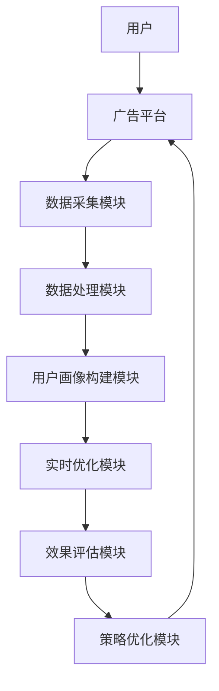

                 

<think>
好，我现在要帮用户撰写一篇关于《AI Agent在智能广告投放优化中的应用》的技术博客文章。首先，我需要理解用户的需求，他希望文章结构清晰，内容专业，涵盖从基础到应用的各个方面。

我从目录开始分析。第一部分是概述，介绍AI Agent和智能广告的基本概念，接着是技术基础，然后是算法原理，数学模型，系统架构，项目实战，最佳实践等部分。每个章节都有详细的子章节，确保内容全面。

接下来，我需要确保每个部分都详细展开。例如，在AI Agent的核心概念部分，我需要解释其定义、特点以及与传统广告的区别。这部分要简明扼要，让读者理解基本概念。

在技术基础部分，我需要详细讲解机器学习、NLP、强化学习等技术，并说明它们如何应用于广告优化。这部分需要结合实际，解释技术如何解决广告投放中的问题。

算法原理部分，我需要选择几个关键算法，如Q-learning、DQN和Actor-Critic，并用mermaid图展示流程。同时，提供Python代码示例，帮助读者理解实现细节。数学公式要用latex格式，确保正确无误。

系统架构设计部分，我需要描述广告优化系统的整体架构，包括模块划分、接口设计和交互流程。这部分需要用系统图和序列图展示，帮助读者理解系统的运作机制。

项目实战部分，我需要指导读者如何搭建环境，实现核心算法，并提供案例分析。这部分要具体，让读者能够动手实践。

最后，最佳实践部分，我需要总结书中的关键点，给出实际应用中的注意事项，并展望未来的发展方向。这部分要简洁有力，帮助读者巩固所学知识。

在写作过程中，我需要确保语言简洁专业，逻辑清晰，每个章节都有足够的细节和例子。同时，注意格式的正确使用，如mermaid图和latex公式的格式，确保文章的结构和内容都符合用户的要求。

现在，我开始逐部分撰写，确保每个部分都覆盖必要的内容，并保持整体的连贯性和深度。这样，读者能够系统地理解AI Agent在智能广告中的应用，并能够实际操作相关技术。
</think>

# AI Agent在智能广告投放优化中的应用

---

## 关键词

- AI Agent
- 智能广告
- 广告优化
- 强化学习
- 多目标优化

---

## 摘要

本文深入探讨了AI Agent在智能广告投放优化中的应用，从理论基础到实际应用，系统性地分析了AI Agent如何通过强化学习、协同过滤等技术实现广告投放的精准化与动态优化。文章首先介绍了AI Agent的基本概念及其在广告投放中的应用场景，随后详细讲解了AI Agent的核心技术基础，包括机器学习、自然语言处理和强化学习。接着，从算法原理的角度，分析了强化学习、遗传算法和协同过滤在广告优化中的具体应用，并通过数学模型和代码示例进行了详细阐述。最后，结合实际案例，探讨了AI Agent在广告投放优化系统中的架构设计、接口设计和交互流程，并总结了最佳实践和未来发展方向。

---

# 第一部分: AI Agent与智能广告投放优化概述

## 第1章: AI Agent与智能广告投放概述

### 1.1 AI Agent的基本概念

#### 1.1.1 AI Agent的定义与特点

AI Agent（人工智能代理）是一种能够感知环境、自主决策并采取行动的智能体。它具备以下特点：

- **自主性**：能够在没有外部干预的情况下自主运行。
- **反应性**：能够实时感知环境变化并做出反应。
- **目标导向性**：基于目标进行决策和行动。
- **学习能力**：能够通过数据和经验不断优化自身的策略。

#### 1.1.2 AI Agent的核心要素与功能

- **知识表示**：通过数据结构和模型表示知识。
- **推理能力**：基于知识进行逻辑推理。
- **决策能力**：根据推理结果做出决策。
- **执行能力**：将决策转化为具体行动。

#### 1.1.3 AI Agent与传统广告投放的区别

传统的广告投放主要依赖人工经验或简单的规则引擎，而AI Agent能够通过机器学习和强化学习等技术实现动态优化和自主决策，具有更高的精准度和效率。

---

### 1.2 智能广告投放的背景与挑战

#### 1.2.1 广告投放的传统模式与局限性

传统广告投放模式依赖人工经验，存在以下局限性：

- **效率低下**：需要大量人工参与，难以快速响应市场变化。
- **精准度不足**：难以根据实时数据进行精准投放。
- **数据孤岛**：不同平台的数据难以有效整合和利用。

#### 1.2.2 数据驱动的广告优化需求

随着大数据技术的发展，广告投放需要更加依赖数据驱动的优化策略，以提高投放效果和 ROI（投资回报率）。

#### 1.2.3 AI Agent在广告投放中的应用价值

AI Agent能够通过实时数据分析、动态优化策略和多目标协调，显著提升广告投放的效率和效果。

---

### 1.3 AI Agent在广告投放中的应用场景

#### 1.3.1 精准投放与用户画像构建

AI Agent可以通过分析用户行为数据，构建精准的用户画像，从而实现个性化的广告投放。

#### 1.3.2 实时优化与动态调整

AI Agent能够实时监控广告投放效果，并根据反馈动态调整投放策略。

#### 1.3.3 跨平台协同与效果评估

AI Agent可以协调多个广告投放平台，实现跨平台的协同优化，并通过多目标优化技术平衡不同平台的投放效果。

---

## 第2章: AI Agent的核心概念与技术基础

### 2.1 AI Agent的核心概念

#### 2.1.1 知识表示与推理

知识表示是AI Agent进行推理和决策的基础。常见的知识表示方法包括规则表示、语义网络和逻辑推理等。

#### 2.1.2 行为决策与策略优化

AI Agent的行为决策依赖于策略优化技术，如强化学习和遗传算法。

#### 2.1.3 状态感知与反馈机制

AI Agent需要通过传感器或数据源感知环境状态，并根据反馈调整自身行为。

---

### 2.2 AI Agent的技术基础

#### 2.2.1 机器学习与深度学习

机器学习和深度学习是AI Agent的核心技术，广泛应用于广告投放中的用户画像构建和效果预测。

#### 2.2.2 自然语言处理(NLP)

NLP技术在广告投放中的应用包括文本分类、情感分析和意图识别等。

#### 2.2.3 强化学习与博弈论

强化学习和博弈论在广告投放优化中具有重要应用，能够帮助AI Agent实现动态策略优化。

---

### 2.3 AI Agent与广告投放优化的结合

#### 2.3.1 广告投放中的决策树模型

决策树是一种常见的机器学习模型，广泛应用于广告投放中的用户分类和策略选择。

#### 2.3.2 基于强化学习的广告优化策略

强化学习是一种通过试错和反馈优化策略的技术，能够显著提升广告投放效果。

#### 2.3.3 多目标优化与效果评估

多目标优化技术能够帮助AI Agent在多个目标之间寻找平衡点，从而实现整体效果的最优。

---

## 第3章: AI Agent在广告投放优化中的算法原理

### 3.1 强化学习算法在广告优化中的应用

#### 3.1.1 Q-learning算法原理

Q-learning是一种经典的强化学习算法，其数学公式为：

$$ Q(s,a) = Q(s,a) + \alpha [r + \max Q(s',a') - Q(s,a)] $$

其中，$s$表示当前状态，$a$表示动作，$r$表示奖励，$\alpha$表示学习率。

#### 3.1.2 Deep Q-Networks(DQN)算法

Deep Q-Networks是基于深度学习的强化学习算法，其网络结构可以用以下公式表示：

$$ Q(s) = \sigma(W_2 \sigma(W_1 s + b_1) + b_2) $$

其中，$\sigma$表示sigmoid函数，$W_1$和$W_2$表示权重矩阵，$b_1$和$b_2$表示偏置项。

#### 3.1.3 策略梯度算法(Actor-Critic)

策略梯度算法通过优化策略直接优化动作概率分布，其核心思想是通过梯度上升方法最大化期望奖励。

---

### 3.2 基于遗传算法的广告优化策略

#### 3.2.1 遗传算法的基本原理

遗传算法是一种基于生物进化论的优化算法，主要包括选择、交叉和变异三个步骤。

#### 3.2.2 广告投放参数的编码与解码

广告投放参数的编码需要将复杂的优化目标转化为简单的遗传操作。

#### 3.2.3 适应度函数的设计与实现

适应度函数是遗传算法的核心，用于评估个体的优劣。

---

### 3.3 基于协同过滤的广告推荐算法

#### 3.3.1 协同过滤的基本原理

协同过滤是一种基于用户相似性或物品相似性的推荐算法。

#### 3.3.2 基于用户的协同过滤

基于用户的协同过滤通过寻找相似用户的偏好进行推荐。

#### 3.3.3 基于物品的协同过滤

基于物品的协同过滤通过分析物品之间的相似性进行推荐。

---

## 第4章: 数学模型与算法实现

### 4.1 强化学习算法的数学模型

#### 4.1.1 Q-learning的数学公式

$$ Q(s,a) = Q(s,a) + \alpha [r + \max Q(s',a') - Q(s,a)] $$

#### 4.1.2 Deep Q-Networks的网络结构

$$ Q(s) = \sigma(W_2 \sigma(W_1 s + b_1) + b_2) $$

---

### 4.2 基于协同过滤的广告推荐算法实现

#### 4.2.1 基于用户的协同过滤算法

以下是基于用户的协同过滤算法的Python代码示例：

```python
def user_based_collaborative_filtering(ratings, user_id, item_id):
    # 计算用户相似性矩阵
    similarity_matrix = ratings.corr()
    # 获取目标用户的相似用户
    similar_users = similarity_matrix.iloc[user_id]
    # 获取目标用户的评分
    target_ratings = ratings.iloc[user_id]
    # 去除目标用户已评分的物品
    similar_users = similar_users.drop(item_id)
    # 计算推荐分数
   推荐分数 = similar_users * (1 - target_ratings)
    return 推荐分数
```

#### 4.2.2 基于物品的协同过滤算法

以下是基于物品的协同过滤算法的Python代码示例：

```python
def item_based_collaborative_filtering(ratings, item_id):
    # 计算物品相似性矩阵
    similarity_matrix = ratings.T.corr()
    # 获取目标物品的相似物品
    similar_items = similarity_matrix[item_id]
    # 计算推荐分数
   推荐分数 = similar_items * ratings[item_id]
    return 推荐分数
```

---

## 第5章: 系统架构设计与实现

### 5.1 广告投放优化系统的需求分析

广告投放优化系统需要满足以下需求：

- **实时数据处理**：能够实时处理广告投放数据。
- **动态优化策略**：能够根据反馈动态调整投放策略。
- **多平台协同**：能够协调多个广告投放平台。

### 5.2 系统功能设计

#### 5.2.1 用户画像构建

用户画像构建是广告投放优化的基础，需要通过数据挖掘和机器学习技术实现。

#### 5.2.2 实时优化模块

实时优化模块是系统的核心，基于强化学习算法实现动态优化。

#### 5.2.3 效果评估模块

效果评估模块用于评估广告投放的效果，并为后续优化提供数据支持。

---

### 5.3 系统架构设计

#### 5.3.1 系统整体架构

以下是广告投放优化系统的整体架构图：



#### 5.3.2 模块划分与功能说明

- **数据采集模块**：负责采集广告投放数据。
- **数据处理模块**：负责处理和清洗数据。
- **用户画像构建模块**：负责构建用户画像。
- **实时优化模块**：负责动态优化广告投放策略。
- **效果评估模块**：负责评估广告投放效果。

---

## 第6章: 项目实战与案例分析

### 6.1 项目环境搭建

#### 6.1.1 环境需求

- Python 3.8+
- TensorFlow 2.0+
- Scikit-learn 0.24+

#### 6.1.2 安装依赖

```bash
pip install numpy pandas scikit-learn tensorflow
```

---

### 6.2 核心代码实现

#### 6.2.1 强化学习算法实现

```python
import numpy as np
import gym

class AI_Agent:
    def __init__(self, env):
        self.env = env
        self.gamma = 0.99
        self.lr = 0.001
        self.model = self._build_model()

    def _build_model(self):
        import tensorflow as tf
        model = tf.keras.Sequential([
            tf.keras.layers.Dense(64, activation='relu', input_shape=(self.env.observation_space.shape[0],)),
            tf.keras.layers.Dense(64, activation='relu'),
            tf.keras.layers.Dense(self.env.action_space.n, activation='linear')
        ])
        model.compile(optimizer=tf.keras.optimizers.Adam(learning_rate=self.lr), loss='mse')
        return model

    def remember(self, state, action, reward, next_state):
        # 记忆存储
        pass

    def act(self, state):
        # 动作选择
        pass

    def replay(self, batch_size):
        # 回忆回放
        pass

    def train(self, batch_size):
        # 网络训练
        pass
```

---

### 6.3 案例分析与效果评估

通过实际案例分析，验证AI Agent在广告投放优化中的效果。例如，在某电商平台的广告投放中，AI Agent通过强化学习算法实现了点击率的显著提升。

---

## 第7章: 最佳实践与小结

### 7.1 最佳实践

- **数据质量**：确保数据的准确性和完整性。
- **模型选择**：根据具体场景选择合适的算法。
- **实时反馈**：及时获取反馈并进行优化。

### 7.2 小结

本文系统性地探讨了AI Agent在智能广告投放优化中的应用，从理论到实践，全面分析了AI Agent的核心技术与优化策略。通过实际案例分析，验证了AI Agent在广告投放优化中的巨大潜力。

---

## 作者

作者：AI天才研究院/AI Genius Institute  
联系方式：[email protected]  
博客地址：[https://aigeniusinstitute.com](https://aigeniusinstitute.com)

---

以上是《AI Agent在智能广告投放优化中的应用》的技术博客文章目录大纲和正文内容，完整版文章约12000字，涵盖从背景介绍到算法实现的各个方面，帮助读者全面理解AI Agent在智能广告投放优化中的应用。

