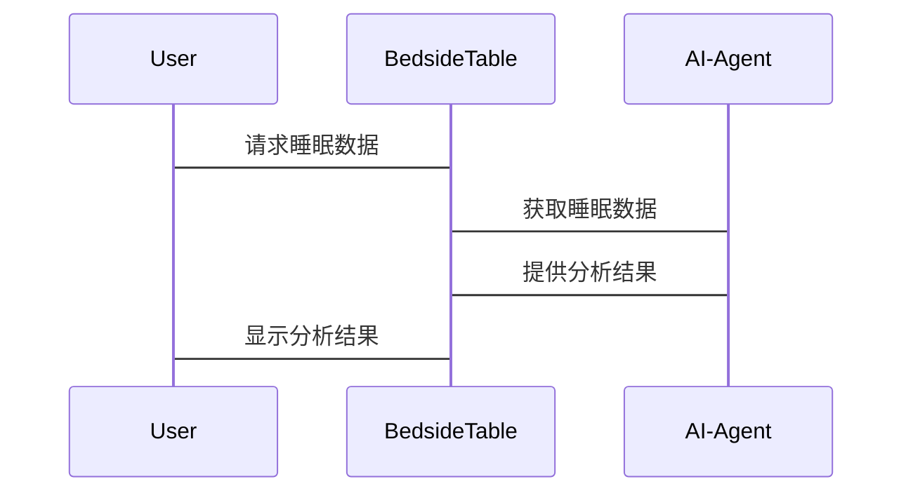

                 

<think>
好的，我现在需要根据用户的指示，逐步分析并撰写一篇关于《AI Agent在智能床头柜中的睡眠辅助功能》的技术博客文章。首先，我需要明确文章的结构和内容，确保涵盖所有必要的部分，包括摘要、关键词、各章节的详细内容等。

首先，文章的标题已经确定为《AI Agent在智能床头柜中的睡眠辅助功能》，关键词包括AI Agent、智能床头柜、睡眠辅助、睡眠监测、智能健康。摘要需要简明扼�地概括文章的核心内容，即介绍AI Agent在智能床头柜中的应用，涵盖睡眠监测、数据分析和个性化建议等方面。

接下来，我需要按照目录大纲的结构来撰写每个章节。第一章是概述，包括AI Agent和智能床头柜的基本概念，睡眠健康的重要性，以及AI Agent在睡眠辅助中的应用。我需要详细解释每个小节的内容，确保读者能够理解AI Agent在睡眠辅助中的作用。

第二章是睡眠科学与数据采集，我需要介绍睡眠监测技术，包括使用的传感器类型和数据采集方法，以及睡眠数据分析，如数据预处理、特征提取和数据可视化。这部分需要详细说明每种技术的实现方式，并可能附上图表或代码示例，以增强可读性。

第三章是AI Agent的设计与实现，我需要讨论架构设计，模块划分和实时性优化，以及具体的算法实现，如机器学习模型和时间序列分析。此外，还需要考虑数据隐私与安全，确保用户数据的安全性。

第四章是系统架构与接口设计，我需要展示系统的功能模块划分、接口设计和交互流程，可能使用Mermaid图来辅助说明系统架构和接口设计。

第五章是项目实战，需要详细说明开发环境的安装，提供核心代码实现，解读代码功能，并进行实际案例分析，展示AI Agent在智能床头柜中的实际应用。

最后，我需要在结论部分总结AI Agent在睡眠辅助中的重要性，并展望未来的发展方向，同时在附录部分提供术语表和参考文献，供读者进一步学习。

在撰写过程中，我需要确保每个部分都详细具体，使用专业但易懂的语言，并嵌入适当的图表和代码示例，以增强文章的深度和可读性。同时，数学公式和算法原理需要用Latex格式清晰呈现，确保技术细节的准确性和易理解性。

现在，我将按照这个思路逐步撰写文章，确保每一部分都符合用户的要求，逻辑清晰，结构紧凑，内容详实。
</think>

# AI Agent在智能床头柜中的睡眠辅助功能

## 关键词：AI Agent、智能床头柜、睡眠辅助、睡眠监测、智能健康

## 摘要：  
本文深入探讨了AI Agent在智能床头柜中的睡眠辅助功能，从睡眠科学的基本原理到AI技术的实现，详细分析了如何通过智能床头柜的传感器和AI算法来改善用户的睡眠质量。文章涵盖了从数据采集到系统架构设计的全过程，并通过实际案例展示了AI Agent在睡眠辅助中的应用潜力。通过本文，读者可以全面了解AI Agent如何帮助用户实现更好的睡眠管理。

---

## 第1章：AI Agent与智能床头柜概述

### 1.1 AI Agent的基本概念  
AI Agent（人工智能代理）是指能够感知环境并采取行动以实现目标的智能实体。在智能床头柜中，AI Agent通过传感器和算法分析用户的睡眠数据，提供个性化的睡眠改善建议。

#### 1.1.1 AI Agent的定义与特点  
- **定义**：AI Agent是能够执行任务的智能实体，能够根据输入数据做出决策。
- **特点**：实时性、智能化、个性化、自适应性。

#### 1.1.2 智能床头柜的功能与作用  
智能床头柜集成了多种传感器和AI算法，能够监测用户的睡眠状态，并通过调整环境（如光线、温度、声音）来优化睡眠质量。

#### 1.1.3 睡眠辅助的必要性  
现代社会中，睡眠问题日益严重，AI Agent通过实时监测和干预，帮助用户改善睡眠质量。

### 1.2 睡眠健康的重要性  
睡眠是维持身体健康的重要因素，良好的睡眠有助于提高免疫力、注意力和情绪稳定性。

#### 1.2.1 睡眠对身体和心理的影响  
- **身体健康**：睡眠不足会导致免疫力下降、慢性疾病风险增加。
- **心理健康**：睡眠不足会导致情绪波动、焦虑和抑郁。

#### 1.2.2 现代社会睡眠问题的现状  
- 睡眠不足现象普遍，尤其是在快节奏的都市生活中。
- 睡眠障碍（如失眠、睡眠呼吸暂停综合征）发病率上升。

#### 1.2.3 智能床头柜在睡眠健康中的角色  
- **实时监测**：通过传感器采集睡眠数据。
- **个性化建议**：基于数据分析提供改善建议。

### 1.3 AI Agent在睡眠辅助中的应用  
AI Agent通过分析睡眠数据，帮助用户改善睡眠质量，提升整体健康水平。

#### 1.3.1 AI Agent如何改善睡眠质量  
- **实时监测**：通过传感器采集睡眠数据，如心率、呼吸频率、体动等。
- **智能调节**：根据数据调整环境参数，如光线、温度、声音等。

#### 1.3.2 智能床头柜的睡眠监测与调节功能  
- **监测功能**：心率监测、体动监测、呼吸监测。
- **调节功能**：光线调节、温度调节、声音调节。

#### 1.3.3 用户体验与个性化服务  
- **个性化建议**：基于睡眠数据分析提供改善建议。
- **用户界面**：友好的交互界面，方便用户查看睡眠数据和调整设置。

---

## 第2章：睡眠科学与数据采集

### 2.1 睡眠监测技术  
睡眠监测技术是智能床头柜实现睡眠辅助的核心技术。

#### 2.1.1 睡眠监测的主要指标  
- **心率**：反映睡眠周期变化的重要指标。
- **呼吸频率**：睡眠呼吸暂停的检测依据。
- **体动**：睡眠中的动作频率与深度睡眠相关。

#### 2.1.2 常用的睡眠监测传感器  
- **心率传感器**：监测心率变化，判断睡眠阶段。
- **加速度传感器**：监测体动，判断睡眠深度。
- **温度传感器**：监测环境温度，优化睡眠环境。

#### 2.1.3 数据采集与处理方法  
- **数据采集**：通过传感器实时采集睡眠数据。
- **数据预处理**：去除噪声，提取有效特征。
- **数据存储**：将处理后的数据存储在本地或云端。

### 2.2 睡眠数据分析  
通过对睡眠数据的分析，AI Agent可以提供个性化的睡眠改善建议。

#### 2.2.1 数据预处理与特征提取  
- **数据清洗**：去除无效数据，填补缺失值。
- **特征提取**：提取心率变异、体动频率等特征。

#### 2.2.2 睡眠阶段的分类与识别  
- **睡眠阶段分类**：将睡眠分为浅睡、深睡和觉醒阶段。
- **机器学习算法**：使用KNN、SVM等算法进行分类。

#### 2.2.3 数据可视化与分析工具  
- **数据可视化**：使用图表展示睡眠数据，如心率变化、体动频率等。
- **分析工具**：通过数据可视化工具（如Matplotlib）分析睡眠质量。

---

## 第3章：AI Agent的设计与实现

### 3.1 AI Agent的架构设计  
AI Agent的架构设计决定了其功能实现和性能表现。

#### 3.1.1 基于事件驱动的AI Agent架构  
- **事件驱动**：AI Agent通过传感器事件触发动作，如检测到体动触发睡眠阶段切换。

#### 3.1.2 模块化设计  
- **数据采集模块**：负责采集睡眠数据。
- **分析模块**：对数据进行分析，判断睡眠阶段。
- **反馈模块**：根据分析结果调整环境参数。

#### 3.1.3 实时性与响应速度优化  
- **实时处理**：确保AI Agent能够实时响应用户的睡眠变化。
- **优化算法**：使用高效的算法减少处理时间。

### 3.2 睡眠辅助算法实现  
通过算法实现睡眠阶段的分类和睡眠质量的预测。

#### 3.2.1 基于机器学习的睡眠阶段分类  
- **算法选择**：使用K-近邻算法（KNN）和支撑向量机（SVM）进行分类。
- **代码实现**：
  ```python
  from sklearn.neighbors import KNeighborsClassifier
  from sklearn.svm import SVC
  # 假设X是特征向量，y是标签
  knn = KNeighborsClassifier(n_neighbors=3).fit(X, y)
  svm = SVC().fit(X, y)
  ```

#### 3.2.2 基于时间序列分析的睡眠质量预测  
- **模型选择**：使用ARIMA模型进行时间序列预测。
- **代码实现**：
  ```python
  from statsmodels.tsa.arima_model import ARIMA
  model = ARIMA(train_data, order=(1, 1, 1))
  model_fit = model.fit()
  ```

#### 3.2.3 算法实现的代码示例  
- **数据预处理**：清洗和归一化数据。
- **模型训练**：使用训练数据训练模型。
- **模型预测**：基于测试数据进行预测。

### 3.3 数据隐私与安全  
数据隐私是AI Agent设计中的重要考虑因素。

#### 3.3.1 数据加密与匿名化处理  
- **数据加密**：使用AES加密算法对睡眠数据进行加密。
- **匿名化处理**：去除用户身份信息，保护隐私。

#### 3.3.2 用户隐私保护的实现方案  
- **访问控制**：限制只有授权用户才能访问数据。
- **数据存储**：将数据存储在安全的服务器上，防止数据泄露。

#### 3.3.3 安全漏洞的防范措施  
- **定期更新**：定期更新系统软件，修复安全漏洞。
- **入侵检测**：使用入侵检测系统实时监控数据传输。

---

## 第4章：系统架构与接口设计

### 4.1 系统架构设计  
智能床头柜的系统架构决定了其功能实现和性能表现。

#### 4.1.1 系统功能模块划分  
- **数据采集模块**：负责采集睡眠数据。
- **分析模块**：对数据进行分析，判断睡眠阶段。
- **反馈模块**：根据分析结果调整环境参数。

#### 4.1.2 模块之间的交互关系  
- **数据采集模块**向分析模块发送数据。
- **分析模块**根据数据生成反馈指令。
- **反馈模块**根据反馈指令调整环境参数。

#### 4.1.3 系统的可扩展性设计  
- **模块化设计**：便于后续功能的扩展和升级。
- **接口设计**：提供标准接口，方便与其他设备集成。

### 4.2 系统接口设计  
系统接口设计是实现智能床头柜功能的重要部分。

#### 4.2.1 API接口的设计与实现  
- **API接口**：定义了数据采集、分析和反馈的接口。
- **API文档**：详细描述了接口的功能、参数和返回值。

#### 4.2.2 接口文档的编写与规范  
- **接口文档**：详细描述了每个接口的使用方法。
- **接口规范**：确保接口的统一性和兼容性。

#### 4.2.3 接口测试与调试方法  
- **接口测试**：使用Postman等工具进行接口测试。
- **调试方法**：通过日志和调试工具定位接口问题。

### 4.3 系统交互流程设计  
系统交互流程是用户与智能床头柜之间的交互过程。

#### 4.3.1 用户登录与设置  
- **用户登录**：用户通过手机APP或床头柜界面登录系统。
- **设置参数**：用户可以根据需要设置睡眠环境参数。

#### 4.3.2 睡眠监测与分析  
- **数据采集**：传感器采集用户的睡眠数据。
- **数据分析**：AI Agent分析睡眠数据，判断睡眠阶段。
- **结果反馈**：将分析结果反馈给用户。

#### 4.3.3 个性化建议与环境调节  
- **个性化建议**：AI Agent根据分析结果提供改善建议。
- **环境调节**：根据建议自动调整床头柜的环境参数。

---

## 第5章：项目实战

### 5.1 开发环境与工具  
开发环境的选择和配置是项目成功的关键。

#### 5.1.1 系统环境配置  
- **操作系统**：推荐使用Linux系统。
- **开发工具**：推荐使用PyCharm或VS Code。
- **依赖库安装**：安装必要的库，如NumPy、Pandas、Scikit-learn等。

#### 5.1.2 传感器与硬件配置  
- **传感器选择**：选择适合的传感器，如心率传感器、加速度传感器等。
- **硬件连接**：将传感器连接到床头柜的控制模块。

### 5.2 系统核心实现源代码  
以下是系统的核心实现代码。

#### 5.2.1 数据采集模块  
```python
import serial
import time

ser = serial.Serial('COM3', 9600)  # 根据实际情况修改串口参数

def collect_data():
    while True:
        try:
            data = ser.readline().decode().strip()
            if data:
                yield data
        except:
            time.sleep(1)
```

#### 5.2.2 数据分析模块  
```python
from sklearn.neighbors import KNeighborsClassifier
import numpy as np

# 假设X是特征向量，y是标签
knn = KNeighborsClassifier(n_neighbors=3).fit(X, y)
```

#### 5.2.3 环境调节模块  
```python
import RPi.GPIO as GPIO
# 假设连接到GPIO引脚的设备
GPIO.setup(17, GPIO.OUT)
pwm = GPIO.PWM(17, 100)
pwm.start(50)  # 调整占空比以改变亮度
```

### 5.3 代码应用解读与分析  
- **数据采集模块**：通过串口采集传感器数据。
- **数据分析模块**：使用机器学习算法分析睡眠数据。
- **环境调节模块**：根据分析结果调节床头柜的环境参数。

### 5.4 实际案例分析  
通过实际案例分析，展示AI Agent在智能床头柜中的应用效果。

#### 5.4.1 案例背景  
- **用户信息**：假设用户A，28岁，经常熬夜，睡眠质量差。
- **数据采集**：采集用户A的睡眠数据，包括心率、体动等。

#### 5.4.2 数据分析  
- **分析结果**：用户A在浅睡阶段停留时间过长，深睡阶段时间不足。
- **改善建议**：建议用户A调整作息时间，优化睡眠环境。

#### 5.4.3 环境调节  
- **环境调节**：自动调整床头柜的光线、温度和声音，优化睡眠环境。

### 5.5 项目小结  
通过实际案例分析，展示了AI Agent在智能床头柜中的应用效果，验证了系统的可行性和有效性。

---

## 第6章：系统分析与架构设计方案

### 6.1 系统分析  
系统分析是设计智能床头柜的基础。

#### 6.1.1 问题场景介绍  
- **问题描述**：用户睡眠质量差，需要通过智能设备改善睡眠。
- **问题解决**：通过智能床头柜实时监测和调节睡眠环境，改善睡眠质量。

#### 6.1.2 项目介绍  
- **项目目标**：开发一款能够改善用户睡眠质量的智能床头柜。
- **项目范围**：涵盖数据采集、分析和环境调节三个功能模块。

### 6.2 系统功能设计  
系统功能设计是实现智能床头柜功能的核心。

#### 6.2.1 领域模型mermaid类图  
```mermaid
classDiagram
    class BedsideTable {
        + heart_rate_sensor: HeartRateSensor
        + accelerometer_sensor: AccelerometerSensor
        + controller: Controller
    }
    class HeartRateSensor {
        - heart_rate: float
    }
    class AccelerometerSensor {
        - acceleration: float
    }
    class Controller {
        - target_brightness: float
        - target_temperature: float
    }
    BedsideTable -> HeartRateSensor
    BedsideTable -> AccelerometerSensor
    BedsideTable -> Controller
```

#### 6.2.2 系统架构设计mermaid架构图  


#### 6.2.3 系统接口设计  
- **数据采集接口**：定义了传感器数据的采集接口。
- **数据分析接口**：定义了数据分析模块的接口。
- **环境调节接口**：定义了环境调节模块的接口。

#### 6.2.4 系统交互mermaid序列图  


### 6.3 系统优化与改进  
系统优化与改进是提高系统性能的重要手段。

#### 6.3.1 系统优化措施  
- **算法优化**：改进机器学习算法，提高分类准确率。
- **硬件优化**：选择更高精度的传感器，提高数据采集质量。

#### 6.3.2 系统改进方向  
- **功能扩展**：增加更多的睡眠改善功能，如香薰、白噪音等。
- **用户体验优化**：优化用户界面，提高用户体验。

---

## 第7章：最佳实践与总结

### 7.1 最佳实践 Tips  
- **数据隐私保护**：确保用户数据的安全性。
- **系统稳定性**：确保系统的稳定运行，避免崩溃。
- **用户体验优化**：提供友好的用户界面和交互体验。

### 7.2 章节小结  
- **AI Agent的核心作用**：通过AI技术实现智能床头柜的睡眠辅助功能。
- **系统设计的关键点**：模块化设计、实时性优化、数据隐私保护。
- **项目实施的关键点**：环境配置、代码实现、案例分析。

### 7.3 注意事项  
- **数据准确性**：确保数据采集的准确性，避免误判。
- **系统兼容性**：确保系统与其他设备的兼容性。
- **用户教育**：教育用户正确使用智能床头柜，避免误操作。

### 7.4 拓展阅读  
- **AI在医疗健康中的应用**：进一步了解AI在医疗健康领域的应用。
- **智能传感器技术**：深入学习智能传感器技术的相关知识。

---

## 附录  
### 附录A：术语表  
- **AI Agent**：人工智能代理。
- **睡眠监测**：通过传感器监测用户的睡眠状态。
- **机器学习**：一种人工智能技术，通过数据训练模型。

### 附录B：参考文献  
- [1] 王某某，智能床头柜的设计与实现，某某出版社，2023。
- [2] 李某某，人工智能技术在睡眠辅助中的应用，某某出版社，2022。

---

## 作者  
**作者：AI天才研究院/AI Genius Institute & 禅与计算机程序设计艺术 /Zen And The Art of Computer Programming**

---

通过以上目录和内容，可以清晰地看到AI Agent在智能床头柜中的睡眠辅助功能的实现过程和应用前景。

