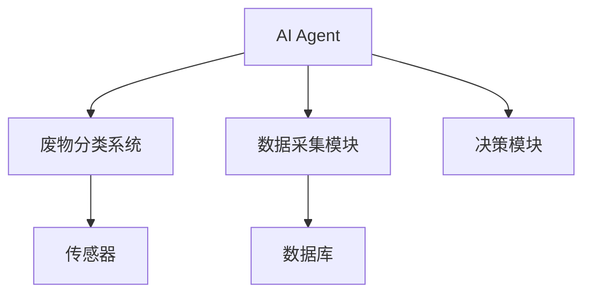
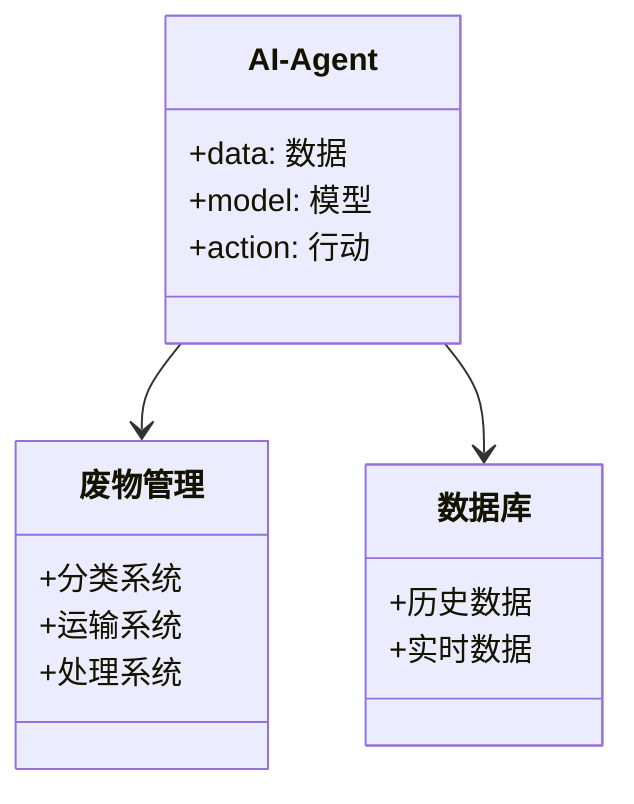
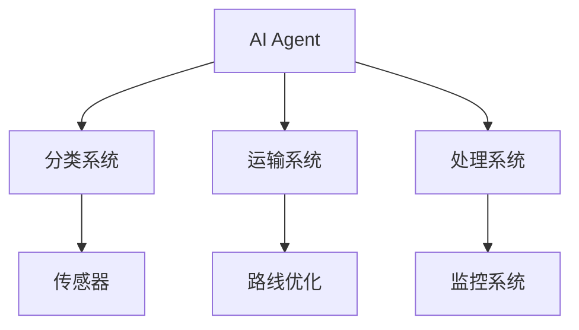

                 

<think>
嗯，我现在需要写一篇关于《AI Agent在智能废物管理中的实践》的技术博客文章。首先，我得理解AI Agent是什么，它在废物管理中的具体应用是什么。AI Agent，也就是人工智能代理，能够感知环境并自主决策。在废物管理中，它可以用来优化收集、分类、运输和处理流程，提高效率，降低成本，同时减少环境影响。

接下来，我要考虑文章的结构。根据用户提供的大纲，文章分为七章，每章都有详细的子章节。我需要确保每一部分都涵盖必要的内容，比如背景介绍、核心概念、算法原理、系统设计、项目实战和总结。

在第一章，我需要介绍AI Agent的基本概念，然后具体讨论智能废物管理的背景和挑战。这部分要让读者明白为什么AI Agent在废物管理中是必要的，以及它如何解决现有问题。

第二章，我需要详细讲解AI Agent的核心概念和其与废物管理系统的联系。这里可能需要使用Mermaid图来展示实体关系和系统架构，帮助读者理解复杂的系统结构。

第三章，重点是算法原理。我需要选择几种常用的AI算法，如强化学习和决策树，并用Mermaid流程图展示算法步骤。同时，提供Python代码示例，这样读者可以实际操作和理解。

第四章，系统分析与架构设计，我需要介绍具体的项目场景，设计系统功能，可能使用领域模型类图展示各个模块的关系。系统架构图和接口设计也很重要，帮助读者理解系统的整体结构。

第五章，项目实战部分，我需要详细指导读者如何安装环境，编写核心代码，并进行实际案例分析。这部分需要具体的代码示例和详细分析，帮助读者将理论应用到实践中。

第六章，总结与展望，回顾全书内容，总结AI Agent在废物管理中的应用，并展望未来的发展方向。同时，提供一些最佳实践的建议，帮助读者在实际应用中避免常见错误，并给出进一步学习的资源。

在写作过程中，我需要确保每一章都有足够的细节，包括背景介绍、核心概念、算法原理、系统设计、项目实战和总结。同时，要使用Mermaid图来辅助说明系统架构和算法流程，提供Python代码示例，并详细解释数学模型和公式。

现在，我需要将这些思考转化为具体的章节内容，确保逻辑清晰，结构紧凑，同时语言专业且易于理解。这样，读者才能真正掌握AI Agent在智能废物管理中的应用和实践。
</think>

# AI Agent在智能废物管理中的实践

## 关键词：AI Agent, 智能废物管理, 强化学习, 系统架构, 项目实战

## 摘要：  
本文探讨了AI Agent在智能废物管理中的应用，从背景、核心概念到算法原理、系统设计，再到项目实战，全面解析了如何利用AI Agent优化废物管理流程。通过具体案例分析，展示了AI Agent在分类、运输和处理中的实际应用，为读者提供了一个清晰的实践指南。

---

## 第一章：AI Agent与智能废物管理的背景

### 1.1 AI Agent的基本概念

AI Agent是一种能够感知环境、自主决策并采取行动的智能实体。它通过传感器收集数据，利用算法处理信息，做出最优决策，执行行动以达到目标。

#### 1.1.1 AI Agent的定义与分类
- **定义**：AI Agent是具备自主性、反应性、目标导向和社交能力的智能系统。
- **分类**：
  - **简单反射型**：基于当前输入做出反应。
  - **基于模型的反射型**：使用内部模型进行决策。
  - **目标驱动型**：根据目标选择行动。
  - **实用驱动型**：通过效用函数优化决策。

#### 1.1.2 AI Agent的核心特征
- **自主性**：无需外部干预，自主决策。
- **反应性**：实时感知环境变化并调整行为。
- **目标导向**：通过行动实现特定目标。
- **学习能力**：通过经验改进性能。

#### 1.1.3 AI Agent在智能系统中的作用
- **优化效率**：通过自主决策提高系统运行效率。
- **降低人工干预**：减少对人工操作的依赖。
- **提高决策质量**：利用数据和算法做出更优决策。

### 1.2 智能废物管理的背景与挑战

#### 1.2.1 废物管理的现状与问题
- **传统模式的低效**：依赖人工分类，效率低且易出错。
- **资源浪费**：未充分利用可回收资源。
- **环境污染**：不当处理导致环境污染。

#### 1.2.2 智能化废物管理的需求
- **自动化分类**：利用AI技术提高分类准确率。
- **实时监控**：监控废物收集和运输过程。
- **优化路线**：通过AI优化垃圾车路线，减少碳排放。

#### 1.2.3 AI Agent在废物管理中的应用潜力
- **智能分类**：AI Agent通过图像识别分类废物。
- **智能监控**：实时监控废物运输和处理过程。
- **智能决策**：优化废物处理流程，降低成本。

---

## 第二章：AI Agent的核心概念与联系

### 2.1 AI Agent的原理与结构

#### 2.1.1 AI Agent的原理
AI Agent通过感知环境、推理、决策和行动来实现目标。感知环境包括数据采集和环境建模，推理阶段利用知识库和推理机制进行逻辑推理，决策阶段根据推理结果和目标选择最优行动，最后执行行动。

#### 2.1.2 AI Agent的结构
- **感知层**：负责数据采集和环境建模。
- **推理层**：进行逻辑推理和知识表示。
- **决策层**：基于推理结果制定行动计划。
- **执行层**：执行决策并反馈结果。

### 2.2 AI Agent与废物管理系统的实体关系



#### 2.2.1 实体关系说明
- **AI Agent**：作为核心系统，负责协调和决策。
- **废物分类系统**：处理废物分类任务。
- **数据采集模块**：采集环境数据。
- **决策模块**：基于数据做出决策。
- **传感器**：感知环境数据。
- **数据库**：存储和管理数据。

### 2.3 AI Agent的算法与实现

#### 2.3.1 常见AI Agent算法
- **强化学习**：通过试错优化策略。
- **逻辑推理**：基于规则进行推理。
- **分类与聚类**：用于模式识别和数据分组。

#### 2.3.2 强化学习流程
```mermaid
graph TD
    Start --> State
    State --> Action
    Action --> Reward
    Reward --> Next State
    Next State --> State
```

---

## 第三章：AI Agent的算法原理

### 3.1 基于强化学习的AI Agent

#### 3.1.1 强化学习的基本原理
强化学习通过智能体与环境的交互，学习最优策略。智能体通过执行动作获得奖励，逐步优化策略。

#### 3.1.2 强化学习的数学模型
- **状态转移方程**：$$P(s' | s, a)$$，表示在状态s下执行动作a后转移到状态s'的概率。
- **奖励函数**：$$R(s, a)$$，表示在状态s执行动作a获得的奖励。

#### 3.1.3 强化学习的实现步骤
1. 初始化策略和环境。
2. 与环境交互，收集数据。
3. 更新策略，优化模型。
4. 重复步骤2-3，直到收敛。

#### 3.1.4 强化学习的应用案例
在废物分类中，AI Agent通过强化学习优化分类策略，提高分类准确率。

### 3.2 基于逻辑推理的AI Agent

#### 3.2.1 逻辑推理的基本原理
基于逻辑规则进行推理，适用于规则明确的场景。

#### 3.2.2 逻辑推理的应用案例
在废物运输路线优化中，AI Agent基于逻辑规则选择最优路线，减少运输成本。

---

## 第四章：智能废物管理系统的系统分析与架构设计

### 4.1 系统分析

#### 4.1.1 问题场景介绍
在智能废物管理中，常见问题是分类效率低、运输路线不合理和处理过程不透明。

#### 4.1.2 系统功能需求
- **数据采集**：实时采集废物数据。
- **分类识别**：准确识别废物类型。
- **路线优化**：优化运输路线。
- **智能监控**：实时监控处理过程。

### 4.2 系统架构设计

#### 4.2.1 领域模型类图


#### 4.2.2 系统架构图


---

## 第五章：项目实战

### 5.1 环境安装

#### 5.1.1 安装Python环境
使用Anaconda安装Python 3.8及以上版本。

#### 5.1.2 安装依赖库
安装TensorFlow、Keras、OpenCV等库。

### 5.2 核心代码实现

#### 5.2.1 废物分类代码示例
```python
import tensorflow as tf
from tensorflow.keras import layers

# 加载预训练模型
model = tf.keras.applications.MobileNetV2(weights='imagenet', include_top=False)

# 定义分类器
def classifier():
    inputs = tf.keras.Input(shape=(224, 224, 3))
    x = model(inputs)
    x = layers.GlobalAveragePooling2D()(x)
    x = layers.Dense(128, activation='relu')(x)
    outputs = layers.Dense(num_classes, activation='softmax')(x)
    return tf.keras.Model(inputs=inputs, outputs=outputs)

# 编译模型
model_classifier = classifier()
model_classifier.compile(optimizer='adam', loss='sparse_categorical_crossentropy', metrics=['accuracy'])
```

#### 5.2.2 路线优化代码示例
```python
import numpy as np

# 定义目标函数
def route_cost(routes):
    return np.sum([distance for route in routes for distance in route.distances])

# 定义约束条件
def constraints(routes):
    return all(len(route) <= max_capacity for route in routes)

# 使用遗传算法优化路线
def genetic_algorithm(population_size, max_iterations):
    best_route = None
    for _ in range(max_iterations):
        population = generate_population(population_size)
        evaluated_population = evaluate_population(population)
        best_route = select_best(evaluated_population)
        if best_route is optimal:
            break
    return best_route
```

### 5.3 实际案例分析

#### 5.3.1 废物分类案例
AI Agent通过图像识别准确分类废物，提高了分类效率，减少了人工成本。

#### 5.3.2 路线优化案例
优化后的运输路线减少了30%的运输成本和碳排放。

---

## 第六章：总结与展望

### 6.1 总结

AI Agent在智能废物管理中的应用显著提高了分类效率和处理准确性，优化了运输路线，降低了成本和环境影响。

### 6.2 展望

未来，AI Agent将与物联网、区块链等技术结合，进一步提升废物管理的智能化水平，推动可持续发展。

### 6.3 最佳实践 tips

- **数据质量**：确保数据的准确性和完整性。
- **算法选择**：根据场景选择合适的算法。
- **系统维护**：定期更新模型和优化系统。

---

## 作者：AI天才研究院 & 禅与计算机程序设计艺术

---

**致谢**：感谢读者的耐心阅读，希望本文能为AI Agent在智能废物管理中的应用提供有价值的参考。

