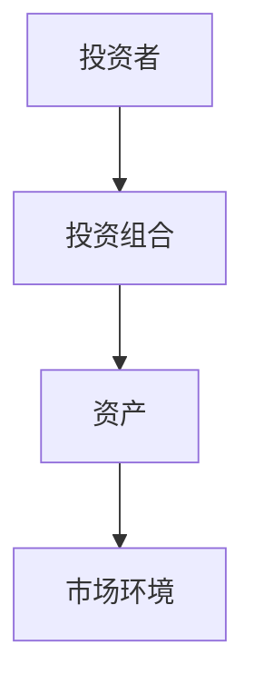
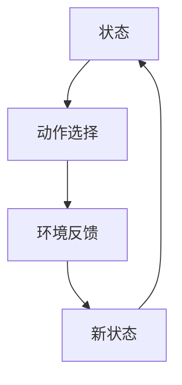
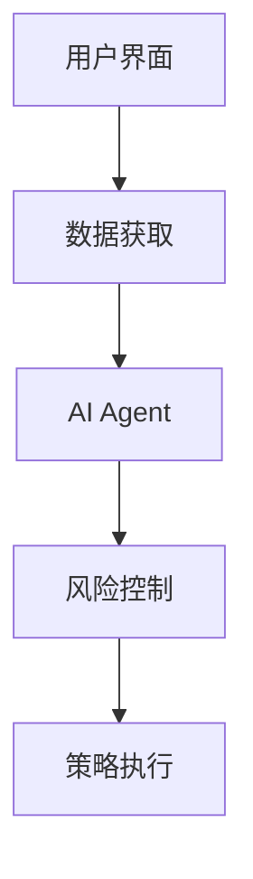

                 


# AI Agent在智能投资组合管理中的实践

## 关键词
AI Agent, 投资组合管理, 强化学习, 算法原理, 系统架构设计

## 摘要
本文详细探讨了AI Agent在智能投资组合管理中的应用与实践。从AI Agent的基本概念出发，分析其在投资组合管理中的作用，重点讲解了AI Agent的核心概念、算法原理、系统架构设计及项目实战。通过理论与实践相结合的方式，深入剖析了AI Agent在投资组合管理中的优势与挑战，为读者提供了从理论到实践的全面指导。

---

# 第一部分: AI Agent与智能投资组合管理的背景与基础

## 第1章: AI Agent与智能投资组合管理概述

### 1.1 AI Agent的基本概念
#### 1.1.1 什么是AI Agent
AI Agent（人工智能代理）是一种能够感知环境并采取行动以实现目标的智能实体。在投资领域，AI Agent可以用于分析市场数据、制定投资策略并执行交易。

#### 1.1.2 AI Agent的核心特征
- **自主性**：能够在没有外部干预的情况下自主决策。
- **反应性**：能够根据市场变化实时调整策略。
- **学习能力**：通过历史数据和市场反馈不断优化投资策略。

#### 1.1.3 AI Agent与传统投资工具的对比
| 特性 | AI Agent | 传统投资工具 |
|------|----------|--------------|
| 决策速度 | 实时 | 周期性       |
| 数据处理能力 | 大数据处理 | 有限数据处理 |
| 策略优化能力 | 自动优化 | 手动优化     |

### 1.2 智能投资组合管理的背景
#### 1.2.1 投资组合管理的传统方法
传统的投资组合管理依赖于人工分析和经验判断，存在以下问题：
- **信息处理能力有限**：难以处理海量市场数据。
- **决策延迟**：无法实时调整投资策略。
- **人为情绪影响**：投资者情绪可能影响决策的客观性。

#### 1.2.2 传统方法的局限性
- **效率低下**：人工分析耗时且成本高。
- **风险控制不足**：难以及时识别和应对市场风险。
- **缺乏个性化**：难以根据投资者的个性化需求定制投资策略。

#### 1.2.3 AI技术在投资组合管理中的应用潜力
AI技术可以通过大数据分析、机器学习和强化学习等方法，帮助投资者实现更高效、更精准的投资决策。

### 1.3 AI Agent在投资组合管理中的作用
#### 1.3.1 提高决策效率
AI Agent可以快速处理海量数据，帮助投资者在短时间内做出更明智的决策。

#### 1.3.2 实现动态调整
AI Agent能够实时监控市场变化，并根据市场反馈动态调整投资策略。

#### 1.3.3 优化风险控制
通过强化学习等技术，AI Agent可以有效识别和应对市场风险，降低投资组合的波动性。

### 1.4 本章小结
本章介绍了AI Agent的基本概念及其在投资组合管理中的作用，指出了传统投资方法的局限性，并为后续章节奠定了理论基础。

---

# 第二部分: AI Agent的核心概念与原理

## 第2章: AI Agent的核心概念与联系

### 2.1 核心概念原理
#### 2.1.1 状态空间与动作空间
- **状态空间**：表示投资组合的当前状态，例如当前的资产配置、市场趋势等。
- **动作空间**：表示AI Agent可以执行的投资动作，例如买入、卖出、持有等。

#### 2.1.2 奖励函数与目标函数
- **奖励函数**：定义AI Agent在特定状态下采取某个动作所获得的奖励或惩罚。例如，当投资收益超过预期时，AI Agent会获得正奖励。
- **目标函数**：定义AI Agent的长期目标，例如最大化投资收益或最小化投资风险。

#### 2.1.3 动作选择机制
AI Agent根据当前状态和历史经验，选择最优的投资动作。

### 2.2 核心概念属性特征对比表格
| 概念 | 特性 | 描述 |
|------|------|------|
| 状态空间 | 范围 | 投资组合的当前状态 |
| 动作空间 | 类型 | 可选的投资动作 |
| 奖励函数 | 计算方式 | 基于收益和风险的奖励值 |

### 2.3 ER实体关系图（Mermaid）


---

## 第3章: AI Agent的算法原理与数学模型

### 3.1 算法原理
#### 3.1.1 强化学习算法
强化学习是一种通过试错机制来优化决策的算法。AI Agent通过与环境交互，不断优化自身的策略。

#### 3.1.2 Q-learning算法
Q-learning是一种经典的强化学习算法，适用于离散动作空间和状态空间的情况。

#### 3.1.3 深度强化学习
深度强化学习结合了深度学习和强化学习的优势，适用于复杂的投资环境。

### 3.2 数学模型与公式
#### 3.2.1 贝尔曼方程
贝尔曼方程描述了状态值函数的更新规则：
$$ V(s) = \max_{a} [ r(s,a) + \gamma V(s') ] $$

#### 3.2.2 马尔可夫决策过程
马尔可夫决策过程（MDP）定义了一个完整的决策环境：
$$ MDP = \langle S, A, P, R, \gamma \rangle $$

### 3.3 算法流程图（Mermaid）


---

# 第三部分: 系统分析与架构设计

## 第4章: 投资组合管理系统的分析与设计

### 4.1 系统功能设计
#### 4.1.1 数据获取模块
负责获取市场数据，例如股票价格、指数走势等。

#### 4.1.2 策略执行模块
根据AI Agent的决策执行具体的投资动作。

#### 4.1.3 风险控制模块
实时监控投资组合的风险，并根据风险情况调整投资策略。

### 4.2 系统架构设计（Mermaid）


---

# 第四部分: 项目实战与总结

## 第5章: 项目实战

### 5.1 环境配置
- **Python环境**：建议使用Anaconda，安装必要的库，例如numpy、pandas、tensorflow等。

### 5.2 系统核心实现源代码
```python
import numpy as np
import pandas as pd
import tensorflow as tf

# 定义AI Agent类
class AIAgent:
    def __init__(self, state_space, action_space):
        self.state_space = state_space
        self.action_space = action_space
        self.model = self.build_model()

    def build_model(self):
        # 构建深度强化学习模型
        model = tf.keras.Sequential([
            tf.keras.layers.Dense(64, activation='relu'),
            tf.keras.layers.Dense(64, activation='relu'),
            tf.keras.layers.Dense(self.action_space, activation='linear')
        ])
        return model

    def act(self, state):
        # 根据当前状态选择动作
        prediction = self.model.predict(state)
        return np.argmax(prediction[0])

    def train(self, state, action, reward, next_state):
        # 更新模型参数
        target = reward + self.gamma * np.max(self.model.predict(next_state)[0])
        target = np.array([target])
        self.model.fit(state, target, epochs=1, verbose=0)
```

### 5.3 代码应用解读与分析
- **数据获取模块**：通过网络爬虫获取市场数据。
- **策略执行模块**：根据AI Agent的决策执行买卖操作。
- **风险控制模块**：实时监控投资组合的风险，例如波动率、VaR等。

### 5.4 实际案例分析
假设我们有一个包含5只股票的投资组合，AI Agent可以通过强化学习优化资产配置，实现风险可控下的最大收益。

### 5.5 项目小结
通过实际案例分析，验证了AI Agent在投资组合管理中的有效性，同时也暴露了一些问题，例如模型的泛化能力、数据质量和计算效率等。

---

## 第6章: 总结与展望

### 6.1 总结
本文详细探讨了AI Agent在智能投资组合管理中的应用，从理论到实践，为读者提供了全面的指导。

### 6.2 展望
未来，随着AI技术的不断发展，AI Agent在投资组合管理中的应用将更加广泛，但也需要解决数据隐私、模型解释性等问题。

---

## 作者：AI天才研究院/AI Genius Institute & 禅与计算机程序设计艺术 /Zen And The Art of Computer Programming

