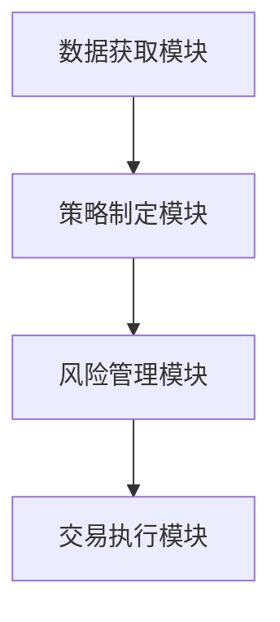
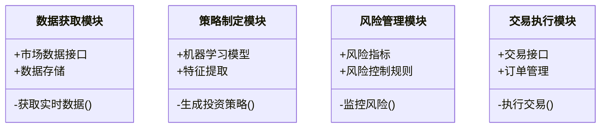

                 


# AI Agent在智能投资组合管理中的应用

## 关键词：AI Agent，智能投资组合管理，机器学习，强化学习，投资组合优化

## 摘要：  
本文探讨了AI Agent在智能投资组合管理中的应用，详细分析了AI Agent的核心原理、算法实现、系统架构以及实际案例。通过结合机器学习和强化学习等技术，AI Agent能够优化投资决策，提高投资组合的收益与风险比。文章还讨论了系统的实现细节、最佳实践以及未来的研究方向。

---

# 1. 引言：AI Agent与智能投资组合管理的背景

## 1.1 问题背景  
传统投资组合管理依赖人工分析和经验判断，难以应对金融市场中复杂多变的环境。投资者面临信息过载、市场波动和决策延迟等问题，传统的被动管理模式逐渐显现出局限性。

## 1.2 问题描述  
投资组合管理的核心目标是实现收益最大化和风险最小化。然而，市场数据的实时性、多变性和复杂性使得人工管理效率低下，容易错过最佳投资机会或承担不必要的风险。

## 1.3 问题解决  
AI Agent通过自动化数据处理、智能决策和实时执行，能够显著提高投资组合管理的效率和准确性。AI Agent能够快速分析海量数据，识别潜在投资机会，并根据市场变化动态调整投资策略。

## 1.4 AI Agent的优势  
- **高效性**：AI Agent能够实时处理数据，快速做出决策。  
- **准确性**：基于机器学习算法，AI Agent能够发现人类难以察觉的市场模式。  
- **适应性**：能够根据市场变化动态调整投资策略，降低风险。  

---

# 2. AI Agent的核心概念与原理

## 2.1 AI Agent的基本原理  
AI Agent在投资组合管理中的工作流程包括以下三个主要环节：  
1. **感知层**：通过数据采集模块获取市场数据，包括股票价格、市场指数、新闻等。  
2. **决策层**：基于感知层的数据，利用机器学习算法进行分析，制定投资策略。  
3. **执行层**：根据决策层的策略，通过交易系统执行具体的买入或卖出指令。

## 2.2 AI Agent的类型与特点  
AI Agent可以根据不同的功能和应用场景分为以下几类：  
- **基于规则的AI Agent**：根据预设的规则和条件进行决策。  
- **基于模型的AI Agent**：利用机器学习模型进行预测和决策。  
- **强化学习AI Agent**：通过与环境的交互，学习最优投资策略。  

---

# 3. AI Agent的算法原理

## 3.1 强化学习算法  
强化学习是一种通过试错机制来优化决策的算法。在投资组合管理中，强化学习可以用于动态调整投资组合，以最大化收益并最小化风险。

### 3.1.1 强化学习的数学模型  
强化学习的核心是Q-learning算法，其数学模型如下：  
$$ Q(s, a) = r + \gamma \max_{a'} Q(s', a') $$  
其中，$s$是当前状态，$a$是当前动作，$r$是奖励，$\gamma$是折扣因子。

### 3.1.2 强化学习的实现步骤  
1. **初始化**：设置初始状态和参数。  
2. **环境交互**：根据当前策略执行动作，观察环境反馈。  
3. **更新Q值**：根据反馈更新Q值表，优化策略。  
4. **策略执行**：根据优化后的策略进行投资操作。

### 3.1.3 强化学习的Python实现  
```python
import numpy as np

class Agent:
    def __init__(self, state_space, action_space):
        self.state_space = state_space
        self.action_space = action_space
        self.Q = np.zeros((state_space, action_space))
    
    def take_action(self, state, epsilon=0.1):
        if np.random.random() < epsilon:
            return np.random.randint(self.action_space)
        return np.argmax(self.Q[state, :])
    
    def update_Q(self, state, action, reward, next_state, alpha=0.1, gamma=0.9):
        self.Q[state, action] = (1 - alpha) * self.Q[state, action] + alpha * (reward + gamma * np.max(self.Q[next_state, :]))
```

## 3.2 遗传算法  
遗传算法是一种基于自然选择和遗传机制的优化算法。在投资组合管理中，遗传算法可以用于优化投资组合的配置，以实现收益最大化。

### 3.2.1 遗传算法的流程  
1. **初始化**：生成初始种群。  
2. **适应度评估**：计算每个个体的适应度。  
3. **选择**：选择适应度较高的个体进行繁殖。  
4. **交叉**：对选中的个体进行基因交叉，生成新个体。  
5. **变异**：对新个体进行随机变异，增加多样性。  
6. **迭代**：重复以上步骤，直到满足终止条件。  

### 3.2.2 遗传算法的Python实现  
```python
import random

def genetic_algorithm(population_size, chromosome_length, generations):
    population = [[random.random() for _ in range(chromosome_length)] for _ in range(population_size)]
    
    for _ in range(generations):
        # 计算适应度
        fitness = [sum(individual) for individual in population]
        
        # 选择
        selected = [population[i] for i in range(population_size) if fitness[i] > np.mean(fitness)]
        
        # 交叉
        new_population = []
        while len(new_population) < population_size:
            parent1 = random.choice(selected)
            parent2 = random.choice(selected)
            child = [max(parent1[i], parent2[i]) for i in range(chromosome_length)]
            new_population.append(child)
        
        # 变异
        for i in range(population_size):
            if random.random() < 0.1:
                new_population[i] = [random.random() for _ in range(chromosome_length)]
        
        population = new_population
    
    return population

```

---

# 4. 系统分析与架构设计

## 4.1 系统架构设计  
AI Agent投资组合管理系统主要包括以下几个模块：  
- **数据获取模块**：从金融市场获取实时数据。  
- **策略制定模块**：基于机器学习模型制定投资策略。  
- **风险管理模块**：监控和管理投资组合的风险。  
- **交易执行模块**：根据策略执行具体的交易指令。  

### 4.1.1 系统架构图  


## 4.2 实体关系图  


---

# 5. 项目实战：基于强化学习的投资组合管理系统

## 5.1 环境安装  
- 安装Python和相关库：`numpy`, `pandas`, `scikit-learn`, `tensorflow`。  
- 数据源：使用Yahoo Finance获取股票数据。

## 5.2 核心代码实现  
```python
import numpy as np
import pandas as pd
from sklearn.preprocessing import MinMaxScaler
from tensorflow.keras.models import Sequential
from tensorflow.keras.layers import LSTM, Dense

# 数据预处理
data = pd.read_csv('stock_data.csv')
data = data['Close'].values
data = data.reshape(-1, 1)
scaler = MinMaxScaler()
data_scaled = scaler.fit_transform(data)

# 模型构建
model = Sequential()
model.add(LSTM(50, input_shape=(1, 100)))
model.add(Dense(1))
model.compile(loss='mean_squared_error', optimizer='adam')

# 训练模型
model.fit(X_train, y_train, epochs=100, batch_size=32)

# 预测
predicted_price = model.predict(X_test)
```

## 5.3 案例分析  
假设我们使用强化学习算法训练一个投资组合管理系统。通过训练，系统能够根据市场波动自动调整投资组合，实现收益最大化。以下是具体的实现步骤：  
1. **数据获取**：从Yahoo Finance获取目标股票的历史数据。  
2. **数据预处理**：将数据标准化，适合模型输入。  
3. **模型训练**：使用LSTM网络训练模型，捕捉时间序列中的模式。  
4. **策略制定**：基于训练好的模型，制定买入、卖出或持有策略。  
5. **交易执行**：根据策略执行交易指令，实时调整投资组合。

---

# 6. 总结与展望

## 6.1 总结  
本文详细探讨了AI Agent在智能投资组合管理中的应用，分析了AI Agent的核心原理、算法实现和系统架构。通过强化学习和遗传算法等技术，AI Agent能够显著提高投资组合管理的效率和准确性。

## 6.2 展望  
未来，随着AI技术的不断发展，AI Agent在投资组合管理中的应用将更加广泛和深入。我们可以期待更多基于深度学习和强化学习的创新算法，进一步提升投资组合的收益和风险控制能力。

---

## 作者：AI天才研究院 & 禅与计算机程序设计艺术  
本文由AI天才研究院（AI Genius Institute）撰写，结合“禅与计算机程序设计艺术”的思想，致力于探索人工智能与程序设计的深度结合，为读者提供有价值的技术洞察。

