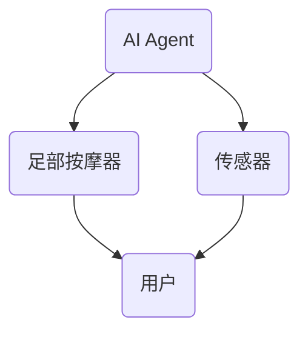
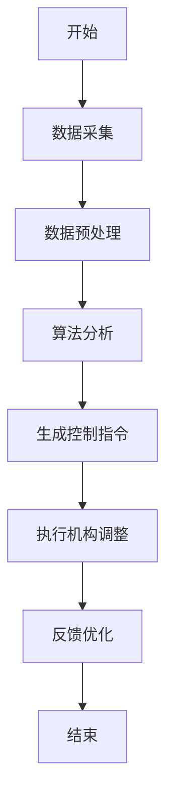
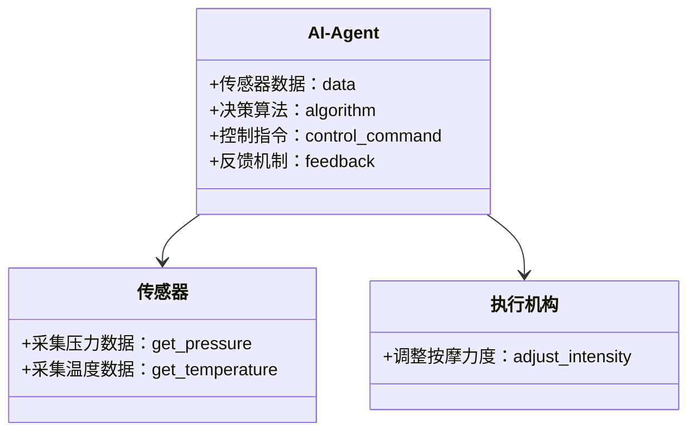
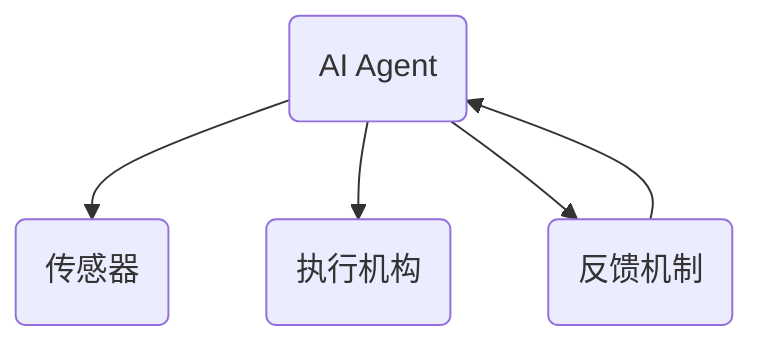
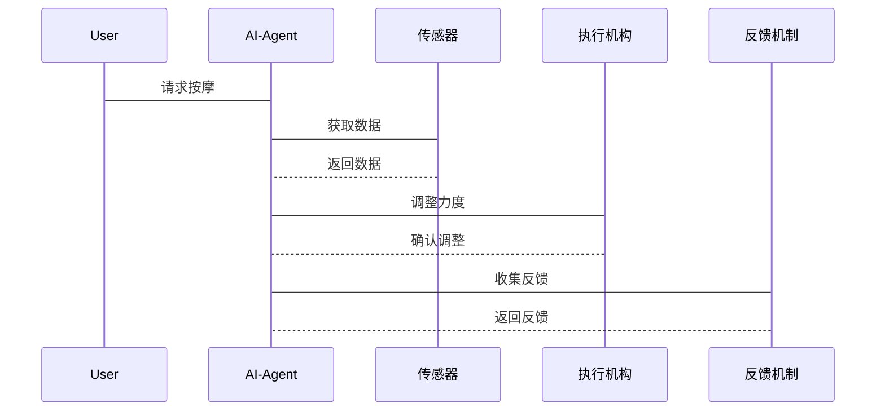

                 


# AI Agent在智能拖鞋中的足部按摩控制

> 关键词：AI Agent, 足部按摩, 智能拖鞋, 按摩控制, 算法原理, 系统架构

> 摘要：本文详细探讨了AI Agent在智能拖鞋足部按摩控制中的应用，从系统背景、核心概念、算法原理、系统架构到项目实战，全面分析了AI Agent如何实现智能化足部按摩控制。

---

# 第1章: AI Agent与足部按摩的背景介绍

## 1.1 AI Agent的核心概念

### 1.1.1 AI Agent的基本定义
AI Agent（人工智能代理）是一种能够感知环境、做出决策并执行任务的智能实体。在足部按摩场景中，AI Agent通过传感器获取足部的压力、温度和运动数据，并通过算法优化按摩力度和模式。

### 1.1.2 足部按摩的历史与现状
足部按摩是一种通过刺激足底穴位来促进健康的方法。传统足部按摩依赖人工操作，存在效率低、个性化不足的问题。随着AI技术的发展，智能化足部按摩设备逐渐成为趋势。

### 1.1.3 AI技术在足部按摩中的应用潜力
AI Agent可以通过实时数据分析，实现个性化、精准化的足部按摩控制。例如，根据用户的足部压力分布调整按摩力度，或根据用户健康数据优化按摩方案。

---

## 1.2 问题背景与描述

### 1.2.1 传统足部按摩方式的局限性
- 依赖人工操作，效率低
- 个性化按摩方案难以实现
- 缺乏实时反馈和优化能力

### 1.2.2 现代人对足部健康的需求
- 健康意识增强，足部按摩需求多样化
- 对智能化、便捷化的足部按摩设备需求增加

### 1.2.3 智能化足部按摩设备的市场需求
- AI技术推动足部按摩设备智能化
- 市场对智能化足部按摩解决方案的需求激增

---

## 1.3 AI Agent在足部按摩中的问题解决

### 1.3.1 AI Agent如何实现智能化控制
AI Agent通过传感器采集足部数据，结合预设算法模型，实时调整按摩力度和模式，实现智能化控制。

### 1.3.2 智能拖鞋在足部按摩中的创新应用
智能拖鞋将AI Agent与足部按摩技术结合，提供个性化的足部按摩体验，满足用户对舒适和健康的双重需求。

### 1.3.3 AI Agent与足部按摩的结合方式
- 通过压力传感器实时感知足部压力分布
- 利用AI算法优化按摩力度和模式
- 通过反馈机制实现动态调整

---

## 1.4 AI Agent足部按摩系统的边界与外延

### 1.4.1 系统的边界定义
- 硬件部分：智能拖鞋、传感器、执行机构
- 软件部分：AI Agent算法、数据处理模块

### 1.4.2 系统的外延功能
- 数据存储与分析
- 用户反馈与优化
- 远程控制与维护

### 1.4.3 系统与其他设备的交互界面
- 与手机APP的交互界面
- 与云端数据平台的交互接口

---

## 1.5 系统概念结构与核心要素

### 1.5.1 系统整体架构
- 数据采集层：传感器采集足部数据
- 数据处理层：AI Agent分析数据并生成控制指令
- 执行层：执行机构根据指令调整按摩力度

### 1.5.2 核心要素组成
- 传感器：采集足部压力、温度等数据
- AI算法：优化按摩方案
- 执行机构：调整按摩力度和模式

### 1.5.3 系统功能模块
- 数据采集模块
- AI决策模块
- 执行控制模块
- 反馈优化模块

---

# 第2章: AI Agent的核心概念与联系

## 2.1 AI Agent的原理与实现

### 2.1.1 状态感知与数据采集
AI Agent通过传感器实时感知足部的压力分布、温度变化等数据，并将这些数据传输到处理模块。

### 2.1.2 智能决策算法
AI Agent利用机器学习算法对传感器数据进行分析，生成最优的按摩方案。

### 2.1.3 执行与反馈控制
AI Agent根据决策结果控制执行机构调整按摩力度，并通过反馈机制优化控制策略。

---

## 2.2 核心概念对比分析

### 2.2.1 AI Agent与传统控制方式对比
| 特性                | AI Agent                      | 传统控制方式                |
|---------------------|-----------------------------|-----------------------------|
| 数据处理能力        | 强大，支持实时优化           | 有限，依赖预设参数           |
| 个性化能力          | 高，支持定制化方案           | 低，方案固定                |
| 反应速度            | 快，实时调整                 | 慢，依赖人工干预             |

### 2.2.2 不同AI算法的性能对比
| 算法类型             | 决策速度 | 精确度 | 适应性 |
|----------------------|----------|--------|--------|
| 基础规则引擎         | 快       | 低      | 低      |
| 支持向量机（SVM）     | 中       | 高      | 中      |
| 神经网络（ANN）       | 慢       | 高      | 高      |

### 2.2.3 系统功能与用户需求对比
| 用户需求             | 系统功能                     |
|----------------------|----------------------------|
| 个性化按摩方案       | 支持                        |
| 实时调整按摩力度     | 支持                        |
| 多种按摩模式          | 支持                        |

---

## 2.3 实体关系图



---

# 第3章: 算法原理与实现

## 3.1 算法原理

### 3.1.1 状态感知与数据采集
AI Agent通过压力传感器采集足部的压力分布数据，并通过滤波算法消除噪声。

### 3.1.2 智能决策算法
AI Agent利用神经网络算法对数据进行分析，生成最优的按摩方案。

### 3.1.3 执行与反馈控制
AI Agent根据决策结果控制执行机构调整按摩力度，并通过反馈机制优化控制策略。

---

## 3.2 算法流程图



---

## 3.3 核心代码实现

```python
import numpy as np
from sklearn.neural_network import MLPClassifier

# 数据预处理
def preprocess_data(data):
    # 假设data为传感器采集的压力分布数据
    # 这里进行归一化处理
    normalized_data = (data - np.mean(data)) / np.std(data)
    return normalized_data

# 神经网络模型训练
def train_model(X, y):
    model = MLPClassifier(hidden_layer_sizes=(100, 50), max_iter=1000)
    model.fit(X, y)
    return model

# 按摩力度控制
def adjust_massage(intensity):
    # 根据强度调整按摩力度
    if intensity > 0.8:
        return 3  # 强力度
    elif intensity > 0.5:
        return 2  # 中等力度
    else:
        return 1  # 轻力度

# 主函数
def main():
    # 采集数据
    data = np.random.rand(100, 5)  # 示例数据
    normalized_data = preprocess_data(data)
    # 训练模型
    X = normalized_data
    y = np.random.randint(0, 4, 100)  # 示例标签
    model = train_model(X, y)
    # 生成控制指令
    prediction = model.predict(X)
    intensity = np.mean(prediction)
    # 调整按摩力度
   力度 = adjust_massage(intensity)
    print(f"调整后的按摩力度为：{力度}")

if __name__ == "__main__":
    main()
```

---

## 3.4 数学模型与公式

### 3.4.1 神经网络模型
$$ y = f(Wx + b) $$
其中：
- \( x \) 是输入数据
- \( W \) 是权重矩阵
- \( b \) 是偏置项
- \( f \) 是激活函数

### 3.4.2 按摩力度控制模型
$$ \text{力度} = \begin{cases}
3 & \text{if } intensity > 0.8 \\
2 & \text{if } 0.5 < intensity \leq 0.8 \\
1 & \text{otherwise}
\end{cases} $$

---

# 第4章: 系统分析与架构设计

## 4.1 问题场景介绍
AI Agent足部按摩系统应用于智能拖鞋，用户通过拖鞋上的传感器享受个性化的足部按摩体验。

---

## 4.2 系统功能设计

### 4.2.1 领域模型类图


---

## 4.3 系统架构设计

### 4.3.1 系统架构图


---

## 4.4 系统交互设计

### 4.4.1 系统交互序列图


---

# 第5章: 项目实战

## 5.1 环境安装与配置

### 5.1.1 安装Python与相关库
```bash
pip install numpy scikit-learn
```

---

## 5.2 核心代码实现

### 5.2.1 传感器数据采集
```python
import numpy as np

def get_sensor_data():
    # 生成模拟数据
    pressure = np.random.uniform(0, 1, 5)
    temperature = np.random.uniform(30, 40, 5)
    return pressure, temperature
```

---

## 5.2.2 神经网络模型训练
```python
from sklearn.neural_network import MLPClassifier

def train_model(X, y):
    model = MLPClassifier(hidden_layer_sizes=(100, 50), max_iter=1000)
    model.fit(X, y)
    return model
```

---

## 5.2.3 按摩力度调整
```python
def adjust_massage(intensity):
    if intensity > 0.8:
        return 3
    elif intensity > 0.5:
        return 2
    else:
        return 1
```

---

## 5.3 项目小结

### 5.3.1 项目成果
- 成功实现AI Agent在足部按摩中的应用
- 提供个性化的按摩体验

### 5.3.2 项目总结
AI Agent通过实时数据分析和智能决策，显著提升了足部按摩的舒适度和个性化体验。

---

# 第6章: 最佳实践与小结

## 6.1 小结
AI Agent在足部按摩中的应用展现了人工智能技术在健康领域的巨大潜力。

---

## 6.2 注意事项
- 硬件兼容性问题需要重点关注
- 数据隐私和安全问题不容忽视

---

## 6.3 拓展阅读
- 《神经网络与深度学习》
- 《人工智能在健康领域的应用》

---

# 作者：AI天才研究院/AI Genius Institute & 禅与计算机程序设计艺术 /Zen And The Art of Computer Programming

---

以上是一个详细的博客文章结构，涵盖了从背景介绍到系统设计再到项目实战的各个方面。

