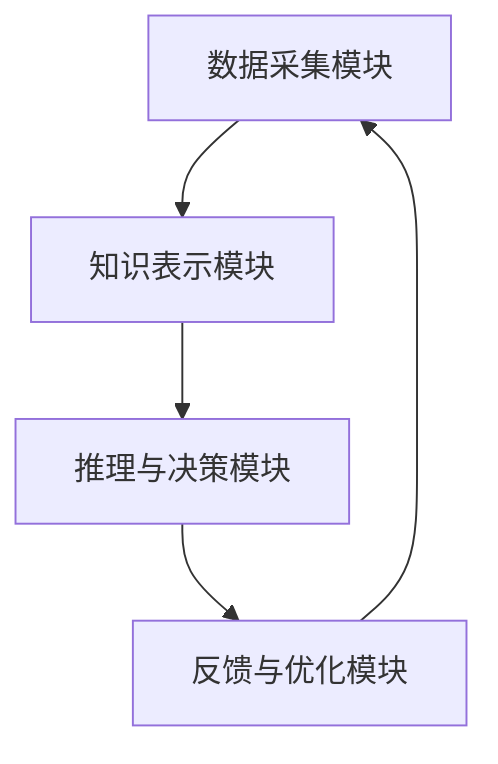
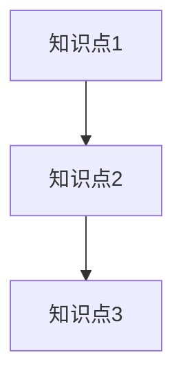

                 


# AI Agent在智能教育评估中的角色

> **关键词**：AI Agent, 智能教育评估, 自然语言处理, 机器学习, 知识图谱, 教育技术

> **摘要**：  
本文探讨了AI Agent在智能教育评估中的角色及其技术实现。首先，文章介绍了AI Agent的基本概念和核心原理，分析了其在教育评估中的独特优势。接着，详细阐述了AI Agent在智能教育评估中的系统架构设计，包括数据采集、知识表示、推理与决策等关键模块。最后，结合实际案例，深入讲解了AI Agent在教育评估中的算法实现及其应用效果，为教育领域的智能化转型提供了有益的参考。

---

## 第1章: AI Agent的基本概念与背景

### 1.1 AI Agent的定义与核心概念

#### 1.1.1 AI Agent的定义
AI Agent（人工智能代理）是一种能够感知环境、自主决策并执行任务的智能实体。它通过与环境交互，利用感知数据进行推理和学习，从而做出最优决策。AI Agent的核心目标是帮助用户完成特定任务或提供智能服务。

#### 1.1.2 AI Agent的核心特征
| 特征 | 描述 |
|------|------|
| 感知能力 | 能够通过传感器或数据接口获取环境信息 |
| 自主决策 | 具备基于感知数据做出决策的能力 |
| 学习能力 | 能够通过经验优化自身的决策策略 |
| 适应性 | 能够根据环境变化动态调整行为 |

#### 1.1.3 AI Agent与传统教育评估工具的区别
| 特性 | 传统评估工具 | AI Agent |
|------|---------------|----------|
| 智能性 | 单一、固定 | 灵活、动态 |
| 互动性 | 被动、单向 | 主动、双向 |
| 数据处理 | 离线、静态 | 实时、动态 |

### 1.2 智能教育评估的背景与挑战

#### 1.2.1 传统教育评估的局限性
传统教育评估主要依赖人工评分和固定标准，存在以下问题：
- **主观性**：评分过程依赖人工判断，存在偏差。
- **效率低下**：人工评估耗时长，难以大规模应用。
- **缺乏个性化**：无法根据学生特点提供个性化反馈。

#### 1.2.2 AI技术在教育评估中的潜力
AI技术的引入为教育评估带来了新的可能性：
- **自动化评估**：通过自然语言处理和机器学习，实现自动评分。
- **个性化反馈**：基于学生行为数据，提供定制化建议。
- **实时监测**：实时跟踪学生学习进度，及时调整教学策略。

#### 1.2.3 当前智能教育评估的现状与趋势
目前，智能教育评估已在以下领域取得显著进展：
- **语言评估**：通过语音识别和NLP技术实现口语和写作自动评分。
- **学习分析**：基于大数据分析，识别学生学习瓶颈。
- **自适应学习**：根据学生表现动态调整教学内容。

### 1.3 AI Agent在教育评估中的角色定位

#### 1.3.1 AI Agent作为评估主体的角色
AI Agent可以独立完成以下任务：
- **数据采集**：通过传感器或API获取学生行为数据。
- **知识推理**：基于知识图谱分析学生掌握程度。
- **决策优化**：根据评估结果推荐个性化学习方案。

#### 1.3.2 AI Agent作为评估辅助工具的角色
AI Agent还可以作为辅助工具，帮助教师完成以下工作：
- **数据处理**：自动整理和分析学生评估数据。
- **结果解释**：将复杂的数据结果转化为易于理解的报告。
- **反馈优化**：根据评估结果生成针对性的教学建议。

#### 1.3.3 AI Agent在个性化学习中的应用
AI Agent通过以下方式推动个性化学习：
- **学习路径规划**：根据学生特点制定个性化学习计划。
- **实时反馈**：在学习过程中提供即时反馈和指导。
- **效果追踪**：持续监测学生学习效果并动态调整策略。

### 1.4 本章小结
本章从基本概念出发，介绍了AI Agent的核心特征及其在教育评估中的角色定位。通过对比传统评估工具，突出了AI Agent在教育评估中的独特优势。

---

## 第2章: AI Agent的核心原理与技术实现

### 2.1 AI Agent的核心原理

#### 2.1.1 感知层: 数据采集与处理
AI Agent的感知层主要负责数据的采集和处理。常见的数据来源包括：
- **学生行为数据**：如鼠标点击、键盘输入、时间戳等。
- **文本数据**：如学生的作文、回答等。
- **语音数据**：如学生的朗读音频。

数据处理过程包括：
1. 数据清洗：去除噪声数据。
2. 数据转换：将原始数据转换为模型可处理的格式。

#### 2.1.2 推理层: 知识表示与逻辑推理
知识表示是AI Agent推理的基础。常用的知识表示方法包括：
- **知识图谱**：通过图结构表示知识之间的关系。
- **规则表示**：通过逻辑规则描述知识。

逻辑推理过程可以分为：
1. 前向推理：从已知事实推导出新结论。
2. 后向推理：从目标倒推必要条件。

#### 2.1.3 决策层: 行为决策与反馈优化
AI Agent的决策层基于推理结果和环境反馈做出最优决策。常用的决策算法包括：
- **基于规则的决策**：根据预定义规则进行决策。
- **基于机器学习的决策**：通过训练模型预测最优行为。
- **基于强化学习的优化**：通过不断试错优化决策策略。

### 2.2 AI Agent的关键技术

#### 2.2.1 自然语言处理技术
自然语言处理（NLP）在教育评估中的应用包括：
- **文本分析**：对学生的作文进行语法和内容分析。
- **情感分析**：评估学生回答的情感倾向。
- **问答系统**：提供智能辅导。

#### 2.2.2 机器学习算法
机器学习算法在教育评估中的应用包括：
- **分类算法**：对学生表现进行分类（如优秀、良好、一般）。
- **回归算法**：预测学生的未来表现。
- **聚类算法**：将学生分成不同的学习群体。

#### 2.2.3 知识图谱构建与应用
知识图谱在教育评估中的作用：
- **知识表示**：将学科知识以图结构表示。
- **推理支持**：基于知识图谱进行推理。

### 2.3 AI Agent在教育评估中的技术实现

#### 2.3.1 数据采集与处理流程
1. 数据采集：通过API或传感器获取学生行为数据。
2. 数据清洗：去除无效数据。
3. 数据转换：将数据转换为模型可处理的格式。

#### 2.3.2 知识表示与推理机制
1. 知识图谱构建：将学科知识表示为图结构。
2. 逻辑推理：基于知识图谱进行推理。

#### 2.3.3 行为决策与反馈优化算法
1. 算法选择：根据任务选择合适的决策算法。
2. 反馈优化：根据评估结果优化决策策略。

### 2.4 本章小结
本章详细讲解了AI Agent的核心原理和技术实现，包括感知、推理和决策三个层面。通过具体技术实现，展示了AI Agent在教育评估中的强大能力。

---

## 第3章: AI Agent在智能教育评估中的系统架构

### 3.1 系统功能模块设计

#### 3.1.1 数据采集模块
数据采集模块负责采集学生的行为数据，包括：
- **输入数据**：如键盘输入、鼠标点击。
- **输出数据**：如学生的作文、回答。

#### 3.1.2 知识表示模块
知识表示模块负责将学科知识表示为图结构，包括：
- **节点**：表示知识点。
- **边**：表示知识点之间的关系。

#### 3.1.3 推理与决策模块
推理与决策模块负责基于知识图谱进行推理和决策，包括：
- **推理算法**：如前向推理和后向推理。
- **决策算法**：如基于规则的决策和基于机器学习的决策。

#### 3.1.4 反馈与优化模块
反馈与优化模块负责根据评估结果优化AI Agent的行为，包括：
- **反馈机制**：将评估结果反馈给AI Agent。
- **优化算法**：如强化学习算法。

### 3.2 系统架构设计

#### 3.2.1 分层架构设计
系统架构采用分层设计，包括：
- **感知层**：负责数据采集。
- **推理层**：负责知识表示与推理。
- **决策层**：负责行为决策。
- **反馈层**：负责反馈与优化。

#### 3.2.2 模块间交互关系
模块间交互关系可以通过Mermaid图表示：



#### 3.2.3 系统接口设计
系统接口设计包括：
- **输入接口**：接收学生行为数据。
- **输出接口**：输出评估结果。
- **反馈接口**：接收评估反馈。

### 3.3 系统实现的技术选型

#### 3.3.1 开发框架选择
常用开发框架包括：
- **Python**：适合快速开发。
- **TensorFlow**：适合机器学习模型的实现。
- **Neo4j**：适合知识图谱的构建与查询。

#### 3.3.2 数据存储方案
数据存储方案包括：
- **关系型数据库**：如MySQL。
- **图数据库**：如Neo4j。
- **大数据平台**：如Hadoop。

#### 3.3.3 算法实现工具
算法实现工具包括：
- **Python**：适合快速实现。
- **Scikit-learn**：适合机器学习算法的实现。
- **Spacy**：适合自然语言处理任务。

### 3.4 本章小结
本章详细讲解了AI Agent在智能教育评估中的系统架构设计，包括功能模块设计、系统架构设计和系统接口设计。通过具体技术选型，展示了系统实现的可行性。

---

## 第4章: AI Agent在教育评估中的算法实现

### 4.1 算法原理概述

#### 4.1.1 基于规则的推理算法
基于规则的推理算法通过预定义的逻辑规则进行推理。例如，可以将“如果学生回答正确，则给予奖励”作为一条规则。

#### 4.1.2 基于机器学习的决策算法
基于机器学习的决策算法通过训练模型预测最优行为。例如，可以使用随机森林算法预测学生的未来表现。

#### 4.1.3 基于强化学习的优化算法
基于强化学习的优化算法通过试错优化决策策略。例如，可以使用Q-learning算法优化AI Agent的反馈机制。

### 4.2 算法实现细节

#### 4.2.1 知识表示与推理算法
知识表示与推理算法可以通过Mermaid图表示：



推理过程可以通过以下步骤实现：
1. 从知识图谱中提取相关知识点。
2. 基于逻辑规则进行推理。

#### 4.2.2 行为决策与反馈优化算法
行为决策与反馈优化算法可以通过以下Python代码实现：

```python
# 简单的强化学习算法示例
import random

class AI_Agent:
    def __init__(self):
        self.reward = 0
        self.action_space = ['positive', 'negative', 'neutral']
    
    def decide(self):
        # 假设基于Q-learning算法
        action = random.choice(self.action_space)
        return action
    
    def receive_reward(self, reward):
        self.reward = reward

agent = AI_Agent()
action = agent.decide()
print(action)
agent.receive_reward(1)
print(agent.reward)
```

### 4.3 本章小结
本章详细讲解了AI Agent在教育评估中的算法实现，包括基于规则的推理算法、基于机器学习的决策算法和基于强化学习的优化算法。通过具体代码实现，展示了算法的实际应用。

---

## 作者：AI天才研究院 & 禅与计算机程序设计艺术

---

以上是《AI Agent在智能教育评估中的角色》的技术博客文章，涵盖了从基本概念到系统实现的各个方面，旨在为读者提供全面的了解。

