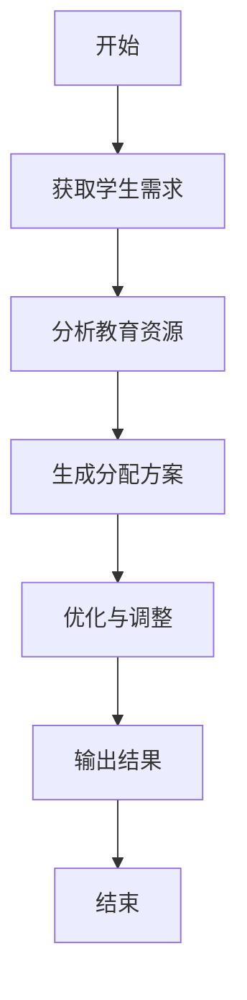
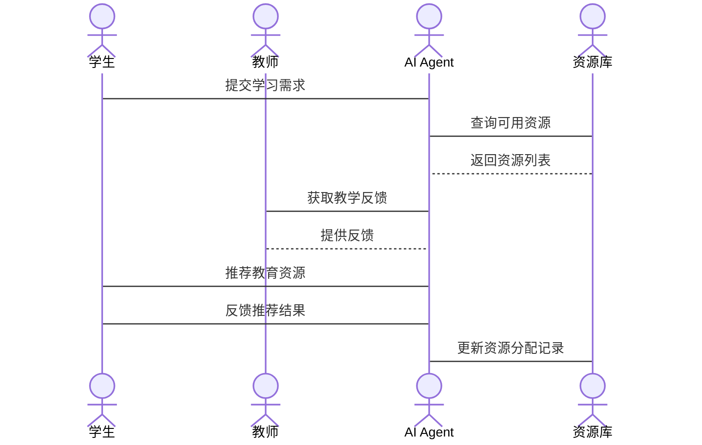

                 


# AI Agent在智能教育资源分配中的应用

> 关键词：AI Agent，智能教育，教育资源分配，机器学习，教育优化

> 摘要：本文深入探讨AI Agent在智能教育资源分配中的应用，从核心概念、算法原理到系统设计与实战，全面解析AI Agent如何通过感知、决策和优化能力，实现教育资源的高效分配与个性化推荐，为教育公平与质量提升提供技术支持。

---

# 第一部分: AI Agent在智能教育资源分配中的应用概述

## 第1章: AI Agent与智能教育资源分配的背景

### 1.1 AI Agent的基本概念

#### 1.1.1 AI Agent的定义与特点
AI Agent（智能代理）是指能够感知环境、自主决策并执行任务的智能体。在教育领域，AI Agent可以通过分析学生的学习行为、需求和目标，动态调整教育资源分配策略。

- **定义**：AI Agent是一种能够执行特定任务的智能系统，具备感知、推理、学习和执行能力。
- **特点**：
  - **自主性**：无需外部干预，自主完成任务。
  - **反应性**：能够实时感知环境变化并做出反应。
  - **学习性**：通过数据学习优化决策策略。
  - **协作性**：能够与其他智能体或系统协同工作。

#### 1.1.2 AI Agent的核心要素与功能

- **核心要素**：
  - **感知模块**：通过传感器或数据输入获取环境信息。
  - **推理模块**：基于感知信息进行逻辑推理或模式识别。
  - **决策模块**：根据推理结果制定行动方案。
  - **执行模块**：将决策转化为具体行动。
- **功能**：
  - **数据采集**：收集学生的学习数据、教师的教学数据等。
  - **需求分析**：分析学生的学习需求和目标。
  - **资源推荐**：基于需求匹配最优教育资源。
  - **动态优化**：根据反馈持续优化资源分配策略。

#### 1.1.3 AI Agent与智能教育的关系

AI Agent是智能教育的核心技术之一，通过智能化的资源分配和个性化推荐，推动教育从传统模式向智能化、个性化转变。AI Agent能够解决教育资源分配中的信息不对称问题，实现教育资源的高效利用和公平分配。

---

### 1.2 智能教育资源分配的背景与挑战

#### 1.2.1 教育资源分配的现状与问题

- **现状**：
  - 教育资源分布不均，部分地区或学校缺乏优质教育资源。
  - 教学资源种类繁多，但匹配效率低。
  - 学生的学习需求多样化，传统分配方式难以满足个性化需求。

- **问题**：
  - **资源浪费**：部分教育资源未被充分利用。
  - **分配不公**：教育资源分配缺乏公平性。
  - **效率低下**：传统分配方式耗时且效率低。

#### 1.2.2 AI技术在教育领域的应用前景

- **潜力**：
  - **个性化学习**：通过AI技术实现个性化教学方案。
  - **资源优化**：提高教育资源的利用率和分配效率。
  - **教育公平**：缩小教育资源分配的地域差异和个体差异。

- **发展趋势**：
  - 基于AI的教育资源分配系统逐渐普及。
  - 多智能体协作的教育资源分配模式成为主流。

#### 1.2.3 AI Agent在教育资源分配中的作用

AI Agent能够通过以下方式推动教育资源分配的智能化：

- **数据驱动**：通过收集和分析海量教育数据，为教育资源分配提供科学依据。
- **动态调整**：根据实时数据动态优化资源分配策略。
- **个性化推荐**：基于学生需求和学习特点推荐最优教育资源。

---

## 第2章: AI Agent在智能教育资源分配中的核心概念

### 2.1 AI Agent的核心原理

#### 2.1.1 AI Agent的感知与决策机制

- **感知模块**：
  - 通过数据采集技术获取学生的学习数据，包括学习进度、兴趣偏好、知识点掌握情况等。
  - 使用自然语言处理技术分析教师的教学反馈和学生的需求描述。

- **决策模块**：
  - 基于感知数据，利用机器学习算法生成教育资源分配方案。
  - 根据分配方案的可行性进行评估和优化。

#### 2.1.2 基于机器学习的教育资源分配模型

- **监督学习**：
  - 使用历史数据训练模型，预测学生的资源需求。
  - 例如，基于学生的考试成绩预测其需要的辅导资源。

- **无监督学习**：
  - 使用聚类算法将学生按学习特点分组，为每组推荐适合的教育资源。

#### 2.1.3 多智能体协作与教育资源优化

- **多智能体协作**：
  - AI Agent与其他智能体（如教师、学生、学校系统）协同工作，共同优化教育资源分配。
  - 例如，教师智能体提供教学反馈，学生智能体提供学习需求，AI Agent综合两者信息生成资源分配方案。

---

### 2.2 AI Agent与教育资源分配的实体关系

```mermaid
er
actor: 教育机构
actor: 学生
actor: 教师
entity: 教育资源
entity: 学生需求
entity: 教学目标
```

- **实体关系**：
  - 教育机构拥有教育资源，并根据学生需求分配资源。
  - 学生需求与教学目标通过AI Agent进行匹配。
  - 教师提供教学反馈，帮助优化资源分配。

---

### 2.3 教育资源分配的算法流程



- **流程说明**：
  1. 获取学生需求：通过问卷调查、学习数据分析等方式获取学生的学习需求。
  2. 分析教育资源：对现有的教育资源进行分类和评估。
  3. 生成分配方案：基于学生需求和资源评估结果，生成初步分配方案。
  4. 优化与调整：根据反馈信息优化分配方案。
  5. 输出结果：将优化后的分配方案输出给相关人员。

---

## 第3章: AI Agent教育资源分配的数学模型与算法

### 3.1 基于优化的教育资源分配模型

#### 3.1.1 线性规划模型

- **目标函数**：
  $$ \text{目标函数: } \min \sum_{i=1}^{n} c_i x_i $$
  - $c_i$：分配资源$i$的成本。
  - $x_i$：分配资源$i$的数量。

- **约束条件**：
  $$ \sum_{i=1}^{n} a_i x_i \geq b $$
  - $a_i$：资源$i$的可用数量。
  - $b$：总需求量。

#### 3.1.2 聚类算法在教育资源分配中的应用

- **聚类算法**：
  - 使用K-means算法将学生分为不同的学习群体。
  - 根据学习群体的特点推荐适合的教育资源。

- **距离公式**：
  $$ \text{距离公式: } d(x_i, x_j) = \sqrt{(x_i - x_j)^2} $$

#### 3.1.3 分层优化策略

- **分层优化**：
  - 将教育资源分配问题分解为多个子问题，分别进行优化。
  - 例如，首先优化教师的资源分配，再优化学生的资源分配。

---

### 3.2 基于机器学习的教育资源推荐算法

#### 3.2.1 基于协同过滤的推荐算法

- **协同过滤**：
  - 基于学生的历史学习数据和行为数据，推荐相似学生的教育资源。
  - 计算用户相似度：
    $$ \text{相似度计算: } \text{sim}(u, v) = \frac{\sum_{i=1}^{n} (r_{u,i} - \bar{r}_u)(r_{v,i} - \bar{r}_v)}{\sqrt{\sum_{i=1}^{n} (r_{u,i} - \bar{r}_u)^2} \cdot \sqrt{\sum_{i=1}^{n} (r_{v,i} - \bar{r}_v)^2}}} $$

#### 3.2.2 基于内容的推荐算法

- **内容分析**：
  - 对教育资源的内容进行分析，提取关键词或主题。
  - 根据学生的学习需求推荐相关资源。

- **主题模型**：
  - 使用LDA（主题模型）分析教育资源的主题分布。
  - 根据学生的学习兴趣推荐相关主题的教育资源。

---

## 第4章: 系统分析与架构设计

### 4.1 问题场景介绍

- **问题场景**：
  - 某教育机构希望利用AI技术优化教育资源分配，提高教学效率和学习效果。
  - 现有教育资源分配方式效率低下，难以满足个性化学习需求。

### 4.2 项目介绍

- **项目目标**：
  - 开发一个基于AI Agent的教育资源分配系统，实现教育资源的智能化分配和个性化推荐。

- **系统功能设计**：
  ```mermaid
  classDiagram
  class AI Agent {
    + 数据采集模块
    + 需求分析模块
    + 资源推荐模块
    + 反馈评估模块
  }
  ```

- **系统架构设计**：
  ```mermaid
  graph TD
  A[AI Agent] --> B[学生]
  A --> C[教师]
  A --> D[教育资源库]
  A --> E[反馈系统]
  ```

### 4.3 系统接口设计

- **接口描述**：
  - 学生接口：用于提交学习需求和接收教育资源推荐。
  - 教师接口：用于提供教学反馈和管理教育资源。
  - 资源库接口：用于存储和管理教育资源。
  - 反馈接口：用于收集学生和教师的反馈信息，优化资源分配策略。

### 4.4 系统交互流程



---

## 第5章: 项目实战

### 5.1 环境安装

- **开发环境**：
  - Python 3.8+
  - PyTorch 2.0+
  - Scikit-learn 1.0+
  - Mermaid CLI

### 5.2 系统核心实现源代码

#### 5.2.1 数据采集模块

```python
import pandas as pd

def collect_data():
    # 数据采集模块
    data = pd.read_csv('student_data.csv')
    return data
```

#### 5.2.2 需求分析模块

```python
from sklearn.cluster import KMeans

def analyze_demand(data):
    # 聚类分析模块
    X = data[['学习进度', '兴趣偏好']]
    kmeans = KMeans(n_clusters=3, random_state=42)
    kmeans.fit(X)
    data['学习群体'] = kmeans.predict(X)
    return data
```

#### 5.2.3 资源推荐模块

```python
from sklearn.metrics.pairwise import cosine_similarity

def recommend_resources(data, user_id):
    # 基于协同过滤的推荐算法
    user_profile = data[data['学生ID'] == user_id]
    similar_users = cosine_similarity(user_profile, data.dropna())
    top_users = similar_users.argsort()[:, -3:]
    recommended_resources = data.iloc[top_users.flatten()]
    return recommended_resources
```

#### 5.2.4 反馈评估模块

```python
def feedback_assessment(feedback_data):
    # 反馈评估模块
    feedback_data['满意度'] = feedback_data['满意度'].apply(lambda x: x if x >= 4 else '需要优化')
    return feedback_data
```

### 5.3 实际案例分析

#### 5.3.1 案例背景

- **案例背景**：
  - 某中学希望通过AI Agent优化语文教学资源的分配，提高学生的学习效果。

#### 5.3.2 数据采集

- **数据来源**：
  - 学生的学习进度、兴趣偏好、考试成绩等。

#### 5.3.3 聚类分析

- **学生群体划分**：
  - 将学生分为三个学习群体：基础薄弱型、中等水平型和拔高冲刺型。

#### 5.3.4 资源推荐

- **推荐策略**：
  - 基于学生的学习群体和个体需求推荐语文教学资源。

#### 5.3.5 反馈优化

- **反馈收集**：
  - 收集教师和学生的反馈，优化资源推荐算法。

### 5.4 项目小结

- **项目成果**：
  - 开发了一个基于AI Agent的教育资源分配系统，实现了教育资源的智能化分配和个性化推荐。
  - 提高了教育资源的利用率和教学效果，推动了教育公平。

---

## 第6章: 最佳实践、小结与注意事项

### 6.1 最佳实践

- **数据质量**：
  - 确保数据的准确性和完整性，避免因数据问题影响分配结果。
- **模型优化**：
  - 根据实际需求不断优化算法模型，提高推荐的准确性和效率。
- **系统维护**：
  - 定期更新教育资源库，维护系统性能。

### 6.2 小结

本文详细介绍了AI Agent在智能教育资源分配中的应用，从核心概念、算法原理到系统设计与实战，全面解析了AI Agent如何通过感知、决策和优化能力，实现教育资源的高效分配与个性化推荐。

### 6.3 注意事项

- **隐私保护**：
  - 注意保护学生和教师的隐私数据，避免数据泄露。
- **系统稳定性**：
  - 确保系统的稳定性和安全性，避免因系统故障影响教育资源分配。
- **用户体验**：
  - 提供友好的用户界面和交互体验，提高用户满意度。

---

## 第7章: 拓展阅读与深入思考

### 7.1 拓展阅读

- **推荐书籍**：
  - 《教育技术与人工智能》
  - 《机器学习在教育中的应用》
- **推荐论文**：
  - "AI Agents in Education: A Review" (2023)
  - "Intelligent Resource Allocation in Education" (2022)

### 7.2 深入思考

- **未来发展方向**：
  - 结合元学习（Meta-Learning）技术，提升AI Agent的自适应能力。
  - 探索多模态学习（Multi-modal Learning），提高资源分配的精准性。

---

# 作者：AI天才研究院/AI Genius Institute & 禅与计算机程序设计艺术/Zen And The Art of Computer Programming

---

以上是完整的文章结构和内容，涵盖了从理论到实践的各个方面，满足了用户的详细需求。希望对您有所帮助！

