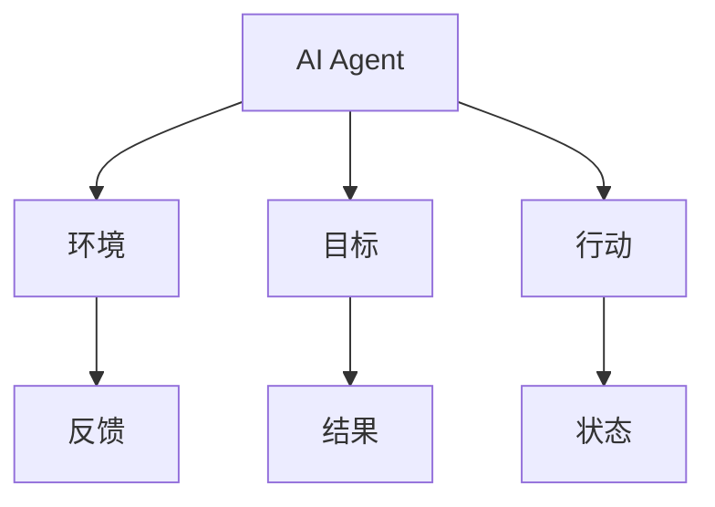
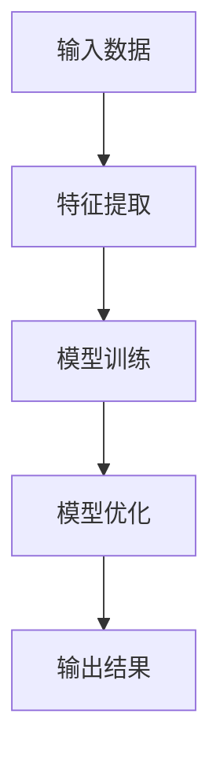
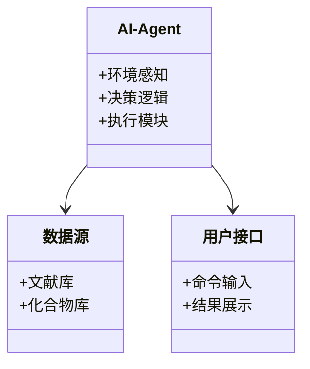
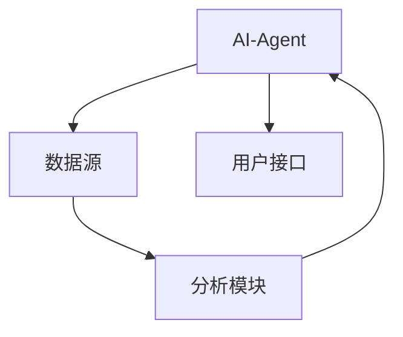
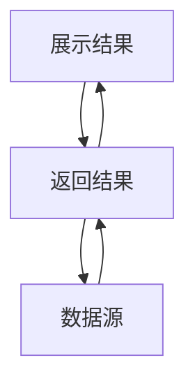

                 


# AI Agent在智能新药研发中的应用

> 关键词：AI Agent, 新药研发, 机器学习, 自然语言处理, 强化学习, 药物发现, 智能系统

> 摘要：本文系统地探讨了AI Agent在智能新药研发中的应用，从AI Agent的基本概念到其在新药研发中的核心算法、系统设计和实际应用，进行了全面而深入的分析。文章首先介绍了AI Agent与新药研发的背景，然后详细讲解了AI Agent的核心概念与原理，接着分析了AI Agent在新药研发中的算法原理与数学模型，随后探讨了AI Agent在新药研发中的系统设计与架构，最后通过实际项目案例展示了AI Agent在新药研发中的具体应用。本文内容详实，逻辑清晰，旨在为读者提供一个全面的视角，理解AI Agent在智能新药研发中的重要性与应用潜力。

---

# 第一部分: AI Agent与新药研发的背景介绍

## 第1章: AI Agent与新药研发的背景介绍

### 1.1 AI Agent的基本概念

#### 1.1.1 什么是AI Agent
AI Agent（人工智能代理）是指能够感知环境、做出决策并执行动作的智能体。与传统的AI系统不同，AI Agent具有更强的自主性和适应性，能够根据实时环境信息动态调整行为。

#### 1.1.2 AI Agent的核心特征
- **自主性**：AI Agent能够自主决策，无需外部干预。
- **反应性**：AI Agent能够实时感知环境并做出反应。
- **学习能力**：AI Agent能够通过经验不断优化自己的行为。
- **协作性**：AI Agent能够与其他Agent或人类协同工作。

#### 1.1.3 AI Agent与传统AI的区别
| 特性          | 传统AI                          | AI Agent                         |
|---------------|---------------------------------|----------------------------------|
| 决策方式      | 基于规则或预设模型              | 基于实时环境反馈和学习           |
| 适应性        | 较低                           | 较高                              |
| 应用场景      | 固定任务（如图像识别）          | 动态任务（如自动驾驶、药物发现）  |

### 1.2 新药研发的挑战与痛点

#### 1.2.1 新药研发的复杂性
新药研发是一个耗时长、成本高、风险大的过程，涉及化学、生物学、医学等多个学科的交叉应用。

#### 1.2.2 传统新药研发的流程
1. **靶点发现**：寻找疾病相关的分子靶点。
2. **化合物筛选**：通过实验或计算方法筛选潜在药物分子。
3. **临床前研究**：进行毒理学、药代动力学等研究。
4. **临床试验**：分为I、II、III期临床试验，验证药物的安全性和有效性。
5. **审批与上市**：通过监管机构审批，获得上市许可。

#### 1.2.3 当前新药研发的主要挑战
- **时间长**：从靶点发现到上市平均需要10-15年。
- **成本高**：单个新药研发成本可达数亿美元。
- **效率低**：传统实验方法效率低下，难以应对海量数据。

### 1.3 AI Agent在新药研发中的应用前景

#### 1.3.1 AI Agent在药物发现中的潜力
AI Agent可以通过分析海量文献、化合物数据，快速发现潜在药物分子，并预测其药理特性。

#### 1.3.2 AI Agent的独特优势
- **高效性**：AI Agent能够快速处理和分析大量数据。
- **精准性**：基于机器学习的AI Agent可以提高化合物筛选的精准度。
- **动态适应性**：AI Agent能够根据实验结果动态调整研究方向。

#### 1.3.3 未来趋势与发展方向
- **多模态AI Agent**：结合视觉、文本等多种模态信息，提升药物发现的效率。
- **人机协作**：AI Agent与人类研究人员协同工作，优化研发流程。
- **个性化药物**：基于个体基因信息，开发个性化治疗方案。

### 1.4 本章小结
本章介绍了AI Agent的基本概念及其在新药研发中的应用背景，指出了当前新药研发面临的挑战，并展望了AI Agent在该领域的巨大潜力。

---

# 第二部分: AI Agent的核心概念与原理

## 第2章: AI Agent的核心概念与原理

### 2.1 AI Agent的定义与分类

#### 2.1.1 AI Agent的定义
AI Agent是一种能够感知环境、自主决策并执行任务的智能体。它能够通过与环境的交互不断优化自身行为。

#### 2.1.2 AI Agent的分类
| 类型          | 描述                                   | 适用场景                       |
|---------------|--------------------------------------|-------------------------------|
| 反应式Agent   | 基于当前感知做出反应                  | 自动驾驶、实时交易             |
| 学习式Agent   | 通过经验学习优化行为                 | 游戏AI、推荐系统               |
| 交互式Agent   | 与人类交互并协作                     | 智能助手、教育辅助             |
| 多智能体系统   | 多个Agent协同工作                    | 智能城市、分布式计算           |

### 2.2 AI Agent的核心算法与技术

#### 2.2.1 机器学习算法在AI Agent中的应用
- **监督学习**：用于分类任务，如药物分子分类。
- **无监督学习**：用于聚类分析，发现潜在的药物特征。
- **强化学习**：用于动态决策，如药物优化。

#### 2.2.2 自然语言处理在AI Agent中的应用
- **文本挖掘**：从文献中提取知识。
- **对话系统**：与研究人员进行自然语言交互。

#### 2.2.3 强化学习在AI Agent中的应用
- **药物优化**：通过强化学习优化药物分子结构。
- **策略优化**：动态调整研发策略。

### 2.3 AI Agent的实体关系图



### 2.4 本章小结
本章详细讲解了AI Agent的核心概念与分类，并分析了其在新药研发中的核心算法与技术，最后通过实体关系图展示了AI Agent的运行架构。

---

## 第3章: AI Agent的算法原理

### 3.1 AI Agent的核心算法

#### 3.1.1 机器学习算法
- **支持向量机（SVM）**：用于分类任务。
- **随机森林**：用于特征选择和分类。
- **神经网络**：用于复杂模式识别。

#### 3.1.2 自然语言处理算法
- **词嵌入（Word2Vec）**：用于文本表示。
- **序列模型（RNN/LSTM）**：用于文本生成和分析。

#### 3.1.3 强化学习算法
- **Q-learning**：用于离线策略优化。
- **深度强化学习（DQN）**：用于复杂决策任务。

### 3.2 算法的流程图



### 3.3 算法的数学模型与公式

#### 3.3.1 机器学习的数学模型
$$ y = f(x) $$

#### 3.3.2 强化学习的数学模型
$$ Q(s, a) = r + \gamma \max Q(s', a') $$

### 3.4 本章小结
本章详细讲解了AI Agent的核心算法及其数学模型，并通过流程图展示了算法的运行流程。

---

## 第4章: 新药研发的系统分析与架构设计

### 4.1 系统分析

#### 4.1.1 问题场景介绍
AI Agent在新药研发中的应用场景包括靶点发现、化合物筛选、临床试验设计等。

#### 4.1.2 项目介绍
本项目旨在通过AI Agent技术，优化新药研发的流程，提高研发效率。

#### 4.1.3 系统功能设计
- **数据采集**：收集文献、化合物数据。
- **数据分析**：通过机器学习分析数据。
- **决策支持**：提供药物优化建议。

### 4.2 系统架构设计

#### 4.2.1 领域模型类图


#### 4.2.2 系统架构图


### 4.3 系统交互设计

#### 4.3.1 系统交互流程图


### 4.4 本章小结
本章通过系统分析与架构设计，展示了AI Agent在新药研发中的具体应用场景，并设计了系统的功能模块和交互流程。

---

## 第5章: 项目实战

### 5.1 环境安装
```bash
pip install numpy
pip install scikit-learn
pip install transformers
```

### 5.2 核心代码实现

#### 5.2.1 机器学习模型实现
```python
from sklearn import svm
model = svm.SVC()
model.fit(X_train, y_train)
y_pred = model.predict(X_test)
```

#### 5.2.2 自然语言处理实现
```python
from transformers import AutoTokenizer, AutoModel
tokenizer = AutoTokenizer.from_pretrained('bert-base-uncased')
model = AutoModel.from_pretrained('bert-base-uncased')
```

### 5.3 案例分析
- **案例1**：通过AI Agent筛选潜在药物分子。
- **案例2**：通过AI Agent优化药物分子结构。

### 5.4 本章小结
本章通过实际项目案例，展示了AI Agent在新药研发中的具体应用，并提供了核心代码实现。

---

## 第6章: 总结与展望

### 6.1 总结
AI Agent在新药研发中的应用具有巨大潜力，能够显著提高研发效率和精准度。

### 6.2 最佳实践
- **数据质量**：确保数据的准确性和完整性。
- **模型优化**：不断优化AI Agent的算法和模型。
- **人机协作**：结合人类专家的知识和AI Agent的效率。

### 6.3 未来展望
- **多模态AI Agent**：结合视觉、文本等多种模态信息。
- **个性化药物**：基于个体基因信息，开发个性化治疗方案。

### 6.4 本章小结
本章总结了AI Agent在新药研发中的应用，并提出了未来的发展方向和最佳实践建议。

---

# 作者：AI天才研究院/AI Genius Institute & 禅与计算机程序设计艺术 /Zen And The Art of Computer Programming

