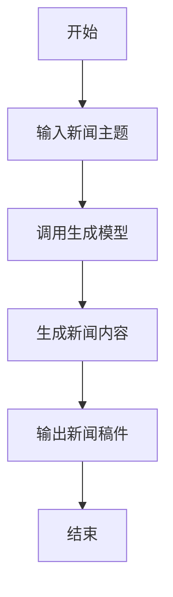
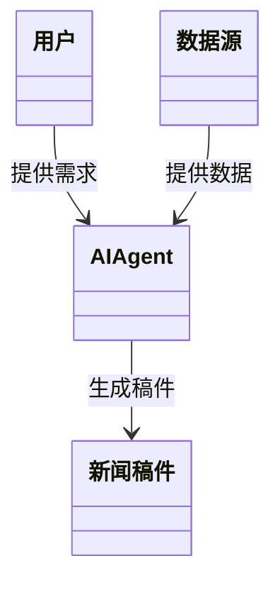
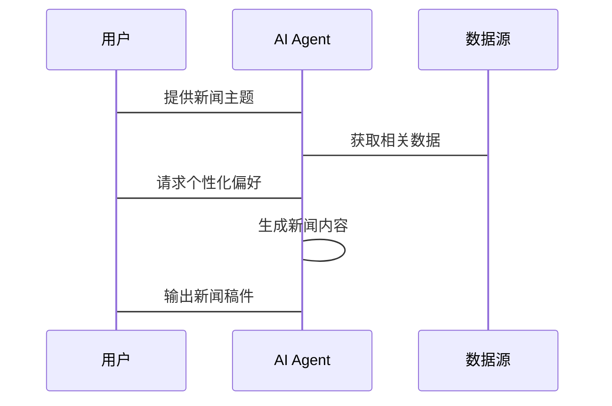

                 


# AI Agent在智能新闻写作中的角色

## 关键词：AI Agent, 智能新闻写作, 自然语言处理, 生成式AI, 新闻伦理

## 摘要：  
随着人工智能技术的飞速发展，AI Agent在新闻写作中的角色变得越来越重要。本文详细探讨了AI Agent在智能新闻写作中的应用背景、核心概念、算法原理、系统架构以及实际项目中的应用场景。通过分析AI Agent在新闻写作中的优势与挑战，本文为读者提供了全面的理解和实践指导。

---

## 第一部分：AI Agent与智能新闻写作的背景

### 第1章：AI Agent的基本概念与新闻写作的演变

#### 1.1 AI Agent的定义与核心功能  
AI Agent（人工智能代理）是指能够感知环境、自主决策并执行任务的智能体。其核心功能包括数据采集、信息处理、内容生成和用户交互。AI Agent通过学习和适应，能够高效完成复杂的任务。

#### 1.2 智能新闻写作的背景  
传统新闻写作依赖人工操作，存在效率低下和个性化不足的问题。随着AI技术的发展，智能新闻写作应运而生，利用AI Agent实现自动化内容生成，满足用户多样化的需求。

#### 1.3 AI Agent在新闻写作中的问题背景  
新闻写作需要快速响应、多语言支持和个性化内容生成，传统方法难以满足这些要求。AI Agent通过自动化和智能化，解决了这些问题。

#### 1.4 AI Agent的应用价值  
AI Agent能够提高新闻生产效率，实现个性化内容生成，并支持多语言和多平台发布，显著提升了新闻行业的竞争力。

---

## 第二部分：AI Agent的核心概念与工作原理

### 第2章：AI Agent的核心概念与联系

#### 2.1 AI Agent的定义与类型  
AI Agent可以分为基于规则的AI Agent和基于模型的AI Agent。基于规则的AI Agent通过预定义的规则进行操作，而基于模型的AI Agent则利用机器学习模型进行自适应决策。

#### 2.2 AI Agent在新闻写作中的核心要素  
- **数据源**：包括新闻事件数据、用户反馈等。
- **用户需求**：用户的个性化需求和偏好。
- **内容生成规则**：用于指导内容生成的规则和模板。

#### 2.3 AI Agent与相关概念的关系  
- **AI Agent与自然语言处理（NLP）**：NLP为AI Agent提供了语言理解和生成能力。
- **AI Agent与生成式AI**：生成式AI为AI Agent的内容生成提供支持。
- **AI Agent与新闻伦理**：AI Agent在新闻写作中需遵守伦理规范，确保内容的真实性和客观性。

---

## 第三部分：AI Agent的算法原理与数学模型

### 第3章：AI Agent的算法原理

#### 3.1 自然语言处理模型  
自然语言处理（NLP）模型是AI Agent的核心技术之一。常用的NLP模型包括BERT和GPT，它们通过大量数据训练，能够理解并生成自然语言文本。

#### 3.2 生成式AI的原理  
生成式AI通过生成模型（如Transformer架构）生成文本内容。生成模型利用概率分布预测下一个词，逐步生成完整的新闻稿件。

#### 3.3 算法流程图  
以下是一个生成式AI的算法流程图：



#### 3.4 数学模型与公式  
生成式AI的数学模型基于概率分布，公式如下：

$$ P(y|x) = \frac{P(x,y)}{P(x)} $$

其中，$x$ 是输入，$y$ 是输出，$P(x,y)$ 是联合概率，$P(x)$ 是条件概率。

---

## 第四部分：系统分析与架构设计

### 第4章：系统功能设计

#### 4.1 领域模型设计  
以下是新闻写作系统的领域模型：



#### 4.2 系统架构设计  
以下是系统架构图：

```mermaid
rectangle 数据源
rectangle 用户
rectangle AI Agent
rectangle 新闻稿件
AI Agent -- 数据源: 数据获取
AI Agent -- 用户: 交互
AI Agent -- 新闻稿件: 输出
```

#### 4.3 接口与交互设计  
以下是用户与AI Agent的交互流程图：



---

## 第五部分：项目实战

### 第5章：AI Agent在新闻写作中的应用

#### 5.1 项目环境搭建  
需要安装Python、TensorFlow、Keras等工具。

#### 5.2 核心代码实现  
以下是AI Agent的核心代码：

```python
def generate_article(topic):
    # 获取数据
    data = fetch_data(topic)
    # 生成内容
    model = load_model()
    article = model.generate(data)
    return article
```

#### 5.3 案例分析  
以一个新闻主题为例，展示AI Agent如何生成新闻稿件，并分析其优缺点。

---

## 第六部分：最佳实践与总结

### 第6章：最佳实践与小结

#### 6.1 最佳实践  
- 定期更新模型以保持准确性。
- 结合人工审核确保内容质量。
- 根据用户反馈优化生成策略。

#### 6.2 注意事项  
- 注意数据隐私和新闻伦理。
- 定期维护和更新AI Agent模型。

#### 6.3 拓展阅读  
推荐阅读相关书籍和论文，深入了解AI Agent和新闻写作的前沿技术。

---

## 作者：AI天才研究院/AI Genius Institute & 禅与计算机程序设计艺术 /Zen And The Art of Computer Programming

---

通过以上结构，文章详细探讨了AI Agent在智能新闻写作中的角色，涵盖了理论、算法、系统设计和实际应用，为读者提供了全面的视角和深入的分析。

