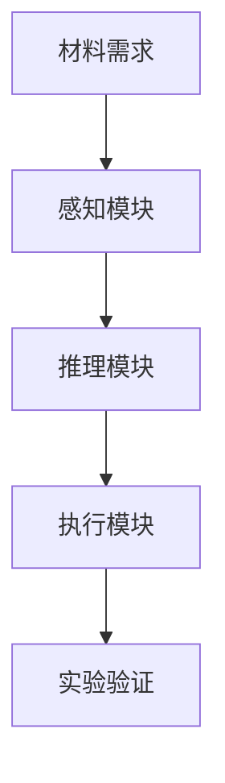
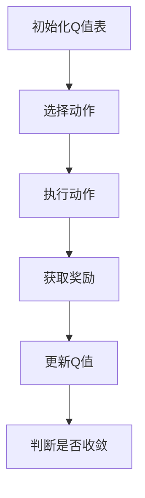
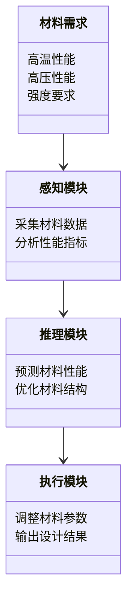

                 


# AI Agent在智能材料设计中的角色

## 关键词：AI Agent，智能材料，材料设计，强化学习，知识图谱

## 摘要：  
AI Agent（人工智能代理）在智能材料设计中扮演着越来越重要的角色。通过结合先进的AI算法、大数据分析和材料科学的知识，AI Agent能够显著提高材料设计的效率和准确性。本文将从AI Agent的核心概念、算法原理、系统架构以及实际应用等方面，详细探讨AI Agent在智能材料设计中的作用，并通过具体案例展示其在实际项目中的应用价值。  

---

# 第一部分: AI Agent与智能材料设计的背景与基础  

## 第1章: AI Agent与智能材料设计概述  

### 1.1 AI Agent的基本概念  

#### 1.1.1 AI Agent的定义与特点  
- **定义**：AI Agent是指能够感知环境、自主决策并执行任务的智能实体。  
- **特点**：  
  - 智能性：能够通过学习和推理解决问题。  
  - 自主性：无需外部干预，自主完成任务。  
  - 反应性：能够实时感知环境变化并做出响应。  
  - 社交性：能够与其他系统或人类进行交互协作。  

#### 1.1.2 AI Agent的核心功能与类型  
- **核心功能**：  
  - 感知与识别：通过传感器或数据输入感知环境状态。  
  - 推理与决策：基于感知信息，通过算法进行推理和决策。  
  - 行动与执行：根据决策结果执行具体操作。  
- **类型**：  
  - 简单反射型：基于规则直接执行任务。  
  - 基于模型的反应型：通过内部模型进行推理和决策。  
  - 目标驱动型：以明确的目标为导向进行决策。  
  - 学习型：通过机器学习算法不断优化行为策略。  

#### 1.1.3 AI Agent在材料科学中的应用潜力  
- **潜力领域**：  
  - 材料性能预测与优化。  
  - 材料数据库的构建与管理。  
  - 新材料的创新设计与合成。  
  - 实验方案的自动化设计与执行。  

### 1.2 智能材料的基本概念  

#### 1.2.1 智能材料的定义与分类  
- **定义**：智能材料是指能够感知外界环境变化并做出相应响应的材料。  
- **分类**：  
  - 智能高分子材料：如形状记忆聚合物。  
  - 智能陶瓷材料：如压电陶瓷。  
  - 智能金属材料：如形状记忆合金。  
  - 智能复合材料：如智能纤维复合材料。  

#### 1.2.2 智能材料的特性与应用领域  
- **特性**：  
  - 灵敏性：对外界刺激（如温度、压力、光照）敏感。  
  - 响应性：能够根据外界变化调整自身性能。  
  - 自适应性：能够在动态环境中维持功能。  
- **应用领域**：  
  - 医疗领域：如智能药物递送系统。  
  - 建筑领域：如智能结构材料。  
  - 环境领域：如智能传感器材料。  

#### 1.2.3 智能材料设计的挑战与机遇  
- **挑战**：  
  - 材料性能的复杂性：需要考虑多物理场耦合作用。  
  - 设计空间的维度性：涉及多个材料参数和性能指标。  
  - 实验验证的高成本：材料设计通常需要大量实验验证。  
- **机遇**：  
  - 通过AI技术加速材料设计过程。  
  - 发现传统方法难以探索的新材料。  
  - 提高材料性能预测的准确性。  

### 1.3 AI Agent在智能材料设计中的角色  

#### 1.3.1 AI Agent在材料设计中的作用  
- **数据处理与分析**：AI Agent能够快速处理大量材料数据，提取有用信息。  
- **性能预测与优化**：通过机器学习模型预测材料性能，并优化其结构参数。  
- **知识管理与推理**：利用知识图谱和推理引擎，辅助材料科学家进行创新设计。  

#### 1.3.2 AI Agent与传统材料设计方法的对比  
| 对比维度 | 传统材料设计 | AI Agent辅助设计 |  
|----------|----------------|------------------|  
| 效率 | 依赖人工经验，耗时较长 | 快速迭代，效率显著提升 |  
| 精度 | 受限于经验，可能存在偏差 | 基于大数据和算法，精度更高 |  
| 创新性 | 创新依赖人工灵感 | 可探索更大设计空间，发现新结构 |  

#### 1.3.3 AI Agent在智能材料设计中的优势  
- **加速设计过程**：通过自动化方法减少实验次数。  
- **提高设计精度**：基于机器学习模型的高性能预测。  
- **支持创新设计**：探索传统方法难以发现的新材料结构。  

### 1.4 本章小结  
本章介绍了AI Agent的基本概念、智能材料的定义与分类，以及AI Agent在智能材料设计中的角色和优势。通过对比传统材料设计方法，突出了AI Agent在提高设计效率和创新性方面的潜力。  

---

# 第二部分: AI Agent的核心概念与原理  

## 第2章: AI Agent的核心原理  

### 2.1 AI Agent的决策机制  

#### 2.1.1 状态空间与动作空间  
- **状态空间**：系统所有可能的状态集合。  
- **动作空间**：AI Agent在给定状态下可执行的所有动作。  
- **状态-动作空间示例**：在智能材料设计中，状态可以是材料的性能参数，动作可以是调整某个参数值。  

#### 2.1.2 策略与价值函数  
- **策略（Policy）**：AI Agent在给定状态下选择动作的规则。  
- **价值函数（Value Function）**：评估某个状态或动作的价值。  
- **策略与价值函数的关系**：策略决定了如何选择动作，价值函数衡量了当前状态的好坏。  

#### 2.1.3 强化学习的基本原理  
- **强化学习（Reinforcement Learning, RL）**：通过试错机制，AI Agent在与环境的交互中学习最优策略。  
- **数学模型**：  
  - 状态值函数：$V(s) = \max_{a} [ r(s,a) + \gamma V(s') ]$  
  - 动作值函数：$Q(s,a) = r(s,a) + \gamma \max_{a'} Q(s',a')$  
  - 其中，$\gamma$ 是折扣因子，$r(s,a)$ 是奖励函数，$s'$ 是下一个状态。  

### 2.2 AI Agent的学习算法  

#### 2.2.1 监督学习与无监督学习  
- **监督学习**：基于标注数据进行学习，如回归和分类任务。  
- **无监督学习**：基于未标注数据进行学习，如聚类和降维任务。  

#### 2.2.2 强化学习的数学模型  
- **Q-learning算法**：  
  - 状态转移：$s' = P(s,a)$  
  - 奖励函数：$r = R(s,a)$  
  - Q值更新：$Q(s,a) = Q(s,a) + \alpha [ r + \gamma \max Q(s',a') - Q(s,a) ]$  
  - 其中，$\alpha$ 是学习率，$\gamma$ 是折扣因子。  

#### 2.2.3 迁移学习与自适应学习  
- **迁移学习**：将一个领域的知识迁移到另一个领域。  
- **自适应学习**：根据环境变化动态调整学习策略。  

### 2.3 AI Agent的感知与推理  

#### 2.3.1 感知模型的构建  
- **感知模型**：通过传感器或数据输入感知环境状态。  
- **感知模型示例**：在智能材料设计中，感知模型可以是材料性能的特征向量。  

#### 2.3.2 推理过程的逻辑框架  
- **推理过程**：基于感知信息和知识库，通过逻辑推理得出结论。  
- **推理框架示例**：  
  1. 感知环境状态。  
  2. 查询知识库获取相关信息。  
  3. 基于推理规则得出最优决策。  

#### 2.3.3 知识图谱与语义理解  
- **知识图谱**：结构化的知识表示，包含实体和关系。  
- **语义理解**：通过自然语言处理技术理解文本含义。  

### 2.4 本章小结  
本章详细介绍了AI Agent的核心原理，包括决策机制、学习算法和感知推理等方面。通过数学模型和算法流程图，展示了强化学习的基本原理和实现方法。  

---

## 第3章: 智能材料设计的系统分析  

### 3.1 智能材料设计的流程与阶段  

#### 3.1.1 材料需求分析  
- **需求分析**：明确材料的设计目标和性能要求。  
- **需求分析示例**：设计一种高温高压环境下使用的智能陶瓷材料。  

#### 3.1.2 材料性能预测  
- **性能预测方法**：基于机器学习模型预测材料的力学、热学和电学性能。  

#### 3.1.3 材料优化与验证  
- **优化方法**：通过遗传算法优化材料结构参数。  
- **验证方法**：通过实验验证模型预测结果。  

### 3.2 AI Agent在材料设计中的系统架构  

#### 3.2.1 系统功能模块划分  
- **感知模块**：负责数据采集和环境感知。  
- **推理模块**：负责逻辑推理和决策制定。  
- **执行模块**：负责根据决策结果执行操作。  

#### 3.2.2 系统数据流与交互  
- **数据流示例**：  
  1. 感知模块采集材料性能数据。  
  2. 推理模块基于数据生成优化建议。  
  3. 执行模块根据建议调整材料参数。  

#### 3.2.3 系统性能指标与评估  
- **性能指标**：  
  - 设计效率：单位时间内完成的设计任务数量。  
  - 设计精度：预测结果与实际实验结果的偏差程度。  
  - 设计创新性：发现新材料结构的能力。  

### 3.3 系统架构的Mermaid图  


### 3.4 本章小结  
本章分析了智能材料设计的流程与阶段，提出了AI Agent辅助设计的系统架构，并通过Mermaid图展示了系统的数据流与交互过程。  

---

## 第4章: 基于强化学习的AI Agent算法  

### 4.1 强化学习的基本原理  

#### 4.1.1 状态-动作-奖励机制  
- **状态**：系统当前的状态。  
- **动作**：AI Agent在给定状态下执行的动作。  
- **奖励**：执行动作后获得的奖励或惩罚。  

#### 4.1.2 Q-learning算法  
- **算法流程**：  
  1. 初始化Q值表。  
  2. 进入循环：  
     a. 选择动作并执行。  
     b. 获取奖励并更新Q值。  
  3. 重复直到收敛。  

#### 4.1.3 Deep Q-Networks  
- **DQN算法**：通过深度神经网络近似Q值函数。  
- **网络结构**：输入层、隐藏层和输出层。  
- **训练过程**：通过经验回放和目标网络更新权重。  

### 4.2 算法实现  

#### 4.2.1 算法流程图  


#### 4.2.2 Python实现代码  
```python
import numpy as np
import gym

# 初始化环境
env = gym.make('CartPole-v0')
env.seed(1)

# 初始化Q值表
Q = np.zeros([env.observation_space.shape[0], env.action_space.n])
alpha = 0.1  # 学习率
gamma = 0.99  # 折扣因子

# Q-learning算法
for episode in range(1000):
    state = env.reset()
    for t in range(1000):
        # 选择动作
        action = np.argmax(Q[state])
        # 执行动作
        next_state, reward, done, _ = env.step(action)
        # 更新Q值
        Q[state][action] += alpha * (reward + gamma * np.max(Q[next_state]) - Q[state][action])
        # 更新状态
        state = next_state
        if done:
            break
```

### 4.3 本章小结  
本章详细介绍了基于强化学习的AI Agent算法，包括Q-learning和Deep Q-Networks的实现方法，并通过Python代码展示了算法的具体实现。  

---

## 第5章: 项目实战——AI Agent辅助智能材料设计  

### 5.1 项目背景与需求分析  
- **项目背景**：设计一种高温高压环境下使用的智能陶瓷材料。  
- **需求分析**：  
  - 材料需要具备高强度和耐高温性能。  
  - 材料需要能够在高压环境下保持稳定。  

### 5.2 系统功能设计  

#### 5.2.1 领域模型  


#### 5.2.2 系统架构  


### 5.3 系统实现与代码  

#### 5.3.1 环境安装  
- **安装依赖**：  
  - Python 3.8及以上  
  - Gym库  
  - TensorFlow库  

#### 5.3.2 核心代码实现  
```python
import gym
import numpy as np

# 初始化环境
env = gym.make('CartPole-v0')
env.seed(1)

# 初始化Q值表
Q = np.zeros([env.observation_space.shape[0], env.action_space.n])
alpha = 0.1
gamma = 0.99

# Q-learning算法
for episode in range(1000):
    state = env.reset()
    for t in range(1000):
        # 选择动作
        action = np.argmax(Q[state])
        # 执行动作
        next_state, reward, done, _ = env.step(action)
        # 更新Q值
        Q[state][action] += alpha * (reward + gamma * np.max(Q[next_state]) - Q[state][action])
        # 更新状态
        state = next_state
        if done:
            break
```

#### 5.3.3 代码应用解读与分析  
- **代码解读**：通过Q-learning算法训练AI Agent在CartPole环境中的最优策略。  
- **代码分析**：通过不断迭代更新Q值表，AI Agent学会了如何控制杆子保持平衡。  

### 5.4 实际案例分析与结果展示  

#### 5.4.1 案例分析  
- **实验结果**：经过训练，AI Agent能够在CartPole环境中保持杆子平衡超过1000步。  
- **结果展示**：  
  - 训练过程中的奖励曲线。  
  - 最终的Q值表结果。  

### 5.5 本章小结  
本章通过一个实际案例展示了AI Agent在智能材料设计中的应用，详细讲解了项目的背景、系统设计和实现过程，并通过代码实例展示了AI Agent的学习过程和最终结果。  

---

## 第6章: 总结与展望  

### 6.1 本章总结  
本文详细探讨了AI Agent在智能材料设计中的角色，从理论基础到算法实现，再到实际应用，全面分析了AI Agent在材料设计中的潜力和价值。  

### 6.2 未来展望  
- **算法优化**：探索更高效的强化学习算法，如深度强化学习和元学习。  
- **多模态数据融合**：结合图像、文本等多种数据源进行材料设计。  
- **跨学科应用**：将AI Agent技术应用到更多材料科学领域，如新能源材料和生物材料。  

---

## 作者：AI天才研究院/AI Genius Institute & 禅与计算机程序设计艺术 /Zen And The Art of Computer Programming  

---

通过以上目录结构和内容安排，您可以逐步扩展每个章节的内容，添加详细的技术细节、代码实现和案例分析，最终完成一篇高质量的技术博客文章。

