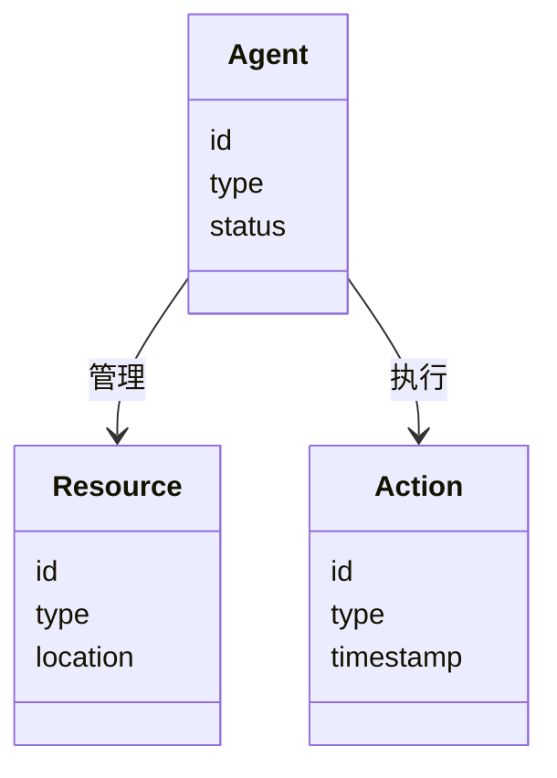
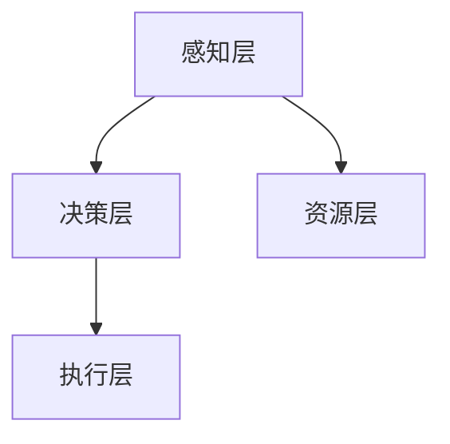

                 


# AI Agent在智能森林资源管理中的实践

## 关键词：
AI Agent, 智能森林资源管理, 强化学习, 系统架构设计, 项目实战

## 摘要：
本文详细探讨了AI Agent在智能森林资源管理中的实践应用。通过分析森林资源管理中的问题与挑战，介绍了AI Agent的核心概念、算法原理、系统架构设计以及实际项目实现。文章内容涵盖从理论到实践的各个方面，旨在为读者提供全面的技术指导和实践参考。

---

# 第一部分: AI Agent在智能森林资源管理中的背景与概述

## 第1章: AI Agent与森林资源管理概述

### 1.1 AI Agent的基本概念
#### 1.1.1 AI Agent的定义与特点
AI Agent（人工智能代理）是一种能够感知环境、做出决策并执行操作的智能实体。它具有以下特点：
- **自主性**：能够自主决策，无需外部干预。
- **反应性**：能够实时感知环境并做出反应。
- **目标导向**：具有明确的目标，行为围绕目标展开。
- **学习能力**：能够通过数据和经验不断优化自身的性能。

#### 1.1.2 森林资源管理的定义与现状
森林资源管理是指对森林中的各种资源（如树木、土壤、水源等）进行保护、利用和优化的过程。当前，森林资源管理面临以下问题：
- **资源浪费**：传统管理方式效率低下，资源利用不充分。
- **环境破坏**：不合理的开发可能导致生态破坏。
- **数据孤岛**：各管理环节之间的数据难以有效整合。

#### 1.1.3 AI Agent在森林资源管理中的应用价值
AI Agent能够通过智能化的方式解决上述问题，例如：
- **资源优化配置**：通过实时数据监测，优化资源分配。
- **环境保护**：通过预测模型，提前发现潜在的环境风险。
- **高效管理**：通过自动化决策，提高管理效率。

---

### 1.2 森林资源管理中的问题与挑战
#### 1.2.1 森林资源管理的主要问题
1. 资源浪费：传统管理方式效率低下。
2. 环境破坏：不合理的开发导致生态破坏。
3. 数据孤岛：各管理环节之间的数据难以有效整合。

#### 1.2.2 AI Agent如何解决这些问题
1. **资源优化配置**：通过实时数据监测和预测模型，优化资源分配。
2. **环境保护**：通过预测模型，提前发现潜在的环境风险。
3. **高效管理**：通过自动化决策，提高管理效率。

#### 1.2.3 森林资源管理的边界与外延
森林资源管理的边界包括：
- **资源类型**：树木、土壤、水源等。
- **管理目标**：保护、利用和优化。
- **管理范围**：从局部到全球范围。

---

### 1.3 本章小结
本章介绍了AI Agent的基本概念及其在森林资源管理中的应用价值，分析了传统管理方式的局限性以及AI Agent如何通过智能化的方式解决这些问题。

---

# 第二部分: AI Agent的核心概念与原理

## 第2章: AI Agent的核心概念与联系

### 2.1 AI Agent的原理与机制
#### 2.1.1 AI Agent的感知、决策与执行过程
AI Agent的核心机制包括三个环节：
1. **感知**：通过传感器或其他数据源获取环境信息。
2. **决策**：基于感知信息，结合目标和约束条件，制定行动方案。
3. **执行**：根据决策结果，执行具体操作。

#### 2.1.2 AI Agent的核心要素与组成
AI Agent的核心要素包括：
- **感知模块**：负责获取环境信息。
- **决策模块**：负责制定行动方案。
- **执行模块**：负责执行具体操作。
- **知识库**：存储相关领域的知识和经验。

---

### 2.2 AI Agent与相关概念的对比
#### 2.2.1 AI Agent与传统算法的对比分析
| 对比维度 | AI Agent | 传统算法 |
|----------|-----------|-----------|
| 决策方式 | 自主决策   | 确定性决策 |
| 学习能力 | 具备学习能力 | 无学习能力 |
| 应用场景 | 复杂动态环境 | 简单静态环境 |

#### 2.2.2 AI Agent与机器学习模型的对比
| 对比维度 | AI Agent | 机器学习模型 |
|----------|-----------|--------------|
| 主导任务 | 自主决策   | 数据分析与预测 |
| 学习方式 | 在线学习   | 批量学习     |
| 应用目标 | 实时操作   | 数据分析     |

#### 2.2.3 AI Agent与规则引擎的对比
| 对比维度 | AI Agent | 规则引擎 |
|----------|-----------|----------|
| 决策方式 | 基于目标和约束 | 基于规则 |
| 灵活性 | 高          | 中        |
| 学习能力 | 具备学习能力 | 无学习能力 |

---

### 2.3 AI Agent的ER实体关系图
```mermaid
er
    entity(Agent) {
        id
        type
        status
    }
    entity(Resource) {
        id
        type
        location
    }
    entity(Action) {
        id
        type
        timestamp
    }
    Agent --> Action: 执行
    Resource --> Action: 监测
```

---

## 第3章: AI Agent的算法原理与数学模型

### 3.1 AI Agent的核心算法
#### 3.1.1 强化学习算法
强化学习是一种通过试错机制优化决策的算法。其核心思想是通过与环境交互，逐步优化策略，以最大化累计奖励。

**数学模型**：
$$ Q(s, a) = r + \gamma \max_{a'} Q(s', a') $$
其中：
- \( Q(s, a) \) 表示在状态 \( s \) 下采取动作 \( a \) 的价值。
- \( r \) 表示当前奖励。
- \( \gamma \) 表示折扣因子。
- \( s' \) 表示下一个状态。

#### 3.1.2 监督学习算法
监督学习是一种通过标签数据训练模型的算法。其核心思想是通过最小化预测值与真实值之间的误差，优化模型参数。

**数学模型**：
$$ \text{损失函数} = \sum (y_i - \hat{y}_i)^2 $$
其中：
- \( y_i \) 表示真实值。
- \( \hat{y}_i \) 表示预测值。

#### 3.1.3 聚类与分

---

### 3.2 AI Agent的数学模型与代码实现
#### 3.2.1 强化学习算法的Python实现
```python
import numpy as np

class Agent:
    def __init__(self, state_space, action_space):
        self.state_space = state_space
        self.action_space = action_space
        self.Q = np.zeros((state_space, action_space))

    def act(self, state):
        # 根据Q值选择动作
        return np.argmax(self.Q[state, :])

    def update(self, state, action, reward, next_state):
        # 更新Q值
        self.Q[state, action] += reward + 0.99 * np.max(self.Q[next_state, :])
```

#### 3.2.2 监督学习算法的Python实现
```python
from sklearn.linear_model import LinearRegression

model = LinearRegression()
model.fit(X, y)
```

---

# 第三部分: AI Agent在智能森林资源管理中的系统架构设计

## 第4章: 系统分析与架构设计

### 4.1 系统分析
#### 4.1.1 问题场景介绍
森林资源管理的复杂性要求我们设计一个能够实时监测、智能决策的系统。

#### 4.1.2 系统介绍
我们的系统包括以下几个部分：
1. **感知层**：通过传感器采集环境数据。
2. **决策层**：基于感知数据，制定管理策略。
3. **执行层**：根据决策结果，执行具体操作。

---

### 4.2 系统功能设计
#### 4.2.1 功能模块设计
| 模块名称 | 功能描述 |
|----------|----------|
| 数据采集模块 | 采集环境数据 |
| 数据处理模块 | 处理和分析数据 |
| 决策模块 | 制定管理策略 |
| 执行模块 | 执行具体操作 |

#### 4.2.2 功能模块的ER类图


---

### 4.3 系统架构设计
#### 4.3.1 系统架构图


---

## 第5章: 项目实战

### 5.1 环境安装
```bash
pip install numpy matplotlib scikit-learn
```

---

### 5.2 系统核心实现
#### 5.2.1 核心代码实现
```python
import numpy as np
from sklearn.linear_model import LinearRegression

class Agent:
    def __init__(self, state_space, action_space):
        self.state_space = state_space
        self.action_space = action_space
        self.Q = np.zeros((state_space, action_space))

    def act(self, state):
        return np.argmax(self.Q[state, :])

    def update(self, state, action, reward, next_state):
        self.Q[state, action] += reward + 0.99 * np.max(self.Q[next_state, :])

# 示例使用
agent = Agent(5, 3)
agent.update(0, 1, 0.5, 2)
```

---

### 5.3 实际案例分析
#### 5.3.1 森林火灾监测案例
1. **数据采集**：通过传感器采集森林中的温度、湿度等数据。
2. **数据处理**：对数据进行清洗和预处理。
3. **决策制定**：基于强化学习算法，制定灭火策略。
4. **执行操作**：根据决策结果，执行灭火操作。

---

## 第6章: 最佳实践

### 6.1 小结
本文详细介绍了AI Agent在智能森林资源管理中的实践应用，包括核心概念、算法原理、系统架构设计以及项目实战。

### 6.2 注意事项
1. **数据质量**：确保数据的准确性和完整性。
2. **算法选择**：根据具体场景选择合适的算法。
3. **系统优化**：不断优化系统性能，提高管理效率。

### 6.3 拓展阅读
1. 《强化学习入门》
2. 《机器学习实战》
3. 《系统架构设计的艺术》

---

## 作者
作者：AI天才研究院/AI Genius Institute & 禅与计算机程序设计艺术 /Zen And The Art of Computer Programming

