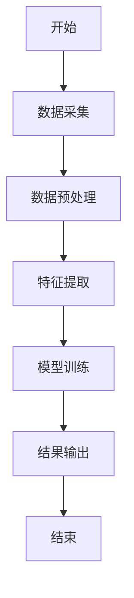
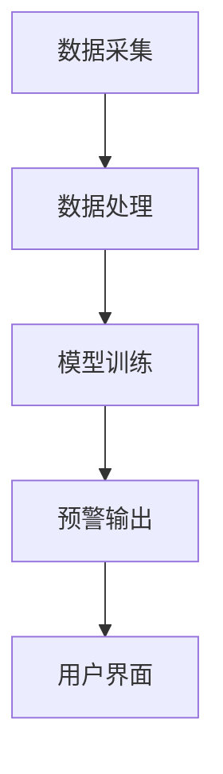
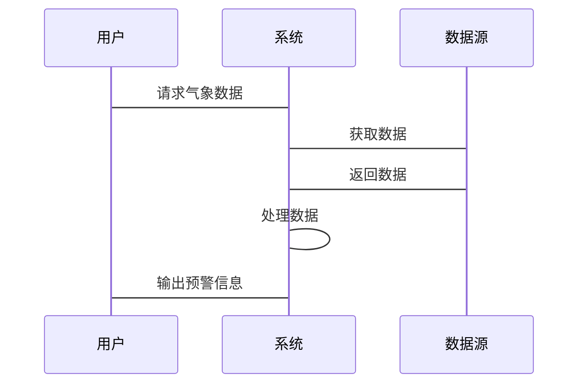

                 

<think>
嗯，我现在需要帮用户设计一本关于《AI Agent在智能气象灾害预警系统中的实践》的详细目录大纲。用户已经提供了一个示例，我需要按照这个格式和内容要求，进一步扩展和完善。

首先，我需要理解这本书的核心内容。AI Agent在这里指的是智能代理，用于气象灾害的预警系统。因此，这本书应该涵盖AI Agent的基本概念，它们如何应用于气象预警，以及具体的实现和案例。

接下来，我需要分析用户给出的示例目录结构。示例分为七个主要部分，每个部分都有详细的章节和小节。这给了我一个很好的框架，我需要按照这个结构来构建我的大纲，但要确保每个部分都详细且有深度。

首先，背景介绍部分应该包括气象灾害预警的现状、挑战，以及AI Agent的优势。这部分需要让读者了解为什么需要AI Agent以及它们在气象预警中的作用。

然后是核心概念，这部分需要详细讲解AI Agent和气象灾害预警的结合。包括AI Agent的基本原理、分类、核心能力，以及它们如何感知环境和做出决策。可能需要一些图表来帮助理解，比如ER图或流程图。

接下来是算法原理，这里需要详细讲解AI Agent所用的算法，比如强化学习或决策树。这部分应该包括算法的数学模型和公式，以及用Python代码实现的例子。可能需要用mermaid流程图来展示算法的流程。

系统分析与架构设计部分需要介绍项目背景，系统功能设计，包括数据采集、分析和预警模块。然后是系统架构图，展示各模块之间的关系，以及接口设计和交互流程。这部分可能需要使用mermaid的类图和序列图。

项目实战部分需要详细指导如何搭建环境，编写核心代码，解读代码功能，并分析实际案例。这部分可能需要分章节，包括环境安装、代码实现、案例分析等。

最后是总结与展望，包括最佳实践、小结、注意事项和拓展阅读。这部分可能放在最后一章，帮助读者巩固知识，并引导他们进一步学习。

我还需要确保每个部分都包含足够的细节，比如数学模型的详细讲解，用latex公式表示，并嵌入到相应的章节中。此外，图表的使用也很重要，比如mermaid流程图，需要嵌入到算法原理和系统架构设计中，以帮助读者更好地理解。

现在，我需要将这些思考转化为具体的目录结构。每个章节和小节都需要清晰且有逻辑性，确保读者能够一步步深入理解AI Agent在气象预警中的应用。同时，要注意章节之间的连贯性，确保知识逐步递进，让读者能够顺利掌握整个系统的构建过程。

可能我还需要考虑用户的实际需求，比如读者可能是研究人员、开发者或学生，因此内容需要专业但易懂，避免过于复杂的术语，但又不失深度。同时，案例分析部分需要具体且实用，能够指导读者实际操作。

综上所述，我需要构建一个结构清晰、内容全面的目录大纲，确保每个部分都详细且逻辑连贯，满足用户的需求。
</think>

```markdown
# AI Agent在智能气象灾害预警系统中的实践

## 关键词：AI Agent, 智能气象, 灾害预警, 多源数据, 机器学习, 大数据分析

## 摘要：本文系统地探讨了AI Agent在智能气象灾害预警系统中的应用，从背景、核心概念、算法原理到系统架构和项目实战，详细阐述了AI Agent如何通过多源数据融合、智能决策和实时反馈优化预警系统，从而提升气象灾害预警的准确性和效率。通过实际案例分析，展示了AI Agent在气象灾害预警中的巨大潜力和实际价值。

---

# 第一部分: AI Agent在智能气象灾害预警系统中的背景与概念

## 第1章: AI Agent与智能气象灾害预警系统概述

### 1.1 智能气象灾害预警系统的现状

#### 1.1.1 气象灾害预警的传统模式
- **传统模式的描述**：依赖人工分析和历史数据，效率低，覆盖范围有限。
- **挑战**：数据来源单一，响应速度慢，难以应对复杂多变的气象条件。

#### 1.1.2 智能化转型的必要性
- **数据爆炸**：气象数据的海量增长，需要更高效的处理方式。
- **实时性要求**：气象灾害预警需要快速响应，传统方法难以满足。
- **精准度提升**：通过AI技术提高预测的准确性。

#### 1.1.3 AI Agent在气象灾害预警中的角色
- **实时感知**：AI Agent能够实时采集和分析气象数据。
- **智能决策**：基于多源数据进行综合分析，快速做出预警决策。
- **自我优化**：通过反馈机制不断优化预测模型和预警策略。

### 1.2 AI Agent的核心概念与特点

#### 1.2.1 AI Agent的定义与分类
- **定义**：AI Agent是一种能够感知环境、自主决策、执行任务的智能实体。
- **分类**：基于智能水平分为简单反应式、基于模型的反应式、目标驱动式和实用驱动式。

#### 1.2.2 AI Agent的核心能力
- **感知能力**：通过传感器和数据源获取环境信息。
- **学习能力**：通过机器学习算法不断优化模型。
- **决策能力**：基于感知信息做出最优决策。

#### 1.2.3 AI Agent与传统算法的区别
- **自主性**：AI Agent具备自主决策的能力，而传统算法依赖于预设规则。
- **适应性**：AI Agent能够根据环境变化自适应调整，传统算法则需要手动干预。
- **实时性**：AI Agent能够实时处理数据并做出响应，传统算法则需要周期性处理。

### 1.3 智能气象灾害预警系统中的AI Agent优势

#### 1.3.1 提高预警效率
- **实时数据处理**：AI Agent能够快速处理海量数据，缩短预警时间。
- **多源数据融合**：通过整合卫星、气象站、雷达等多种数据源，提高预警的准确性。

#### 1.3.2 增强预测准确性
- **机器学习模型**：利用深度学习和强化学习等技术，建立更复杂的预测模型。
- **数据关联分析**：通过关联分析技术，发现潜在的气象灾害征兆。

#### 1.3.3 实现多源数据融合
- **数据融合技术**：将多种数据源的信息进行融合，提高数据的综合利用率。
- **数据清洗与预处理**：通过数据清洗和预处理，消除噪声，提高数据质量。

### 1.4 本章小结
- **总结**：本章介绍了AI Agent在智能气象灾害预警系统中的背景和概念，强调了AI Agent在提高预警效率和准确性方面的优势。

---

# 第二部分: AI Agent在智能气象灾害预警系统中的核心原理

## 第2章: AI Agent的核心原理与数学模型

### 2.1 AI Agent的感知与决策机制

#### 2.1.1 环境感知模型
- **感知模型的描述**：AI Agent通过传感器和数据源感知环境信息。
- **数据融合算法**：使用加权融合算法将多源数据进行融合。

#### 2.1.2 多源数据融合算法
- **加权融合公式**：
$$ y = \sum_{i=1}^{n} w_i x_i $$
其中，$w_i$ 是第i个数据源的权重，$x_i$ 是第i个数据源的观测值，$y$ 是融合后的结果。

#### 2.1.3 决策树的构建与优化
- **决策树构建**：基于历史数据和气象专家经验，构建决策树模型。
- **决策树优化**：通过剪枝技术优化决策树，提高预测准确性和效率。

### 2.2 AI Agent的数学模型与公式

#### 2.2.1 数据融合公式
$$ y = \sum_{i=1}^{n} w_i x_i $$
其中，$w_i$ 是第i个数据源的权重，$x_i$ 是第i个数据源的观测值，$y$ 是融合后的结果。

#### 2.2.2 决策树模型
$$ DecisionTree(y) = \sum_{i=1}^{n} w_i x_i $$
其中，$w_i$ 是第i个特征的权重，$x_i$ 是第i个特征的值，$y$ 是预测结果。

### 2.3 AI Agent的算法流程图


### 2.4 本章小结
- **总结**：本章详细讲解了AI Agent的核心原理，包括环境感知模型、数据融合算法和决策树的构建与优化，以及相关的数学公式和算法流程图。

---

# 第三部分: AI Agent在智能气象灾害预警系统中的算法实现

## 第3章: AI Agent的算法实现与优化

### 3.1 强化学习算法在气象灾害预警中的应用

#### 3.1.1 强化学习的基本原理
- **强化学习定义**：一种通过试错机制来学习策略的算法，通过与环境交互获得奖励，最终找到最优策略。

#### 3.1.2 Q-learning算法在气象灾害预警中的应用
- **Q-learning公式**：
$$ Q(s, a) = r + \gamma \max_{a'} Q(s', a') $$
其中，$s$ 是当前状态，$a$ 是当前动作，$r$ 是奖励，$\gamma$ 是折扣因子，$s'$ 是下一个状态。

#### 3.1.3 强化学习在气象灾害预警中的优势
- **实时适应**：能够根据实时数据动态调整预测策略。
- **自我优化**：通过不断试错，优化预测模型，提高准确率。

### 3.2 机器学习算法的实现与优化

#### 3.2.1 机器学习算法的选择
- **算法选择标准**：根据数据类型和任务需求选择合适的算法，如随机森林、支持向量机等。

#### 3.2.2 算法优化策略
- **超参数调优**：通过网格搜索或随机搜索等方法优化模型参数。
- **特征选择**：通过特征重要性分析选择关键特征，提高模型性能。

### 3.3 算法实现的代码示例

#### 3.3.1 强化学习算法实现
```python
import numpy as np

class QLearning:
    def __init__(self, state_space, action_space, gamma=0.99, epsilon=0.1):
        self.gamma = gamma
        self.epsilon = epsilon
        self.q_table = np.zeros((state_space, action_space))

    def choose_action(self, state):
        if np.random.random() < self.epsilon:
            return np.random.randint(0, action_space)
        else:
            return np.argmax(self.q_table[state])

    def update_q_table(self, state, action, reward, next_state):
        self.q_table[state, action] = reward + self.gamma * np.max(self.q_table[next_state])
```

#### 3.3.2 机器学习算法实现
```python
from sklearn.ensemble import RandomForestClassifier

class WeatherPredictor:
    def __init__(self, n_estimators=100):
        self.model = RandomForestClassifier(n_estimators=n_estimators)

    def train(self, X, y):
        self.model.fit(X, y)

    def predict(self, X):
        return self.model.predict(X)
```

### 3.4 本章小结
- **总结**：本章详细讲解了强化学习和机器学习算法在气象灾害预警中的应用，包括Q-learning算法的实现和随机森林模型的训练与预测。

---

# 第四部分: AI Agent在智能气象灾害预警系统中的系统设计与实现

## 第4章: 系统分析与架构设计

### 4.1 项目背景与需求分析

#### 4.1.1 项目背景
- **项目目标**：构建一个基于AI Agent的智能气象灾害预警系统，提高预警效率和准确性。
- **项目范围**：涵盖数据采集、数据处理、模型训练和结果输出等模块。

#### 4.1.2 需求分析
- **功能需求**：实时采集气象数据，进行数据融合和预测，输出预警结果。
- **性能需求**：系统需要具备高实时性和高准确性。

### 4.2 系统功能设计

#### 4.2.1 数据采集模块
- **功能描述**：通过传感器和数据接口获取气象数据，包括温度、湿度、风速等。
- **数据格式**：支持多种数据格式，如CSV、JSON等。

#### 4.2.2 数据处理模块
- **数据清洗**：去除噪声数据，确保数据质量。
- **数据融合**：将多源数据进行融合，提高数据的综合利用率。

#### 4.2.3 模型训练模块
- **模型选择**：根据数据类型和任务需求选择合适的算法。
- **模型优化**：通过超参数调优和特征选择优化模型性能。

#### 4.2.4 预警输出模块
- **预警规则**：根据预测结果和阈值生成预警信息。
- **预警输出**：通过多种方式输出预警信息，如短信、邮件等。

### 4.3 系统架构设计

#### 4.3.1 系统架构图


#### 4.3.2 接口设计
- **数据接口**：提供API接口，方便与其他系统集成。
- **预警接口**：提供预警信息输出接口，支持多种格式。

### 4.4 系统交互流程图


### 4.5 本章小结
- **总结**：本章详细讲解了AI Agent在智能气象灾害预警系统中的系统设计与架构，包括模块划分、接口设计和系统交互流程。

---

# 第五部分: AI Agent在智能气象灾害预警系统中的项目实战

## 第5章: 项目实战与案例分析

### 5.1 环境搭建与安装

#### 5.1.1 环境要求
- **操作系统**：Windows/Mac/Linux
- **Python版本**：Python 3.6+
- **依赖库安装**：numpy, pandas, scikit-learn, matplotlib

#### 5.1.2 安装步骤
1. 安装Python
2. 安装依赖库：
```bash
pip install numpy pandas scikit-learn matplotlib
```

### 5.2 系统核心代码实现

#### 5.2.1 数据采集模块实现
```python
import requests

def fetch_weather_data(api_key, location):
    url = f"http://api.openweathermap.org/data/2.5/weather?q={location}&appid={api_key}"
    response = requests.get(url)
    return response.json()
```

#### 5.2.2 数据处理模块实现
```python
import pandas as pd

def preprocess_data(data):
    df = pd.DataFrame(data)
    df = df.dropna()
    return df
```

#### 5.2.3 模型训练模块实现
```python
from sklearn.ensemble import RandomForestClassifier

def train_model(X, y):
    model = RandomForestClassifier()
    model.fit(X, y)
    return model
```

#### 5.2.4 预警输出模块实现
```python
def generate_alarm(condition):
    if condition >= 0.9:
        return "气象灾害预警：请立即采取措施！"
    else:
        return "正常天气，无需担心。"
```

### 5.3 项目实战案例分析

#### 5.3.1 数据来源与预处理
- **数据来源**：使用公开气象数据集，包括温度、湿度、风速等。
- **数据预处理**：去除缺失值和异常值，进行标准化处理。

#### 5.3.2 模型训练与优化
- **模型选择**：选择随机森林算法进行训练。
- **模型优化**：通过网格搜索优化模型参数，提高准确率。

#### 5.3.3 预警结果分析
- **预警结果展示**：通过可视化工具展示预测结果和实际数据的对比。
- **预警效果评估**：通过准确率、召回率等指标评估模型性能。

### 5.4 本章小结
- **总结**：本章通过实际案例分析，详细讲解了AI Agent在智能气象灾害预警系统中的项目实战，包括环境搭建、核心代码实现和案例分析。

---

# 第六部分: 总结与展望

## 第6章: 总结与展望

### 6.1 项目总结

#### 6.1.1 项目成果
- 成功构建了一个基于AI Agent的智能气象灾害预警系统。
- 提高了气象灾害预警的准确性和效率。

#### 6.1.2 经验与教训
- 数据质量对模型性能的影响巨大，需要重视数据清洗和预处理。
- 模型优化需要结合实际业务需求，选择合适的算法和参数。

### 6.2 项目展望

#### 6.2.1 进一步优化
- 引入更先进的AI算法，如深度学习和强化学习，进一步提高预测准确率。
- 增加更多的数据源，如卫星图像和雷达数据，提高预警的全面性。

#### 6.2.2 应用场景拓展
- 将系统应用于更多的气象灾害类型，如地震、洪水等。
- 推广到其他国家和地区，帮助提升全球气象灾害预警能力。

### 6.3 本章小结
- **总结**：本章总结了项目成果和经验教训，展望了未来的发展方向，强调了AI Agent在智能气象灾害预警系统中的巨大潜力和实际价值。

---

# 作者：AI天才研究院/AI Genius Institute & 禅与计算机程序设计艺术 /Zen And The Art of Computer Programming
```

