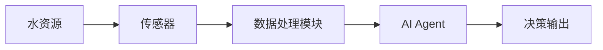
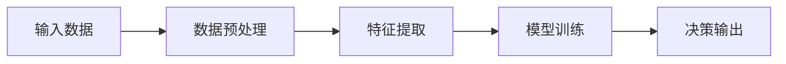
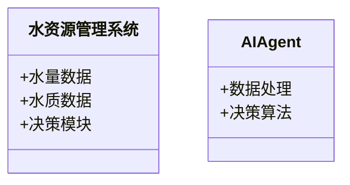

                 

# AI Agent在智能水资源管理决策中的角色

## 关键词：
- AI Agent
- 智能水资源管理
- 决策系统
- 数学模型
- 系统架构

## 摘要：
本文探讨了AI Agent在智能水资源管理中的应用，分析了其在决策过程中的关键作用，并详细阐述了算法原理、系统架构及实际案例。通过理论与实践结合，展示了AI Agent如何提升水资源管理效率。

---

## 第1章: 智能水资源管理决策的背景与挑战

### 1.1 水资源管理的现状与问题

#### 1.1.1 当前水资源管理的主要问题
水资源管理面临多重挑战：  
1. **水资源短缺**：全球多地面临水资源不足的问题。  
2. **污染严重**：工业废水、农业面源污染加剧水质问题。  
3. **管理效率低**：传统管理依赖人工，效率低下且决策滞后。  
4. **数据孤岛**：各系统间数据分散，难以协同管理。  

#### 1.1.2 水资源管理的复杂性与挑战
水资源管理涉及多方利益，需综合考虑经济、社会和环境因素。例如，如何在农业、工业和居民用水之间平衡分配，同时确保生态环境不被破坏。  

#### 1.1.3 传统水资源管理的局限性
传统方法依赖经验判断，难以应对复杂多变的环境变化和突发事件（如干旱或洪涝）。此外，数据采集和处理能力有限，难以支持精准决策。

---

### 1.2 AI Agent的基本概念与特点

#### 1.2.1 AI Agent的定义与核心要素
AI Agent是一种智能体，具备以下核心要素：  
1. **自主性**：无需外部干预，自主决策。  
2. **反应性**：能感知环境并实时响应。  
3. **目标导向**：基于目标优化决策。  
4. **学习能力**：通过数据不断优化性能。  

#### 1.2.2 AI Agent的主要类型与应用场景
AI Agent可分为**反应式**和**目标式**两类。在水资源管理中，目标式AI Agent更常用，用于优化水资源分配和预测。

#### 1.2.3 AI Agent与传统决策系统的区别
传统决策系统依赖预设规则，而AI Agent具备学习和适应能力，能处理非线性问题，提供更优解。

---

### 1.3 智能水资源管理中的AI Agent角色

#### 1.3.1 AI Agent在水资源管理中的作用
AI Agent能实时收集数据、分析并优化决策，提升水资源利用效率。  

#### 1.3.2 AI Agent如何提升水资源管理效率
通过数据驱动的优化算法，AI Agent能快速响应需求变化，减少资源浪费。  

#### 1.3.3 AI Agent在水资源管理中的潜在价值
1. **高效分配**：优化水资源分配，确保供需平衡。  
2. **风险预测**：提前预测干旱或洪涝风险，制定应急预案。  
3. **成本降低**：通过精准管理，降低运营成本。  

---

## 第2章: AI Agent与水资源管理的结合

### 2.1 AI Agent在水资源管理中的核心概念

#### 2.1.1 水资源管理的决策过程
决策过程包括数据采集、分析、预测和优化四个阶段。  

#### 2.1.2 AI Agent在决策过程中的角色
AI Agent作为决策引擎，负责数据处理、模型构建和优化输出。  

#### 2.1.3 AI Agent与水资源管理的系统性结合
AI Agent与传感器、数据库等系统协同工作，构建闭环决策系统。

---

### 2.2 AI Agent在水资源管理中的属性特征对比

#### 2.2.1 基于表格的核心概念属性对比
| 属性       | 传统方法 | AI Agent |
|------------|----------|----------|
| 数据处理   | 手动处理 | 自动化处理 |
| 决策速度   | 较慢     | 实时决策  |
| 精准度     | 较低     | 高        |

#### 2.2.2 AI Agent与水资源管理的实体关系

---

### 2.3 算法原理与数学模型

#### 2.3.1 AI Agent的核心算法流程

#### 2.3.2 数学模型与公式
目标函数：  
$$
\text{目标函数：} \quad f(x) = \argmax_{\theta} \sum_{i=1}^{n} \log p(x_i | \theta)
$$  

约束条件：  
$$
g(x) \leq 0
$$  

#### 2.3.3 举例说明
假设某地区面临水资源分配问题，AI Agent通过收集实时数据，利用上述模型进行优化，最终输出最优分配方案。

---

## 第3章: 智能水资源管理系统的架构设计

### 3.1 系统功能设计

#### 3.1.1 领域模型设计

---

## 总结

通过以上分析，AI Agent在智能水资源管理中扮演了至关重要的角色，从数据采集到决策优化，全面提升了水资源管理的效率和精准度。未来，随着技术的进步，AI Agent将在这一领域发挥更大的潜力。

---

**作者：AI天才研究院/AI Genius Institute & 禅与计算机程序设计艺术 /Zen And The Art of Computer Programming**

