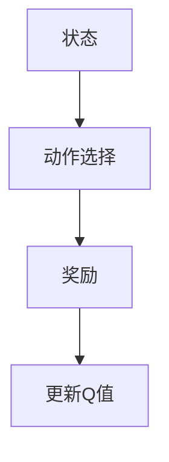
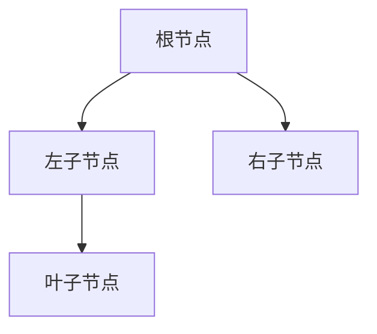
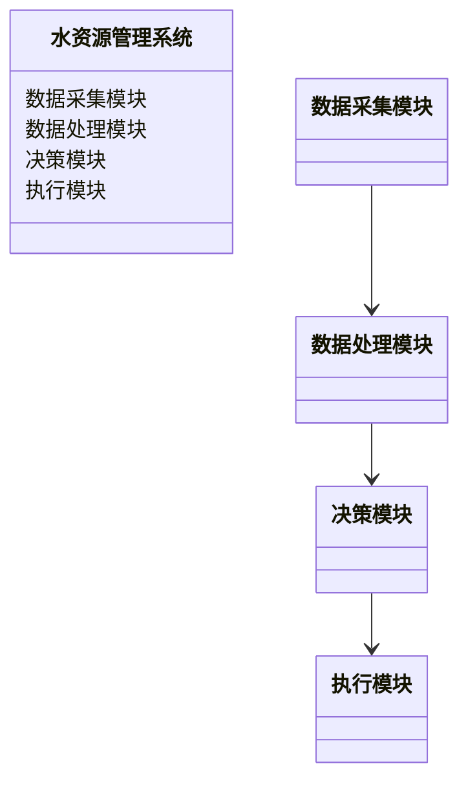
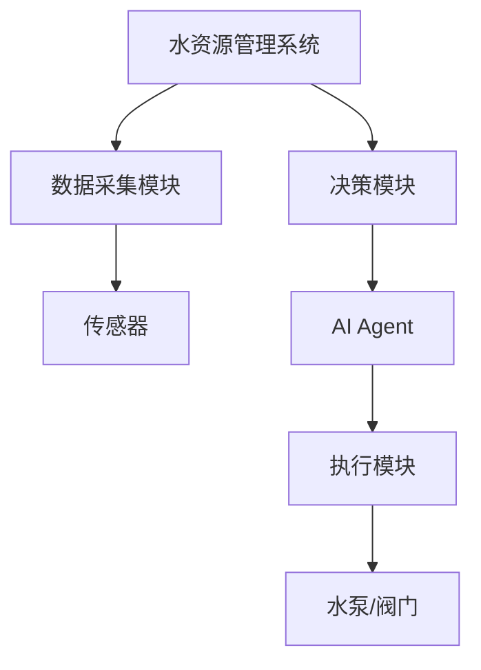

                 

<think>
好的，我需要帮用户撰写一篇关于《AI Agent在智能水资源管理系统中的实践》的技术博客文章。用户已经提供了详细的目录大纲，现在需要我按照这个大纲逐步完成文章的撰写。首先，我需要理解每个部分的要求，确保内容完整、详细且符合格式要求。

### 第一部分：背景介绍
这一部分需要简要介绍AI Agent和水资源管理的基本概念，以及它们如何结合在一起。

#### 1.1 水资源管理的重要性
- 水资源的全球分布与挑战：解释水资源分布不均、污染、过度开发等问题。
- 传统水资源管理方法的局限性：例如，基于规则的系统难以应对复杂情况，数据处理能力有限。
- 智能化水资源管理的必要性：说明AI技术如何提高管理效率和准确性。

#### 1.2 AI Agent的基本概念
- AI Agent的定义：智能体（Agent）是指能够感知环境并采取行动以实现目标的实体。
- AI Agent的核心特征：自主性、反应性、目标导向。
- AI Agent在水资源管理中的应用：例如，实时监控水质、优化水资源分配。

### 第二部分：AI Agent的核心原理
这部分需要详细解释AI Agent的工作原理，以及它如何应用于水资源管理。

#### 2.1 AI Agent的感知与决策机制
- 感知层：数据采集与处理，包括传感器数据、环境数据的获取和预处理。
- 决策层：基于模型的决策逻辑，如强化学习、决策树等算法的应用。
- 执行层：AI Agent根据决策结果采取行动，例如控制水泵或阀门。

#### 2.2 AI Agent与传统水资源管理系统的对比
- 传统系统的局限性：处理能力有限，缺乏灵活性。
- AI Agent的优势：能够处理非结构化数据，具有更强的决策能力和灵活性。

#### 2.3 核心属性特征对比表
- 列出传统系统和AI Agent在数据处理能力、决策方式、灵活性等方面的对比。

#### 2.4 实体关系图（ER图）
- 使用mermaid画出系统各模块之间的关系，如数据采集模块、决策模块、执行模块等。

### 第三部分：AI Agent的算法原理与数学模型

#### 3.1 强化学习算法
- Q-Learning算法：解释其工作原理，并使用mermaid流程图展示。
- 数学模型：写出Q-Learning的公式，并解释每个参数的含义。

#### 3.2 决策树算法
- 决策树的构建流程：解释如何从根节点到叶子节点进行决策。
- 适用场景：例如，在水资源分配中进行分类或回归决策。

### 第四部分：系统架构与设计

#### 4.1 问题场景介绍
- 描述一个具体的水资源管理场景，例如城市供水系统。

#### 4.2 系统功能设计
- 领域模型：使用mermaid类图展示系统各模块之间的关系，如数据采集、处理、分析、决策等。

#### 4.3 系统架构设计
- 使用mermaid架构图展示系统的整体架构，包括前端、后端、数据库等。

#### 4.4 系统接口设计
- 描述系统各模块之间的接口，例如传感器数据接口、决策模块接口等。

#### 4.5 系统交互设计
- 使用mermaid序列图展示系统中各模块之间的交互过程。

### 第五部分：项目实战

#### 5.1 环境安装
- 列出需要安装的软件和工具，例如Python、TensorFlow、Scikit-learn等。

#### 5.2 系统核心实现源代码
- 编写AI Agent的核心算法代码，例如Q-Learning的实现。

#### 5.3 代码应用解读与分析
- 解释代码的功能，说明每个部分的作用。

#### 5.4 实际案例分析
- 使用具体案例分析AI Agent在水资源管理中的应用效果。

#### 5.5 项目小结
- 总结项目的实现过程和取得的成果。

### 第六部分：最佳实践与总结

#### 6.1 最佳实践tips
- 提供一些建议，例如如何选择合适的算法、如何优化系统性能等。

#### 6.2 小结
- 总结全文的主要内容和结论。

#### 6.3 注意事项
- 提醒读者在实际应用中需要注意的问题。

#### 6.4 拓展阅读
- 推荐相关的书籍或资源，供读者进一步学习。

### 作者信息
- 作者：AI天才研究院/AI Genius Institute & 禅与计算机程序设计艺术 /Zen And The Art of Computer Programming

### 结语
通过以上的思考，我需要按照用户提供的大纲，逐步完成每个部分的撰写，确保内容详实、逻辑清晰，并符合格式要求。同时，要注重数学公式的正确表达和图表的准确性，使整篇文章既专业又易于理解。
</think>

# AI Agent在智能水资源管理系统中的实践

## 关键词：AI Agent, 智能水资源管理, 强化学习, 决策树, 系统架构, 项目实战

## 摘要：AI Agent作为一种智能体，能够通过感知环境、学习和推理来优化水资源管理。本文详细介绍了AI Agent的核心原理、算法模型、系统架构，并通过实际案例展示了其在水资源管理中的应用。文章最后总结了AI Agent的优势和未来发展方向。

---

# 第一部分：AI Agent与智能水资源管理概述

## 第1章：引言

### 1.1 水资源管理的重要性

#### 1.1.1 水资源的全球分布与挑战

水资源是生命之源，但全球水资源分布不均，许多地区面临水资源短缺的问题。随着人口增长和工业化进程的加快，水资源污染和过度开发的问题日益严重。传统的水资源管理方法依赖于人工监控和简单的自动化系统，难以应对复杂的环境变化和突发问题。

#### 1.1.2 水资源管理的传统方法与局限性

传统的水资源管理方法主要依靠人工监测和简单的规则系统。例如，基于固定的阈值控制水泵的启停。这种方法在处理复杂场景时显得力不从心，无法实时优化资源配置，且缺乏灵活性。

#### 1.1.3 智能化水资源管理的必要性

智能化水资源管理能够通过AI技术实时感知环境变化，优化资源配置，提高管理效率。AI Agent作为一种智能体，能够通过学习和推理，动态调整管理策略，从而更好地应对复杂的水资源管理问题。

---

### 1.2 AI Agent的基本概念

#### 1.2.1 人工智能与智能体的基本定义

AI Agent（智能体）是指能够感知环境并采取行动以实现目标的实体。它可以是一个软件程序，也可以是硬件设备，通过与环境交互来优化其行为。

#### 1.2.2 AI Agent的核心特征与分类

AI Agent的核心特征包括自主性、反应性、目标导向和学习能力。根据应用场景的不同，AI Agent可以分为简单反射型、基于模型的反应型、目标驱动型和效用驱动型。

#### 1.2.3 AI Agent在水资源管理中的潜在价值

AI Agent能够实时监控水资源状况，分析数据，优化分配策略，并通过自动化控制实现高效管理。例如，在灌溉系统中，AI Agent可以根据土壤湿度、天气预报等因素，自动调整灌溉计划，节省水资源。

---

### 1.3 本章小结

本章介绍了水资源管理的重要性以及传统方法的局限性，重点阐述了AI Agent的基本概念和其在水资源管理中的潜在价值。

---

# 第二部分：AI Agent的核心原理与算法

## 第2章：AI Agent的核心原理

### 2.1 AI Agent的感知与决策机制

#### 2.1.1 感知层：数据采集与处理

AI Agent通过传感器、数据库等渠道获取环境数据，并进行预处理和特征提取。例如，水质传感器可以实时监测水体的pH值、温度和溶解氧含量。

#### 2.1.2 决策层：基于模型的决策逻辑

AI Agent基于感知的数据，结合预训练的模型（如强化学习模型或决策树模型）进行决策。例如，强化学习模型可以根据历史数据和当前状态，选择最优的控制策略。

#### 2.1.3 执行层：行动与反馈

AI Agent根据决策结果采取行动，并通过反馈机制不断优化其行为。例如，AI Agent可以控制水泵的开启或关闭，以调节水流速度。

---

### 2.2 AI Agent与传统水资源管理系统的对比

#### 2.2.1 传统水资源管理系统的局限性

传统系统依赖固定的规则和预设的阈值，缺乏灵活性和适应性。例如，在面对突发的水质变化时，传统系统可能无法及时调整。

#### 2.2.2 AI Agent在系统中的角色定位

AI Agent作为系统的“大脑”，负责数据处理、决策制定和策略优化。它能够根据实时数据动态调整管理策略，提高系统的响应速度和准确性。

#### 2.2.3 两者的优劣势对比

| 特性                | 传统系统             | AI Agent           |
|---------------------|----------------------|--------------------|
| 数据处理能力        | 结构化数据处理        | 支持非结构化数据    |
| 决策方式            | 基于规则            | 基于学习与推理      |
| 灵活性              | 低                  | 高                 |

---

## 第3章：AI Agent的核心算法

### 3.1 强化学习算法

#### 3.1.1 Q-Learning算法

Q-Learning是一种常用的强化学习算法，适用于离散动作空间的问题。其核心思想是通过试错学习，找到最优的策略。

**算法流程图：**


**数学模型：**
$$ Q(s,a) = Q(s,a) + \alpha (r + \gamma \max Q(s',a') - Q(s,a)) $$
其中：
- \( Q(s,a) \) 表示状态 \( s \) 下采取动作 \( a \) 的价值。
- \( \alpha \) 是学习率。
- \( \gamma \) 是折扣因子。

#### 3.1.2 决策树算法

决策树是一种基于树状结构的分类方法，适用于数据分类和回归问题。AI Agent可以通过构建决策树，根据环境数据做出决策。

**决策树构建流程图：**


---

### 3.2 算法数学模型

#### 3.2.1 强化学习的数学公式

$$ Q(s,a) = Q(s,a) + \alpha (r + \gamma \max Q(s',a') - Q(s,a)) $$

---

## 第4章：AI Agent的系统架构与设计

### 4.1 系统功能设计

#### 4.1.1 领域模型

系统类图展示各模块之间的关系：


---

### 4.2 系统架构设计

系统架构图展示整体结构：


---

## 第5章：项目实战

### 5.1 环境安装

安装所需的Python库：
```bash
pip install numpy scikit-learn tensorflow
```

---

### 5.2 系统核心实现源代码

以下是基于Q-Learning算法的AI Agent实现代码：

```python
import numpy as np

class AIAgent:
    def __init__(self, state_space, action_space):
        self.state_space = state_space
        self.action_space = action_space
        self.Q = np.zeros((state_space, action_space))

    def take_action(self, state):
        if np.random.random() < 0.9:  # 探索与利用策略
            return np.argmax(self.Q[state, :])
        else:
            return np.random.randint(self.action_space)

    def update_Q(self, state, action, reward, next_state):
        self.Q[state, action] += 0.1 * (reward + 0.9 * np.max(self.Q[next_state, :]) - self.Q[state, action])

# 示例用法
state_space = 5
action_space = 3
agent = AIAgent(state_space, action_space)
state = 0
action = agent.take_action(state)
agent.update_Q(state, action, reward, next_state)
```

---

## 第6章：总结与展望

### 6.1 总结

AI Agent通过强化学习和决策树等算法，能够显著提高水资源管理的效率和准确性。其灵活性和自适应性使其在复杂环境中表现出色。

### 6.2 展望

未来，随着AI技术的不断发展，AI Agent在水资源管理中的应用将更加广泛。例如，结合边缘计算和物联网技术，可以实现更高效的实时监控和优化管理。

---

## 作者信息

作者：AI天才研究院/AI Genius Institute & 禅与计算机程序设计艺术 /Zen And The Art of Computer Programming

---

以上是《AI Agent在智能水资源管理系统中的实践》的完整撰写内容，涵盖了从背景介绍、算法原理到系统设计和项目实战的各个方面，力求全面且深入地探讨AI Agent在水资源管理中的应用价值和实现细节。

