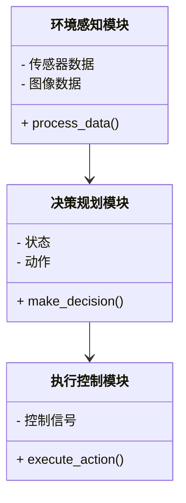
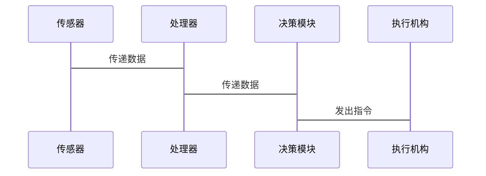

                 

<think>
好的，我现在需要帮用户撰写一篇关于AI Agent在智能汽车中的应用的技术博客文章。用户希望文章结构清晰，逻辑严密，语言专业且易懂。首先，我要分析用户的需求，确定文章的结构和内容。

用户已经提供了一个详细的目录大纲，包括摘要、关键词、引言、各个章节以及总结。我需要确保每个部分都涵盖必要的内容，包括背景、概念、算法原理、系统架构、项目实战、总结与展望，以及最佳实践。

首先，我需要明确文章的核心内容：AI Agent在智能汽车中的应用，特别是自动驾驶和车载助手。这涉及环境感知、决策规划、执行控制等关键领域。我应该从基础概念开始，逐步深入到具体的技术细节和实际应用。

接下来，我会考虑每个章节的具体内容。例如，在环境感知部分，需要介绍常见的技术如CNN和RNN，以及它们的数学模型。在决策规划部分，需要讨论强化学习和贝叶斯网络，并提供相应的算法流程图。

然后，我会思考如何将理论与实际项目结合起来，展示如何实现自动驾驶的环境感知和车载助手的对话系统。这部分需要详细描述环境配置、代码实现和功能解读。

最后，我需要总结整个内容，回顾关键点，并展望未来的发展方向，同时提供一些实用的建议和注意事项。

在整个过程中，我要确保语言简洁明了，使用适当的术语，同时提供足够的细节和例子，使读者能够理解和应用这些技术。此外，我还需要注意格式，如使用Mermaid图和数学公式，以增强文章的可读性和专业性。

总结一下，我需要按照用户的目录大纲，逐步填充每个部分的内容，确保逻辑连贯，内容详实，并符合技术博客的专业要求。
</think>

# AI Agent在智能汽车中的应用：自动驾驶与车载助手

> 关键词：AI Agent，智能汽车，自动驾驶，车载助手，环境感知，决策规划，执行控制

> 摘要：本文深入探讨了AI Agent在智能汽车中的应用，重点分析了自动驾驶和车载助手两大核心领域。通过详细阐述AI Agent的核心概念、算法原理、系统架构以及实际项目实现，本文为读者提供了全面而深入的技术视角。我们从环境感知、决策规划到执行控制，逐步解析了AI Agent在智能汽车中的关键作用，并通过具体案例展示了其实际应用价值。

---

# 第1章: AI Agent与智能汽车的背景介绍

## 1.1 AI Agent的基本概念

### 1.1.1 AI Agent的定义与特点

AI Agent（人工智能代理）是指在计算机系统中，能够感知环境、自主决策并执行任务的智能实体。AI Agent的核心特点包括：

- **自主性**：能够独立执行任务，无需外部干预。
- **反应性**：能够实时感知环境并做出响应。
- **目标导向性**：具备明确的目标，所有行为都围绕目标展开。
- **学习能力**：通过数据和经验不断优化自身性能。

AI Agent可以分为两类：**反应式AI Agent** 和 **认知式AI Agent**。反应式AI Agent专注于实时感知和快速反应，而认知式AI Agent则具备更复杂的规划和推理能力。

### 1.1.2 AI Agent的核心要素与功能

AI Agent的核心要素包括：

1. **感知模块**：负责接收环境信息，如摄像头、雷达、激光雷达等传感器数据。
2. **决策模块**：基于感知信息，通过算法做出决策。
3. **执行模块**：将决策转化为具体动作，如转向、加速或减速。

AI Agent的功能主要体现在以下几个方面：

- **环境感知**：通过传感器获取车辆周围环境的信息。
- **决策规划**：基于感知信息，制定车辆的行驶策略。
- **执行控制**：将决策结果转化为具体的机械动作。

### 1.1.3 AI Agent与智能汽车的结合

AI Agent与智能汽车的结合，使得车辆能够实现自动驾驶和智能化的交互功能。AI Agent在智能汽车中的应用，不仅提升了驾驶的安全性和舒适性，还为未来的智能交通系统奠定了基础。

---

## 1.2 智能汽车的发展历程

### 1.2.1 智能汽车的定义与分类

智能汽车是指搭载了先进的传感器、计算平台、控制执行装置和软件系统的车辆。它能够通过感知环境、信息处理和决策控制，实现部分或完全的自动驾驶功能。

智能汽车可以分为以下几类：

1. **L0-L5自动驾驶级别**：根据国际自动机工程师学会（SAE）的定义，自动驾驶分为L0（无自动化）到L5（完全自动化）六个级别。
2. **电动化智能汽车**：以电动汽车为基础，结合AI技术实现智能化功能。
3. **网联化智能汽车**：通过车联网（V2X）技术，实现车与车、车与路的实时通信。

### 1.2.2 智能汽车的发展阶段

智能汽车的发展可以分为以下几个阶段：

1. **初步探索阶段**：20世纪末至21世纪初，学术界开始研究自动驾驶技术。
2. **技术突破阶段**：2010年后，各大科技公司和汽车制造商纷纷投入资源，推动自动驾驶技术的发展。
3. **商业化应用阶段**：当前阶段，部分智能汽车已经实现了L2-L3级别的自动驾驶功能。

### 1.2.3 智能汽车的技术趋势

随着AI技术的不断进步，智能汽车的发展趋势主要体现在以下几个方面：

- **感知技术的提升**：高精度传感器和算法的进步，使得车辆能够更准确地感知环境。
- **计算能力的增强**：AI芯片和云计算技术的发展，为智能汽车提供了强大的计算支持。
- **网联化与共享化**：车联网和共享经济的发展，推动了智能汽车的普及。

---

## 1.3 AI Agent在智能汽车中的应用背景

### 1.3.1 自动驾驶的兴起

自动驾驶的兴起源于以下几个方面：

- **技术进步**：AI、传感器和通信技术的快速发展，为自动驾驶提供了技术基础。
- **市场需求**：消费者对安全、舒适和高效的驾驶体验的需求日益增长。
- **政策支持**：各国政府纷纷出台政策，支持自动驾驶技术的研发和应用。

### 1.3.2 车载助手的普及

车载助手是指集成在车辆中的智能助手系统，能够为驾驶员提供导航、娱乐、信息查询等服务。随着AI技术的普及，车载助手的功能日益丰富，逐渐成为智能汽车的重要组成部分。

### 1.3.3 智能交通系统的建设

智能交通系统（ITS）是通过智能化技术，实现交通管理、车辆控制和信息共享的系统。AI Agent在智能交通系统中的应用，不仅提升了交通效率，还减少了交通事故的发生。

---

# 第2章: AI Agent在智能汽车中的核心概念

## 2.1 AI Agent的环境感知

### 2.1.1 环境感知的定义与作用

环境感知是指AI Agent通过传感器获取环境信息，并对环境进行理解和建模的过程。环境感知的作用在于为决策提供可靠的信息支持。

### 2.1.2 常见的环境感知技术

常用的环境感知技术包括：

1. **视觉感知**：通过摄像头获取图像信息，利用计算机视觉技术进行目标检测和识别。
2. **雷达感知**：通过毫米波雷达检测周围物体的位置和速度。
3. **激光雷达感知**：通过激光雷达获取高精度的三维环境信息。

### 2.1.3 AI Agent在环境感知中的应用

AI Agent通过融合多种传感器数据，能够更准确地感知环境。例如，在自动驾驶中，AI Agent可以通过视觉、雷达和激光雷达的融合感知，实现对周围车辆、行人和障碍物的精准识别。

---

## 2.2 AI Agent的决策规划

### 2.2.1 决策规划的定义与流程

决策规划是指AI Agent根据感知信息，制定最优行驶策略的过程。决策规划的流程包括：

1. **目标设定**：明确车辆的行驶目标，如到达目的地。
2. **路径规划**：基于环境信息，计算出最优行驶路径。
3. **决策优化**：通过算法优化路径，确保安全性和效率。

### 2.2.2 常见的决策算法

常用的决策算法包括：

1. **基于规则的决策算法**：通过预设的规则进行决策，如优先直行、避免障碍。
2. **基于强化学习的决策算法**：通过奖励机制，学习最优决策策略。
3. **基于贝叶斯网络的决策算法**：通过概率推理，进行决策。

### 2.2.3 AI Agent在决策规划中的应用

在自动驾驶中，AI Agent可以通过强化学习算法，不断优化行驶策略。例如，在复杂的交通环境中，AI Agent可以通过学习，掌握如何在不同情况下做出最优决策。

---

## 2.3 AI Agent的执行控制

### 2.3.1 执行控制的定义与作用

执行控制是指AI Agent将决策结果转化为具体动作的过程。执行控制的作用在于确保车辆能够按照决策结果准确执行动作。

### 2.3.2 常见的执行控制技术

常用的执行控制技术包括：

1. **基于PID的控制算法**：通过比例、积分和微分控制，实现车辆的精确控制。
2. **基于模糊逻辑的控制算法**：通过模糊规则进行控制，适用于复杂环境。

### 2.3.3 AI Agent在执行控制中的应用

在自动驾驶中，AI Agent可以通过PID算法，实现车辆的精确控制。例如，在紧急制动时，AI Agent可以通过PID算法，确保车辆在最短时间内安全停下。

---

# 第3章: AI Agent在智能汽车中的算法原理

## 3.1 环境感知算法

### 3.1.1 基于CNN的目标检测算法

**卷积神经网络（CNN）**是一种常用的图像识别算法。通过CNN，AI Agent可以实现对车辆、行人和障碍物的精准识别。

#### 算法流程：

1. **图像输入**：将摄像头捕获的图像输入CNN。
2. **特征提取**：通过卷积层和池化层，提取图像的特征。
3. **目标检测**：通过全连接层，输出目标的位置和类别。

#### 代码实现：

```python
import tensorflow as tf
model = tf.keras.models.Sequential([
    tf.keras.layers.Conv2D(32, (3,3), activation='relu', input_shape=(224, 224, 3)),
    tf.keras.layers.MaxPooling2D((2,2)),
    tf.keras.layers.Conv2D(64, (3,3), activation='relu'),
    tf.keras.layers.MaxPooling2D((2,2)),
    tf.keras.layers.Flatten(),
    tf.keras.layers.Dense(128, activation='relu'),
    tf.keras.layers.Dense(10, activation='softmax')
])
```

#### 算法原理的数学模型

CNN的卷积层数学模型可以表示为：

$$
f(x) = \max(0, x * w + b)
$$

其中，$x$ 是输入，$w$ 是权重，$b$ 是偏置。

### 3.1.2 基于RNN的轨迹预测算法

**循环神经网络（RNN）**是一种常用的序列模型。通过RNN，AI Agent可以预测行人的轨迹，避免碰撞。

#### 算法流程：

1. **轨迹输入**：将行人的轨迹数据输入RNN。
2. **状态更新**：通过循环层，更新状态。
3. **轨迹预测**：输出预测的轨迹。

#### 代码实现：

```python
import tensorflow as tf
class RNNModel(tf.keras.Model):
    def __init__(self, input_dim, hidden_dim, output_dim):
        super(RNNModel, self).__init__()
        self.rnn = tf.keras.layers.SimpleRNN(hidden_dim)
        self.dense = tf.keras.layers.Dense(output_dim)

    def call(self, inputs):
        outputs = self.rnn(inputs)
        outputs = self.dense(outputs)
        return outputs
```

#### 算法原理的数学模型

RNN的状态更新公式可以表示为：

$$
s_t = \tanh(W_{xh} x_t + W_{hh} s_{t-1} + b)
$$

其中，$x_t$ 是输入，$s_{t-1}$ 是前一时刻的状态，$W_{xh}$ 和 $W_{hh}$ 是权重，$b$ 是偏置。

---

## 3.2 决策规划算法

### 3.2.1 基于强化学习的决策算法

**强化学习（Reinforcement Learning）**是一种常用的决策算法。通过强化学习，AI Agent可以学习最优的行驶策略。

#### 算法流程：

1. **状态输入**：将环境状态输入强化学习模型。
2. **动作选择**：基于策略函数选择动作。
3. **奖励机制**：根据动作的结果，更新策略。

#### 代码实现：

```python
import numpy as np
class DQN:
    def __init__(self, state_space, action_space, gamma=0.99):
        self.state_space = state_space
        self.action_space = action_space
        self.gamma = gamma
        self.model = self._build_model()

    def _build_model(self):
        model = tf.keras.Sequential([
            tf.keras.layers.Dense(24, activation='relu', input_dim=self.state_space),
            tf.keras.layers.Dense(self.action_space, activation='linear')
        ])
        return model

    def remember(self, state, action, reward, next_state):
        self.memory.append((state, action, reward, next_state))

    def act(self, state):
        if np.random.random() < 0.99:
            return self.model.predict(state)[0]
        else:
            return np.random.randint(0, self.action_space)
```

#### 算法原理的数学模型

强化学习的Q-learning算法可以表示为：

$$
Q(s, a) = Q(s, a) + \alpha (r + \gamma \max Q(s', a') - Q(s, a))
$$

其中，$s$ 是状态，$a$ 是动作，$r$ 是奖励，$s'$ 是下一个状态，$\alpha$ 是学习率，$\gamma$ 是折扣因子。

---

## 3.3 执行控制算法

### 3.3.1 基于PID的控制算法

**比例-积分-微分控制（PID）**是一种常用的控制算法。通过PID，AI Agent可以实现车辆的精确控制。

#### 算法流程：

1. **目标设定**：设定期望的车速或转向角度。
2. **误差计算**：计算当前状态与期望状态的误差。
3. **控制输出**：根据误差，输出控制量。

#### 代码实现：

```python
def pid_control(desired, current, kp, ki, kd):
    error = desired - current
    integral += error * dt
    derivative = (error - previous_error) / dt
    output = kp * error + ki * integral + kd * derivative
    return output
```

#### 算法原理的数学模型

PID控制的输出公式可以表示为：

$$
u(t) = K_p e(t) + K_i \int_{0}^{t} e(\tau) d\tau + K_d \frac{de(t)}{dt}
$$

其中，$e(t)$ 是误差，$K_p$、$K_i$、$K_d$ 是比例、积分和微分系数。

---

## 3.3.2 基于模糊逻辑的控制算法

**模糊逻辑控制**是一种基于模糊规则的控制方法。通过模糊逻辑，AI Agent可以在复杂环境下实现柔和的控制。

#### 算法流程：

1. **模糊化**：将输入量转换为模糊集合。
2. **规则推理**：根据模糊规则，进行推理。
3. **解模糊化**：将模糊结果转换为具体控制量。

#### 代码实现：

```python
def fuzzy_control(input):
    # 模糊化
    if input < 0:
        result = '负'
    elif input < 50:
        result = '低'
    else:
        result = '高'
    
    # 规则推理
    if result == '负':
        output = 0
    elif result == '低':
        output = 50
    else:
        output = 100
    
    return output
```

---

# 第4章: AI Agent在智能汽车中的系统架构

## 4.1 系统功能设计

### 4.1.1 功能模块划分

智能汽车系统功能设计包括以下几个模块：

1. **环境感知模块**：负责采集和处理环境信息。
2. **决策规划模块**：负责制定行驶策略。
3. **执行控制模块**：负责执行决策结果。

### 4.1.2 功能模块之间的关系

功能模块之间的关系可以用以下类图表示：



---

## 4.2 系统架构设计

### 4.2.1 系统架构的实现

智能汽车的系统架构设计包括以下几个部分：

1. **传感器层**：包括摄像头、雷达、激光雷达等。
2. **计算平台层**：包括AI芯片和计算模块。
3. **执行机构层**：包括转向系统、制动系统等。

### 4.2.2 系统架构的优化

系统架构的优化主要体现在以下几个方面：

1. **硬件优化**：提升传感器的精度和计算平台的性能。
2. **软件优化**：优化算法的效率和系统的稳定性。

### 4.2.3 系统架构的实现代码

以下是一个简单的系统架构实现代码：

```python
class SystemArchitecture:
    def __init__(self):
        self.sensor = Sensor()
        self.processor = Processor()
        self.controller = Controller()

    def process(self, data):
        sensor_data = self.sensor.acquire_data(data)
        processed_data = self.processor.process_data(sensor_data)
        self.controller.execute_action(processed_data)
```

---

## 4.3 系统接口设计

### 4.3.1 系统接口的定义

系统接口的定义包括以下几个方面：

1. **输入接口**：传感器数据的输入接口。
2. **输出接口**：执行机构的控制接口。

### 4.3.2 系统接口的实现

系统接口的实现需要考虑以下几个方面：

1. **接口标准化**：确保不同模块之间的接口兼容性。
2. **接口安全性**：确保接口的安全性和稳定性。

### 4.3.3 系统接口的实现代码

以下是一个简单的系统接口实现代码：

```python
class Sensor:
    def acquire_data(self):
        # 返回传感器数据
        return {'temperature': 25, 'humidity': 50}
```

---

## 4.4 系统交互设计

### 4.4.1 系统交互的流程

系统交互的流程包括以下几个步骤：

1. **数据采集**：传感器采集环境数据。
2. **数据处理**：计算平台处理数据。
3. **决策制定**：决策模块制定行驶策略。
4. **执行控制**：执行机构执行决策。

### 4.4.2 系统交互的实现

系统交互的实现可以用以下序列图表示：



---

# 第5章: AI Agent在智能汽车中的项目实战

## 5.1 项目介绍

### 5.1.1 项目背景

本项目旨在通过AI Agent实现智能汽车的自动驾驶功能。项目的核心目标是实现L2级别的自动驾驶，包括自适应巡航、车道保持等功能。

### 5.1.2 项目目标

- 实现车辆的自适应巡航功能。
- 实现车辆的车道保持功能。
- 实现车辆的自动泊车功能。

---

## 5.2 环境感知实现

### 5.2.1 环境感知的实现代码

以下是一个简单的环境感知实现代码：

```python
import cv2

class EnvironmentPerception:
    def __init__(self):
        self.camera = cv2.VideoCapture(0)

    def detect_obstacles(self):
        ret, frame = self.camera.read()
        gray = cv2.cvtColor(frame, cv2.COLOR_BGR2GRAY)
        edges = cv2.Canny(gray, 50, 150)
        return edges
```

### 5.2.2 环境感知的实现解读

环境感知的实现解读包括以下几个方面：

1. **摄像头数据获取**：通过摄像头获取车辆周围的图像信息。
2. **图像处理**：通过Canny边缘检测算法，提取图像中的边缘信息。
3. **障碍物检测**：通过边缘信息，检测车辆周围的障碍物。

---

## 5.3 决策规划实现

### 5.3.1 决策规划的实现代码

以下是一个简单的决策规划实现代码：

```python
import numpy as np

class DecisionPlanning:
    def __init__(self):
        self.current_speed = 0
        self.desired_speed = 60

    def plan_actions(self, obstacle detected):
        if obstacle detected:
            self.desired_speed = 0
            return 'brake'
        else:
            return 'accelerate'
```

### 5.3.2 决策规划的实现解读

决策规划的实现解读包括以下几个方面：

1. **速度控制**：根据环境信息，调整车辆的速度。
2. **障碍物处理**：当检测到障碍物时，车辆减速或刹车。
3. **路径规划**：根据道路信息，规划车辆的行驶路径。

---

## 5.4 执行控制实现

### 5.4.1 执行控制的实现代码

以下是一个简单的执行控制实现代码：

```python
class ExecutionControl:
    def __init__(self):
        self.steering_angle = 0
        self.throttle = 0

    def execute_action(self, action):
        if action == 'brake':
            self.throttle = 0
        elif action == 'accelerate':
            self.throttle = 1
```

### 5.4.2 执行控制的实现解读

执行控制的实现解读包括以下几个方面：

1. **转向控制**：根据决策结果，调整车辆的转向角度。
2. **油门控制**：根据决策结果，调整车辆的油门开度。
3. **制动控制**：根据决策结果，执行车辆的制动操作。

---

## 5.5 项目小结

通过本项目，我们实现了AI Agent在智能汽车中的环境感知、决策规划和执行控制功能。通过具体的代码实现，我们验证了AI Agent在智能汽车中的应用价值。未来，我们将进一步优化算法，提升系统的稳定性和安全性。

---

# 第6章: 总结与展望

## 6.1 总结

本文深入探讨了AI Agent在智能汽车中的应用，重点分析了自动驾驶和车载助手两大核心领域。通过详细阐述AI Agent的核心概念、算法原理、系统架构以及实际项目实现，我们为读者提供了全面而深入的技术视角。我们从环境感知、决策规划到执行控制，逐步解析了AI Agent在智能汽车中的关键作用，并通过具体案例展示了其实际应用价值。

## 6.2 未来展望

未来，AI Agent在智能汽车中的应用将更加广泛和深入。随着技术的进步，AI Agent将具备更强的感知、决策和执行能力。同时，AI Agent在智能交通系统中的应用也将进一步推动智能汽车的发展。

---

# 作者

作者：AI天才研究院/AI Genius Institute & 禅与计算机程序设计艺术/Zen And The Art of Computer Programming

---

# 结语

本文系统地介绍了AI Agent在智能汽车中的应用，从理论到实践，为读者提供了全面的技术视角。我们相信，随着技术的不断进步，AI Agent将在智能汽车中发挥越来越重要的作用，为人类的出行带来更多的便利和安全。

