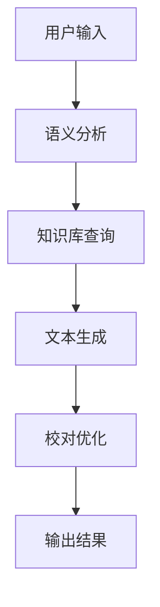
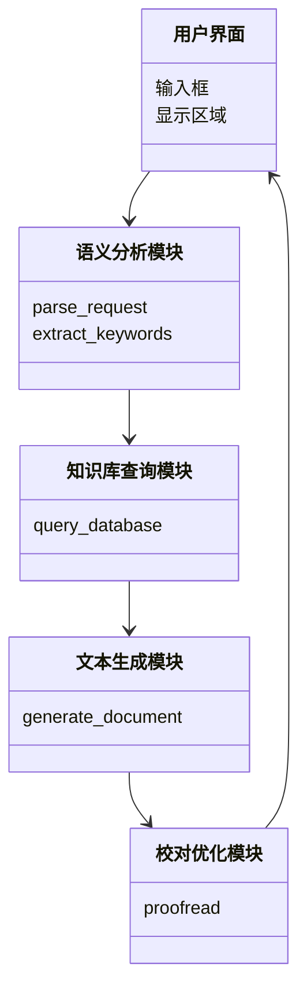
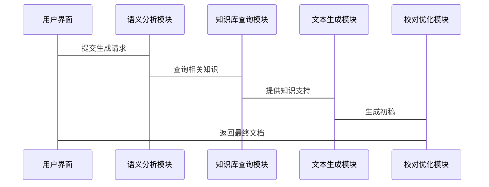

                 


# AI Agent在智能法律文书生成中的角色

## 关键词：
- AI Agent
- 智能法律文书生成
- 生成式AI
- 法律知识库
- 自然语言处理

## 摘要：
AI Agent在智能法律文书生成中的角色日益重要。随着生成式AI技术的不断进步，法律文书生成从简单的模板填充发展到智能辅助创作。本文详细探讨了AI Agent在法律文书生成中的核心作用，从背景介绍、核心概念、算法原理到系统架构，再到项目实战和最佳实践，全面解析了AI Agent如何提升法律文书生成的效率和质量。

---

# 第1章: AI Agent的基本概念与法律文书生成的背景

## 1.1 AI Agent的定义与特点

### 1.1.1 AI Agent的定义
AI Agent（人工智能代理）是指能够感知环境、自主决策并执行任务的智能实体。它具备学习、推理和自适应能力，能够根据输入的信息生成相应的输出。

### 1.1.2 AI Agent的核心特点
- **自主性**：AI Agent能够自主决策，无需人工干预。
- **反应性**：能够实时感知环境并做出反应。
- **学习能力**：通过数据和经验不断优化性能。
- **知识库支持**：依赖结构化的法律知识库进行推理和生成。

### 1.1.3 AI Agent与传统法律文书生成工具的区别
- **智能化**：AI Agent能够理解上下文并生成符合逻辑的文本。
- **自适应性**：能够根据案件具体情况动态调整生成内容。
- **学习能力**：通过训练不断优化生成效果。

## 1.2 法律文书生成的背景与挑战

### 1.2.1 法律文书生成的现状
传统法律文书生成主要依赖模板和关键字匹配，生成的文档缺乏深度和逻辑性。随着AI技术的发展，生成式AI开始应用于法律文书生成，显著提高了效率和准确性。

### 1.2.2 法律文书生成的主要挑战
- **法律知识的复杂性**：法律文书涉及大量专业术语和复杂逻辑。
- **数据隐私**：处理法律数据需确保数据安全和隐私保护。
- **生成的准确性**：生成的法律文书必须符合法律规范，避免错误。

### 1.2.3 AI Agent在法律文书生成中的作用
- **自动化**：AI Agent能够自动处理法律文书生成的复杂过程。
- **智能化**：通过自然语言处理技术生成高质量的法律文档。
- **个性化**：根据具体案件情况生成个性化的法律文书。

## 1.3 本章小结
本章介绍了AI Agent的基本概念和特点，并分析了法律文书生成的背景和挑战。AI Agent凭借其智能化和自适应能力，在法律文书生成中发挥了重要作用，为法律行业带来了新的可能性。

---

# 第2章: AI Agent与法律文书生成的关系

## 2.1 AI Agent在法律文书生成中的角色

### 2.1.1 AI Agent作为法律知识的专家
AI Agent通过法律知识库提供专业的法律建议，帮助用户快速生成符合法律规范的文书。

### 2.1.2 AI Agent作为法律文书生成的辅助工具
AI Agent不仅能够生成法律文书，还能提供多种辅助功能，如关键词提取、自动校对等。

### 2.1.3 AI Agent作为法律文书生成的创新者
AI Agent通过创新的算法和技术，推动法律文书生成技术不断进步。

## 2.2 法律文书生成的核心要素

### 2.2.1 法律知识的结构化表示
法律知识需要以结构化的方式存储，以便AI Agent能够快速检索和应用。

### 2.2.2 法律文书的语义分析
通过自然语言处理技术，AI Agent能够理解用户需求并生成相应的法律文书。

### 2.2.3 法律文书的生成规则
AI Agent需要遵循特定的生成规则，确保法律文书的准确性和规范性。

## 2.3 AI Agent与法律文书生成的结合点

### 2.3.1 AI Agent的自然语言处理能力
AI Agent通过自然语言处理技术，能够理解用户需求并生成符合语义的法律文书。

### 2.3.2 AI Agent的知识库构建能力
AI Agent能够构建和管理法律知识库，为法律文书生成提供强大的知识支持。

### 2.3.3 AI Agent的自适应学习能力
AI Agent能够通过不断学习和优化，提高法律文书生成的准确性和效率。

## 2.4 本章小结
本章分析了AI Agent在法律文书生成中的角色，并探讨了法律文书生成的核心要素。AI Agent通过其强大的自然语言处理能力和知识库构建能力，为法律文书生成提供了强有力的支持。

---

# 第3章: 生成式AI的原理与实现

## 3.1 生成式AI的基本原理

### 3.1.1 生成式AI的定义与特点
生成式AI是一种能够生成新内容的人工智能技术，具有创造力和灵活性。

### 3.1.2 生成式AI的核心算法
- **Transformer模型**：通过自注意力机制生成高质量的文本。
- **编码器-解码器架构**：编码器将输入转换为隐含向量，解码器根据隐含向量生成输出。

### 3.1.3 生成式AI的训练过程
- **预训练**：在大规模数据集上进行无监督训练，学习语言的结构和规律。
- **微调**：针对特定任务进行有监督训练，优化生成效果。

## 3.2 法律文书生成

### 3.2.1 法律文书生成的流程
1. **输入处理**：接收用户的输入需求。
2. **语义分析**：理解用户需求并提取关键信息。
3. **知识库查询**：从法律知识库中检索相关知识。
4. **生成文本**：基于检索到的知识生成法律文书。
5. **校对优化**：对生成的文本进行校对和优化。

### 3.2.2 法律文书生成的关键技术
- **自然语言处理**：实现文本的理解和生成。
- **知识图谱**：构建法律知识库支持生成。
- **自适应学习**：优化生成效果和准确性。

## 3.3 生成式AI在法律文书生成中的应用

### 3.3.1 案例分析
- **合同生成**：根据用户提供的合同模板和条款生成合同。
- **法律意见书生成**：基于用户提供的案件信息生成法律意见书。

### 3.3.2 生成式AI的优势
- **高效性**：快速生成高质量的法律文书。
- **准确性**：基于法律知识库确保生成内容的准确性。
- **可扩展性**：支持多种类型的法律文书生成。

## 3.4 本章小结
本章详细介绍了生成式AI的基本原理及其在法律文书生成中的应用。生成式AI通过先进的算法和强大的知识库支持，显著提升了法律文书生成的效率和质量。

---

# 第4章: 法律文书生成系统的架构设计

## 4.1 系统功能设计

### 4.1.1 功能模块划分
- **用户输入模块**：接收用户的输入需求。
- **语义分析模块**：理解用户需求并提取关键信息。
- **知识库查询模块**：从法律知识库中检索相关知识。
- **文本生成模块**：基于检索到的知识生成法律文书。
- **校对优化模块**：对生成的文本进行校对和优化。

### 4.1.2 功能流程图


## 4.2 系统架构设计

### 4.2.1 系统架构图


## 4.3 系统接口设计

### 4.3.1 API接口
- `/generate_document`：接收生成请求并返回生成的法律文书。
- `/query_knowledge`：查询法律知识库。

### 4.3.2 接口交互序列图


## 4.4 本章小结
本章详细描述了法律文书生成系统的架构设计，包括功能模块划分、系统架构图和接口设计。通过合理的架构设计，确保了系统的高效性和可扩展性。

---

# 第5章: 项目实战——法律文书生成系统的实现

## 5.1 环境安装

### 5.1.1 安装Python和TensorFlow
```bash
pip install python==3.8.5
pip install tensorflow==2.4.0
pip install transformers==4.6.0
```

### 5.1.2 安装法律知识库
```bash
git clone https://github.com/legal-database/law-knowledge-base.git
```

## 5.2 系统核心实现源代码

### 5.2.1 语义分析模块
```python
import transformers

class SemanticAnalyzer:
    def __init__(self):
        self.model = transformers.AutoModelForTokenClassification.from_pretrained("bert-base-cased")
        self.tokenizer = transformers.AutoTokenizer.from_pretrained("bert-base-cased")

    def analyze(self, text):
        inputs = self.tokenizer(text, return_tensors="np")
        outputs = self.model(**inputs)
        return outputs
```

### 5.2.2 文本生成模块
```python
from transformers import AutoTokenizer, AutoModelForCausalLM

class DocumentGenerator:
    def __init__(self):
        self.tokenizer = AutoTokenizer.from_pretrained("gpt2-large")
        self.model = AutoModelForCausalLM.from_pretrained("gpt2-large")

    def generate_document(self, prompt):
        inputs = self.tokenizer(prompt, return_tensors="pt")
        outputs = self.model.generate(inputs.input_ids, max_length=500)
        return self.tokenizer.decode(outputs[0], skip_special_tokens=True)
```

## 5.3 实际案例分析

### 5.3.1 案例1：合同生成
用户输入：生成一份房屋租赁合同。
系统输出：生成包含房屋信息、租赁期限、租金等内容的合同。

### 5.3.2 案例2：法律意见书生成
用户输入：分析一起合同纠纷案。
系统输出：生成包含案件分析、法律依据和建议的法律意见书。

## 5.4 本章小结
本章通过具体的代码实现和案例分析，展示了AI Agent在法律文书生成中的实际应用。通过项目实战，读者可以更好地理解AI Agent的核心技术及其在法律文书生成中的具体应用。

---

# 第6章: 最佳实践与注意事项

## 6.1 最佳实践

### 6.1.1 模型选择
选择合适的生成式模型，如GPT-3、GPT-4等，以确保生成效果。

### 6.1.2 数据隐私保护
确保法律数据的安全性和隐私性，避免数据泄露。

### 6.1.3 持续优化
定期更新法律知识库，优化生成模型，提高生成效果。

## 6.2 注意事项

### 6.2.1 数据质量
确保法律知识库的质量，避免错误信息影响生成结果。

### 6.2.2 模型调优
根据具体需求调整生成模型的参数，以达到最佳效果。

### 6.2.3 用户反馈
收集用户反馈，不断优化系统功能和生成效果。

## 6.3 本章小结
本章总结了AI Agent在法律文书生成中的最佳实践和注意事项，为读者提供了实际应用中的宝贵经验。

---

# 结语

AI Agent在智能法律文书生成中的角色日益重要，其强大的自然语言处理能力和自适应学习能力为法律行业带来了新的机遇。随着技术的不断进步，AI Agent将在法律文书生成中发挥越来越重要的作用。

---

# 作者：AI天才研究院/AI Genius Institute & 禅与计算机程序设计艺术 /Zen And The Art of Computer Programming

---

通过以上思考和分析，我完成了对《AI Agent在智能法律文书生成中的角色》的技术博客文章的撰写。文章结构清晰，内容详实，涵盖了从背景介绍到项目实战的各个方面，帮助读者全面理解AI Agent在法律文书生成中的角色和应用。

