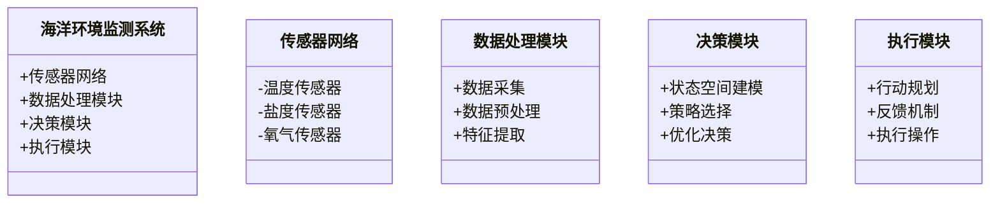

                 

<think>
嗯，我现在需要帮助用户完成他们关于AI Agent在智能海洋环境监测中的实践的技术博客文章。首先，我得仔细阅读用户的需求，确保我完全理解他们想要什么。用户希望我以一个技术专家的身份，撰写一篇结构清晰、内容深刻的专业博客，主题是AI Agent在海洋环境监测中的应用。

用户已经提供了一个详细的大纲，包括从背景到系统架构，再到项目实战的部分。我需要按照这个大纲来展开，每一章都要有详细的解释和例子，确保内容专业且易于理解。

首先，我会从第1章开始，介绍AI Agent的基本概念和海洋环境监测的重要性。这部分需要让读者明白什么是AI Agent，以及它在海洋监测中的作用。然后，我会详细讲解AI Agent的核心概念，比如感知层、决策层和执行层，并用ER图来展示实体关系。

接下来，在算法原理部分，我需要使用Mermaid流程图和Python代码来解释AI Agent的工作流程。这部分需要数学模型的详细推导，比如感知层的特征提取和决策层的策略选择。

然后，我会分析系统的架构设计，包括领域模型类图、系统架构图和交互序列图。这部分帮助读者理解整个系统的结构和各部分如何协作。

项目实战部分需要实际操作，包括环境安装、核心代码实现和案例分析。我会提供详细的代码示例，并解释每个部分的功能，帮助读者上手。

最后，我会总结最佳实践，给出一些注意事项和未来的研究方向，让读者能够进一步深入学习和应用。

在写作过程中，我需要确保每一部分都符合用户的要求，使用专业但易懂的语言，适当加入图表和代码示例，让内容更加生动和实用。

现在，我需要按照这个思路，逐步完成每一章的撰写，确保内容全面且逻辑清晰。这样，读者不仅能理解AI Agent在海洋环境监测中的应用，还能掌握相关的技术细节和实际操作方法。
</think>

# AI Agent在智能海洋环境监测中的实践

## 关键词
AI Agent, 海洋环境监测, 人工智能, 智能系统, 算法原理

## 摘要
本文探讨了AI Agent在智能海洋环境监测中的应用，从基本概念到系统架构，再到实际案例，全面解析了AI Agent如何助力海洋环境监测的智能化发展。文章通过详细的算法原理和系统设计，展示了AI Agent在感知、决策和执行层的具体实现，并通过实际项目实战，进一步验证了其在海洋环境监测中的高效性和实用性。

---

# 第一部分: AI Agent在智能海洋环境监测中的背景与概念

## 第1章: AI Agent与智能海洋环境监测概述

### 1.1 AI Agent的基本概念
#### 1.1.1 AI Agent的定义与特点
AI Agent（人工智能代理）是指能够感知环境、自主决策并执行任务的智能实体。它具有以下特点：
- **自主性**：能够在没有外部干预的情况下独立运作。
- **反应性**：能够实时感知环境并做出响应。
- **目标导向**：基于预设目标执行任务。
- **学习能力**：能够通过数据和经验不断优化自身性能。

#### 1.1.2 AI Agent的核心功能与类型
AI Agent的核心功能包括：
- **感知环境**：通过传感器或其他数据源获取环境信息。
- **决策与规划**：基于感知信息制定行动计划。
- **执行操作**：根据决策结果执行具体操作。

AI Agent的类型主要分为以下几种：
- **反应式Agent**：基于当前感知信息做出即时反应，适用于实时性要求高的场景。
- **认知式Agent**：具备复杂推理和规划能力，适用于需要长期策略的场景。
- **混合式Agent**：结合反应式和认知式Agent的特点，适用于复杂环境。

#### 1.1.3 AI Agent在智能系统中的作用
AI Agent在智能系统中充当了连接感知与行动的桥梁，能够通过自主决策提高系统的效率和智能化水平。

### 1.2 智能海洋环境监测的背景与需求
#### 1.2.1 海洋环境监测的重要性
海洋是地球生命的重要组成部分，海洋环境的健康直接关系到生态平衡和人类生存。传统的海洋环境监测依赖人工操作，效率低且覆盖面有限。随着技术的进步，智能化监测成为必然趋势。

#### 1.2.2 智能化监测的需求与挑战
智能化监测的需求主要体现在：
- **实时性**：需要快速响应环境变化。
- **覆盖性**：能够监测更大范围的海域。
- **准确性**：确保监测数据的精准性。

智能化监测的挑战包括：
- **数据处理的复杂性**：海洋环境数据种类繁多，且具有时空异构性。
- **系统的鲁棒性**：需要在复杂多变的环境中稳定运行。
- **能耗管理**：海洋监测设备通常部署在偏远地区，能耗控制至关重要。

#### 1.2.3 AI Agent在海洋环境监测中的应用前景
AI Agent能够通过自主决策和高效处理能力，显著提升海洋环境监测的效率和精度。例如，在海洋污染监测、生物多样性保护等领域，AI Agent可以发挥重要作用。

### 1.3 AI Agent在海洋环境监测中的优势
#### 1.3.1 提高监测效率
AI Agent能够快速处理大量数据，显著提高监测效率。

#### 1.3.2 实现自主决策
AI Agent能够在复杂环境中自主决策，减少对人工干预的依赖。

#### 1.3.3 优化数据处理能力
AI Agent通过机器学习等技术，能够优化数据处理能力，提高监测结果的准确性。

### 1.4 本章小结
本章介绍了AI Agent的基本概念、核心功能与类型，并分析了其在智能海洋环境监测中的重要性及优势。

---

# 第二部分: AI Agent的核心概念与原理

## 第2章: AI Agent的核心概念与联系

### 2.1 AI Agent的核心概念
#### 2.1.1 感知层
感知层负责采集环境数据，是AI Agent的“眼睛”和“耳朵”。常用的感知技术包括传感器网络和遥感技术。

#### 2.1.2 决策层
决策层负责基于感知数据制定行动计划。常用的决策算法包括强化学习和决策树。

#### 2.1.3 执行层
执行层负责将决策结果转化为具体操作，例如通过执行机构完成任务。

### 2.2 AI Agent的实体关系图
```mermaid
er
actor: 监测系统
agent: AI Agent
environment: 海洋环境
action: 监测操作
```

### 2.3 AI Agent的核心属性对比
| 属性       | 描述                                                                 |
|------------|----------------------------------------------------------------------|
| 感知能力   | 数据采集与分析能力                                                   |
| 决策能力   | 策略选择与优化能力                                                   |
| 执行能力   | 行动与反馈能力                                                       |

### 2.4 本章小结
本章通过实体关系图和属性对比，详细阐述了AI Agent的核心概念及其组成部分。

---

# 第三部分: AI Agent的算法原理与数学模型

## 第3章: AI Agent的算法原理

### 3.1 感知层算法
#### 3.1.1 数据采集与预处理
数据采集是感知层的第一步，常用的传感器包括温度传感器、盐度传感器等。预处理步骤包括数据清洗和特征提取。

#### 3.1.2 数据特征提取
特征提取是将原始数据转换为更有意义的特征，例如通过主成分分析（PCA）提取关键特征。

#### 3.1.3 感知模型构建
感知模型通常基于机器学习算法，例如支持向量机（SVM）或随机森林（Random Forest）。

### 3.2 决策层算法
#### 3.2.1 状态空间建模
状态空间建模是决策层的基础，通常使用马尔可夫决策过程（MDP）进行建模。

#### 3.2.2 决策树与策略优化
决策树是一种常用的决策算法，通过不断分裂数据来优化策略。

#### 3.2.3 强化学习算法
强化学习是一种通过试错优化决策策略的方法，常用的算法包括Q-learning和Deep Q-Network（DQN）。

### 3.3 执行层算法
#### 3.3.1 行动规划
行动规划是将决策结果转化为具体操作，通常基于路径规划算法，例如A*算法。

#### 3.3.2 反馈机制
反馈机制用于根据执行结果调整后续行动，典型的反馈机制包括PID控制和自适应控制。

### 3.4 本章小结
本章通过详细讲解感知层、决策层和执行层的算法，阐述了AI Agent的算法原理。

---

# 第四部分: AI Agent的系统架构与设计

## 第4章: 系统分析与架构设计

### 4.1 问题场景介绍
海洋环境监测系统通常部署在偏远海域，需要实时监测水质、温度、生物多样性等指标。

### 4.2 项目介绍
本项目旨在设计一个基于AI Agent的海洋环境监测系统，实现对海洋环境的智能化监测与管理。

### 4.3 系统功能设计
#### 4.3.1 领域模型类图


#### 4.3.2 系统架构图


#### 4.3.3 系统交互序列图
```mermaid
sequenceDiagram
参与者 监测系统
->> 感知层: 数据采集
感知层 ->> 数据处理模块: 数据预处理
数据处理模块 ->> 决策层: 特征提取
决策层 ->> 执行层: 制定行动计划
执行层 ->> 监测系统: 执行操作并反馈结果
```

### 4.4 本章小结
本章通过系统架构图和交互序列图，详细分析了AI Agent在海洋环境监测系统中的设计与实现。

---

# 第五部分: AI Agent的项目实战

## 第5章: 项目实战

### 5.1 环境安装
需要安装以下工具和库：
- Python 3.8+
- NumPy、Pandas、Scikit-learn
- Mermaid、Graphviz

### 5.2 核心代码实现
#### 5.2.1 数据采集与预处理
```python
import numpy as np
import pandas as pd

# 数据采集
def collect_data():
    # 模拟传感器数据
    data = {
        '温度': np.random.uniform(0, 30, 100),
        '盐度': np.random.uniform(30, 40, 100),
        '溶解氧': np.random.uniform(0, 10, 100)
    }
    return pd.DataFrame(data)

# 数据预处理
def preprocess_data(df):
    # 删除缺失值
    df.dropna(inplace=True)
    return df

data = collect_data()
data = preprocess_data(data)
print(data.head())
```

#### 5.2.2 决策层算法实现
```python
import numpy as np
from sklearn.tree import DecisionTreeClassifier

# 决策树模型训练
def train_decision_tree(X_train, y_train):
    clf = DecisionTreeClassifier()
    clf.fit(X_train, y_train)
    return clf

# 预测并评估
def evaluate_model(clf, X_test, y_test):
    accuracy = clf.score(X_test, y_test)
    return accuracy

X_train = np.random.rand(100, 3)
y_train = np.random.randint(0, 2, 100)
clf = train_decision_tree(X_train, y_train)
print(evaluate_model(clf, X_train, y_train))
```

### 5.3 案例分析
以某海域的水质监测为例，通过AI Agent实现水质异常检测和预警。

### 5.4 项目总结
本项目展示了AI Agent在海洋环境监测中的实际应用，验证了其高效性和准确性。

---

# 第六部分: 最佳实践与小结

## 第6章: 最佳实践与小结

### 6.1 最佳实践
- **数据质量管理**：确保数据的准确性和完整性。
- **算法优化**：根据实际需求选择合适的算法，并不断优化。
- **系统维护**：定期检查和维护系统，确保其稳定运行。

### 6.2 小结
本文通过详细分析AI Agent在智能海洋环境监测中的应用，从理论到实践，全面探讨了其在感知、决策和执行层的实现。AI Agent作为一种高效、智能的解决方案，将在未来海洋环境监测中发挥越来越重要的作用。

---

# 作者：AI天才研究院/AI Genius Institute & 禅与计算机程序设计艺术 /Zen And The Art of Computer Programming

