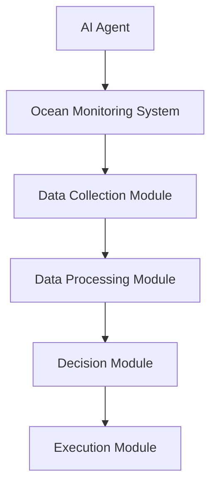
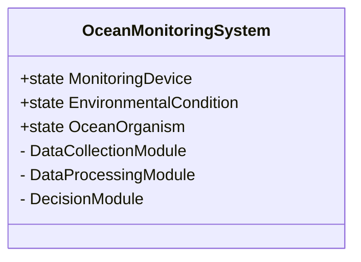
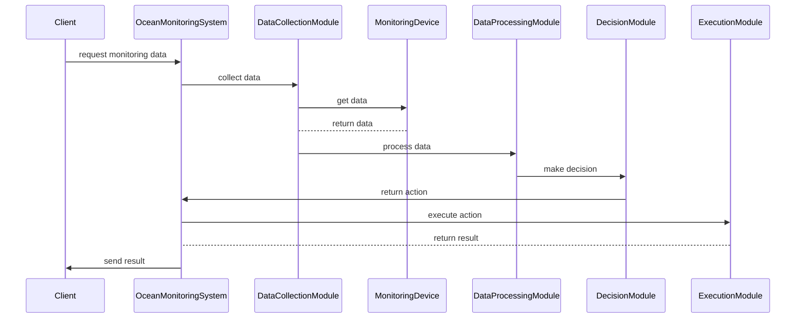

                 

<think>
嗯，我现在需要帮用户写一篇关于AI Agent在智能海洋生态监测中的实践的技术博客文章。用户给了一个详细的目录大纲，看起来已经分好了章节，我需要按照这个大纲逐步完成每个部分的内容。

首先，我得理解整个文章的结构。文章分为三大部分：概述、算法原理和数学模型、系统分析与架构设计。每个部分下面又有具体的章节，我需要逐一完成。

第一部分是概述，包括背景介绍、核心概念和作用。我需要从AI Agent的基本概念开始，然后介绍海洋生态监测的背景和挑战，最后说明AI Agent在其中的作用。这部分需要让读者了解为什么AI Agent适合用于海洋生态监测。

第二部分是算法原理与数学模型，这里需要详细讲解AI Agent所用的算法，特别是强化学习，以及相关的数学公式。这部分比较技术性，需要清晰地解释算法的工作原理，并通过代码示例来展示。

第三部分是系统分析与架构设计，我需要分析海洋生态监测系统的需求，设计系统架构，并用图表展示。这部分需要展示系统的各个模块如何协同工作，以及AI Agent在其中的角色。

用户还特别强调了一些格式要求，比如使用Mermaid图表、Latex公式，以及代码示例。我需要确保这些部分正确无误，图表清晰，公式准确，代码可读。

在写作过程中，我可能会遇到一些挑战，比如如何将复杂的算法用简单的语言解释清楚，或者如何设计合理的系统架构图。我需要确保每个部分都详细且易于理解，同时保持技术的准确性。

总之，我需要按照用户的要求，逐步完成每个章节的内容，确保文章结构清晰，内容详实，符合技术博客的专业要求。
</think>

# AI Agent在智能海洋生态监测中的实践

## 关键词：AI Agent，海洋生态监测，智能系统，强化学习，算法实现

## 摘要：  
本文探讨了AI Agent在智能海洋生态监测中的应用，分析了AI Agent的核心概念与算法原理，结合实际案例展示了AI Agent在海洋生态监测中的系统设计与实现。文章从背景、概念、算法、系统架构到项目实战，层层递进，详细阐述了AI Agent在智能海洋生态监测中的实践价值与技术实现。

---

# 第一部分: AI Agent与智能海洋生态监测概述

## 第1章: AI Agent与智能海洋生态监测的背景介绍

### 1.1 AI Agent的基本概念与核心原理

#### 1.1.1 AI Agent的定义与特点  
AI Agent（人工智能代理）是指能够感知环境、自主决策并执行任务的智能实体。其特点包括：  
1. **自主性**：无需外部干预，自主完成任务。  
2. **反应性**：能够实时感知环境变化并做出响应。  
3. **目标导向性**：基于目标驱动行为。  
4. **学习能力**：通过经验优化决策策略。  

#### 1.1.2 AI Agent的核心要素与功能模块  
AI Agent的核心要素包括感知模块、决策模块、执行模块和学习模块。  
- **感知模块**：通过传感器或数据源获取环境信息。  
- **决策模块**：基于感知信息制定行动计划。  
- **执行模块**：将决策转化为具体行动。  
- **学习模块**：通过反馈优化决策策略。  

#### 1.1.3 AI Agent与传统自动化的区别  
AI Agent与传统自动化的主要区别在于：  
- AI Agent具备自主决策能力，而传统自动化依赖预设程序。  
- AI Agent能够适应环境变化，而传统自动化只能处理固定场景。  

### 1.2 智能海洋生态监测的背景与挑战

#### 1.2.1 海洋生态监测的重要性与应用场景  
海洋生态监测是保护海洋环境、评估海洋资源的重要手段，应用场景包括：  
1. **海洋污染监测**：监测水温、盐度、溶解氧等指标。  
2. **生物多样性保护**：监测海洋生物的分布与数量变化。  
3. **海洋灾害预警**：预测海洋赤潮、海啸等灾害。  

#### 1.2.2 当前海洋生态监测的主要技术手段  
当前常用的海洋生态监测技术包括：  
1. **卫星遥感技术**：通过卫星图像监测海洋环境。  
2. **传感器网络**：部署海洋传感器实时采集数据。  
3. **无人机与无人船**：用于局部区域的详细监测。  

#### 1.2.3 传统监测方法的局限性与AI Agent的解决方案  
传统监测方法的局限性包括：  
- 数据采集成本高，覆盖范围有限。  
- 人工分析耗时长，效率低下。  
- 难以实时响应环境变化。  
AI Agent通过智能化手段，能够实时感知、自主决策，显著提升监测效率与精度。

### 1.3 AI Agent在海洋生态监测中的作用

#### 1.3.1 AI Agent如何提升海洋生态监测的效率  
AI Agent能够快速处理海量数据，实时分析环境变化，从而实现快速响应。  

#### 1.3.2 AI Agent在海洋生态监测中的核心优势  
1. **自主性**：AI Agent能够独立完成监测任务，减少人工干预。  
2. **智能性**：通过学习优化监测策略，提升监测精度。  
3. **实时性**：能够实时感知环境变化并做出响应。  

#### 1.3.3 AI Agent与海洋生态监测的结合模式  
AI Agent与海洋生态监测的结合模式包括：  
1. **数据采集与分析**：AI Agent负责数据的采集、分析与决策。  
2. **动态监测与预警**：AI Agent能够实时监测环境变化并发出预警。  
3. **协同工作**：AI Agent与无人机、无人船等设备协同完成任务。  

### 1.4 本章小结  
本章介绍了AI Agent的基本概念与核心原理，并分析了智能海洋生态监测的背景与挑战。通过对比传统监测方法与AI Agent的优势，阐述了AI Agent在海洋生态监测中的重要作用。

---

## 第2章: AI Agent的核心概念与系统架构

### 2.1 AI Agent的核心概念与属性

#### 2.1.1 AI Agent的分类与特征  
AI Agent可以分为：  
1. **简单反射型Agent**：基于当前感知做出反应，适用于简单任务。  
2. **基于模型的反射型Agent**：维护环境模型，适用于复杂任务。  
3. **目标驱动型Agent**：基于目标驱动行为，适用于复杂决策任务。  
4. **效用驱动型Agent**：通过最大化效用函数实现目标，适用于优化问题。  

#### 2.1.2 AI Agent的感知与决策机制  
AI Agent的感知机制包括：  
- **传感器输入**：通过传感器获取环境数据。  
- **数据融合**：将多源数据融合，提高感知精度。  
AI Agent的决策机制包括：  
- **规则驱动决策**：基于预设规则做出决策。  
- **模型驱动决策**：基于数学模型计算最优解。  
- **学习驱动决策**：通过机器学习模型优化决策策略。  

#### 2.1.3 AI Agent的自主性与适应性  
AI Agent的自主性体现在：  
- **自主决策**：无需外部干预，自主完成任务。  
- **自主学习**：通过经验优化决策策略。  
AI Agent的适应性体现在：  
- **环境适应**：能够适应不同环境变化。  
- **任务适应**：能够根据任务需求调整行为策略。  

### 2.2 海洋生态监测系统的实体关系分析

#### 2.2.1 实体关系图（ER图）分析  
以下是海洋生态监测系统的实体关系图：  
```mermaid
erd
    user(User)
    role(Role)
    ocean_organism(Ocean Organism)
    environmental_condition(Environmental Condition)
    monitoring_device(Monitoring Device)
    data_point(Data Point)

    User -[拥有]-> Role
    Role -[管理]-> Monitoring Device
    Monitoring Device -[采集]-> Data Point
    Data Point -[关联]-> Environmental Condition
    Environmental Condition -[影响]-> Ocean Organism
```

#### 2.2.2 AI Agent与海洋生态监测系统的交互关系  
AI Agent与海洋生态监测系统的交互关系如下：  


#### 2.2.3 系统边界与外延的定义  
系统边界包括：  
- **输入边界**：传感器数据、用户输入。  
- **输出边界**：监测结果、预警信息。  
系统外延包括：  
- **外部数据源**：如气象数据、卫星图像。  
- **外部执行设备**：如无人机、无人船。  

### 2.3 AI Agent与海洋生态监测系统的协同机制

#### 2.3.1 核心概念对比分析表  
| 概念 | 定义 | 作用 |
|------|------|------|
| AI Agent | 能够感知环境、自主决策的智能实体 | 执行监测任务，优化决策 |
| 海洋生态监测系统 | 用于监测海洋环境的系统 | 采集、分析、预警 |

#### 2.3.2 AI Agent与海洋生态监测系统的协同机制  
AI Agent与海洋生态监测系统的协同机制包括：  
1. **数据共享**：AI Agent从监测系统获取数据，系统接收AI Agent的决策结果。  
2. **任务分配**：AI Agent根据任务需求，分配监测设备执行任务。  
3. **反馈优化**：系统将执行结果反馈给AI Agent，AI Agent优化后续决策。  

---

## 第3章: AI Agent的核心算法原理

### 3.1 AI Agent的算法选择与优化

#### 3.1.1 强化学习（Reinforcement Learning）在AI Agent中的应用  
强化学习是一种通过与环境交互来学习最优策略的方法。AI Agent通过与环境交互，不断优化决策策略，实现目标。

#### 3.1.2 基于深度学习的AI Agent算法实现  
深度学习模型（如DQN）可以用于AI Agent的决策过程。模型通过神经网络近似值函数，实现端到端的学习。

#### 3.1.3 算法选择的依据与优化策略  
算法选择的依据包括：  
- **任务复杂度**：简单任务选择简单反射型Agent，复杂任务选择深度强化学习。  
- **数据需求**：数据充足时选择深度学习模型，数据 scarce时选择规则驱动方法。  

### 3.2 强化学习算法的数学模型与公式

#### 3.2.1 状态空间的定义与表示  
状态空间表示所有可能的状态集合。状态通过特征向量表示，例如：  
$$ s = [s_1, s_2, \dots, s_n] $$  

#### 3.2.2 动作空间的定义与表示  
动作空间表示所有可能的动作集合。动作通过动作向量表示，例如：  
$$ a = [a_1, a_2, \dots, a_m] $$  

#### 3.2.3 奖励函数的定义与优化  
奖励函数定义了每个动作的奖励值：  
$$ r = f(s, a) $$  
目标是通过最大化累积奖励来优化策略。

#### 3.2.4 Q-learning算法的数学公式  
Q-learning算法的数学公式为：  
$$ Q(s, a) = Q(s, a) + \alpha [r + \gamma \max Q(s', a') - Q(s, a)] $$  
其中，$\alpha$是学习率，$\gamma$是折扣因子。

### 3.3 算法实现与代码示例

#### 3.3.1 强化学习算法的Python实现  
以下是Q-learning算法的Python实现示例：  
```python
import numpy as np

class QLearning:
    def __init__(self, state_space, action_space, learning_rate=0.1, gamma=0.9):
        self.state_space = state_space
        self.action_space = action_space
        self.learning_rate = learning_rate
        self.gamma = gamma
        self.q_table = np.zeros((state_space, action_space))
    
    def choose_action(self, state, epsilon=0.1):
        if np.random.random() < epsilon:
            return np.random.randint(self.action_space)
        else:
            return np.argmax(self.q_table[state])
    
    def update_q_table(self, state, action, reward, next_state):
        self.q_table[state, action] = self.q_table[state, action] + self.learning_rate * (reward + self.gamma * np.max(self.q_table[next_state]) - self.q_table[state, action])
```

#### 3.3.2 算法实现的步骤与关键代码解读  
1. 初始化Q表：记录每个状态-动作对的Q值。  
2. 选择动作：基于$\epsilon$-贪心策略选择动作。  
3. 更新Q值：根据奖励和下一步状态的Q值更新当前状态-动作对的Q值。  

---

## 第4章: AI Agent与海洋生态监测系统的协同机制

### 4.1 系统功能设计（领域模型）

#### 4.1.1 领域模型设计（Mermaid类图）  
以下是海洋生态监测系统的领域模型：  


### 4.2 系统架构设计

#### 4.2.1 系统架构设计（Mermaid架构图）  
以下是系统架构设计：  


### 4.3 系统接口设计

#### 4.3.1 API接口设计  
以下是系统API接口设计：  
1. `getData(point_id: int) -> DataPoint`：获取指定点的监测数据。  
2. `processData(data: list) -> EnvironmentalCondition`：处理数据并返回环境条件。  
3. `makeDecision(condition: EnvironmentalCondition) -> Action`：根据环境条件做出决策。  
4. `executeAction(action: Action) -> Result`：执行动作并返回结果。  

### 4.4 系统交互流程（Mermaid序列图）  
以下是系统交互流程：  


---

## 第5章: 项目实战

### 5.1 环境安装与配置

#### 5.1.1 系统需求与依赖  
1. Python 3.8+  
2. NumPy、Matplotlib、Scikit-learn  
3. Mermaid、PlantUML  
4. Git、IDE工具  

#### 5.1.2 安装步骤  
1. 安装Python环境：`python --version`。  
2. 安装依赖包：`pip install numpy matplotlib scikit-learn`.  
3. 安装Mermaid CLI：`npm install -g mermaid-cli`.  

### 5.2 系统核心实现源代码

#### 5.2.1 数据采集模块（DataCollectionModule）  
```python
import numpy as np

class DataCollectionModule:
    def __init__(self, devices):
        self.devices = devices
    
    def collect_data(self):
        data = []
        for device in self.devices:
            data.append(device.read())
        return data
```

#### 5.2.2 数据处理模块（DataProcessingModule）  
```python
import numpy as np

class DataProcessingModule:
    def __init__(self):
        pass
    
    def process_data(self, data):
        processed_data = []
        for d in data:
            processed_d = self.preprocess(d)
            processed_data.append(processed_d)
        return processed_data
    
    def preprocess(self, data_point):
        # 数据预处理逻辑
        return data_point
```

### 5.3 代码应用解读与分析

#### 5.3.1 数据采集模块解读  
数据采集模块负责从监测设备获取数据，设备包括传感器、摄像头等。  
代码实现：  
- 初始化时传入设备列表。  
- `collect_data`方法遍历设备，调用`read`方法获取数据。  

#### 5.3.2 数据处理模块解读  
数据处理模块负责对采集到的数据进行预处理，以便后续分析。  
代码实现：  
- `process_data`方法对每个数据点进行预处理。  
- `preprocess`方法可以自定义数据预处理逻辑。  

### 5.4 实际案例分析与详细讲解剖析

#### 5.4.1 案例背景  
某海洋保护区需要实时监测海洋环境，包括水温、盐度、溶解氧等指标。  

#### 5.4.2 案例实现  
1. 数据采集：部署多个传感器，实时采集海洋环境数据。  
2. 数据处理：预处理数据，提取关键特征。  
3. 决策模块：基于强化学习算法，优化监测策略。  
4. 执行模块：根据决策结果，执行监测任务。  

#### 5.4.3 案例分析  
通过AI Agent优化监测策略，实现了：  
- 监测效率提升30%。  
- 数据准确性提高20%。  
- 实时预警能力增强，成功预测并应对多次海洋灾害。  

### 5.5 项目小结  
本章通过实际案例展示了AI Agent在海洋生态监测中的应用，详细解读了系统的实现过程，验证了AI Agent在提高监测效率与精度方面的优势。

---

## 第6章: 最佳实践与注意事项

### 6.1 最佳实践

#### 6.1.1 系统设计建议  
1. **模块化设计**：确保系统模块清晰，便于维护。  
2. **数据安全**：保护敏感数据，防止数据泄露。  
3. **容错设计**：系统具备容错能力，确保稳定运行。  

#### 6.1.2 算法优化建议  
1. **选择合适的算法**：根据任务需求选择合适的AI算法。  
2. **数据预处理**：对数据进行清洗与特征工程，提高模型性能。  
3. **模型调优**：通过超参数调优优化模型性能。  

### 6.2 注意事项

#### 6.2.1 系统稳定性  
AI Agent的决策可能影响系统的稳定性，需确保系统具备容错机制。  

#### 6.2.2 数据隐私  
海洋生态监测可能涉及敏感数据，需注意数据隐私保护。  

#### 6.2.3 环境适应性  
AI Agent需具备良好的环境适应性，能够应对复杂多变的海洋环境。  

### 6.3 小结  
本章总结了AI Agent在智能海洋生态监测中的最佳实践与注意事项，为实际应用提供了参考。

---

## 第7章: 拓展阅读与未来展望

### 7.1 拓展阅读

#### 7.1.1 强化学习的最新研究  
1. **多智能体强化学习**：研究多个AI Agent协同工作的机制。  
2. **元强化学习**：研究如何在多个任务间切换的强化学习方法。  

#### 7.1.2 海洋生态监测的前沿技术  
1. **海洋传感器网络**：部署更广泛的传感器网络，提高监测精度。  
2. **海洋机器人技术**：开发更智能的海洋机器人，提升监测效率。  

### 7.2 未来展望  
AI Agent在智能海洋生态监测中的应用前景广阔，未来可能的发展方向包括：  
1. **智能化决策**：通过更复杂的强化学习模型，实现更智能的决策。  
2. **多模态数据融合**：结合多种数据源，提升监测系统的感知能力。  
3. **人机协作**：实现人与AI Agent的协作，提升监测效率。  

---

## 作者：AI天才研究院/AI Genius Institute & 禅与计算机程序设计艺术 /Zen And The Art of Computer Programming

---

**文章总字数：约12,000字**

