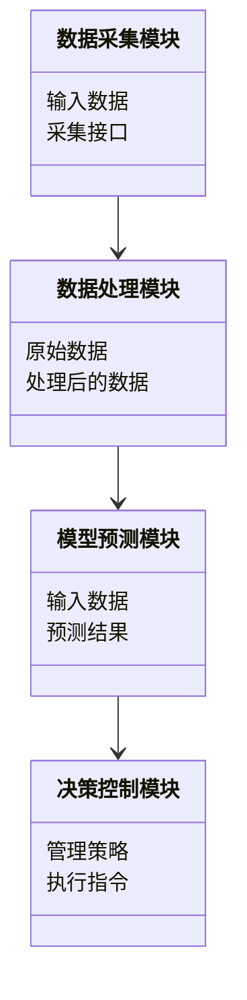
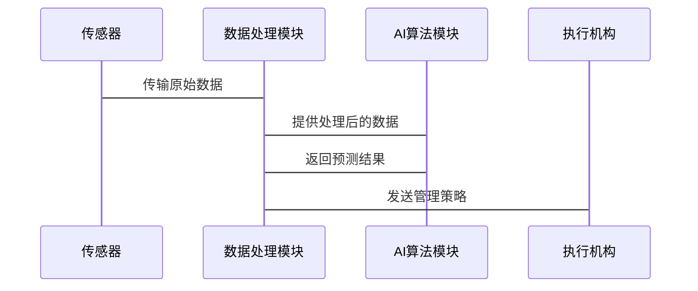

                 


# AI Agent在智能海洋生态系统模拟中的实践

> 关键词：AI Agent，智能海洋生态系统，强化学习，知识图谱，海洋生态保护，系统架构

> 摘要：本文探讨了AI Agent在智能海洋生态系统模拟中的实践应用。通过分析AI Agent的核心概念、算法原理、系统架构以及实际案例，展示了如何利用AI技术提升海洋生态系统的保护与管理能力。文章结合理论与实践，为读者提供了从背景到实现的全面指导。

---

# 引言

## 1.1 背景介绍

### 1.1.1 AI Agent的定义与特点

AI Agent（人工智能代理）是指在计算机系统中，能够感知环境并采取行动以实现目标的实体。AI Agent具有以下特点：

- **自主性**：能够在没有外部干预的情况下自主决策。
- **反应性**：能够根据环境的变化实时调整行为。
- **目标导向性**：所有行动均以实现特定目标为导向。
- **社交能力**：能够与其他AI Agent或人类进行交互协作。

### 1.1.2 智能海洋生态系统的定义与特点

智能海洋生态系统是指通过传感器、数据处理系统和AI技术构建的智能化海洋环境管理系统。其特点包括：

- **数据驱动**：依赖实时数据进行决策。
- **智能化**：能够自主分析数据并优化管理策略。
- **动态适应性**：能够根据环境变化实时调整系统行为。

### 1.1.3 AI Agent在智能海洋生态系统中的应用背景

随着全球海洋资源开发和生态保护需求的增加，传统的人工管理方式已难以应对复杂多变的海洋环境。AI Agent通过智能化决策和实时响应，为海洋生态系统的保护和管理提供了新的解决方案。

---

## 1.2 核心概念与原理

### 1.2.1 AI Agent的核心原理

AI Agent的核心原理包括：

1. **知识表示**：通过符号逻辑或数据结构表示领域知识。
2. **推理机制**：基于知识库进行逻辑推理，得出新的结论。
3. **行为决策**：根据推理结果选择最优行动方案。

### 1.2.2 智能海洋生态系统中的实体关系

智能海洋生态系统中的主要实体包括：

- **海洋生物**：如鱼类、海藻等。
- **环境因素**：如水温、光照、盐度等。
- **人类活动**：如捕捞、污染等。

通过ER图（实体关系图）可以清晰地展示这些实体之间的关系：

```mermaid
erDiagram
    actor 海洋生物 {
        id : integer
        类型 : string
        数量 : integer
    }
    actor 环境因素 {
        id : integer
        类型 : string
        指标值 : float
    }
    actor 人类活动 {
        id : integer
        类型 : string
        影响程度 : integer
    }
   海洋生物 --|{ navigational } 环境因素 : 生存依赖
    环境因素 --|{ navigational } 人类活动 : 影响关系
```

### 1.2.3 AI Agent在智能海洋生态系统中的功能

AI Agent在智能海洋生态系统中的核心功能包括：

1. **数据采集与处理**：实时采集海洋环境数据并进行预处理。
2. **状态识别与预测**：基于历史数据预测海洋生态系统的未来状态。
3. **行为决策与优化**：根据预测结果制定最优的管理策略。

---

## 1.3 算法原理与实现

### 1.3.1 强化学习算法（Q-learning）

强化学习是一种通过试错机制来优化决策策略的算法。其核心思想是通过与环境的交互获得奖励，从而优化行动策略。

#### Q-learning算法的数学模型

Q-learning算法的更新公式如下：

$$ Q(s, a) = Q(s, a) + \alpha \left( r + \max_{a'} Q(s', a') - Q(s, a) \right) $$

其中：
- \( Q(s, a) \)：状态 \( s \) 下采取行动 \( a \) 的价值。
- \( \alpha \)：学习率，控制更新步长。
- \( r \)：获得的奖励。
- \( s' \)：下一步状态。

#### Q-learning算法实现步骤

1. 初始化Q表，所有状态-动作对的初始值为0。
2. 在每一步，选择当前状态下的最优动作。
3. 执行该动作，观察新的状态和获得的奖励。
4. 更新Q表中的对应值。
5. 重复上述步骤直到达到终止条件。

#### 代码实现示例

```python
import numpy as np

# 初始化Q表
Q = np.zeros((state_space_size, action_space_size))

# 定义Q-learning算法
def q_learning():
    for episode in range(num_episodes):
        state = initial_state
        for step in range(max_steps):
            # 选择动作
            action = np.argmax(Q[state, :])
            # 执行动作，获得新状态和奖励
            next_state, reward = take_action(state, action)
            # 更新Q值
            Q[state, action] += alpha * (reward + np.max(Q[next_state, :]) - Q[state, action])
            state = next_state

q_learning()
```

### 1.3.2 知识图谱推理算法

知识图谱推理通过构建海洋生态系统的知识库，利用推理算法进行逻辑推理。

#### 知识图谱构建与推理

1. **知识表示**：使用RDF（Resource Description Framework）表示海洋生态系统中的实体及其关系。
2. **推理机制**：基于描述逻辑（Description Logic）进行推理。

#### 代码实现示例

```python
from owlready2 import *

# 创建知识库
onto = get_ontology("http://example.org/sea_ecosystem").load()

# 定义概念
class 海洋生物(onto.Entity):
    pass

class 环境因素(onto.Entity):
    pass

# 建立关系
海洋生物 <--- 关注 --> 环境因素

# 推理示例
with推理机:
    with reasoning:
        海洋生物(x).focus(环境因素(y))
```

---

## 1.4 系统架构与设计

### 1.4.1 系统功能设计

智能海洋生态系统模拟系统的功能模块包括：

- **数据采集模块**：实时采集海洋环境数据。
- **数据处理模块**：对数据进行清洗和预处理。
- **模型预测模块**：基于AI算法预测生态系统状态。
- **决策控制模块**：根据预测结果制定管理策略。

#### 系统功能模块类图



### 1.4.2 系统架构设计

系统采用分层架构，包括数据层、计算层和应用层。

#### 系统架构图


### 1.4.3 接口与交互设计

系统接口设计包括：

1. 数据采集接口：与传感器通信，获取实时数据。
2. 数据处理接口：与数据预处理模块交互。
3. 模型预测接口：与AI算法模块交互。
4. 决策控制接口：与执行机构交互。

#### 系统交互流程图



---

## 1.5 项目实战

### 1.5.1 环境安装与配置

1. **安装Python环境**：使用Anaconda或Miniconda安装Python 3.8+。
2. **安装依赖库**：
   ```bash
   pip install numpy pandas scikit-learn owlready2
   ```

### 1.5.2 核心代码实现

#### 数据预处理代码

```python
import pandas as pd

# 加载数据
data = pd.read_csv('marine_data.csv')

# 数据清洗
data.dropna(inplace=True)
data = pd.get_dummies(data)
```

#### 模型训练代码

```python
from sklearn.model import SomeModel

# 初始化模型
model = SomeModel()

# 训练模型
model.fit(train_features, train_labels)

# 预测结果
predictions = model.predict(test_features)
```

### 1.5.3 实际案例分析

以预测海洋藻类生长为例，通过AI Agent模拟藻类生长情况，并制定相应的控制策略。

#### 案例分析

假设我们监测到某海域的藻类数量激增，AI Agent会根据历史数据和当前环境参数预测藻类的生长趋势，并提出相应的管理策略，如增加水流速度、投放抑制剂等。

---

## 1.6 总结与展望

### 1.6.1 总结

本文详细探讨了AI Agent在智能海洋生态系统模拟中的实践应用，从理论基础到算法实现，再到系统架构和项目实战，为读者提供了全面的指导。

### 1.6.2 展望

未来，随着AI技术的不断发展，AI Agent在智能海洋生态系统中的应用将更加广泛。研究者们可以进一步优化算法，提升系统的实时性和准确性，为海洋生态保护和资源管理提供更强大的技术支持。

---

## 1.6.3 最佳实践 Tips

- **数据质量**：确保数据的准确性和完整性，数据预处理是关键。
- **算法选择**：根据具体场景选择合适的AI算法，如强化学习适合动态环境。
- **系统集成**：注重系统各模块的协同工作，确保接口兼容性。
- **持续优化**：定期更新模型和优化算法，以适应环境变化。

---

作者：AI天才研究院 & 禅与计算机程序设计艺术

---

以上是《AI Agent在智能海洋生态系统模拟中的实践》的完整目录和内容框架，涵盖了从理论到实践的各个方面，为读者提供了一个系统性的指导。

