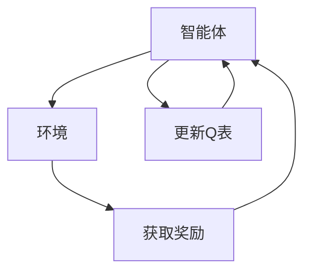
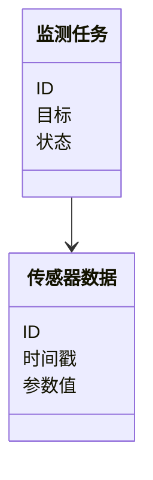
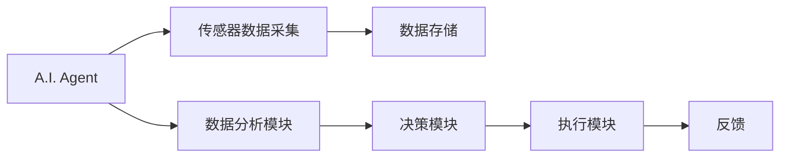
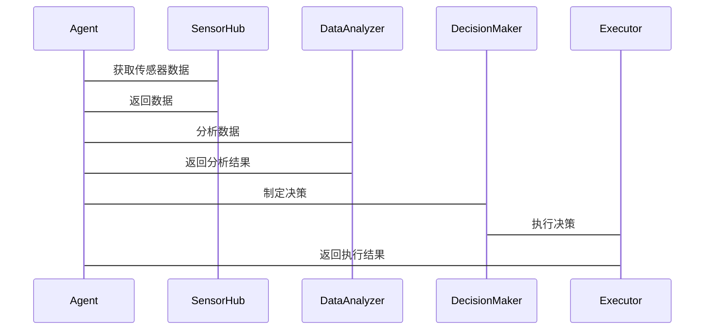

                 


# AI Agent在智能海洋监测中的实践

> **关键词**：AI Agent，智能海洋监测，强化学习，系统架构，项目实战  
> **摘要**：本文详细探讨了AI Agent在智能海洋监测中的应用，从背景介绍、核心概念、算法原理到系统架构、项目实战和总结，全面分析了AI Agent在海洋环境监测、渔业管理、生态保护等方面的优势和挑战。

---

## 第1章 AI Agent与智能海洋监测概述

### 1.1 AI Agent的基本概念

#### 1.1.1 AI Agent的定义
AI Agent（人工智能代理）是一种智能体，能够感知环境、自主决策并执行任务。它具备学习、推理和自适应能力，能够在动态环境中优化目标实现。

#### 1.1.2 AI Agent的核心特征
- **自主性**：无需外部干预，自主完成任务。
- **反应性**：实时感知环境变化并做出反应。
- **目标导向**：基于目标驱动决策和行动。
- **学习能力**：通过数据和经验不断优化性能。

#### 1.1.3 AI Agent与传统自动化的区别
| 特性          | AI Agent                  | 传统自动化              |
|---------------|---------------------------|-------------------------|
| 决策方式      | 基于数据学习，动态调整    | 预设规则，固定流程      |
| 环境适应性    | 高度适应复杂环境          | 适应性较低              |
| 效率优化      | 自主优化，提升效率        | 需人工调整，效率有限    |

---

### 1.2 智能海洋监测的背景与挑战

#### 1.2.1 海洋监测的重要性
海洋监测是保护海洋环境、资源利用和生态平衡的关键。它涉及水质监测、渔业资源管理、海洋污染预警等领域。

#### 1.2.2 当前海洋监测的主要技术
- **传感器技术**：如温度、盐度、溶解氧传感器。
- **卫星遥感**：用于大范围监测和数据采集。
- **数据处理技术**：如大数据分析和机器学习。

#### 1.2.3 智能海洋监测的需求与挑战
- **需求**：实时监测、高效数据处理、精准决策。
- **挑战**：环境复杂性、数据量大、系统稳定性要求高。

---

### 1.3 AI Agent在智能海洋监测中的作用

#### 1.3.1 提高监测效率
AI Agent能够快速处理大量数据，实时分析环境变化，减少人工干预。

#### 1.3.2 实现实时数据分析
通过机器学习模型，AI Agent能够实时预测海洋环境变化，及时发出预警。

#### 1.3.3 优化决策过程
基于历史数据和实时信息，AI Agent能够优化监测策略，提高决策的准确性和效率。

---

## 第2章 AI Agent的核心概念与联系

### 2.1 AI Agent的感知模块

#### 2.1.1 数据采集与处理
AI Agent通过传感器获取环境数据，如温度、盐度、溶解氧等，并进行预处理和特征提取。

#### 2.1.2 数据特征提取
使用主成分分析（PCA）等方法，提取关键特征，降低数据维度。

#### 2.1.3 数据分析与模式识别
通过聚类分析、分类算法，识别海洋环境中的异常模式，如污染区域。

### 2.2 AI Agent的决策模块

#### 2.2.1 决策算法概述
常用的决策算法包括强化学习（Q-learning）和监督学习（随机森林）。

#### 2.2.2 常见决策算法对比
| 算法类型       | 强化学习         | 监督学习         |
|----------------|------------------|------------------|
| 特点           | 奖惩驱动，策略优化 | 标签数据，分类预测 |
| 应用场景       | 动态决策         | 静态分类         |

#### 2.2.3 决策过程中的权衡与优化
在复杂的海洋环境中，AI Agent需要权衡多个目标，如监测效率与资源消耗，通过多目标优化算法找到最佳平衡点。

### 2.3 AI Agent的执行模块

#### 2.3.1 执行策略设计
根据决策结果，生成具体的执行策略，如调整传感器采样频率或启动净化装置。

#### 2.3.2 执行效果评估
通过反馈机制评估执行效果，如监测数据的准确性或任务完成时间。

#### 2.3.3 执行过程中的反馈机制
AI Agent根据反馈调整后续决策，形成闭环控制系统。

### 2.4 AI Agent的核心概念对比表

| 模块       | 感知模块       | 决策模块       | 执行模块       |
|------------|----------------|----------------|----------------|
| 功能       | 数据采集与分析 | 制定决策策略   | 执行决策       |
| 输入       | 环境数据       | 决策目标       | 执行指令       |
| 输出       | 特征数据       | 决策结果       | 实际操作       |

### 2.5 AI Agent的ER实体关系图

```mermaid
er
actor(Agent, [ID, Name], [监测任务])
object(传感器数据, [ID, 时间戳, 参数值], [属于, 监测任务])
```

---

## 第3章 AI Agent的核心算法原理

### 3.1 强化学习算法

#### 3.1.1 强化学习的基本原理
强化学习通过智能体与环境的交互，学习最优策略，最大化累积奖励。

#### 3.1.2 Q-learning算法流程


#### 3.1.3 Q-learning算法代码示例
```python
import numpy as np

class QLearning:
    def __init__(self, state_space, action_space):
        self.q_table = np.zeros((state_space, action_space))
    
    def choose_action(self, state, epsilon):
        if np.random.random() < epsilon:
            return np.random.randint(action_space)
        return np.argmax(self.q_table[state])
    
    def update_q_table(self, state, action, reward, next_state, alpha, gamma):
        self.q_table[state][action] = (1 - alpha) * self.q_table[state][action] + alpha * (reward + gamma * np.max(self.q_table[next_state]))
```

### 3.2 监督学习算法

#### 3.2.1 监督学习的基本原理
监督学习通过标签数据训练模型，预测未知数据。

#### 3.2.2 随机森林算法在海洋监测中的应用
- 用于分类任务，如识别海洋区域的污染类型。

### 3.3 算法的数学模型

#### 3.3.1 强化学习的数学模型
$$ Q(s, a) = Q(s, a) + \alpha (r + \gamma \max Q(s', a') - Q(s, a)) $$

#### 3.3.2 随机森林的数学模型
$$ f(x) = \sum_{i=1}^{n} \text{Tree}(x) $$

---

## 第4章 系统分析与架构设计

### 4.1 问题场景介绍
本系统旨在实现对海洋环境的智能监测，包括水质、生物分布等多维度数据的实时采集和分析。

### 4.2 系统功能设计

#### 4.2.1 领域模型


#### 4.2.2 系统架构设计


### 4.3 系统接口设计

#### 4.3.1 API接口
- **输入**：传感器数据流。
- **输出**：分析结果和决策指令。

#### 4.3.2 交互流程图


---

## 第5章 项目实战

### 5.1 环境安装

#### 5.1.1 安装Python和相关库
```bash
pip install numpy matplotlib scikit-learn
```

### 5.2 系统核心实现

#### 5.2.1 数据采集模块
```python
import serial

class SensorInterface:
    def __init__(self, port):
        self.ser = serial.Serial(port, 9600)
    
    def read_data(self):
        return self.ser.readline().decode()
```

#### 5.2.2 数据分析模块
```python
from sklearn.ensemble import RandomForestClassifier

class DataAnalyzer:
    def __init__(self, features, labels):
        self.model = RandomForestClassifier()
        self.model.fit(features, labels)
    
    def predict(self, new_data):
        return self.model.predict(new_data)
```

### 5.3 案例分析

#### 5.3.1 数据采集与分析
假设我们从传感器获取了温度、盐度、溶解氧的数据，通过数据分析模块进行分类，识别出异常区域。

#### 5.3.2 决策与执行
系统根据分析结果，启动相应的净化设备，并调整传感器的采样频率。

---

## 第6章 总结与展望

### 6.1 本章小结
本文详细介绍了AI Agent在智能海洋监测中的应用，从理论到实践，全面分析了其优势和挑战。

### 6.2 注意事项
- 数据质量和实时性对系统性能至关重要。
- 系统需要具备良好的容错和自适应能力。

### 6.3 拓展阅读
- 推荐阅读《强化学习入门》和《机器学习实战》。

---

**作者：AI天才研究院 & 禅与计算机程序设计艺术**

