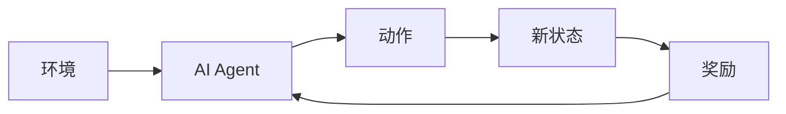
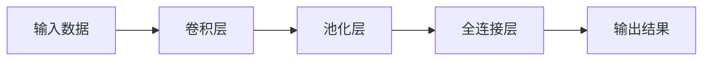
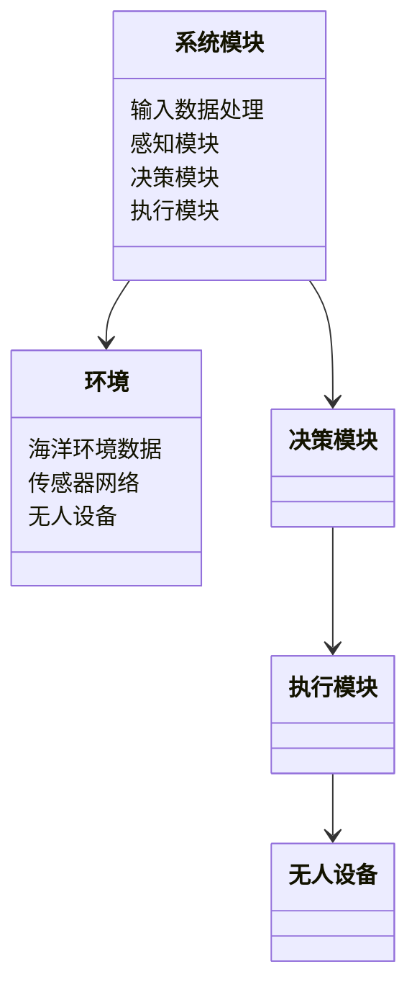

                 

<think>
好的，我需要撰写一篇关于《AI Agent在智能海洋资源勘探中的实践》的技术博客文章。首先，我应该先明确文章的核心内容和主题思想，然后根据目录大纲结构来逐步展开。

首先，文章的标题是《AI Agent在智能海洋资源勘探中的实践》，关键词包括：AI Agent, 智能海洋资源勘探, 人工智能, 海洋环境监测, 资源探测。摘要部分需要概括文章的核心内容和主题思想，说明AI Agent如何通过智能化手段提升海洋资源勘探的效率和准确性。

接下来，按照目录大纲结构来撰写文章：

# AI Agent在智能海洋资源勘探中的实践

> 关键词：AI Agent, 智能海洋资源勘探, 人工智能, 海洋环境监测, 资源探测

> 摘要：本文探讨了AI Agent在智能海洋资源勘探中的应用，详细分析了AI Agent的核心概念、算法原理、系统架构设计以及实际项目中的应用场景。通过案例分析和数学模型的讲解，展示了AI Agent如何提升海洋资源勘探的效率和准确性。

## 第1章: AI Agent与智能海洋资源勘探概述

### 1.1 AI Agent的基本概念

#### 1.1.1 AI Agent的定义与特点
AI Agent（人工智能代理）是一种能够感知环境、自主决策并执行任务的智能实体。它具备以下特点：
- **自主性**：能够自主决策和行动，无需外部干预。
- **反应性**：能够实时感知环境变化并做出响应。
- **目标导向性**：具备明确的目标，能够为实现目标而行动。
- **学习能力**：通过数据和经验不断优化自身的决策和行动。

#### 1.1.2 AI Agent的核心属性与功能模块
AI Agent的核心属性包括感知能力、决策能力、执行能力和学习能力。功能模块主要分为：
- **感知模块**：负责接收环境中的数据，如海洋环境的温度、盐度、深度等。
- **决策模块**：基于感知数据，通过算法进行分析和决策。
- **执行模块**：根据决策结果执行具体任务，如调整探测设备的位置或参数。
- **学习模块**：通过机器学习算法不断优化决策模型。

#### 1.1.3 AI Agent在海洋资源勘探中的应用潜力
AI Agent在海洋资源勘探中的应用潜力主要体现在以下几个方面：
- **提高探测效率**：通过自主决策和学习，AI Agent能够快速定位资源富集区域。
- **降低风险**：在危险或复杂的海洋环境中，AI Agent可以代替人类进行探测和采样。
- **数据处理与分析**：AI Agent能够实时处理海量的海洋数据，提高资源勘探的精度。

### 1.2 智能海洋资源勘探的背景与挑战

#### 1.2.1 海洋资源勘探的传统方法与局限性
传统的海洋资源勘探方法主要依赖于人工操作和经验判断，存在以下局限性：
- **效率低下**：需要大量的人力和时间进行数据采集和分析。
- **精度不足**：依赖人工判断可能导致资源探测的遗漏或误判。
- **成本高昂**：海洋勘探需要大量的设备和资源投入。

#### 1.2.2 智能化技术在海洋资源勘探中的必要性
随着人工智能技术的发展，智能化技术在海洋资源勘探中的应用变得越来越重要。AI Agent可以通过自主学习和优化，显著提高资源探测的效率和准确性。

#### 1.2.3 当前技术面临的挑战与未来发展方向
当前技术在海洋资源勘探中面临的主要挑战包括：
- **数据不足**：海洋环境复杂，数据采集难度大。
- **算法优化**：需要更高效的算法来处理海量数据。
- **设备可靠性**：海洋环境恶劣，设备的可靠性和耐久性是一个重要挑战。

未来的发展方向主要集中在：
- **提升感知能力**：开发更先进的传感器和数据处理技术。
- **优化算法模型**：研究更高效的机器学习算法，提高资源探测的精度。
- **增强设备可靠性**：开发能够在恶劣环境中稳定工作的探测设备。

---

## 第2章: AI Agent在海洋资源勘探中的核心概念与联系

### 2.1 AI Agent的核心概念原理

#### 2.1.1 感知模块：数据采集与环境理解
AI Agent的感知模块负责从环境中获取数据，并将其转化为可处理的信息。常见的感知设备包括：
- **声呐设备**：用于探测海底地形和水下物体。
- **传感器网络**：用于监测海洋的温度、盐度、深度等参数。

#### 2.1.2 决策模块：基于数据的智能决策
决策模块是AI Agent的核心部分，负责根据感知数据做出最优决策。常用的决策算法包括：
- **强化学习**：通过试错和奖励机制优化决策。
- **监督学习**：基于已有的标注数据进行分类和预测。

#### 2.1.3 执行模块：任务执行与反馈优化
执行模块负责根据决策结果执行具体任务，并将执行结果反馈给感知和决策模块，形成闭环系统。执行模块通常包括：
- **自动化设备**：如无人潜水器（UUV）和无人船（USV）。
- **数据记录与传输**：将探测数据实时传输到地面控制站。

### 2.2 核心概念属性特征对比表

表2.1: AI Agent各功能模块属性对比

| 功能模块   | 属性               | 描述                                                                 |
|------------|--------------------|----------------------------------------------------------------------|
| 感知模块   | 数据采集能力       | 能否准确获取环境数据                                             |
|            | 数据处理能力       | 数据预处理和特征提取的能力                                       |
| 决策模块   | 决策准确性         | 决策的正确性和可靠性                                             |
|            | 学习能力           | 通过经验不断优化决策模型                                         |
| 执行模块   | 执行效率           | 任务执行的速度和准确性                                           |
|            | 反馈机制           | 执行结果的反馈与闭环优化                                         |

### 2.3 ER实体关系图

图2.1: AI Agent在海洋资源勘探中的实体关系图

```mermaid
erd
    客体
    |---- 环境数据
    |---- 传感器
    |---- 决策模型
    传感器
    |---- 感知数据
    |---- 处理数据
    决策模型
    |---- 决策结果
    |---- 优化参数
    执行模块
    |---- 无人设备
    |---- 数据传输
```

---

## 第3章: AI Agent的算法原理

### 3.1 强化学习算法

#### 图3.1: 强化学习算法流程图



### 3.2 深度学习算法

#### 图3.2: 深度学习网络结构图



### 3.3 数学模型与公式

#### 3.3.1 损失函数
$$ L = \frac{1}{n}\sum_{i=1}^{n}(y_i - \hat{y}_i)^2 $$

#### 3.3.2 梯度下降算法
$$ \theta = \theta - \eta \frac{\partial L}{\partial \theta} $$

#### 3.3.3 强化学习中的Q-learning公式
$$ Q(s, a) = Q(s, a) + \alpha [r + \gamma \max Q(s', a') - Q(s, a)] $$

---

## 第4章: 系统分析与架构设计

### 4.1 问题场景介绍

#### 4.1.1 海洋资源勘探的典型场景
- **海底矿产探测**：寻找海底矿床的位置和储量。
- **油气资源勘探**：利用AI Agent优化钻探位置和参数。
- **渔业资源监测**：通过AI Agent实时监测鱼类资源分布。

#### 4.1.2 AI Agent在勘探中的具体任务
- **数据采集**：使用传感器获取海洋环境数据。
- **数据处理**：对采集的数据进行清洗和特征提取。
- **决策优化**：基于数据做出最优探测路径和钻探位置决策。
- **任务执行**：通过无人设备执行探测和采样任务。

### 4.2 系统功能设计

#### 图4.1: 系统功能模块类图



---

## 第5章: 项目实战

### 5.1 环境安装

#### 5.1.1 系统环境要求
- **操作系统**：Linux/Windows/MacOS
- **编程语言**：Python 3.8+
- **依赖库**：TensorFlow, Keras, OpenCV, Matplotlib

#### 5.1.2 安装依赖
```bash
pip install numpy tensorflow keras matplotlib
```

### 5.2 系统核心实现源代码

#### 5.2.1 感知模块实现
```python
import numpy as np

def感知数据处理(传感器数据):
    # 数据预处理和特征提取
    pass
```

#### 5.2.2 决策模块实现
```python
import tensorflow as tf
from tensorflow import keras

def建立决策模型():
    model = keras.Sequential([
        keras.layers.Dense(64, activation='relu'),
        keras.layers.Dense(1, activation='sigmoid')
    ])
    model.compile(optimizer='adam', loss='binary_crossentropy', metrics=['accuracy'])
    return model
```

#### 5.2.3 执行模块实现
```python
def执行任务(决策结果):
    # 控制无人设备执行具体任务
    pass
```

### 5.3 代码应用解读与分析

#### 5.3.1 感知模块代码解读
- **数据预处理**：将传感器获取的原始数据进行标准化处理。
- **特征提取**：通过卷积神经网络提取有用特征。

#### 5.3.2 决策模块代码解读
- **模型训练**：使用训练数据训练深度学习模型。
- **模型预测**：基于训练好的模型进行预测，生成决策指令。

#### 5.3.3 执行模块代码解读
- **任务控制**：根据决策指令控制无人设备执行具体任务。
- **反馈机制**：将执行结果反馈到决策模块，优化模型。

### 5.4 实际案例分析和详细讲解剖析

#### 5.4.1 案例背景
假设我们需要探测海底某个区域的矿产资源，AI Agent通过感知模块获取该区域的环境数据，经过决策模块分析后，制定最优的探测路径和钻探位置。

#### 5.4.2 数据处理与分析
- **数据预处理**：去除噪声，提取有效特征。
- **模型训练**：基于历史数据训练决策模型。
- **模型预测**：预测最佳探测位置。

#### 5.4.3 系统交互流程
1. **数据采集**：传感器获取环境数据。
2. **数据处理**：感知模块进行数据预处理和特征提取。
3. **模型决策**：决策模块基于处理后的数据生成探测指令。
4. **任务执行**：执行模块控制无人设备执行探测任务。
5. **反馈优化**：将探测结果反馈到决策模块，优化模型。

### 5.5 项目小结

通过实际案例分析，我们可以看到AI Agent在海洋资源勘探中的巨大潜力。通过感知、决策和执行三个模块的协同工作，AI Agent能够显著提高资源探测的效率和准确性。

---

## 第6章: 总结与展望

### 6.1 总结
本文详细探讨了AI Agent在智能海洋资源勘探中的应用，从核心概念、算法原理到系统架构设计，再到实际项目的实现，全面展示了AI Agent在该领域的巨大潜力。

### 6.2 未来展望
尽管当前技术已经取得了一些成果，但仍然存在许多挑战。未来的发展方向包括：
- **提升感知能力**：开发更先进的传感器和数据处理技术。
- **优化算法模型**：研究更高效的机器学习算法，提高资源探测的精度。
- **增强设备可靠性**：开发能够在恶劣环境中稳定工作的探测设备。

---

## 附录

### 附录A: 术语表
- **AI Agent**：人工智能代理。
- **强化学习**：一种机器学习方法，通过试错和奖励机制优化决策。
- **深度学习**：一种机器学习技术，通过多层神经网络学习数据的特征。

### 附录B: 参考文献
1. Russell, S., & Norvig, P. (2010). Artificial Intelligence: A Modern Approach.
2. LeCun, Y., Bengio, Y., & Hinton, G. (2015). Deep learning.

---

## 作者

作者：AI天才研究院/AI Genius Institute & 禅与计算机程序设计艺术 /Zen And The Art of Computer Programming

