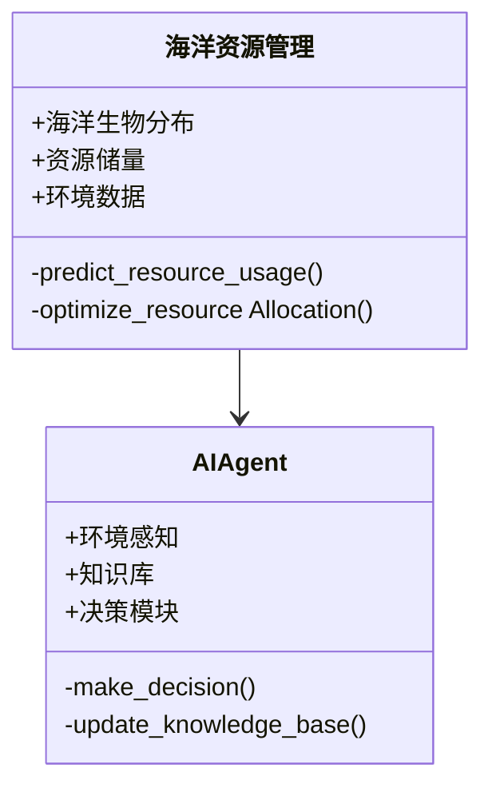

                 


# AI Agent在智能海洋资源管理中的实践

> **关键词**: AI Agent, 智能海洋资源管理, 人工智能算法, 系统架构设计, 智能决策支持

> **摘要**: 本文探讨了AI Agent在智能海洋资源管理中的应用，从基本概念到核心算法，再到系统架构和项目实战，详细分析了AI Agent如何助力海洋资源的高效管理和可持续利用。文章结合实际案例，阐述了AI Agent在海洋环境监测、资源分配优化和智能决策支持等方面的具体实践，为读者提供了全面的技术视角和实践指导。

---

## 第一部分: AI Agent与智能海洋资源管理概述

### 第1章: AI Agent与海洋资源管理概述

#### 1.1 AI Agent的基本概念

##### 1.1.1 AI Agent的定义与特点
- **定义**: AI Agent（人工智能代理）是一种能够感知环境、自主决策并执行任务的智能实体。
- **特点**:
  - **自主性**: 能够自主决策，无需外部干预。
  - **反应性**: 能够实时感知环境并做出反应。
  - **学习性**: 可以通过经验优化自身行为。
  - **协作性**: 能够与其他Agent或系统协同工作。

##### 1.1.2 AI Agent的核心技术
- **知识表示**: 通过符号逻辑或深度学习模型表示知识。
- **推理与规划**: 基于知识进行推理，制定行动计划。
- **行为决策**: 使用强化学习、监督学习等算法进行决策。

##### 1.1.3 AI Agent在智能系统中的作用
- **信息处理**: 处理复杂环境中的多源数据。
- **决策支持**: 提供基于数据的决策建议。
- **执行控制**: 协调多个系统或设备的行动。

#### 1.2 海洋资源管理的背景与挑战

##### 1.2.1 海洋资源的种类与价值
- **种类**: 包括渔业资源、矿产资源、能源资源等。
- **价值**: 经济价值高，同时具有生态价值。

##### 1.2.2 海洋资源管理的主要挑战
- **资源过度开发**: 非法捕捞、矿产过度开采。
- **环境污染**: 工业污染、海洋垃圾对生态的破坏。
- **气候变化**: 海平面上升、海水酸化对海洋生态系统的影响。

##### 1.2.3 智能化管理的必要性
- **提高管理效率**: 通过AI技术优化资源配置。
- **保护生态环境**: 实现精准监测和保护。
- **应对复杂挑战**: 综合处理多因素影响的复杂问题。

#### 1.3 AI Agent在海洋资源管理中的应用价值

##### 1.3.1 提高资源利用效率
- **智能化监测**: 实时监测海洋资源分布，优化捕捞和开采计划。
- **资源分配优化**: 基于AI Agent的决策支持，合理分配资源利用。

##### 1.3.2 优化资源分配与保护
- **动态监控**: 实时跟踪海洋资源的变化，防止过度开发。
- **生态保护区划分**: 利用AI Agent分析数据，划定保护区域。

##### 1.3.3 支持决策制定
- **数据驱动决策**: 通过AI分析提供科学依据。
- **风险评估**: 评估资源开发的风险，制定应对策略。

#### 1.4 本章小结
本章介绍了AI Agent的基本概念和其在海洋资源管理中的应用价值，强调了AI技术在提高管理效率和保护生态环境方面的重要性。

---

## 第二部分: AI Agent的核心概念与原理

### 第2章: AI Agent的核心概念与原理

#### 2.1 AI Agent的核心原理

##### 2.1.1 知识表示与推理
- **知识表示**: 使用语义网络或知识图谱表示海洋资源相关知识。
- **推理算法**: 基于规则的推理和基于深度学习的推理。

##### 2.1.2 行为规划与决策
- **强化学习**: 通过试错优化决策策略。
- **监督学习**: 基于历史数据训练决策模型。

##### 2.1.3 感知与交互
- **感知**: 利用传感器数据进行环境感知。
- **交互**: 与人类或其他系统进行信息交互。

#### 2.2 AI Agent的技术特征

##### 2.2.1 数据驱动 vs. 知识驱动
- **数据驱动**: 基于大量数据训练模型。
- **知识驱动**: 基于领域知识构建推理系统。

##### 2.2.2 强化学习 vs. 监督学习
- **强化学习**: 通过奖励机制优化行为。
- **监督学习**: 基于标注数据进行分类或回归。

##### 2.2.3 单智能体 vs. 多智能体
- **单智能体**: 独立完成任务。
- **多智能体**: 多个Agent协同工作。

#### 2.3 AI Agent与其他技术的关系

##### 2.3.1 AI Agent与大数据技术的结合
- **数据采集**: 利用大数据技术收集海洋环境数据。
- **数据分析**: 通过大数据处理优化AI Agent的决策。

##### 2.3.2 AI Agent与物联网的集成
- **实时感知**: 通过物联网设备获取实时环境数据。
- **智能控制**: 基于AI Agent进行智能控制。

##### 2.3.3 AI Agent与云计算的协同
- **计算能力**: 利用云计算资源进行模型训练和推理。
- **数据存储**: 使用云存储管理大量海洋资源数据。

#### 2.4 本章小结
本章详细讲解了AI Agent的核心原理及其与大数据、物联网和云计算等技术的结合，分析了不同技术在海洋资源管理中的协同作用。

---

## 第三部分: AI Agent的算法原理与实现

### 第3章: AI Agent的核心算法原理

#### 3.1 知识表示与推理算法

##### 3.1.1 语义网络与规则推理
- **语义网络**: 通过节点和边表示知识。
- **规则推理**: 基于预定义规则进行推理。

##### 3.1.2 基于图的推理算法
- **路径推理**: 通过图结构推导关系。
- **图嵌入**: 使用深度学习生成节点向量表示。

##### 3.1.3 深度学习的语义理解
- **神经网络模型**: 如BERT用于语义理解。
- **预训练语言模型**: 用于复杂文本分析。

#### 3.2 行为规划与决策算法

##### 3.2.1 强化学习算法（Q-learning）
- **算法原理**: 通过状态-动作-奖励机制优化策略。
- **数学模型**: 
  $$ Q(s,a) = Q(s,a) + \alpha [r + \max Q(s',a') - Q(s,a)] $$
- **代码示例**:
  ```python
  def q_learning(env, learning_rate=0.1, discount_factor=0.9):
      q_table = np.zeros((env.observation_space.n, env.action_space.n))
      for _ in range(1000):
          state = env.reset()
          done = False
          while not done:
              action = np.argmax(q_table[state])
              next_state, reward, done, _ = env.step(action)
              q_table[state][action] = q_table[state][action] + learning_rate * (reward + discount_factor * np.max(q_table[next_state]) - q_table[state][action])
  ```

##### 3.2.2 基于策略的决策算法
- **策略网络**: 直接输出最优动作。
- **数学模型**: 
  $$ \pi(a|s) = \text{softmax}(W s + b) $$
- **代码示例**:
  ```python
  import torch
  class PolicyNetwork(nn.Module):
      def __init__(self, input_dim, output_dim):
          super(PolicyNetwork, self).__init__()
          self.fc1 = nn.Linear(input_dim, 128)
          self.fc2 = nn.Linear(128, output_dim)
          self.softmax = nn.Softmax(dim=1)
      
      def forward(self, x):
          x = torch.relu(self.fc1(x))
          x = self.softmax(self.fc2(x))
          return x
  ```

##### 3.2.3 多目标优化算法
- **算法原理**: 在多个目标之间寻找平衡点。
- **数学模型**: 
  $$ \text{minimize} \quad f_1(x) + \lambda f_2(x) $$
- **代码示例**:
  ```python
  def multi_objective_optimization(x):
      f1 = x**2
      f2 = (x-1)**2
      return f1 + 0.5*f2
  ```

#### 3.3 感知与交互算法

##### 3.3.1 基于视觉的感知算法
- **目标检测**: 使用YOLO等算法检测海洋生物。
- **图像分割**: 使用U-Net进行区域分割。

##### 3.3.2 基于语音的交互算法
- **语音识别**: 使用ASR技术进行语音转文本。
- **语音合成**: 使用TTS技术生成语音指令。

##### 3.3.3 多模态感知与交互
- **融合技术**: 结合视觉、听觉等多种感知方式。
- **应用场景**: 智能海洋监测设备的多模态交互。

#### 3.4 算法实现的数学模型与公式

##### 3.4.1 强化学习的数学模型
$$ Q(s,a) = Q(s,a) + \alpha [r + \max Q(s',a') - Q(s,a)] $$

##### 3.4.2 多目标优化的数学模型
$$ \text{minimize} \quad f_1(x) + \lambda f_2(x) $$

#### 3.5 本章小结
本章详细讲解了AI Agent的核心算法，包括知识表示与推理、行为规划与决策以及感知与交互的算法原理，并通过数学公式和代码示例进行了具体说明。

---

## 第四部分: 系统分析与架构设计

### 第4章: 系统分析与架构设计

#### 4.1 项目背景介绍
- **项目目标**: 实现基于AI Agent的海洋资源智能管理系统。
- **应用场景**: 海洋环境监测、资源分配优化等。

#### 4.2 系统功能设计

##### 4.2.1 领域模型设计


##### 4.2.2 系统架构设计


##### 4.2.3 系统接口设计
- **API接口**: 提供RESTful API供其他系统调用。
- **数据接口**: 与传感器和监测设备的数据接口对接。

#### 4.3 本章小结
本章通过系统分析与架构设计，明确了基于AI Agent的海洋资源管理系统的整体结构和功能模块，为后续的实现奠定了基础。

---

## 第五部分: 项目实战

### 第5章: 项目实战

#### 5.1 环境配置与安装

##### 5.1.1 系统需求
- **硬件要求**: CPU: 4核及以上，GPU: 边缘计算支持。
- **软件要求**: Python 3.8+, PyTorch, OpenCV, Flask。

##### 5.1.2 安装依赖
```bash
pip install numpy torch opencv-python flask
```

#### 5.2 系统核心实现

##### 5.2.1 核心代码实现
```python
import torch
from torch import nn
import cv2
import requests

class海洋资源管理:
    def __init__(self):
        self.agent = AI-Agent()
        self.sensors = Sensor-Node()

    def monitor(self):
        # 实时监测海洋环境数据
        data = self.sensors.read_data()
        # 调用AI Agent进行分析
        result = self.agent.analyze(data)
        return result

    def optimize_resource(self):
        # 资源优化分配
        resources = self.get_resource_status()
        optimized = self.agent.optimize(resources)
        return optimized
```

##### 5.2.2 代码应用解读与分析
- **实时监测**: 使用传感器节点获取环境数据。
- **AI分析**: 调用AI Agent进行数据处理和决策。
- **资源优化**: 基于AI Agent的分析结果优化资源分配。

#### 5.3 实际案例分析

##### 5.3.1 案例背景
- **项目目标**: 监测和管理某区域的渔业资源。
- **数据来源**: 传感器、卫星图像、历史数据。

##### 5.3.2 实施步骤
1. **数据采集**: 通过传感器获取海洋环境数据。
2. **数据处理**: 对数据进行清洗和预处理。
3. **模型训练**: 使用强化学习算法训练AI Agent。
4. **系统部署**: 部署AI Agent进行实时监测和优化。

#### 5.4 结果解读与分析
- **监测结果**: 实时显示海洋环境数据。
- **优化结果**: 资源分配效率提升，生态破坏减少。

#### 5.5 本章小结
本章通过一个实际案例展示了AI Agent在海洋资源管理中的应用，详细讲解了项目的实施步骤和结果分析。

---

## 第六部分: 最佳实践与未来展望

### 第6章: 最佳实践与未来展望

#### 6.1 最佳实践

##### 6.1.1 技术选型
- **选择合适的AI框架**: 根据需求选择TensorFlow或PyTorch。
- **数据处理工具**: 使用Pandas进行数据清洗。

##### 6.1.2 系统优化
- **模型优化**: 使用模型压缩和量化技术。
- **性能优化**: 优化代码运行效率。

##### 6.1.3 安全性保障
- **数据安全**: 加密数据传输和存储。
- **系统防护**: 防护DDoS攻击和数据泄露。

#### 6.2 小结与注意事项
- **小结**: AI Agent在海洋资源管理中的应用前景广阔，但仍需在技术细节和系统优化上不断改进。
- **注意事项**: 注意数据隐私和系统安全，确保系统的稳定性和可靠性。

#### 6.3 未来展望
- **技术趋势**: 更多AI技术（如生成式AI）的应用。
- **应用场景**: 更多领域的智能化管理。
- **研究方向**: 提高AI Agent的自主性和智能性。

#### 6.4 本章小结
本章总结了AI Agent在海洋资源管理中的最佳实践，并展望了未来的技术发展趋势。

---

## 作者：AI天才研究院/AI Genius Institute & 禅与计算机程序设计艺术 /Zen And The Art of Computer Programming

---

以上是《AI Agent在智能海洋资源管理中的实践》的完整目录大纲和文章内容，涵盖了从基础概念到系统设计和实际项目的各个方面，结合了理论与实践，为读者提供了全面的技术视角和实践指导。

