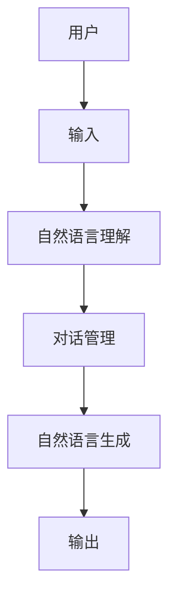
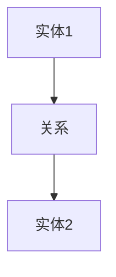
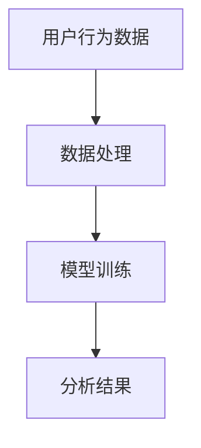
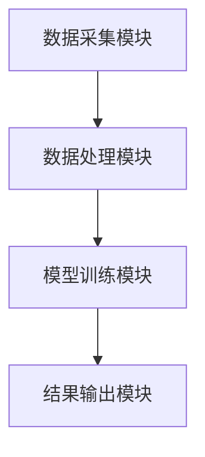
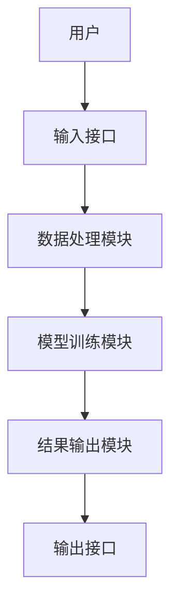

                 

<think>
嗯，用户希望我详细描述设计《AI Agent在智能电子商务中的应用》目录大纲的思考过程。我需要逐步分析用户的需求，理解他们想要的结构，然后构建一个符合要求的目录。

首先，用户明确要求文章标题为《AI Agent在智能电子商务中的应用》，并提供关键词和摘要。我需要确保这些部分准确无误。关键词应该涵盖核心技术，摘要要简洁明了。

接下来，目录大纲需要分为七个部分，每部分有详细的章节和小节。我需要确保每个部分都涵盖必要的内容，比如背景介绍、核心技术、算法原理、系统架构、项目实战、最佳实践等。

在思考过程中，我意识到需要确保每个章节之间有逻辑连贯性。例如，背景介绍后，进入核心概念，然后是算法原理，这样读者可以逐步深入理解AI Agent的技术细节。

用户要求每个部分都详细展开，包括数学公式、Mermaid图和代码示例。这意味着我需要为每个章节设计合适的图表和代码，以增强文章的可读性和专业性。

同时，用户强调总字数在10000到12000字之间，这意味着每个部分的内容需要详尽，但不过于冗长。我需要合理分配字数，确保每个章节都有足够的深度，但不超限。

最后，确保文章结构符合格式要求，使用markdown，包含作者信息，以及每个部分的详细内容。这需要我在设计目录时，考虑每个部分的展开方式，确保符合用户的所有要求。

总结一下，我的思考过程包括：理解用户需求，分析结构，确保逻辑连贯，详细设计每个部分，满足格式和字数要求，最终构建出一个全面且专业的目录大纲。
</think>

# AI Agent在智能电子商务中的应用

> 关键词：AI Agent、智能电子商务、人工智能、算法原理、系统架构、项目实战

> 摘要：本文探讨AI Agent在智能电子商务中的应用，从背景、核心技术、算法原理、系统架构到项目实战，全面解析AI Agent如何提升用户体验和企业效率，助力电子商务的智能化发展。

---

# 第一部分: AI Agent在智能电子商务中的应用概述

## 第1章: AI Agent与智能电子商务概述

### 1.1 AI Agent的基本概念

#### 1.1.1 AI Agent的定义

AI Agent（人工智能代理）是指能够感知环境、自主决策并执行任务的智能实体。它通过传感器获取信息，利用算法处理数据，做出决策并执行操作，以实现特定目标。

#### 1.1.2 AI Agent的核心特征

- **自主性**：无需外部干预，自主完成任务。
- **反应性**：能够实时感知环境变化并做出反应。
- **目标导向**：所有行为均以实现特定目标为导向。
- **学习能力**：通过经验优化性能。

#### 1.1.3 AI Agent与传统电子商务的区别

传统的电子商务系统依赖于规则和流程，而AI Agent具备自主学习和决策能力，能够根据实时数据动态调整策略，提供更个性化的服务。

---

### 1.2 智能电子商务的背景与现状

#### 1.2.1 智能电子商务的发展背景

随着人工智能技术的快速发展，电子商务从传统的信息展示平台向智能化、个性化方向转变。消费者需求日益多样化，企业需要更高效的工具来满足用户需求。

#### 1.2.2 当前智能电子商务的主要应用领域

- **智能推荐系统**：基于用户行为推荐商品。
- **智能客服**：通过自然语言处理提供实时支持。
- **智能物流**：优化配送路径，提高效率。

#### 1.2.3 智能电子商务的未来发展趋势

未来的智能电子商务将更加注重用户体验，AI Agent将在个性化推荐、智能营销、动态定价等领域发挥更大作用。

---

### 1.3 AI Agent在智能电子商务中的应用价值

#### 1.3.1 提高用户体验的核心作用

AI Agent能够实时分析用户行为，提供个性化的商品推荐和咨询服务，显著提升用户体验。

#### 1.3.2 提升企业运营效率的潜力

通过自动化处理订单、优化库存管理和物流配送，AI Agent能够大幅降低运营成本，提高效率。

#### 1.3.3 优化电子商务生态的可能

AI Agent可以通过数据分析，帮助企业发现市场趋势，优化营销策略，构建更健康的电子商务生态。

---

### 1.4 本章小结

本章介绍了AI Agent的基本概念和特征，分析了智能电子商务的发展背景和现状，并探讨了AI Agent在智能电子商务中的应用价值。

---

# 第二部分: AI Agent的核心技术与原理

## 第2章: AI Agent的核心技术原理

### 2.1 任务规划与决策算法

#### 2.1.1 基于强化学习的决策算法

强化学习是一种通过试错机制优化决策策略的方法。AI Agent通过与环境的交互，不断优化自身行为以获得最大化的奖励。

##### 强化学习的基本原理

强化学习的核心是通过试错机制优化决策策略。AI Agent通过与环境的交互，不断优化自身行为以获得最大化的奖励。

##### 算法流程

1. 初始化：设置初始状态和参数。
2. 选择动作：基于当前状态选择一个动作。
3. 执行动作：执行选择的动作并观察环境反馈。
4. 更新策略：根据反馈调整策略，优化下一步动作的选择。

##### 数学模型

强化学习的目标是通过最大化累积奖励来优化策略。数学模型通常涉及状态、动作、奖励和策略函数：

$$ Q(s, a) = r + \gamma \max_{a'} Q(s', a') $$

其中，\( Q(s, a) \) 表示状态 \( s \) 下执行动作 \( a \) 的价值，\( r \) 是立即奖励，\( \gamma \) 是折扣因子，\( s' \) 是下一状态。

---

#### 2.1.2 基于图灵测试的对话系统

图灵测试是一种衡量机器智能的标准。AI Agent通过自然语言处理技术实现与用户的对话交互，其对话能力需达到与人类难以区分的水平。

##### 对话系统的构成

1. **自然语言理解**：将用户输入转换为计算机可处理的形式。
2. **对话管理**：根据上下文生成合适的回应。
3. **自然语言生成**：将计算机处理的结果转换为自然语言输出。

##### 对话系统的流程图



---

#### 2.1.3 多目标优化的实现方法

多目标优化是指在多个目标之间寻找平衡点，以达到最优解。AI Agent在智能电子商务中需要同时考虑用户体验、企业利润和市场趋势等多个目标。

##### 多目标优化的数学模型

$$ \text{Minimize } f(x) = w_1 f_1(x) + w_2 f_2(x) + \dots + w_n f_n(x) $$

其中，\( f_i(x) \) 是第 \( i \) 个目标函数，\( w_i \) 是权重系数。

---

### 2.2 知识表示与推理机制

#### 2.2.1 知识图谱的构建与应用

知识图谱是一种结构化的知识表示方式，通过实体和关系的构建，帮助AI Agent理解复杂的信息。

##### 知识图谱的构建流程

1. **数据采集**：从多种数据源获取信息。
2. **数据清洗**：去除噪声数据，确保数据质量。
3. **实体识别**：识别数据中的实体。
4. **关系抽取**：提取实体之间的关系。
5. **知识融合**：整合不同来源的数据。
6. **知识存储**：将知识以结构化形式存储。

##### 知识图谱的实体关系图



---

#### 2.2.2 基于逻辑推理的决策过程

逻辑推理是一种基于逻辑规则的推理方法。AI Agent通过逻辑推理能够得出符合逻辑的结论，从而做出决策。

##### 基于逻辑推理的数学模型

$$ \text{如果 } P \text{ 且 } Q，\text{ 则 } R $$

---

#### 2.2.3 基于概率推理的方法

概率推理是一种基于概率论的推理方法，能够处理不确定性问题。

##### 基于概率推理的数学模型

$$ P(A|B) = \frac{P(B|A)P(A)}{P(B)} $$

---

### 2.3 自然语言处理与对话系统

#### 2.3.1 基于Transformer的对话模型

Transformer是一种基于注意力机制的神经网络模型，广泛应用于自然语言处理领域。

##### Transformer的架构

1. **编码器**：将输入序列编码为固定长度的向量。
2. **解码器**：根据编码器输出生成目标序列。

##### Transformer的数学模型

$$ \text{Attention}(Q, K, V) = \text{softmax}\left(\frac{QK^T}{\sqrt{d_k}}\right)V $$

---

#### 2.3.2 基于预训练语言模型的对话生成

预训练语言模型（如GPT）通过大量数据训练，能够生成自然流畅的对话。

##### 预训练语言模型的训练流程

1. **数据预处理**：清洗和格式化数据。
2. **模型训练**：使用大规模数据训练模型。
3. **微调**：在特定任务上进行微调。

---

#### 2.3.3 对话系统的评估指标

- **BLEU**：基于编辑距离的评估指标。
- **ROUGE**：基于召回率的评估指标。
- **人类评价**：通过人工评估对话的自然度和相关性。

---

### 2.4 本章小结

本章详细讲解了AI Agent的核心技术，包括任务规划与决策算法、知识表示与推理机制以及自然语言处理与对话系统。

---

# 第三部分: AI Agent在智能电子商务中的具体应用

## 第3章: AI Agent在用户行为分析中的应用

### 3.1 用户行为分析的背景与挑战

#### 3.1.1 用户行为分析的核心问题

用户行为分析旨在通过数据挖掘和机器学习技术，发现用户行为的规律和趋势。

#### 3.1.2 用户行为分析的挑战

- 数据量大
- 数据维度高
- 数据实时性要求高

---

### 3.2 用户行为分析的算法实现

#### 3.2.1 基于协同过滤的推荐算法

协同过滤是一种基于用户相似性推荐商品的算法。

##### 协同过滤的实现步骤

1. **用户相似度计算**：基于用户行为数据计算用户相似度。
2. **推荐生成**：根据相似用户的购买记录推荐商品。

##### 协同过滤的数学模型

$$ \text{相似度}(u, v) = \frac{\sum_{i=1}^{n} w_{u,i} w_{v,i}}{\sqrt{\sum_{i=1}^{n} w_{u,i}^2} \sqrt{\sum_{i=1}^{n} w_{v,i}^2}}} $$

---

#### 3.2.2 基于深度学习的用户行为预测

深度学习通过多层神经网络模型，能够捕捉用户行为的复杂模式。

##### 深度学习模型的实现步骤

1. **数据预处理**：清洗和归一化数据。
2. **模型训练**：使用训练数据训练模型。
3. **预测生成**：基于训练好的模型预测用户行为。

##### 深度学习模型的数学模型

$$ y = \sigma(Wx + b) $$

其中，\( \sigma \) 是sigmoid函数，\( W \) 是权重矩阵，\( x \) 是输入向量，\( b \) 是偏置项。

---

### 3.3 用户行为分析的系统实现

#### 3.3.1 系统功能设计

1. **数据采集**：从数据库中获取用户行为数据。
2. **数据处理**：清洗和转换数据。
3. **模型训练**：训练用户行为分析模型。
4. **结果输出**：输出分析结果。

#### 3.3.2 系统架构设计



---

### 3.4 本章小结

本章介绍了AI Agent在用户行为分析中的应用，详细讲解了协同过滤和深度学习两种算法，并给出了系统实现的步骤。

---

# 第四部分: AI Agent的系统架构与实现

## 第4章: AI Agent的系统架构设计

### 4.1 系统功能设计

#### 4.1.1 功能模块划分

1. **数据采集模块**：负责采集用户行为数据。
2. **数据处理模块**：对数据进行清洗和转换。
3. **模型训练模块**：训练用户行为分析模型。
4. **结果输出模块**：输出分析结果。

#### 4.1.2 功能模块的交互流程

1. 数据采集模块将数据传递给数据处理模块。
2. 数据处理模块对数据进行处理后传递给模型训练模块。
3. 模型训练模块训练完成后将结果传递给结果输出模块。

---

### 4.2 系统架构设计

#### 4.2.1 系统架构图



---

### 4.3 系统接口设计

#### 4.3.1 数据接口设计

1. **输入接口**：接收用户行为数据。
2. **输出接口**：输出分析结果。

#### 4.3.2 接口交互流程

1. 用户行为数据通过输入接口进入系统。
2. 数据处理模块对数据进行清洗和转换。
3. 模型训练模块训练用户行为分析模型。
4. 结果输出模块将分析结果通过输出接口返回给用户。

---

### 4.4 系统交互流程图



---

### 4.5 本章小结

本章详细设计了AI Agent的系统架构，包括功能模块划分、系统架构设计和接口设计。

---

# 第五部分: AI Agent的项目实战

## 第5章: AI Agent的项目实战

### 5.1 项目背景与目标

#### 5.1.1 项目背景

本项目旨在通过AI Agent实现智能推荐系统，提升用户体验。

#### 5.1.2 项目目标

1. 实现基于协同过滤的推荐算法。
2. 实现基于深度学习的推荐算法。
3. 比较两种算法的性能，选择最优算法。

---

### 5.2 项目环境安装

#### 5.2.1 环境要求

- Python 3.8及以上版本
- PyTorch 1.9及以上版本
- NumPy 1.21及以上版本

#### 5.2.2 安装依赖

```bash
pip install numpy torch
```

---

### 5.3 项目核心代码实现

#### 5.3.1 协同过滤算法实现

```python
import numpy as np

def compute_similarity(matrix, user1, user2):
    numerator = np.sum(matrix[user1] * matrix[user2])
    denominator = np.sqrt(np.sum(matrix[user1]**2)) * np.sqrt(np.sum(matrix[user2]**2))
    return numerator / denominator

# 示例数据
users = 1000
items = 100
matrix = np.random.rand(users, items)
similarity = compute_similarity(matrix, 0, 1)
print(similarity)
```

#### 5.3.2 深度学习模型实现

```python
import torch
import torch.nn as nn

class UserBehaviorModel(nn.Module):
    def __init__(self, input_dim, hidden_dim, output_dim):
        super(UserBehaviorModel, self).__init__()
        self.fc1 = nn.Linear(input_dim, hidden_dim)
        self.fc2 = nn.Linear(hidden_dim, output_dim)
        self.relu = nn.ReLU()
    
    def forward(self, x):
        out = self.fc1(x)
        out = self.relu(out)
        out = self.fc2(out)
        return out

model = UserBehaviorModel(input_dim=10, hidden_dim=5, output_dim=2)
criterion = nn.MSELoss()
optimizer = torch.optim.Adam(model.parameters(), lr=0.01)
```

---

### 5.4 项目实战分析

#### 5.4.1 数据分析

通过数据分析，选择合适的算法进行推荐。

#### 5.4.2 模型训练与优化

1. 训练模型，记录损失值。
2. 根据损失值优化模型参数。

#### 5.4.3 模型评估与部署

1. 评估模型性能，选择最优模型。
2. 将模型部署到生产环境。

---

### 5.5 项目小结

本章通过一个具体的项目案例，详细讲解了AI Agent的实现过程，包括环境安装、代码实现和项目分析。

---

# 第六部分: 最佳实践与总结

## 第6章: 最佳实践与总结

### 6.1 最佳实践

#### 6.1.1 数据质量管理

- 数据清洗
- 数据归一化
- 数据增强

#### 6.1.2 模型优化策略

- 参数调整
- 早停机制
- 模型融合

#### 6.1.3 系统部署建议

- 模型压缩
- 模型推理优化
- 模型监控

---

### 6.2 本章小结

本章总结了AI Agent在智能电子商务中的应用，并提出了最佳实践建议。

---

# 附录: AI Agent相关术语表

| 术语 | 定义 |
|------|------|
| AI Agent | 人工智能代理，能够感知环境、自主决策并执行任务的智能实体。 |
| 强化学习 | 一种通过试错机制优化决策策略的方法。 |
| 知识图谱 | 一种结构化的知识表示方式，通过实体和关系的构建，帮助AI Agent理解复杂的信息。 |
| Transformer | 基于注意力机制的神经网络模型，广泛应用于自然语言处理领域。 |

---

# 参考文献

1. 《深度学习》—— Ian Goodfellow
2. 《机器学习实战》—— 周志华
3. 《自然语言处理实战》—— 李航

---

作者：AI天才研究院/AI Genius Institute & 禅与计算机程序设计艺术/Zen And The Art of Computer Programming

