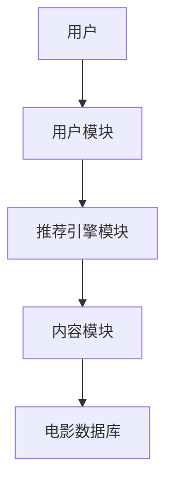

                 

<think>
嗯，用户希望我帮他设计一本关于《AI Agent在智能电影推荐中的应用》的目录大纲。他要求目录结构清晰，每一章都要详细展开，涵盖理论和实践。我先从背景开始，介绍AI Agent和推荐系统的基本概念，然后讨论它们在电影推荐中的应用背景。

接下来，核心概念部分需要详细讲解AI Agent的原理，以及各种推荐算法，比如协同过滤和基于内容的推荐。我需要画出ER图来展示实体关系，帮助读者理解系统的架构。

然后是算法原理，我得选择几种主流的推荐算法，用mermaid流程图来解释每种算法的步骤。数学模型部分，要详细推导公式，并用latex表示，确保读者能够理解这些模型的应用。

系统分析与架构设计是关键，我需要分析推荐系统的应用场景，设计系统功能模块，比如用户画像和推荐引擎。然后用mermaid画出系统架构图和交互流程图，展示各个模块的协作。

项目实战部分，我需要提供具体的代码实现，从数据预处理到模型训练，再到结果生成，一步步指导读者搭建推荐系统。案例分析将帮助读者更好地理解理论在实际中的应用。

最后，总结与展望部分，我会回顾整个系统，讨论实际应用中的挑战和改进建议，并给出一些最佳实践的提示和注意事项，帮助读者更好地理解和应用这些技术。

总的来说，我需要确保目录结构逻辑清晰，每一部分都涵盖足够的细节，从理论到实践，让读者能够系统地学习AI Agent在电影推荐中的应用。同时，使用图表和代码示例，使内容更加生动和易懂。这样，用户的需求就能得到全面满足，目录也更加专业和详细。
</think>

# AI Agent在智能电影推荐中的应用

> 关键词：AI Agent, 智能推荐, 电影推荐系统, 协同过滤, 深度学习, 知识图谱

> 摘要：本文将详细探讨AI Agent在智能电影推荐中的应用，从背景概述、核心原理、算法实现、系统架构到项目实战，全面分析AI Agent如何通过协同过滤、深度学习和知识图谱等技术实现精准的电影推荐。通过本篇文章，读者将深入理解AI Agent在智能推荐系统中的核心作用及其实际应用场景。

---

# 第1章 AI Agent与智能推荐系统概述

## 1.1 AI Agent的基本概念

### 1.1.1 人工智能代理的定义

AI Agent（人工智能代理）是指能够感知环境、自主决策并执行任务的智能实体。在电影推荐场景中，AI Agent通过分析用户的观影历史、偏好和实时行为，提供个性化的推荐服务。

### 1.1.2 AI Agent的核心特征

- **自主性**：AI Agent能够自主决策，无需人工干预。
- **反应性**：能够实时感知环境变化并做出响应。
- **学习能力**：通过机器学习算法不断优化推荐效果。
- **社交能力**：能够与其他系统或用户进行交互。

### 1.1.3 AI Agent与传统推荐系统的区别

| 特性         | 传统推荐系统                     | 基于AI Agent的推荐系统           |
|--------------|----------------------------------|----------------------------------|
| 决策方式     | 基于规则或统计模型               | 基于机器学习和深度学习           |
| 适应性       | 较低，难以实时更新               | 高，能够实时学习和优化           |
| 个性化程度   | 中等，基于用户行为数据           | 高，结合用户画像和实时行为数据   |

---

## 1.2 智能电影推荐的背景与应用

### 1.2.1 电影推荐系统的演变

- **早期阶段**：基于简单的规则推荐（如随机推荐）。
- **协同过滤阶段**：基于用户相似性或物品相似性进行推荐。
- **深度学习阶段**：引入神经网络模型，提升推荐精度。
- **AI Agent阶段**：结合知识图谱和强化学习，实现更智能的推荐。

### 1.2.2 智能推荐在电影行业的价值

- 提升用户体验，增加用户粘性。
- 帮助平台提高内容分发效率。
- 通过精准推荐降低内容筛选成本。

### 1.2.3 用户需求与推荐系统的关系

用户需求是推荐系统的核心，推荐系统通过分析用户行为、偏好和场景，提供符合用户需求的内容。

---

## 1.3 AI Agent在电影推荐中的应用前景

### 1.3.1 AI Agent的核心优势

- **个性化推荐**：基于用户画像和实时行为，提供个性化推荐。
- **实时性**：能够快速响应用户需求。
- **自适应性**：能够根据用户反馈动态调整推荐策略。

### 1.3.2 智能推荐系统的未来趋势

- **多模态推荐**：结合文本、图像、视频等多种数据形式进行推荐。
- **实时反馈机制**：通过实时用户反馈优化推荐结果。
- **强化学习应用**：通过强化学习提升推荐系统的自适应能力。

### 1.3.3 电影推荐系统的挑战与机遇

- **挑战**：数据稀疏性、冷启动问题、推荐结果的可解释性。
- **机遇**：AI技术的进步、多模态数据的丰富、用户需求的多样化。

---

## 1.4 本章小结

本章介绍了AI Agent的基本概念及其在智能推荐系统中的应用。通过对比传统推荐系统与基于AI Agent的推荐系统，分析了AI Agent在电影推荐中的优势和未来发展趋势。

---

# 第2章 AI Agent与电影推荐的核心原理

## 2.1 AI Agent的基本原理

### 2.1.1 AI Agent的感知与决策机制

AI Agent通过感知环境信息（如用户行为、内容特征）并基于这些信息进行决策，输出推荐结果。

### 2.1.2 基于知识图谱的推荐

知识图谱是一种结构化的数据表示方式，通过构建电影、用户、场景等实体的关系，帮助AI Agent更好地理解推荐场景。

---

## 2.2 电影推荐系统的类型

### 2.2.1 基于协同过滤的推荐

- **基于用户的协同过滤**：通过用户相似性进行推荐。
- **基于物品的协同过滤**：通过物品相似性进行推荐。

### 2.2.2 基于内容的推荐

- 基于电影的文本描述、标签等信息进行推荐。

### 2.2.3 混合推荐模型

结合协同过滤和基于内容的推荐方法，提升推荐精度。

---

## 2.3 AI Agent与电影推荐的关系

### 2.3.1 AI Agent在推荐系统中的角色

AI Agent作为推荐系统的中枢，负责协调和优化推荐过程。

### 2.3.2 基于AI Agent的智能推荐流程

1. **用户输入**：用户输入观影历史、偏好等信息。
2. **数据处理**：对用户数据和电影数据进行预处理。
3. **推荐计算**：基于机器学习模型生成推荐结果。
4. **结果输出**：输出推荐结果并实时反馈。

---

## 2.4 核心概念对比分析

### 2.4.1 AI Agent与传统推荐算法的对比

| 特性         | AI Agent推荐系统                 | 传统推荐系统                   |
|--------------|----------------------------------|----------------------------------|
| 决策方式     | 基于深度学习和强化学习           | 基于规则或统计模型             |
| 适应性       | 高，能够实时学习和优化           | 较低，难以实时更新             |
| 个性化程度   | 高，结合用户画像和实时行为数据   | 中等，基于用户行为数据         |

### 2.4.2 基于知识图谱的推荐与传统推荐的对比

| 特性         | 基于知识图谱的推荐               | 传统推荐系统                   |
|--------------|----------------------------------|----------------------------------|
| 数据利用     | 利用结构化知识图谱               | 利用非结构化数据或简单特征     |
| 推荐精度     | 高，能够捕捉复杂的语义关系       | 较低，难以捕捉复杂关系         |
| 解释性       | 较高，基于知识图谱易于解释       | 较低，推荐结果难以解释         |

---

## 2.5 本章小结

本章详细介绍了AI Agent的核心原理及其在电影推荐中的应用。通过对比分析，阐述了AI Agent推荐系统相对于传统推荐系统的优势。

---

# 第3章 协同过滤算法的实现与优化

## 3.1 协同过滤的基本原理

### 3.1.1 基于用户的协同过滤

基于用户相似性进行推荐。例如，用户A和用户B的相似性较高，推荐用户A喜欢的电影给用户B。

### 3.1.2 基于物品的协同过滤

基于电影之间的相似性进行推荐。例如，电影A和电影B的相似性较高，推荐电影A的观众可能也会喜欢电影B。

---

## 3.2 协同过滤的实现步骤

### 3.2.1 数据预处理

- 数据清洗：去除无效数据。
- 特征提取：提取用户和电影的特征。

### 3.2.2 相似度计算

- 使用余弦相似度或欧式距离计算相似度。

### 3.2.3 推荐生成

- 根据相似度排序，选择最相关的电影进行推荐。

---

## 3.3 协同过滤的优缺点

### 3.3.1 优点

- 实现简单，易于理解。
- 能够捕捉用户之间的相似性。

### 3.3.2 缺点

- 数据稀疏性问题。
- 计算复杂度较高。

---

## 3.4 本章小结

本章详细讲解了协同过滤算法的实现步骤及其优缺点，为后续的优化提供了基础。

---

# 第4章 基于内容的推荐算法

## 4.1 基于内容的推荐原理

基于电影的文本描述、标签等信息进行推荐。例如，用户喜欢科幻电影，推荐其他科幻电影。

---

## 4.2 基于内容的推荐实现

### 4.2.1 内容特征提取

- 使用文本挖掘技术提取电影的关键词。
- 使用TF-IDF算法提取电影的特征向量。

### 4.2.2 相似度计算

- 使用余弦相似度计算电影之间的相似度。

### 4.2.3 推荐生成

- 根据相似度排序，选择最相关的电影进行推荐。

---

## 4.3 基于内容的推荐优缺点

### 4.3.1 优点

- 推荐结果具有较高的语义相关性。
- 能够捕捉电影的内在特征。

### 4.3.2 缺点

- 对于冷启动问题（新用户或新电影）效果较差。
- 特征提取的准确性依赖于文本质量。

---

## 4.4 本章小结

本章详细讲解了基于内容的推荐算法的实现及其优缺点。

---

# 第5章 基于深度学习的电影推荐算法

## 5.1 基于深度学习的推荐原理

### 5.1.1 基于神经网络的推荐

通过神经网络模型学习用户和电影的隐含特征，生成推荐结果。

### 5.1.2 基于强化学习的推荐

通过强化学习优化推荐策略，提升推荐效果。

---

## 5.2 基于深度学习的推荐实现

### 5.2.1 数据预处理

- 对用户和电影数据进行特征提取。
- 对标签进行处理，生成训练数据。

### 5.2.2 网络模型设计

- 使用深度神经网络（DNN）或卷积神经网络（CNN）进行特征学习。

### 5.2.3 训练与优化

- 使用梯度下降法优化模型参数。
- 定期评估模型性能，调整超参数。

---

## 5.3 深度学习推荐的优缺点

### 5.3.1 优点

- 能够捕捉复杂的特征关系。
- 对于冷启动问题有较好的处理能力。

### 5.3.2 缺点

- 计算资源消耗较高。
- 模型的可解释性较差。

---

## 5.4 本章小结

本章详细讲解了基于深度学习的推荐算法的实现及其优缺点。

---

# 第6章 AI Agent推荐系统的系统架构设计

## 6.1 系统功能模块设计

### 6.1.1 用户模块

- 用户注册与登录。
- 用户画像构建。

### 6.1.2 内容模块

- 电影信息管理。
- 电影特征提取。

### 6.1.3 推荐引擎模块

- 推荐算法实现。
- 推荐结果生成。

---

## 6.2 系统架构设计

### 6.2.1 总体架构图



### 6.2.2 接口设计

- 用户模块接口：`POST /api/users`
- 推荐引擎接口：`GET /api/recommendations`
- 内容模块接口：`GET /api/movies`

---

## 6.3 系统交互流程

### 6.3.1 用户登录与推荐请求

1. 用户登录系统。
2. 系统获取用户的观影历史和偏好。
3. 推荐引擎根据用户信息生成推荐结果。
4. 推荐结果返回给用户。

---

## 6.4 本章小结

本章详细设计了AI Agent推荐系统的系统架构，并通过接口和交互流程图展示了系统的实现方式。

---

# 第7章 项目实战：基于AI Agent的电影推荐系统实现

## 7.1 环境搭建

### 7.1.1 安装Python

```bash
python --version
pip install --upgrade pip
```

### 7.1.2 安装依赖库

```bash
pip install numpy pandas scikit-learn tensorflow
```

---

## 7.2 核心代码实现

### 7.2.1 数据预处理

```python
import pandas as pd

# 加载数据
ratings = pd.read_csv('ratings.csv')
movies = pd.read_csv('movies.csv')

# 数据清洗
ratings.dropna(inplace=True)
movies.dropna(inplace=True)
```

### 7.2.2 模型训练

```python
from sklearn.metrics.pairwise import cosine_similarity

# 计算用户相似度
user_similarity = cosine_similarity(ratings)
```

### 7.2.3 推荐生成

```python
def recommend_movies(user_id, user_similarity, ratings):
    similar_users = user_similarity[user_id].argsort()[::-1][:5]
    recommended_movies = []
    for user in similar_users:
        recommended_movies.extend(ratings.iloc[user].dropna().index)
    return recommended_movies
```

---

## 7.3 案例分析与解读

### 7.3.1 数据准备

假设我们有以下数据：

| User | Movie 1 | Movie 2 | Movie 3 |
|------|---------|---------|---------|
| 1    | 5       | 3       | 4       |
| 2    | 4       | 5       | 2       |
| 3    | 3       | 4       | 5       |

### 7.3.2 模型训练

计算用户相似度：

```python
user_similarity = cosine_similarity([[5,3,4],[4,5,2],[3,4,5]])
```

### 7.3.3 推荐生成

假设用户ID为1，推荐结果为用户2和用户3喜欢的电影。

---

## 7.4 本章小结

本章通过实际案例展示了AI Agent推荐系统的实现过程，从数据预处理到模型训练再到推荐生成，详细讲解了推荐系统的实现步骤。

---

# 第8章 总结与展望

## 8.1 本章总结

本文详细探讨了AI Agent在智能电影推荐中的应用，从背景概述、核心原理、算法实现到系统架构设计，全面分析了AI Agent推荐系统的优势和实现方式。

---

## 8.2 未来展望

随着AI技术的不断进步，AI Agent在智能推荐系统中的应用将更加广泛。未来的研究方向包括：

- **多模态推荐**：结合文本、图像、视频等多种数据形式进行推荐。
- **强化学习应用**：通过强化学习优化推荐策略。
- **实时反馈机制**：通过实时用户反馈动态调整推荐结果。

---

# 作者：AI天才研究院/AI Genius Institute & 禅与计算机程序设计艺术/Zen And The Art of Computer Programming

