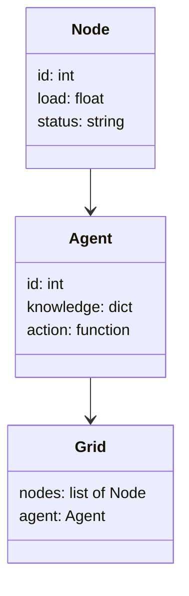
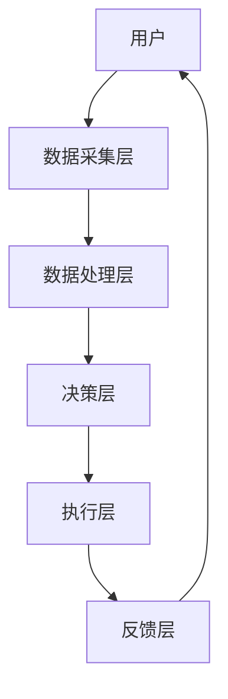
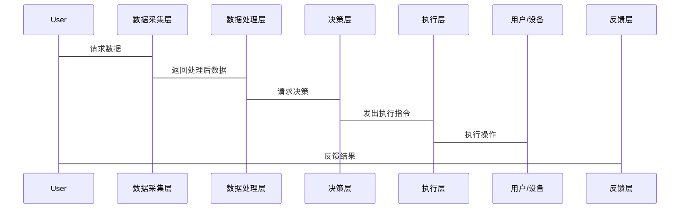

                 


# AI Agent在智能电网中的应用：负载平衡与故障预测

## 关键词：智能电网, AI Agent, 负载平衡, 故障预测, 人工智能, 强化学习, 时间序列分析

## 摘要：  
本文探讨了AI Agent在智能电网中的应用，重点分析了负载平衡与故障预测两个关键问题。通过结合AI Agent的感知、决策与自主学习能力，提出了基于强化学习和时间序列分析的解决方案，构建了系统的架构设计，并通过实际案例展示了AI Agent在智能电网中的实践价值。

---

# 第一部分: AI Agent与智能电网概述

## 第1章: AI Agent与智能电网概述

### 1.1 智能电网的基本概念

#### 1.1.1 智能电网的定义与特点  
智能电网（Smart Grid）是通过先进的信息通信技术、计算机技术和自动控制技术，将发电、输电、配电、用电等环节有机结合起来的现代化电力系统。其特点包括：  
- **智能化**：利用AI、大数据等技术实现电网的智能调控。  
- **高效性**：优化电力分配，提高能源利用效率。  
- **可靠性**：通过实时监测和快速响应，减少停电风险。  
- **环保性**：支持可再生能源的接入，减少碳排放。  

#### 1.1.2 智能电网的发展背景  
随着全球能源结构的调整和环保需求的增加，传统电网的弊端日益显现，例如能源浪费、设备老化、停电频发等。智能电网通过数字化和智能化技术，为这些问题提供了解决方案。  

#### 1.1.3 智能电网的核心技术与应用领域  
核心技术包括：  
- **物联网技术**：实现设备的实时监测与数据采集。  
- **大数据分析**：处理海量数据，优化电网运行。  
- **人工智能**：用于预测、决策和自动化控制。  

主要应用领域包括：  
- 负载平衡  
- 故障预测与定位  
- 能源管理  
- 用户行为分析  

---

### 1.2 AI Agent的基本概念

#### 1.2.1 AI Agent的定义与分类  
AI Agent（人工智能代理）是指能够感知环境、自主决策并采取行动以实现目标的智能体。根据功能和应用场景的不同，AI Agent可以分为：  
- **反应式Agent**：基于当前感知做出反应。  
- **认知式Agent**：具备复杂推理和规划能力。  
- **协作式Agent**：能够与其他Agent或人类协同工作。  

#### 1.2.2 AI Agent的核心功能与优势  
AI Agent的核心功能包括：  
- **感知环境**：通过传感器或数据源获取信息。  
- **决策与规划**：基于信息做出最优决策。  
- **自主学习**：通过机器学习技术提升能力。  
- **通信与协作**：与其他系统或用户交互。  

其优势在于：  
- **实时性**：能够快速响应变化。  
- **准确性**：基于数据驱动的决策更可靠。  
- **灵活性**：适应复杂多变的环境。  

#### 1.2.3 AI Agent在智能电网中的作用  
AI Agent在智能电网中的主要作用包括：  
- 实时监控电网状态，优化电力分配。  
- 预测负荷变化，平衡电力供需。  
- 快速响应故障，减少停电时间。  
- 支持可再生能源的接入与管理。  

---

### 1.3 本章小结  
本章介绍了智能电网的基本概念、核心技术以及AI Agent的定义、功能与优势。AI Agent作为智能电网的重要组成部分，通过其感知、决策和自主学习能力，为电网的高效运行提供了有力支持。

---

# 第二部分: AI Agent在智能电网中的应用背景

## 第2章: 负载平衡与故障预测的背景与挑战

### 2.1 智能电网中的负载平衡问题

#### 2.1.1 负载平衡的定义与重要性  
负载平衡（Load Balancing）是指在电力系统中合理分配电力负载，以避免某些节点过载或欠载。其重要性体现在：  
- 避免设备过载损坏，延长设备寿命。  
- 提高电力系统的稳定性和可靠性。  
- 降低能源浪费，提高效率。  

#### 2.1.2 负载不平衡的负面影响  
负载不平衡可能导致以下问题：  
- 电压波动，影响用户设备的正常运行。  
- 设备过热，引发火灾等安全问题。  
- 系统不稳定，甚至引发大规模停电。  

#### 2.1.3 负载平衡的传统解决方案与局限性  
传统解决方案包括：  
- 基于规则的负载分配策略。  
- 基于数学优化的负载分配模型。  

其局限性在于：  
- 规则依赖人工经验，难以应对复杂场景。  
- 优化模型计算复杂，实时性差。  

---

### 2.2 智能电网中的故障预测问题

#### 2.2.1 故障预测的定义与意义  
故障预测是指通过分析电网设备的运行数据，预测设备可能发生的故障。其意义在于：  
- 提前发现潜在问题，避免设备损坏。  
- 减少停电时间，提高电网可靠性。  

#### 2.2.2 故障预测的传统方法与挑战  
传统方法包括：  
- 基于统计分析的方法，如回归分析。  
- 基于专家经验的故障诊断方法。  

其挑战在于：  
- 数据不足，难以准确预测。  
- 故障模式复杂，难以建模。  

---

### 2.3 AI Agent在负载平衡与故障预测中的应用前景

#### 2.3.1 AI Agent的优势与潜力  
AI Agent的优势在于：  
- 具备自主学习能力，能够不断优化决策策略。  
- 能够实时感知环境变化，快速响应。  

#### 2.3.2 AI Agent在智能电网中的应用场景  
- 负载预测与优化  
- 故障预警与定位  
- 可再生能源的动态管理  

#### 2.3.3 AI Agent技术的未来发展趋势  
- 更加智能化：结合深度学习和强化学习技术。  
- 更加协同化：实现多Agent协作，提高整体效率。  

---

### 2.4 本章小结  
本章分析了负载平衡和故障预测在智能电网中的重要性及其传统解决方案的局限性，提出了AI Agent在解决这些问题中的潜力和应用前景。

---

# 第三部分: AI Agent的核心概念与原理

## 第3章: AI Agent的核心概念与原理

### 3.1 AI Agent的基本原理

#### 3.1.1 AI Agent的感知与决策机制  
AI Agent的感知机制包括：  
- 数据采集：通过传感器获取实时数据。  
- 数据处理：对数据进行清洗、特征提取和分析。  

决策机制包括：  
- 状态评估：基于当前数据评估系统状态。  
- 行动选择：根据评估结果选择最优行动。  

#### 3.1.2 AI Agent的自主学习能力  
AI Agent的学习机制包括：  
- 监督学习：基于标注数据进行模型训练。  
- 强化学习：通过试错机制优化决策策略。  
- 聚类与分类：识别模式和异常情况。  

#### 3.1.3 AI Agent的通信与协作能力  
AI Agent的通信机制包括：  
- 数据共享：与其他系统或Agent共享数据。  
- 信息交互：通过协议进行实时通信。  

---

### 3.2 AI Agent在智能电网中的核心功能

#### 3.2.1 负载平衡的AI Agent设计  
- 数据采集：获取各节点的负载数据。  
- 负载预测：基于历史数据预测未来负载。  
- 负载分配：优化电力分配，平衡负载。  

#### 3.2.2 故障预测的AI Agent设计  
- 数据采集：监测设备运行状态。  
- 异常检测：识别潜在故障特征。  
- 故障定位：精确定位故障位置。  

#### 3.2.3 AI Agent的实时监控与反馈机制  
- 实时监测：持续监控电网状态。  
- 反馈优化：根据反馈结果调整决策策略。  

---

### 3.3 AI Agent与智能电网的交互流程

#### 3.3.1 用户需求的输入与解析  
- 用户输入需求：例如，用户希望优化电力分配。  
- 系统解析需求：将其转化为具体任务。  

#### 3.3.2 AI Agent的决策与执行  
- 数据分析：基于实时数据做出决策。  
- 行动执行：例如，调整电力分配策略。  

#### 3.3.3 系统反馈与优化  
- 系统反馈：例如，负载平衡后的数据。  
- 持续优化：根据反馈不断改进算法。  

---

### 3.4 本章小结  
本章详细介绍了AI Agent的基本原理及其在智能电网中的核心功能，强调了其在负载平衡和故障预测中的应用。

---

# 第四部分: AI Agent的算法原理与数学模型

## 第4章: 负载平衡的算法原理

### 4.1 强化学习在负载平衡中的应用

#### 4.1.1 强化学习的基本原理  
强化学习（Reinforcement Learning, RL）是一种通过试错机制学习最优策略的技术。其核心要素包括：  
- **状态（State）**：环境当前的状况。  
- **动作（Action）**：Agent采取的行动。  
- **奖励（Reward）**：对动作的评价。  

#### 4.1.2 强化学习在负载平衡中的应用流程  
1. **状态空间**：各节点的负载情况。  
2. **动作空间**：调整电力分配的策略。  
3. **奖励函数**：根据负载平衡效果给予奖励。  

#### 4.1.3 强化学习的数学模型  
强化学习的目标是找到最优策略，使得累计奖励最大化。数学模型如下：  
$$ V(s) = \max_{a} [ r(s, a) + V(s', a') ] $$  
其中，$V(s)$表示状态$s$的价值，$r(s, a)$是状态$s$下采取动作$a$的奖励，$s'$是新的状态。  

---

### 4.2 时间序列分析在故障预测中的应用

#### 4.2.1 时间序列分析的基本原理  
时间序列分析（Time Series Analysis）是一种通过历史数据预测未来趋势的技术。常用方法包括：  
- **ARIMA模型**：自回归积分滑动平均模型。  
- **LSTM网络**：长短期记忆网络。  

#### 4.2.2 时间序列分析在故障预测中的应用流程  
1. **数据预处理**：清洗和归一化数据。  
2. **模型训练**：基于历史数据训练模型。  
3. **故障预测**：预测未来时刻的故障概率。  

#### 4.2.3 时间序列分析的数学模型  
LSTM网络的结构包括输入门、遗忘门和输出门，数学模型如下：  
$$ i = \sigma(W_i x + U_i h) $$  
$$ f = \sigma(W_f x + U_f h) $$  
$$ o = \sigma(W_o x + U_o h) $$  
$$ h = i \cdot \cosh + f \cdot \text{prev}_h $$  
$$ o = o \cdot \cosh $$  

---

### 4.3 本章小结  
本章介绍了强化学习和时间序列分析在负载平衡和故障预测中的应用，重点分析了其数学模型和实现流程。

---

# 第五部分: AI Agent的系统架构与设计

## 第5章: 系统分析与架构设计方案

### 5.1 问题场景介绍  
我们设计了一个智能电网系统，包含发电厂、输电网、配电网和用户端。系统需要实时监控各节点的负载情况，并预测可能出现的故障。

### 5.2 系统功能设计

#### 5.2.1 领域模型类图  


#### 5.2.2 系统架构设计  


### 5.3 系统接口设计  
- 数据采集接口：与传感器和数据库交互。  
- 用户接口：提供人机交互界面。  
- 第三方接口：与其他系统（如EMS）对接。  

### 5.4 系统交互流程  



---

### 5.5 本章小结  
本章设计了一个基于AI Agent的智能电网系统架构，明确了各模块的功能与交互流程。

---

# 第六部分: 项目实战与案例分析

## 第6章: 项目实战

### 6.1 环境安装与配置

#### 6.1.1 环境需求  
- Python 3.8+  
- TensorFlow或PyTorch  
- Pandas、NumPy  
- Scikit-learn  

#### 6.1.2 安装依赖  
```bash
pip install numpy pandas scikit-learn tensorflow
```

---

### 6.2 核心代码实现

#### 6.2.1 强化学习算法实现  
```python
import numpy as np
import gym

class Agent:
    def __init__(self, state_space, action_space):
        self.state_space = state_space
        self.action_space = action_space
        self.Q = np.zeros((state_space, action_space))
    
    def act(self, state):
        return np.argmax(self.Q[state])
    
    def update(self, state, action, reward):
        self.Q[state][action] += reward

env = gym.make('GridEnvironment-v0')
agent = Agent(env.observation_space, env.action_space)
```

#### 6.2.2 时间序列分析实现  
```python
from sklearn.preprocessing import MinMaxScaler
from keras.models import Sequential
from keras.layers import LSTM, Dense

model = Sequential()
model.add(LSTM(64, input_shape=(timesteps, features)))
model.add(Dense(1))
model.compile(loss='mean_squared_error', optimizer='adam')
```

---

### 6.3 案例分析与结果展示

#### 6.3.1 负载平衡案例  
- **输入数据**：某区域的电力负载历史数据。  
- **模型训练**：基于强化学习算法优化电力分配。  
- **结果展示**：负载分布更加均衡，系统稳定性提升。  

#### 6.3.2 故障预测案例  
- **输入数据**：设备运行状态数据。  
- **模型训练**：基于时间序列分析预测故障概率。  
- **结果展示**：提前发现潜在故障，减少停电时间。  

---

### 6.4 项目小结  
本章通过实际项目展示了AI Agent在智能电网中的应用，验证了算法的有效性和系统的可行性。

---

# 第七部分: 总结与展望

## 第7章: 总结与展望

### 7.1 本章总结  
本文详细探讨了AI Agent在智能电网中的应用，重点分析了负载平衡与故障预测两个关键问题。通过结合强化学习和时间序列分析技术，提出了高效的解决方案，并设计了系统的架构和实现方案。

### 7.2 未来展望  
未来的研究方向包括：  
- 更加智能化的AI Agent设计。  
- 多Agent协作机制的优化。  
- 更精准的故障预测模型。  
- 更高效的算法优化。  

---

## 最佳实践 Tips

1. 在实际应用中，建议结合具体场景选择合适的算法。  
2. 数据预处理是关键，需确保数据的准确性和完整性。  
3. 系统设计时，注意模块的可扩展性和可维护性。  

---

## 作者：AI天才研究院 & 禅与计算机程序设计艺术  

---

**注**：由于篇幅限制，本文未详细展开所有代码实现和复杂算法推导，后续可根据需要补充。

