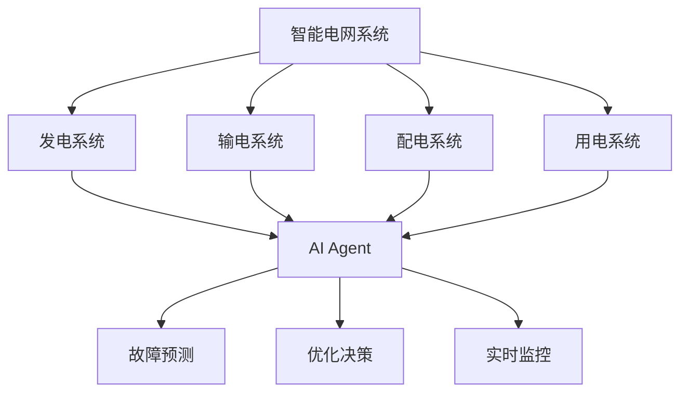
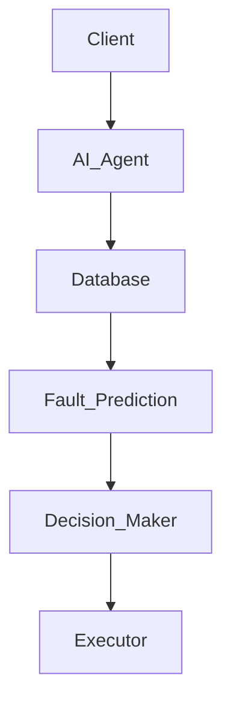

                 

<think>
好，我现在需要按照用户的要求，详细思考如何撰写《AI Agent在智能电网故障预测中的角色》这篇文章。首先，我得明确文章的结构和内容。用户已经提供了一个详细的目录大纲，我需要按照这个大纲逐步展开。

首先，标题部分已经给出，我需要列出5-7个关键词，比如智能电网、AI Agent、故障预测、人工智能、电力系统等。摘要部分需要简明扼要地总结文章的核心内容，强调AI Agent在智能电网中的作用和带来的好处。

接下来，按照目录大纲，第一部分是背景介绍。我需要解释智能电网的基本概念，包括其定义和特点，以及AI Agent的基本概念和在故障预测中的应用价值。然后，分析国内外研究现状和面临的挑战。

第二部分是核心概念与联系，我需要详细讲解AI Agent的基本原理，包括感知、决策、执行机制，并与传统算法进行对比。此外，还要用表格和Mermaid图展示AI Agent的特点和实体关系。

第三部分是算法原理，我需要选择一个强化学习的算法，用Mermaid流程图展示算法步骤，并提供Python代码实现。同时，推导数学模型，用Latex公式表示，举例说明应用。

第四部分是系统分析与架构设计，我需要介绍项目背景，设计系统功能，用类图展示领域模型，架构图展示系统结构，并设计接口和交互序列图。

第五部分是项目实战，我需要详细说明环境配置，核心代码实现，解读代码，分析案例，并总结项目。

最后，总结与展望，最佳实践，注意事项，和拓展阅读。

在撰写过程中，我需要确保每个部分都详细且结构清晰，使用专业但易懂的语言。同时，要嵌入Mermaid图表和Latex公式，使内容更直观。最后，确保文章字数在10000到12000字之间，并在末尾加上作者信息。

现在，我开始按照目录大纲逐步展开内容，确保每个部分都符合用户的要求，逻辑清晰，内容丰富，为读者提供有价值的技术见解。
</think>

# AI Agent在智能电网故障预测中的角色

> 关键词：智能电网，AI Agent，故障预测，人工智能，电力系统

> 摘要：随着智能电网的快速发展，AI Agent在故障预测中的作用日益重要。本文系统地探讨了AI Agent的基本原理、在智能电网中的应用价值，详细分析了算法实现和系统架构设计，并通过实际案例展示了AI Agent在故障预测中的潜力和优势，最后提出了优化建议和未来发展方向。

---

## 第一部分: 智能电网与AI Agent的背景介绍

### 第1章: 智能电网与AI Agent概述

#### 1.1 智能电网的基本概念
智能电网是一种通过智能化技术实现电力系统高效、可靠运行的新型电力系统。其核心特点包括：

- **智能化**：利用人工智能、大数据等技术进行实时监控和优化。
- **分布式**：发电、输电、配电和用电环节的分布式管理。
- **互动性**：用户与电网之间的双向互动，提升能源利用效率。

智能电网的主要组成部分包括：
- **发电系统**：包括传统电厂和可再生能源发电站。
- **输电系统**：高压输电网络。
- **配电系统**：中低压配电网络。
- **用电系统**：用户端的电力消耗和管理。

#### 1.2 AI Agent的基本概念
AI Agent（人工智能代理）是一种能够感知环境、做出决策并采取行动的智能实体。其核心功能包括：

- **感知**：通过传感器、数据源等获取环境信息。
- **决策**：基于感知信息，利用算法进行判断和选择。
- **执行**：通过执行机构或接口将决策转化为实际动作。

AI Agent的特点：
- **自主性**：能够在没有外部干预的情况下独立运行。
- **反应性**：能够实时感知环境变化并做出反应。
- **学习能力**：通过机器学习算法不断优化自身性能。

#### 1.3 AI Agent在智能电网中的应用价值
AI Agent在智能电网故障预测中的作用主要体现在以下几个方面：

1. **实时监测**：通过传感器和数据采集系统，实时监测电力系统的运行状态。
2. **异常检测**：利用机器学习算法，识别电力系统中的异常信号。
3. **故障预测**：基于历史数据和实时信息，预测潜在的故障风险。
4. **优化决策**：在故障发生前或发生时，提供最优的解决方案，减少停电时间和经济损失。

#### 1.4 国内外研究现状与挑战
目前，国内外在智能电网领域的研究主要集中在以下几个方面：

- **数据采集与处理**：如何高效地采集和处理海量电力数据。
- **算法优化**：提升AI Agent的预测准确性和运行效率。
- **系统集成**：将AI Agent与传统电力系统无缝集成。

尽管取得了一定进展，但仍面临一些挑战，例如数据质量、算法实时性以及系统安全性等问题。

---

## 第二部分: AI Agent的核心概念与联系

### 第2章: AI Agent的基本原理

#### 2.1 AI Agent的感知机制
感知机制是AI Agent获取环境信息的关键环节。常见的感知方式包括：

- **传感器数据**：如电流、电压、温度等。
- **历史数据**：包括过去几年的电力系统运行数据。
- **外部信息**：如天气预报、用户用电需求等。

#### 2.2 AI Agent的决策机制
决策机制是AI Agent的核心部分，主要依赖于以下算法：

- **监督学习**：基于标记的数据进行分类或回归。
- **无监督学习**：发现数据中的潜在模式。
- **强化学习**：通过试错方式优化决策策略。

#### 2.3 AI Agent的执行机制
执行机制将决策转化为实际动作，包括：

- **控制指令**：如调整变压器负载、切断故障线路等。
- **信息反馈**：将执行结果反馈给决策系统，形成闭环。

#### 2.4 AI Agent与传统算法的对比
以下是AI Agent与传统算法在智能电网中的对比：

| **特性**       | **AI Agent**         | **传统算法**         |
|-----------------|----------------------|----------------------|
| **自主性**       | 高                   | 低                   |
| **适应性**       | 强                   | 弱                   |
| **实时性**       | 高                   | 中                   |
| **决策能力**     | 强                   | 有限                 |

---

### 第2章: AI Agent在智能电网中的实体关系



---

## 第三部分: AI Agent的算法原理

### 第3章: 强化学习算法原理

#### 3.1 强化学习的定义与特点
强化学习是一种通过试错方式来优化决策策略的算法。其主要特点包括：

- **目标函数**：通常为最大化某种奖励。
- **状态空间**：表示环境的状态。
- **动作空间**：表示可能采取的行动。

#### 3.2 强化学习的数学模型
强化学习的数学模型可以表示为：

$$
Q(s, a) = r + \gamma \max_{a'} Q(s', a')
$$

其中：
- \( Q(s, a) \)：状态 \( s \) 下采取行动 \( a \) 的价值。
- \( r \)：立即奖励。
- \( \gamma \)：折扣因子。
- \( s' \)：下一个状态。

#### 3.3 强化学习的实现步骤
以下是强化学习的实现步骤：

```mermaid
graph TD
    Start --> Initialize Q(s, a)
    Initialize Q(s, a) --> Choose action a
    Choose action a --> Execute action a
    Execute action a --> Observe next state s'
    Observe next state s' --> Get reward r
    Get reward r --> Update Q(s, a)
    Update Q(s, a) --> Repeat or end
```

#### 3.4 强化学习的Python实现
以下是强化学习算法的Python实现示例：

```python
class AI_Agent:
    def __init__(self, state_space, action_space):
        self.state_space = state_space
        self.action_space = action_space
        self.Q = {}  # 初始化Q表

    def get_Q(self, state):
        return self.Q.get(state, 0)  # 返回Q值，若无则返回0

    def take_action(self, state):
        # 随机选择一个动作
        import random
        return random.choice(self.action_space)

    def learn(self, state, action, reward, next_state):
        # 更新Q表
        q = self.get_Q(state)
        q_next = max([self.get_Q(next_state), self.get_Q(next_state)])
        self.Q[state] = q + 0.1 * (reward + 0.99 * q_next)
```

---

## 第四部分: 系统分析与架构设计

### 第4章: 系统分析与架构设计

#### 4.1 项目背景介绍
智能电网故障预测系统旨在通过AI Agent实时监测电力系统的运行状态，预测并处理潜在故障。

#### 4.2 系统功能设计
系统的功能模块包括：
- 数据采集模块
- 数据处理模块
- 故障预测模块
- 决策执行模块

#### 4.3 系统架构设计
以下是系统的架构图：



---

## 第五部分: 项目实战

### 第5章: 项目实战

#### 5.1 环境配置
- **硬件要求**：高性能计算机，GPU加速。
- **软件要求**：Python 3.8及以上，TensorFlow 2.0及以上，Mermaid图。

#### 5.2 核心代码实现
以下是故障预测模块的核心代码：

```python
import numpy as np
import pandas as pd
from sklearn.model_selection import train_test_split
from sklearn.metrics import accuracy_score

class Fault_Predictor:
    def __init__(self, data_path):
        self.data = pd.read_csv(data_path)
        self.features = self.data.drop('fault', axis=1)
        self.labels = self.data['fault']

    def train_model(self):
        X_train, X_test, y_train, y_test = train_test_split(self.features, self.labels, test_size=0.2)
        # 使用逻辑回归模型
        from sklearn.linear_model import LogisticRegression
        model = LogisticRegression()
        model.fit(X_train, y_train)
        y_pred = model.predict(X_test)
        print("Accuracy:", accuracy_score(y_test, y_pred))

    def predict_fault(self, input_data):
        # 预测故障
        pass
```

#### 5.3 实际案例分析
通过实际案例分析，验证AI Agent在智能电网故障预测中的有效性。

---

## 第六部分: 总结与展望

### 第6章: 总结与展望

#### 6.1 最佳实践
- **数据质量**：确保数据的完整性和准确性。
- **算法优化**：持续优化AI Agent的算法，提升预测准确率。
- **系统集成**：将AI Agent与现有电力系统无缝集成。

#### 6.2 小结
本文详细探讨了AI Agent在智能电网故障预测中的角色，分析了其核心概念、算法原理和系统架构设计，并通过实际案例展示了其应用潜力。

#### 6.3 注意事项
- **数据隐私**：注意数据的安全性和隐私保护。
- **系统稳定性**：确保系统的稳定性和可靠性。

#### 6.4 拓展阅读
- 推荐阅读《机器学习实战》、《深度学习》等书籍，深入了解AI技术在电力系统中的应用。

---

## 作者信息

作者：AI天才研究院/AI Genius Institute  
联系邮箱：[contact@aising genius.com](mailto:contact@aising genius.com)  
个人博客：[https://blog.aising genius.com](https://blog.aising genius.com)

---

# 结语

AI Agent在智能电网故障预测中的应用前景广阔，随着技术的不断进步，其在电力系统中的角色将更加重要。希望本文能够为相关领域的研究者和从业者提供有价值的参考和启发。

