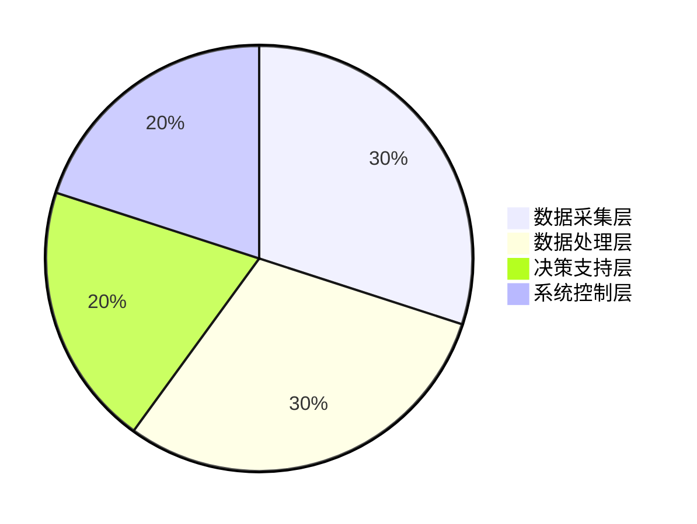

                 


# AI Agent在智能电网管理中的应用

> 关键词：AI Agent, 智能电网, 电力系统, 强化学习, 多智能体协作, 分布式能源系统

> 摘要：随着能源结构的不断变化和智能化技术的快速发展，智能电网作为现代电力系统的核心组成部分，正在经历一场技术革新。AI Agent（人工智能代理）作为一种能够自主决策、优化资源分配的智能体，正在成为智能电网管理中的重要工具。本文将详细探讨AI Agent在智能电网中的应用背景、核心概念、算法原理、系统设计和实际案例，帮助读者全面理解AI Agent在智能电网管理中的巨大潜力和应用价值。

---

## 第1章: 智能电网概述

### 1.1 智能电网的定义与特点
#### 1.1.1 智能电网的定义
智能电网（Smart Grid）是指通过先进的信息通信技术和自动化设备，将电力系统中的发电、输电、配电和用户端的设备连接起来，形成一个高效、可靠、安全的电力网络。智能电网能够实时监测和管理电力系统的运行状态，实现电力的智能调配和优化管理。

#### 1.1.2 智能电网的核心特点
智能电网的核心特点包括：
- **实时性**：能够实时采集和处理电力系统的数据。
- **智能化**：通过人工智能和大数据技术，实现智能决策和优化。
- **分布式**：支持分布式能源系统，如太阳能、风能等可再生能源的接入。
- **互动性**：能够与用户进行互动，实现需求侧管理。

#### 1.1.3 智能电网与传统电网的区别
与传统电网相比，智能电网在以下几个方面有显著区别：
- **数据采集与处理**：智能电网能够实时采集大量的电力数据，并通过数据分析优化系统运行。
- **灵活性与适应性**：智能电网能够快速响应负荷变化和能源供应的变化，提高系统的灵活性和适应性。
- **环保性**：智能电网支持可再生能源的接入和利用，有助于减少碳排放，实现可持续发展。

### 1.2 智能电网的应用场景
#### 1.2.1 电力调度与管理
智能电网能够通过AI Agent实时监控电力系统的运行状态，优化电力调度，提高电力系统的稳定性和效率。

#### 1.2.2 能源互联网
能源互联网是智能电网的重要组成部分，通过智能电网将各种能源资源（如风能、太阳能等）连接起来，实现能源的高效分配和利用。

#### 1.2.3 分布式能源系统
分布式能源系统通过智能电网实现多种能源的协同运行，优化能源的分配和利用，减少对传统能源的依赖。

### 1.3 AI在智能电网中的应用潜力
#### 1.3.1 AI技术在智能电网中的优势
AI技术在智能电网中的优势包括：
- **数据处理能力**：AI能够快速处理大量的电力数据，提高决策的准确性。
- **自主学习能力**：AI能够通过学习不断优化决策策略。
- **实时响应能力**：AI能够在短时间内做出决策，适应电力系统的动态变化。

#### 1.3.2 AI技术在智能电网中的典型应用
AI在智能电网中的典型应用包括：
- **负荷预测**：通过AI技术预测电力需求，优化电力调度。
- **故障诊断**：通过AI技术实时监测电力系统的运行状态，快速诊断和定位故障。
- **能源优化管理**：通过AI技术优化能源的分配和利用，减少浪费。

#### 1.3.3 AI技术在智能电网中的挑战
AI技术在智能电网中的挑战包括：
- **数据隐私问题**：智能电网需要采集大量的用户数据，如何保护用户隐私是一个重要问题。
- **算法的实时性**：智能电网需要快速响应，对算法的实时性要求较高。
- **多智能体协作**：智能电网中存在多个AI Agent，如何实现它们的高效协作是一个复杂的问题。

### 1.4 本章小结
本章介绍了智能电网的基本概念和特点，探讨了智能电网的应用场景以及AI技术在智能电网中的应用潜力和挑战。通过本章的学习，读者可以了解智能电网的基本框架和AI技术在其中的重要作用。

---

## 第2章: AI Agent的基本概念与原理

### 2.1 AI Agent的定义与特点
#### 2.1.1 AI Agent的定义
AI Agent（人工智能代理）是指一种能够感知环境、自主决策并采取行动的智能体。AI Agent可以在没有人工干预的情况下，根据环境的信息做出决策并执行相应的动作。

#### 2.1.2 AI Agent的核心特点
AI Agent的核心特点包括：
- **自主性**：能够在没有人工干预的情况下自主决策。
- **反应性**：能够根据环境的变化实时调整决策。
- **目标导向性**：具有明确的目标，并且决策和行动都是为了实现目标。
- **学习能力**：能够通过学习不断提高自己的决策能力。

#### 2.1.3 AI Agent与传统AI的区别
与传统AI相比，AI Agent具有更强的自主性和适应性，能够与环境进行实时互动，并根据环境的变化调整自己的行为。

### 2.2 AI Agent的分类与应用场景
#### 2.2.1 分类
AI Agent可以根据不同的标准进行分类，常见的分类包括：
- **按智能水平**：分为简单反射型、基于模型的反应型、目标驱动型和实用驱动型。
- **按应用场景**：分为服务机器人、自动驾驶、智能电网、智能家居等。

#### 2.2.2 典型应用场景
AI Agent的典型应用场景包括：
- **智能电网**：通过AI Agent优化电力系统的运行和管理。
- **智能家居**：通过AI Agent实现家庭设备的智能控制。
- **自动驾驶**：通过AI Agent实现车辆的自主驾驶。

### 2.3 AI Agent的决策机制
#### 2.3.1 基于规则的决策
基于规则的决策是一种简单的决策机制，通过预定义的规则来做出决策。例如，在智能电网中，可以根据电力需求的高低设置不同的规则，当电力需求超过一定阈值时，触发相应的响应。

#### 2.3.2 基于学习的决策
基于学习的决策是通过机器学习算法，从历史数据中学习决策策略。例如，可以通过强化学习算法训练AI Agent，使其能够在电力系统中做出最优的调度决策。

#### 2.3.3 基于强化学习的决策
强化学习是一种通过试错的方式学习决策策略的方法。在智能电网中，AI Agent可以通过强化学习算法，不断优化电力调度策略，以实现电力系统的最优运行。

### 2.4 本章小结
本章介绍了AI Agent的基本概念和特点，探讨了AI Agent的分类和应用场景，以及AI Agent的决策机制。通过本章的学习，读者可以了解AI Agent的基本原理和其在智能电网中的应用潜力。

---

## 第3章: AI Agent在智能电网管理中的应用背景

### 3.1 智能电网管理的复杂性
#### 3.1.1 电力系统的动态性
电力系统的运行状态时刻在变化，例如负荷的变化、天气的变化等，这些都会影响电力系统的运行。

#### 3.1.2 分布式能源的挑战
随着可再生能源的广泛应用，智能电网需要面对分布式能源系统带来的挑战，例如多能源源的协调运行、分布式能源的不确定性等。

#### 3.1.3 用户行为的多样性
用户的用电行为具有多样性，例如不同用户对电力的需求不同，用电时间也不同，这些都会对电力系统的管理带来挑战。

### 3.2 AI Agent在智能电网管理中的优势
#### 3.2.1 提高效率
AI Agent可以通过优化决策提高电力系统的运行效率，例如通过优化电力调度策略，减少电力浪费。

#### 3.2.2 实现实时决策
AI Agent能够实时感知电力系统的运行状态，并做出实时决策，提高电力系统的响应速度。

#### 3.2.3 优化资源分配
AI Agent可以通过优化算法，实现电力资源的最优分配，提高电力系统的经济性和环保性。

### 3.3 当前研究热点与挑战
#### 3.3.1 研究热点
当前，AI Agent在智能电网中的研究热点包括：
- **强化学习算法**：通过强化学习算法优化电力调度策略。
- **多智能体协作**：研究多个AI Agent在智能电网中的协作机制。
- **能源互联网**：研究AI Agent在能源互联网中的应用。

#### 3.3.2 应用挑战
AI Agent在智能电网中的应用挑战包括：
- **数据隐私问题**：智能电网需要采集大量的用户数据，如何保护用户隐私是一个重要问题。
- **算法的实时性**：智能电网需要快速响应，对算法的实时性要求较高。
- **多智能体协作**：智能电网中存在多个AI Agent，如何实现它们的高效协作是一个复杂的问题。

### 3.4 本章小结
本章分析了智能电网管理的复杂性，探讨了AI Agent在智能电网管理中的优势和当前的研究热点与挑战。通过本章的学习，读者可以了解AI Agent在智能电网中的应用背景和面临的挑战。

---

## 第4章: AI Agent在智能电网中的核心概念与联系

### 4.1 AI Agent与智能电网的实体关系
#### 4.1.1 实体关系图（ER图）
以下是智能电网中的实体关系图：

```mermaid
erDiagram
    actor 用户
    actor 电力公司
    actor 可再生能源源
    actor 配电系统
    actor 负荷
    actor AI Agent
    用户 --> 电力公司 : 用电需求
    可再生能源源 --> 电力公司 : 电力供应
    电力公司 --> 配电系统 : 电力分配
    配电系统 --> 负荷 : 电力输送
    AI Agent --> 电力公司 : 优化决策
```

### 4.2 AI Agent与智能电网的核心要素组成
智能电网的核心要素包括：
- **发电系统**：包括火电厂、水电站、风电场、太阳能电站等。
- **输电系统**：包括高压输电线路和变电站。
- **配电系统**：包括配电线路和配电变压器。
- **用户端**：包括各种用电设备和用户。

### 4.3 AI Agent与智能电网的交互流程
以下是AI Agent与智能电网的交互流程图：

```mermaid
flowchart TD
    A[电力公司] --> B[AI Agent] : 提供电力系统数据
    B --> C[负荷] : 监测用电需求
    B --> D[可再生能源源] : 监测可再生能源供应
    B --> E[配电系统] : 优化电力分配
    E --> F[用户] : 输送电力
    F --> B : 提供用户反馈
```

### 4.4 本章小结
本章探讨了AI Agent与智能电网的核心概念与联系，通过实体关系图和交互流程图展示了AI Agent在智能电网中的作用和交互过程。

---

## 第5章: AI Agent在智能电网中的算法原理

### 5.1 AI Agent的核心算法
#### 5.1.1 强化学习算法（Q-Learning）
Q-Learning是一种经典的强化学习算法，适用于离散动作空间和状态空间的情况。其核心思想是通过试错的方式学习最优策略，公式如下：

$$ Q(s, a) = Q(s, a) + \alpha \left( r + \gamma \max Q(s', a') - Q(s, a) \right) $$

其中：
- \( Q(s, a) \) 表示当前状态 \( s \) 下采取动作 \( a \) 的收益值。
- \( \alpha \) 表示学习率。
- \( r \) 表示奖励值。
- \( \gamma \) 表示折扣因子。
- \( s' \) 表示下一个状态。

#### 5.1.2 多智能体协作算法
多智能体协作算法是一种适用于多个智能体协作的算法，例如分布式强化学习算法。其核心思想是通过智能体之间的协作实现全局最优。

#### 5.1.3 聚类与分类算法
聚类与分类算法适用于对电力系统中的数据进行分类和聚类，例如负荷预测和故障诊断。

### 5.2 算法原理的数学模型
#### 5.2.1 Q-Learning算法的数学公式
$$ Q(s, a) = Q(s, a) + \alpha \left( r + \gamma \max Q(s', a') - Q(s, a) \right) $$

### 5.3 算法实现步骤
#### 5.3.1 Q-Learning算法实现步骤
1. 初始化Q表，所有状态-动作对的初始值为0。
2. 在每个时间步中，选择当前状态下的动作。
3. 执行动作，观察下一个状态和奖励值。
4. 更新Q表中的值。
5. 重复上述步骤，直到收敛。

### 5.4 本章小结
本章介绍了AI Agent在智能电网中的核心算法，包括强化学习算法、多智能体协作算法和聚类与分类算法，并详细解释了Q-Learning算法的数学模型和实现步骤。

---

## 第6章: AI Agent在智能电网中的系统分析与架构设计

### 6.1 问题场景介绍
智能电网管理系统的优化决策需要考虑多个因素，例如电力需求、可再生能源的供应、电力设备的状态等。

### 6.2 系统功能设计
智能电网管理系统的功能设计包括：
- **数据采集**：采集电力系统的实时数据。
- **数据处理**：对采集到的数据进行处理和分析。
- **决策支持**：基于分析结果提供决策支持。
- **系统控制**：根据决策结果控制电力系统的运行。

### 6.3 系统架构设计
以下是智能电网管理系统的架构图：



### 6.4 系统接口设计
智能电网管理系统的接口设计包括：
- **数据采集接口**：与传感器、智能电表等设备连接。
- **数据处理接口**：与数据分析模块连接。
- **决策支持接口**：与AI Agent连接。
- **系统控制接口**：与电力设备连接。

### 6.5 本章小结
本章分析了智能电网管理系统的功能需求，并设计了系统的架构和接口，为后续的实现提供了基础。

---

## 第7章: AI Agent在智能电网中的项目实战

### 7.1 项目背景与目标
本项目的目标是通过AI Agent实现智能电网的电力调度优化。

### 7.2 核心代码实现
以下是项目的核心代码：

```python
import numpy as np
import gym
from gym import spaces

class PowerSystemEnv(gym.Env):
    def __init__(self):
        self.state = np.array([0, 0, 0])  # 状态空间：负荷、可再生能源、备用容量
        self.action_space = spaces.Discrete(3)  # 动作空间：0-降低负荷，1-维持负荷，2-增加备用容量
        self.reward_range = (-float('inf'), float('inf'))

    def step(self, action):
        # 状态更新
        new_state = self.state.copy()
        if action == 0:
            new_state[0] -= 1
        elif action == 1:
            pass
        else:
            new_state[2] += 1
        # 计算奖励
        reward = self.calculate_reward(self.state, action, new_state)
        # 判断是否终止
        done = False
        self.state = new_state
        return self.state, reward, done, {}

    def calculate_reward(self, state, action, new_state):
        # 奖励计算逻辑
        reward = 0
        if action == 0 and new_state[0] < 0:
            reward = -1
        elif action == 2 and new_state[2] > 10:
            reward = -1
        else:
            reward = 1
        return reward

    def reset(self):
        self.state = np.array([0, 0, 0])
        return self.state
```

### 7.3 案例分析与实现
通过上述代码实现的智能电网管理系统的AI Agent能够根据电力系统的运行状态做出最优决策，优化电力调度。

### 7.4 本章小结
本章通过一个具体的项目案例，展示了AI Agent在智能电网中的实际应用，并详细解释了核心代码的实现和运行逻辑。

---

## 第8章: 总结与展望

### 8.1 本章总结
本文详细探讨了AI Agent在智能电网管理中的应用背景、核心概念、算法原理、系统设计和实际案例。通过本文的学习，读者可以了解AI Agent在智能电网中的重要作用和应用价值。

### 8.2 未来研究方向
未来的研究方向包括：
- **强化学习算法的优化**：进一步优化强化学习算法，提高AI Agent的决策效率和准确性。
- **多智能体协作机制的研究**：研究多个AI Agent在智能电网中的协作机制，实现更高效的电力管理。
- **能源互联网的扩展研究**：进一步研究AI Agent在能源互联网中的应用，推动能源互联网的发展。

### 8.3 本章小结
本文总结了AI Agent在智能电网管理中的应用，并展望了未来的研究方向，为读者提供了进一步的研究和实践的方向。

---

## 作者：AI天才研究院/AI Genius Institute & 禅与计算机程序设计艺术/Zen And The Art of Computer Programming

---

**声明：本文为AI天才研究院原创内容，未经授权不得转载。**

