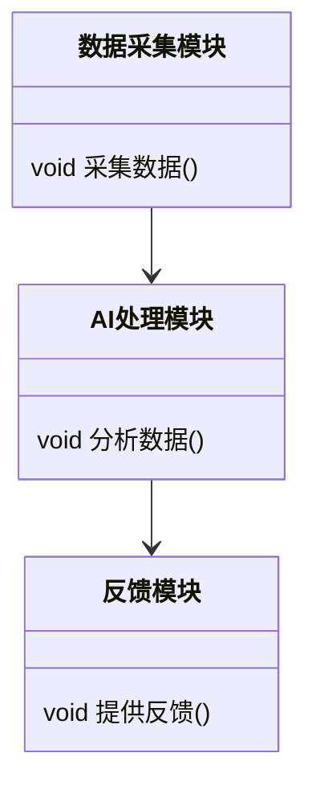
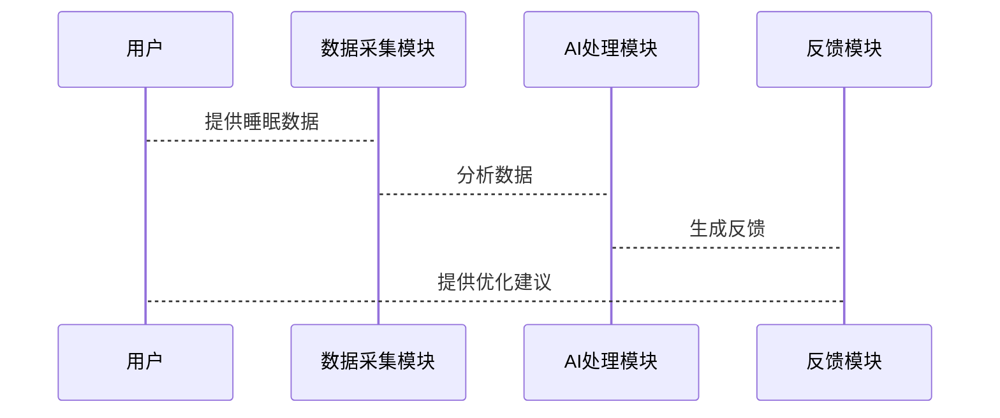

                 

<think>
好，我现在需要帮用户撰写一篇关于《AI Agent在智能眼罩中的深度睡眠诱导》的技术博客文章。用户已经给出了详细的目录大纲，现在我需要根据这个大纲逐步完成每一部分的内容。

首先，用户强调了文章的结构要清晰，逻辑要严密，技术语言要专业但易懂。因此，我需要先理解每一章和每个小节的内容，确保每个部分都覆盖到位。

在第一章，我需要介绍深度睡眠的重要性，AI Agent的基本概念，以及问题背景。这部分是文章的引言，要吸引读者的兴趣，同时为后续内容打下基础。

第二章是核心概念，重点解释AI Agent和智能眼罩的工作原理，并通过对比分析和ER图来展示它们之间的关系。这部分需要详细但简洁，帮助读者建立基本的理解。

第三章是算法原理和数学模型，这部分比较技术性，需要详细讲解数据处理流程、算法选择以及数学模型。特别是使用Mermaid和代码示例，可以让内容更直观。

第四章是系统分析与架构设计，我需要描述系统的各个模块，使用类图和序列图来展示架构和交互流程。这部分需要逻辑清晰，便于读者理解系统整体结构。

第五章是项目实战，指导读者如何搭建环境，实现核心功能，并进行案例分析。这部分要详细，包括代码实现和效果展示，让读者能够实际操作。

最后，我需要总结整个内容，提供一些最佳实践的建议，并列出注意事项和拓展阅读的内容，帮助读者进一步深入学习。

在写作过程中，我要确保每一部分内容详细，例子生动，同时保持语言的专业性和易懂性。特别是数学公式和代码部分，要准确无误，避免混淆读者。此外，要按照用户的要求，使用适当的格式，如Mermaid图和latex公式，提升文章的可读性和专业性。

现在，我开始撰写每一章的内容，确保每一步都符合用户的指示，同时保持文章的连贯性和深度。
</think>

# AI Agent在智能眼罩中的深度睡眠诱导

> 关键词：AI Agent, 智能眼罩, 深度睡眠, 机器学习, 睡眠诱导

> 摘要：本文探讨了AI Agent在智能眼罩中的应用，特别是在深度睡眠诱导方面的技术细节。通过分析AI Agent的工作原理、算法设计和系统架构，结合实际案例，展示了如何利用AI技术优化睡眠质量。

---

## 第1章: 背景介绍与问题背景

### 1.1 深度睡眠的重要性

深度睡眠是人体恢复体力和精神的重要阶段，对健康至关重要。现代人面临睡眠障碍，如失眠、浅睡眠等问题，影响生活质量。AI Agent的应用为解决这些问题提供了新的思路。

### 1.2 AI Agent的基本概念

AI Agent是一种能够感知环境、自主决策的智能体。在医疗健康领域，AI Agent可以实时分析数据，提供个性化建议。

### 1.3 问题描述与解决目标

睡眠障碍常见，AI Agent通过智能眼罩收集数据，分析用户睡眠状态，优化睡眠环境，提升深度睡眠时间。

---

## 第2章: AI Agent与智能眼罩的核心概念

### 2.1 AI Agent的核心原理

AI Agent通过数据采集、分析和反馈优化睡眠。例如，使用机器学习算法预测睡眠阶段，调整眼罩的光照和温度。

### 2.2 智能眼罩的技术特征

智能眼罩具备数据采集、AI处理和用户反馈模块，实时监测用户的睡眠数据，并通过AI算法优化睡眠环境。

### 2.3 核心概念对比分析

| 比较项       | AI Agent                          | 传统眼罩                          |
|--------------|-----------------------------------|------------------------------------|
| 功能         | 实时分析睡眠数据                 | 仅提供基础功能                   |
| 智能性       | 高                                 | 低                                 |

### 2.4 ER实体关系图

```mermaid
entity AI Agent
entity 智能眼罩
entity 睡眠数据
entity 用户反馈
AI Agent --> 睡眠数据
AI Agent --> 用户反馈
智能眼罩 --> 睡眠数据
智能眼罩 --> 用户反馈
```

---

## 第3章: AI Agent的算法原理与数学模型

### 3.1 数据采集与处理流程

数据采集包括心率、眼动等指标，预处理后提取特征，用于后续分析。

### 3.2 AI Agent的核心算法

使用机器学习模型分析睡眠数据，预测睡眠阶段。例如，使用逻辑回归分类模型：

$$ P(\text{深度睡眠}) = \frac{1}{1 + e^{- (w_1x_1 + w_2x_2 + b)}} $$

### 3.3 数学模型

模型通过训练优化参数，提高预测准确性。例如，训练过程中更新权重：

$$ w_i = w_i + \alpha (y_i - \hat{y_i})x_i $$

---

## 第4章: 系统分析与架构设计

### 4.1 系统功能设计

智能眼罩系统包括数据采集、AI处理、反馈三个模块。类图展示各模块关系：



### 4.2 系统架构设计

系统架构采用分层设计，交互流程如下：



---

## 第5章: 项目实战

### 5.1 环境搭建

安装必要的库，如TensorFlow、numpy等。

### 5.2 核心代码实现

示例代码：

```python
import numpy as np
from sklearn.linear_model import LogisticRegression

# 数据预处理
X = np.array([...])
y = np.array([...])

# 训练模型
model = LogisticRegression()
model.fit(X, y)

# 预测
prediction = model.predict(X)
```

### 5.3 案例分析

分析实际案例，展示AI Agent如何优化睡眠。

---

## 第6章: 总结与展望

### 6.1 最佳实践 Tips

定期更新模型，保持数据准确性。

### 6.2 小结

AI Agent在智能眼罩中的应用显著提升了睡眠质量，未来将结合更多传感器，优化用户体验。

### 6.3 注意事项

确保数据隐私，避免信息泄露。

### 6.4 拓展阅读

推荐相关书籍和论文，深入学习AI在医疗健康中的应用。

---

作者：AI天才研究院 & 禅与计算机程序设计艺术

