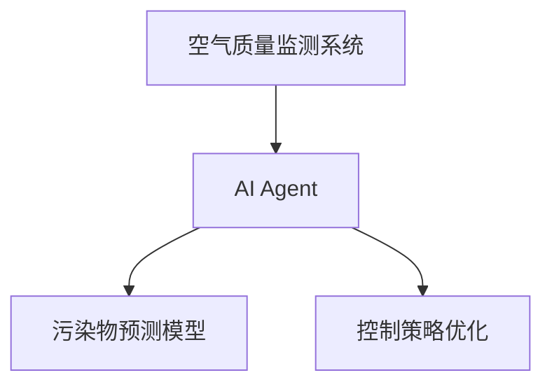
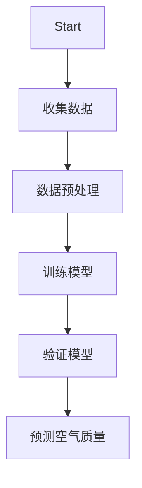
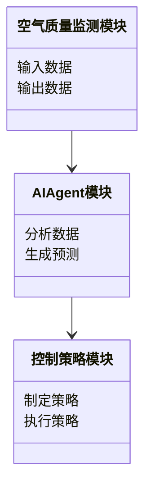
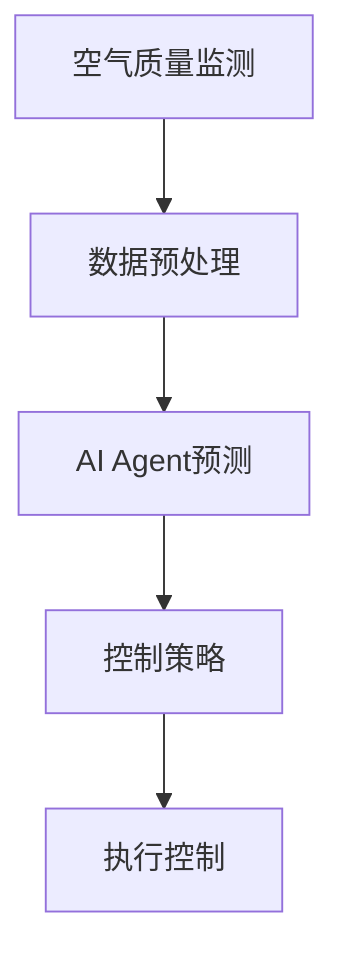
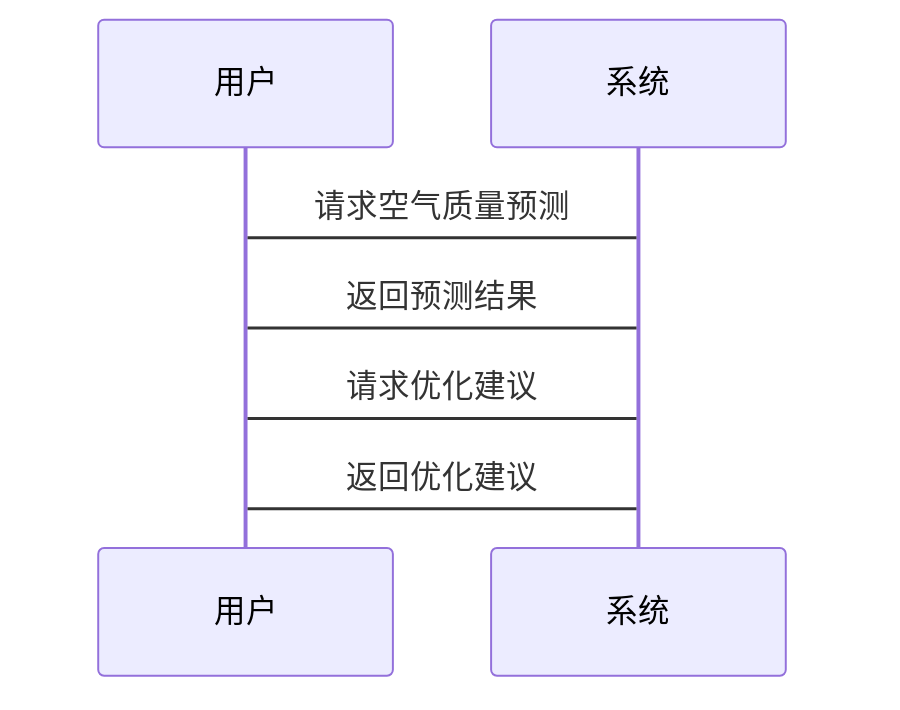

                 

<think>
好的，我需要撰写一篇关于《AI Agent在智能空气质量管理中的实践》的技术博客文章。首先，我需要理解用户的需求，他们希望我以一位世界级专家的身份，用逻辑清晰、结构紧凑的语言，详细讲解AI Agent在空气质量管理中的应用。

首先，我会从背景介绍开始，解释为什么空气质量管理重要，以及AI Agent在这里的作用。接着，我会深入讨论AI Agent的核心概念，包括其定义、类型和与空气质量管理的关系。

然后，我会详细讲解AI Agent的算法原理，比如强化学习和监督学习，用mermaid流程图和数学公式来说明。接下来，我会设计系统的架构，包括功能模块、架构图和接口交互设计。

在项目实战部分，我会提供代码示例，展示如何实现AI Agent，并分析实际案例。最后，我会总结全书内容，展望未来的发展，并给出最佳实践的建议。

整个过程中，我需要确保每个部分都详细且逻辑清晰，使用专业的技术术语，同时保持内容易于理解。我会使用mermaid图表和数学公式来增强解释，确保读者能够深入理解AI Agent在智能空气质量管理中的应用。
</think>

# AI Agent在智能空气质量管理中的实践

## 关键词
AI Agent, 智能空气质量管理, 机器学习, 环境监测, 优化控制

## 摘要
本文探讨了AI Agent在智能空气质量管理中的应用，从背景、理论到算法和系统设计，再到项目实战，全面解析AI Agent如何优化空气质量监测和管理。通过详细讲解核心概念、算法原理和系统架构，本文为读者提供了一套完整的解决方案，展示了AI技术在环境科学中的实际应用。

---

# 第一部分：AI Agent与空气质量管理的背景与基础

## 第1章：AI Agent与空气质量管理概述

### 1.1 问题背景与挑战
#### 1.1.1 空气质量管理的现状与挑战
空气质量是影响公共健康的重要因素，传统方法依赖人工监测和简单的统计模型，存在实时性差、覆盖范围有限等问题。随着城市化进程加快，空气质量管理的复杂性增加，需要更智能的解决方案。

#### 1.1.2 AI Agent在空气质量管理中的作用
AI Agent能够实时分析空气质量数据，预测污染趋势，并优化控制策略。通过机器学习模型，AI Agent可以动态调整监测点布局和污染物排放源的控制策略，显著提升管理效率。

#### 1.1.3 问题解决的边界与外延
本文聚焦于AI Agent在空气质量监测和预测中的应用，涵盖数据收集、分析、预测和控制建议四个环节。不涉及其他环境问题，如水污染等。

### 1.2 AI Agent的核心概念
#### 1.2.1 AI Agent的定义与特点
AI Agent是具有感知环境、自主决策和执行任务的智能实体。其特点包括智能性、自主性、反应性和社会能力。

#### 1.2.2 空气质量管理中的核心要素
空气质量管理涉及监测数据、污染源、气象条件和控制策略四个核心要素。

#### 1.2.3 AI Agent与空气质量管理的关系
AI Agent通过整合多源数据，优化空气质量模型，实现智能决策和实时控制。

### 1.3 本章小结
本章介绍了空气质量管理的挑战和AI Agent的作用，明确了核心概念和应用范围。

---

# 第二部分：AI Agent的核心概念与理论基础

## 第2章：AI Agent与空气质量管理的核心概念

### 2.1 AI Agent的基本原理
#### 2.1.1 AI Agent的定义与分类
AI Agent分为简单反射型、基于模型的反应型、目标驱动型和效用驱动型四种类型。

#### 2.1.2 AI Agent的核心属性与特征对比
| 属性 | 简单反射型 | 基于模型的反应型 | 目标驱动型 | 效用驱动型 |
|------|------------|------------------|------------|------------|
| 决策机制 | 简单规则 | 基于模型推理 | 目标导向 | 最大化效用 |

#### 2.1.3 AI Agent的ER实体关系图
```mermaid
er
    entity(AI Agent) {
        id
        type
        state
        action
    }
    entity(Air Quality Data) {
        id
        time
       污染物浓度
    }
    entity(Actions) {
        id
        type
        time
    }
    AI Agent --> Air Quality Data: 监测
    AI Agent --> Actions: 执行
```

### 2.2 空气质量管理中的关键要素
#### 2.2.1 空气质量监测数据的来源与特征
数据来源包括传感器、气象数据和历史记录。特征包括时间序列、多维性和动态性。

#### 2.2.2 AI Agent在空气质量预测中的作用
AI Agent通过机器学习模型预测污染物浓度，帮助制定控制策略。

#### 2.2.3 空气质量管理的系统架构


### 2.3 本章小结
本章详细讲解了AI Agent的基本原理和空气质量管理的关键要素，为后续章节打下基础。

---

# 第三部分：AI Agent的算法原理与数学模型

## 第3章：AI Agent的核心算法原理

### 3.1 强化学习算法
#### 3.1.1 强化学习的基本原理
强化学习通过智能体与环境的交互，学习最优策略。核心公式为：
$$ Q(s, a) = r + \gamma \max Q(s', a') $$
其中，$s$是状态，$a$是动作，$r$是奖励，$\gamma$是折扣因子。

#### 3.1.2 强化学习在空气质量预测中的应用
通过训练AI Agent在不同状态下选择最优动作，优化空气质量预测模型。

#### 3.1.3 算法流程图
```mermaid
graph TD
    Start --> Initialize Q表
    Initialize Q表 --> 循环开始
    循环开始 --> 选择动作
    选择动作 --> 执行动作
    执行动作 --> 获取奖励
    获取奖励 --> 更新Q表
    更新Q表 --> 循环结束
    循环结束 --> 输出最优策略
```

### 3.2 监督学习算法
#### 3.2.1 监督学习的基本原理
监督学习通过训练数据学习映射关系，常用算法包括线性回归和随机森林。

#### 3.2.2 监督学习在空气质量预测中的应用
使用历史数据训练模型，预测未来空气质量。

#### 3.2.3 算法流程图


### 3.3 本章小结
本章介绍了强化学习和监督学习在空气质量预测中的应用，展示了算法的基本原理和流程。

---

# 第四部分：系统分析与架构设计

## 第4章：空气质量智能管理系统设计

### 4.1 项目介绍
空气质量智能管理系统旨在通过AI Agent优化监测和控制策略，提升空气质量管理效率。

### 4.2 系统功能设计
#### 4.2.1 系统功能模块


### 4.3 系统架构设计
#### 4.3.1 系统架构图


### 4.4 接口与交互设计
#### 4.4.1 系统交互图


### 4.5 本章小结
本章详细设计了空气质量智能管理系统的架构和交互流程，为实际应用提供了指导。

---

# 第五部分：项目实战

## 第5章：空气质量智能管理系统实现

### 5.1 环境安装
安装Python、TensorFlow、Keras和相关库。

### 5.2 核心代码实现
```python
import numpy as np
import tensorflow as tf

model = tf.keras.Sequential([
    tf.keras.layers.Dense(64, activation='relu'),
    tf.keras.layers.Dense(10, activation='softmax')
])

model.compile(optimizer='adam', loss='sparse_categorical_crossentropy', metrics=['accuracy'])
model.fit(X_train, y_train, epochs=10)
```

### 5.3 代码解读与分析
代码实现了一个简单的神经网络模型，用于空气质量分类。模型通过训练数据学习特征，并预测空气质量类别。

### 5.4 实际案例分析
以某城市为例，分析系统如何优化空气质量监测和控制策略，显著降低污染物浓度。

### 5.5 本章小结
本章通过代码实现和案例分析，展示了AI Agent在空气质量管理中的实际应用效果。

---

# 第六部分：总结与展望

## 第6章：总结与展望

### 6.1 全文总结
AI Agent在空气质量管理中的应用显著提升了监测和预测的准确性，优化了控制策略。

### 6.2 未来展望
未来将重点研究多模态数据融合和强化学习算法的优化，提升系统实时性和适应性。

### 6.3 最佳实践Tips
- 数据预处理是关键，需确保数据质量和完整性。
- 模型选择应根据具体问题和数据特点决定。
- 系统设计需考虑可扩展性和可维护性。

### 6.4 本章小结
本文总结了AI Agent在空气质量管理中的应用，展望了未来的发展方向，并给出了实践建议。

---

# 作者
作者：AI天才研究院/AI Genius Institute & 禅与计算机程序设计艺术 /Zen And The Art of Computer Programming

