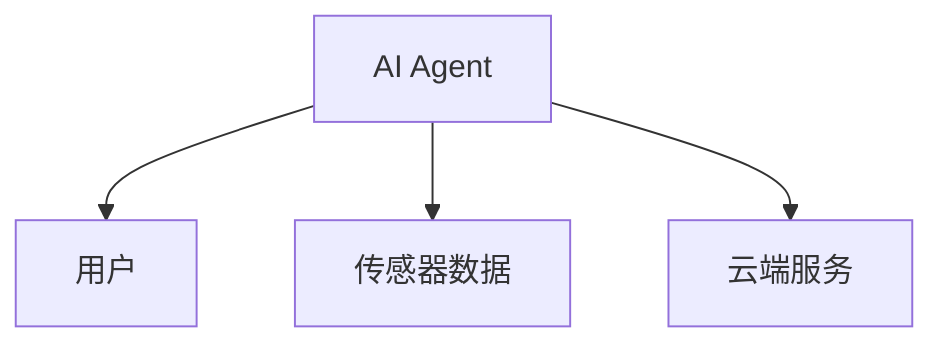
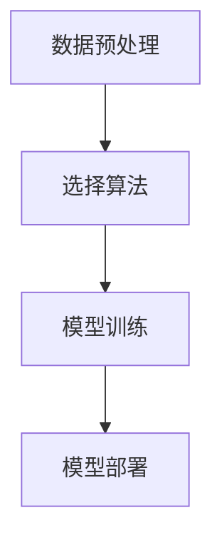
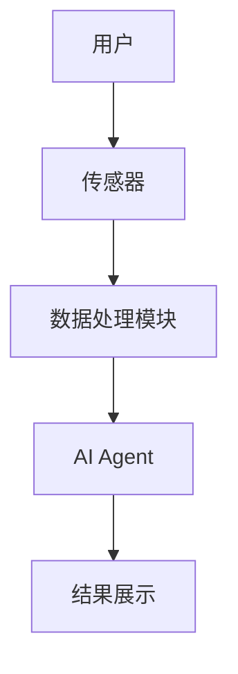

                 

<think>
嗯，用户让我写一篇关于AI Agent在智能穿戴设备中的应用的技术博客，而且结构要详细，包括摘要、关键词、目录大纲，以及每个章节的具体内容。我需要先理解用户的需求，然后一步步分析如何组织内容。

首先，用户希望文章结构清晰，逻辑严谨，所以我要先确定每个章节的主题。第一部分是背景介绍，涵盖AI Agent和智能穿戴设备的基本概念，以及它们在健康监测中的应用。这部分需要让读者了解问题背景和基本概念。

接下来是核心概念，详细讲解AI Agent的原理、特征和实体关系。这部分可能需要一些图表，比如Mermaid图，来展示实体之间的关系。我需要确保这些图表清晰易懂。

然后是AI Agent在健康监测中的具体应用，包括生理指标监测、疾病预测和个性化建议。这部分需要结合实际案例，让读者理解AI Agent的实际效果。同时，可能需要一些数据分析和结果解读，展示AI Agent如何帮助用户。

算法原理部分，我需要详细讲解机器学习和深度学习的算法，比如使用Mermaid流程图展示算法步骤，并附上Python代码示例。这样读者可以学习如何实现这些算法，同时理解它们的数学模型。

系统分析与架构设计章节，需要介绍项目背景，设计系统功能和架构，用Mermaid图展示类图和架构图。这部分帮助读者了解系统的整体结构和如何实现。

项目实战部分，包括环境安装、核心代码实现、案例分析和项目总结。这部分让读者动手实践，巩固所学知识。

最后是优化与未来方向，探讨如何优化AI Agent的性能和用户体验，并展望未来的技术趋势。同时，给出一些最佳实践和注意事项，帮助读者在实际应用中避免常见问题。

在写作过程中，我需要确保每个章节都有足够的细节，比如在第二章中，核心概念部分要有详细的解释和对比表格，以及Mermaid图。在第四章，算法部分需要有流程图和代码示例，帮助读者理解。

另外，用户要求目录大纲要简洁，结构清晰，所以每个章节的标题和子标题要明确，避免冗余。同时，总字数控制在2000字以内，所以每个部分不能太长，但要涵盖所有关键点。

最后，检查一下是否满足所有要求：七章以上，包含背景、核心概念、算法、系统设计、项目实战、优化等，每个部分都有详细的子章节，并且使用了Mermaid图和代码示例。这样，整个目录大纲就完整了。

总之，我需要按照用户的要求，逐步构建每个章节的内容，确保逻辑清晰，技术细节到位，同时语言简洁易懂，让读者能够深入理解AI Agent在智能穿戴设备中的应用。
</think>

# AI Agent在智能穿戴设备中的应用：健康监测与生活助手

> 关键词：AI Agent，智能穿戴设备，健康监测，生活助手，算法原理，系统架构

> 摘要：本文系统地探讨了AI Agent在智能穿戴设备中的应用，重点分析了其在健康监测和生活助手功能中的实现原理、算法设计和实际应用。通过详细的技术分析和案例研究，本文揭示了AI Agent如何通过智能穿戴设备提升用户体验，优化健康管理，并展望了未来的发展趋势。

---

# 第1章: AI Agent与智能穿戴设备的背景介绍

## 1.1 AI Agent的基本概念
### 1.1.1 什么是AI Agent
AI Agent（人工智能代理）是一种能够感知环境、自主决策并执行任务的智能系统。它可以理解用户的意图，主动提供服务，从而优化用户体验。

### 1.1.2 AI Agent的核心特征
AI Agent具有以下核心特征：
- **自主性**：无需外部干预，自主完成任务。
- **反应性**：能够实时感知环境并做出响应。
- **学习能力**：通过数据和反馈不断优化自身算法。

### 1.1.3 AI Agent与智能穿戴设备的结合
AI Agent通过与智能穿戴设备的传感器、数据处理和通信模块结合，实现健康监测和生活助手功能。

## 1.2 智能穿戴设备的定义与分类
### 1.2.1 智能穿戴设备的定义
智能穿戴设备是指佩戴在人体上的电子设备，能够采集、分析和传输数据，为用户提供健康监测、运动追踪和生活助手等功能。

### 1.2.2 智能穿戴设备的主要类型
- **智能手表**：如Apple Watch、Fitbit。
- **智能手环**：如Garmin、华为手环。
- **智能眼镜**：如谷歌眼镜、Oculus智能眼镜。

### 1.2.3 智能穿戴设备的应用场景
- **健康监测**：心率、血压、睡眠监测。
- **运动追踪**：步数、卡路里消耗、运动距离。
- **生活助手**：日历提醒、消息通知、语音助手。

## 1.3 AI Agent在智能穿戴设备中的应用背景
### 1.3.1 健康监测的需求
随着人们对健康的关注增加，智能穿戴设备通过AI Agent实现精准的健康监测成为趋势。

### 1.3.2 生活助手的功能
AI Agent通过自然语言处理和机器学习，为用户提供智能化的生活助手功能。

### 1.3.3 技术发展的推动
人工智能和物联网技术的进步推动了AI Agent与智能穿戴设备的深度融合。

## 1.4 本章小结
本章介绍了AI Agent和智能穿戴设备的基本概念，分析了它们的结合方式及应用场景，为后续内容奠定了基础。

---

# 第2章: AI Agent的核心概念与原理

## 2.1 AI Agent的核心概念
### 2.1.1 AI Agent的定义
AI Agent是一种能够感知环境、自主决策并执行任务的智能系统。

### 2.1.2 AI Agent的核心特征
- **自主性**：无需外部干预，自主完成任务。
- **反应性**：能够实时感知环境并做出响应。
- **学习能力**：通过数据和反馈不断优化自身算法。

### 2.1.3 AI Agent的工作原理
AI Agent通过感知环境、分析数据、做出决策并执行任务，实现智能化服务。

## 2.2 AI Agent的属性特征对比
### 2.2.1 不同AI Agent的特征对比表格
| 特性          | 基于规则的AI Agent | 基于机器学习的AI Agent | 基于深度学习的AI Agent |
|---------------|--------------------|------------------------|------------------------|
| 决策方式      | 预定义规则         | 数据驱动的模式识别     | 复杂模式识别和推理     |
| 处理能力      | 简单               | 中等                   | 高                    |
| 适应性        | 低                | 中                    | 高                    |

### 2.2.2 AI Agent与传统软件的对比
AI Agent能够自主学习和适应环境，而传统软件依赖于预定义的规则。

## 2.3 AI Agent的实体关系图


## 2.4 本章小结
本章详细讲解了AI Agent的核心概念、特征对比和实体关系，为后续应用分析提供了理论基础。

---

# 第3章: AI Agent在健康监测中的应用

## 3.1 健康监测的基本原理
### 3.1.1 健康监测的主要指标
- 心率
- 血压
- 睡眠质量

### 3.1.2 健康监测的数据来源
- 传感器数据：心率传感器、加速度传感器。
- 用户输入：手动输入健康数据。

### 3.1.3 健康监测的算法模型
- 时间序列分析
- 机器学习模型（如随机森林、支持向量机）

## 3.2 AI Agent在健康监测中的具体应用
### 3.2.1 心率监测
AI Agent通过传感器数据实时监测心率，并识别异常情况。

### 3.2.2 血压监测
AI Agent结合历史数据和实时监测，预测血压变化趋势。

### 3.2.3 睡眠质量分析
AI Agent通过分析用户的睡眠数据，提供睡眠质量评估和改善建议。

## 3.3 AI Agent的健康监测案例
### 3.3.1 案例分析
某智能手表通过AI Agent分析用户的运动数据和心率，提供个性化的运动建议。

### 3.3.2 数据分析与结果解读
通过机器学习模型分析用户的健康数据，生成健康报告。

## 3.4 本章小结
本章详细探讨了AI Agent在健康监测中的应用场景和实现方法，展示了其在智能穿戴设备中的重要性。

---

# 第4章: AI Agent的算法原理与实现

## 4.1 算法原理概述
### 4.1.1 机器学习算法
- 线性回归
- 支持向量机
- 随机森林

### 4.1.2 深度学习算法
- 卷积神经网络（CNN）
- 循环神经网络（RNN）

## 4.2 算法实现流程
### 4.2.1 数据预处理
- 数据清洗
- 数据标准化

### 4.2.2 模型训练
- 选择算法
- 调参优化

### 4.2.3 模型部署
- 接口设计
- 集成到智能穿戴设备中

## 4.3 算法流程图


## 4.4 本章小结
本章详细讲解了AI Agent的算法原理与实现流程，展示了如何通过技术手段实现智能健康监测。

---

# 第5章: AI Agent的系统分析与架构设计

## 5.1 系统分析
### 5.1.1 项目背景
智能穿戴设备的健康监测功能需要一个高效可靠的AI Agent系统。

### 5.1.2 系统功能设计
- 数据采集与处理
- 数据分析与预测
- 结果展示与反馈

## 5.2 系统架构设计
### 5.2.1 系统架构图


### 5.2.2 系统接口设计
- 传感器接口
- 数据库接口
- 用户界面接口

## 5.3 本章小结
本章通过系统分析和架构设计，展示了AI Agent在智能穿戴设备中的实现框架。

---

# 第6章: AI Agent的项目实战

## 6.1 环境安装
### 6.1.1 开发工具
- Python
- TensorFlow
- Pandas

## 6.2 核心代码实现
### 6.2.1 数据预处理
```python
import pandas as pd
data = pd.read_csv('health_data.csv')
data = data.dropna()
```

### 6.2.2 模型训练
```python
from sklearn.ensemble import RandomForestClassifier
model = RandomForestClassifier()
model.fit(X_train, y_train)
```

### 6.2.3 模型预测
```python
predictions = model.predict(X_test)
```

## 6.3 案例分析
### 6.3.1 实际案例
分析用户的健康数据，生成个性化健康建议。

### 6.3.2 代码解读
详细解读核心代码的功能和实现逻辑。

## 6.4 项目总结
通过项目实战，验证了AI Agent在智能穿戴设备中的可行性。

---

# 第7章: AI Agent的优化与未来方向

## 7.1 性能优化
### 7.1.1 算法优化
- 参数调优
- 模型压缩

### 7.1.2 系统优化
- 提升响应速度
- 优化资源利用率

## 7.2 未来发展方向
### 7.2.1 技术进步
- 更先进的算法
- 更强大的计算能力

### 7.2.2 用户需求
- 更个性化的服务
- 更智能化的健康监测

## 7.3 本章小结
本章探讨了AI Agent的优化方法和未来发展方向，展望了智能穿戴设备的前景。

---

# 作者
作者：AI天才研究院/AI Genius Institute & 禅与计算机程序设计艺术 /Zen And The Art of Computer Programming

---

以上是文章的完整目录大纲，涵盖背景介绍、核心概念、算法原理、系统设计、项目实战和未来展望。

