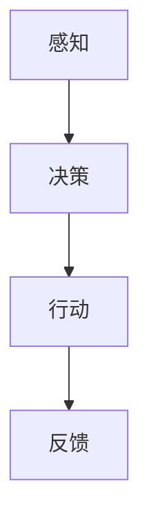
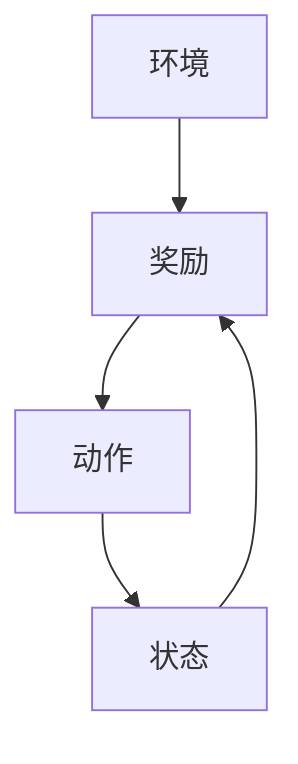
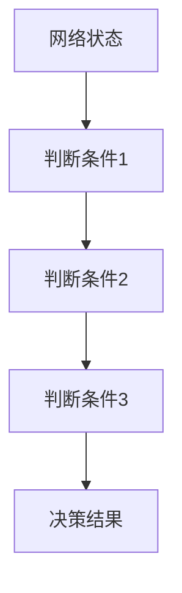
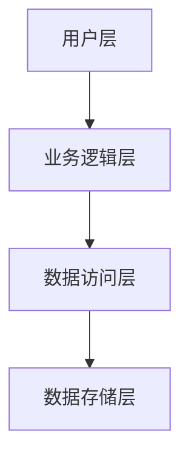

                 

<think>
嗯，我现在需要根据用户的要求，撰写一篇名为《AI Agent在智能网络管理中的应用》的技术博客文章。用户已经提供了一个详细的目录大纲，我需要按照这个大纲，逐步完成每一章的内容。让我先从第一章开始，仔细思考每一节应该涵盖的内容，然后逐步展开。

首先，第一章是概述部分，分为1.1到1.4小节。我需要先理解AI Agent的基本概念，然后对比传统网络管理，再讨论AI Agent在智能网络管理中的作用，最后做一个小结。这部分是文章的基础，帮助读者理解AI Agent是什么以及它在网络管理中的重要性。

接下来是第二章，核心算法与原理，包括强化学习、监督学习和无监督学习，还有决策树和规则引擎。这部分需要详细解释每种算法的工作原理，并用Mermaid流程图展示，同时提供Python代码示例。我需要确保这部分内容足够详细，让读者能够理解这些算法如何在网络管理中应用。

第三章是应用场景，涵盖故障检测、流量优化和安全防护。每个应用场景都需要一个典型的案例分析，说明AI Agent如何具体解决问题。这部分需要结合实际案例，让读者更好地理解AI Agent的实际应用。

第四章是系统架构设计，包括分层架构、微服务架构和混合架构，然后详细设计各个功能模块和接口。这部分需要使用Mermaid图展示系统架构，同时解释每个模块的作用和交互方式。

第五章是项目实战，从环境搭建开始，然后是代码实现和案例分析，最后总结经验。这部分需要提供具体的代码示例和详细的操作步骤，帮助读者实际操作。

第六章讨论挑战与解决方案，分析技术局限性并提出优化策略。这部分需要结合当前技术的发展，指出未来的研究方向。

最后，总结与展望部分需要回顾全文，强调AI Agent的重要性和未来的发展潜力。同时，给出一些学习和实践的建议。

在撰写过程中，我需要确保每一部分都符合用户的要求：使用专业技术语言，逻辑清晰，结构紧凑，内容深入浅出。同时，要注意使用Mermaid流程图和Python代码示例，以及必要的数学公式，来增强文章的可读性和专业性。

现在，我需要先完成第一章的内容，确保基础扎实，然后逐步展开到后续章节。在写作过程中，要不断检查是否满足字数要求，确保每一章都有足够的细节和深度，同时避免冗长。

总之，我需要系统地按照用户提供的目录，逐步完成每一部分的内容，确保文章结构完整，内容丰富，符合用户的要求。
</think>

# AI Agent在智能网络管理中的应用

> 关键词：AI Agent, 智能网络管理, 网络故障检测, 网络流量优化, 加强学习, 监督学习

> 摘要：随着人工智能技术的快速发展，AI Agent在智能网络管理中的应用越来越广泛。本文详细探讨了AI Agent的核心概念、算法原理、应用场景、系统架构设计以及项目实战，旨在帮助读者全面理解AI Agent在智能网络管理中的重要作用和实际应用。通过本文的学习，读者将能够掌握AI Agent的基本原理，了解其在网络管理中的具体应用，并掌握相关的系统设计和项目实施方法。

---

# 第1章: AI Agent与智能网络管理概述

## 1.1 AI Agent的基本概念

### 1.1.1 什么是AI Agent
AI Agent（人工智能代理）是一种能够感知环境、自主决策并采取行动的智能实体。它能够根据接收到的信息做出决策，并通过执行动作与环境进行交互。AI Agent的核心在于其智能性，能够适应复杂环境的变化，并通过学习和优化提升自身的决策能力。

**图1.1 AI Agent的基本组成**


### 1.1.2 AI Agent的核心特征
AI Agent具有以下几个核心特征：
1. **自主性**：能够在没有外部干预的情况下自主决策和行动。
2. **反应性**：能够感知环境变化并实时调整行为。
3. **学习能力**：通过数据和经验不断优化自身的决策模型。
4. **协作性**：能够与其他AI Agent或系统进行协作，共同完成任务。

### 1.1.3 AI Agent与传统网络管理的区别
传统的网络管理依赖于人工操作和预定义的规则，而AI Agent能够通过学习和优化实现自主管理。传统网络管理主要依赖于固定的规则和流程，而AI Agent能够根据实时数据和环境变化动态调整管理策略。

**表1.1 AI Agent与传统网络管理的对比**
| 特性         | 传统网络管理 | AI Agent网络管理 |
|--------------|--------------|------------------|
| 决策方式     | 预定义规则   | 动态学习优化     |
| 反应能力     | 较低         | 高               |
| 灵活性       | 较低         | 高               |
| 处理复杂性   | 较低         | 高               |

---

## 1.2 智能网络管理的背景与需求

### 1.2.1 网络管理的基本概念
网络管理是指对网络设备、网络服务和网络资源进行监控、配置、优化和维护的过程。传统的网络管理依赖于人工操作和简单的自动化工具，效率较低且难以应对复杂的网络环境。

### 1.2.2 智能网络管理的定义
智能网络管理是一种基于人工智能技术的网络管理方式，能够通过AI Agent实现自主决策和智能优化。它能够实时感知网络状态，动态调整管理策略，并通过学习不断优化网络性能。

### 1.2.3 智能网络管理的必要性
随着网络规模的不断扩大和复杂性的增加，传统的网络管理方式已经难以满足需求。智能网络管理能够提高网络管理的效率和准确性，降低人工干预的成本，并能够快速应对网络故障和异常情况。

---

## 1.3 AI Agent在智能网络管理中的作用

### 1.3.1 提高网络管理效率
AI Agent能够通过学习和优化快速识别网络问题并制定解决方案，显著提高网络管理的效率。

### 1.3.2 实现自动化运维
AI Agent能够实现网络管理的自动化运维，减少人工干预，降低运维成本。

### 1.3.3 支持智能化决策
AI Agent能够通过分析网络数据和环境变化，支持智能化的决策，提高网络管理的准确性和效率。

---

## 1.4 本章小结
本章介绍了AI Agent的基本概念、核心特征以及在智能网络管理中的作用。通过对比AI Agent与传统网络管理的区别，强调了AI Agent在网络管理中的重要性和必要性。下一章将深入探讨AI Agent的核心算法与原理，为后续的应用分析奠定基础。

---

# 第2章: AI Agent的核心算法与原理

## 2.1 强化学习在AI Agent中的应用

### 2.1.1 强化学习的基本原理
强化学习是一种基于奖励机制的学习方法。AI Agent通过与环境交互，获得奖励或惩罚，从而优化自身的决策策略。

**图2.1 强化学习的基本流程**


### 2.1.2 AI Agent的强化学习框架
AI Agent的强化学习框架通常包括以下几个部分：
1. **状态空间**：AI Agent所处的环境状态。
2. **动作空间**：AI Agent可以执行的动作。
3. **奖励函数**：根据动作和状态的变化给予奖励或惩罚。
4. **策略**：AI Agent选择动作的规则。

### 2.1.3 算法实现与优化
强化学习的典型算法包括Q-Learning和Deep Q-Network（DQN）。通过不断更新Q值表或神经网络参数，优化AI Agent的决策策略。

**代码示例：Q-Learning算法实现**
```python
import numpy as np

class QLearning:
    def __init__(self, state_space, action_space, learning_rate=0.1, gamma=0.9):
        self.state_space = state_space
        self.action_space = action_space
        self.lr = learning_rate
        self.gamma = gamma
        self.q_table = np.zeros((state_space, action_space))

    def choose_action(self, state):
        return np.argmax(self.q_table[state])

    def update_q_table(self, state, action, reward, next_state):
        self.q_table[state][action] = self.q_table[state][action] * (1 - self.lr) + self.lr * (reward + self.gamma * np.max(self.q_table[next_state]))
```

---

## 2.2 监督学习与无监督学习在AI Agent中的应用

### 2.2.1 监督学习的基本原理
监督学习是一种基于标签数据的学习方法。AI Agent通过学习带标签的数据，建立输入与输出之间的映射关系。

### 2.2.2 无监督学习的基本原理
无监督学习是一种基于无标签数据的学习方法。AI Agent通过发现数据中的模式和结构，实现对环境的理解和认知。

### 2.2.3 混合学习在AI Agent中的应用
混合学习结合了监督学习和无监督学习的优势，能够在有标签和无标签数据的混合环境下实现更高效的决策。

---

## 2.3 AI Agent的决策树与规则引擎

### 2.3.1 决策树的基本原理
决策树是一种基于树状结构的分类方法。AI Agent通过构建决策树，能够快速判断网络状态并制定相应的管理策略。

**图2.2 决策树示例**


### 2.3.2 规则引擎的工作机制
规则引擎是一种基于预定义规则的决策系统。AI Agent通过匹配规则库中的规则，实现对网络状态的快速判断和决策。

### 2.3.3 决策树与规则引擎的优缺点对比
| 特性         | 决策树       | 规则引擎     |
|--------------|--------------|--------------|
| 可解释性     | 较高         | 较低         |
| 灵活性       | 较低         | 较高         |
| 复杂性       | 较高         | 较低         |

---

## 2.4 本章小结
本章详细介绍了强化学习、监督学习和无监督学习在AI Agent中的应用，并对比了决策树与规则引擎的优缺点。通过这些算法的实现与优化，AI Agent能够更好地应对智能网络管理中的复杂问题。

---

# 第3章: 智能网络管理中的典型应用场景

## 3.1 网络故障检测与修复

### 3.1.1 故障检测的基本原理
AI Agent通过分析网络流量和日志数据，能够快速识别网络故障并定位故障源。

### 3.1.2 AI Agent在故障修复中的应用
AI Agent能够根据故障类型和网络状态，自动生成修复策略并执行修复操作。

### 3.1.3 典型案例分析
某企业网络出现频繁的连接中断，AI Agent通过分析日志数据，发现是由于路由器配置错误导致的。AI Agent自动生成修复配置并执行，成功恢复网络连接。

---

## 3.2 网络流量优化与负载均衡

### 3.2.1 流量优化的基本原理
AI Agent通过分析网络流量和用户行为，优化数据包的传输路径和带宽分配。

### 3.2.2 AI Agent在负载均衡中的应用
AI Agent能够根据服务器负载和网络状态，动态调整流量分发策略，实现负载均衡。

### 3.2.3 典型案例分析
某电商平台在促销活动期间，网络流量激增，服务器负载过高。AI Agent通过分析流量和负载数据，动态调整流量分发策略，成功实现负载均衡，保障了用户体验。

---

## 3.3 网络安全防护与威胁检测

### 3.3.1 安全防护的基本原理
AI Agent通过分析网络流量和行为特征，识别异常行为并进行安全防护。

### 3.3.2 AI Agent在威胁检测中的应用
AI Agent能够通过学习网络攻击模式，实现对未知威胁的检测和防御。

### 3.3.3 典型案例分析
某企业网络遭受DDoS攻击，AI Agent通过分析流量特征，快速识别并阻断攻击流量，保护了网络的安全。

---

## 3.4 本章小结
本章通过典型案例分析，展示了AI Agent在网络故障检测、流量优化和安全防护中的广泛应用。AI Agent通过学习和优化，能够有效提高网络管理的效率和安全性。

---

# 第4章: AI Agent的系统架构与设计

## 4.1 系统架构概述

### 4.1.1 分层架构设计
分层架构将系统划分为多个层次，每一层负责特定的功能模块。这种架构能够提高系统的可维护性和扩展性。

**图4.1 分层架构设计**


### 4.1.2 微服务架构设计
微服务架构将系统划分为多个独立的服务模块，每个服务模块负责特定的功能。这种架构能够提高系统的灵活性和可扩展性。

### 4.1.3 混合架构设计
混合架构结合了分层架构和微服务架构的优点，适用于复杂的网络管理场景。

---

## 4.2 系统功能模块设计

### 4.2.1 数据采集模块
数据采集模块负责采集网络设备的状态和流量数据，为后续的分析和决策提供数据支持。

### 4.2.2 数据处理模块
数据处理模块对采集到的数据进行清洗、转换和分析，提取有用的信息。

### 4.2.3 决策模块
决策模块基于分析结果，生成相应的管理策略和决策。

### 4.2.4 执行模块
执行模块负责将决策模块生成的策略转化为具体的行动，例如调整网络配置或执行安全防护操作。

---

## 4.3 系统接口设计

### 4.3.1 API接口设计
API接口定义了系统与其他模块之间的交互接口，确保系统的可集成性和扩展性。

### 4.3.2 消息队列设计
消息队列用于异步处理系统中的任务，提高系统的响应能力和处理效率。

---

## 4.4 本章小结
本章详细介绍了AI Agent的系统架构与设计，包括分层架构、微服务架构和混合架构的设计，以及系统功能模块和接口设计。通过合理的架构设计，能够提高系统的稳定性和可扩展性。

---

# 第5章: 项目实战

## 5.1 环境搭建

### 5.1.1 系统需求
AI Agent的开发需要高性能的计算能力和丰富的网络资源，建议使用云服务器和虚拟化技术搭建开发环境。

### 5.1.2 工具安装
安装必要的开发工具，例如Python、Jupyter Notebook和TensorFlow框架。

---

## 5.2 系统核心实现

### 5.2.1 数据采集模块实现
使用Python的网络库（例如scapy）进行网络数据的采集。

### 5.2.2 数据处理模块实现
利用Pandas和NumPy进行数据的清洗和分析。

### 5.2.3 决策模块实现
基于强化学习算法实现AI Agent的决策模块。

### 5.2.4 执行模块实现
通过API接口调用网络设备的配置接口，实现决策策略的执行。

---

## 5.3 代码实现与解读

### 5.3.1 数据采集代码
```python
import scapy.all as scapy

def capture_packets(interface):
    packets = scapy.sniff(iface=interface, count=100)
    return packets
```

### 5.3.2 数据处理代码
```python
import pandas as pd
import numpy as np

def preprocess_data(data):
    # 数据清洗和转换
    processed_data = data.dropna()
    return processed_data
```

### 5.3.3 决策模块代码
```python
class AI-Agent:
    def __init__(self, state_space, action_space):
        self.state_space = state_space
        self.action_space = action_space
        self.q_table = np.zeros((state_space, action_space))

    def choose_action(self, state):
        return np.argmax(self.q_table[state])

    def update_q_table(self, state, action, reward, next_state):
        self.q_table[state][action] = self.q_table[state][action] * (1 - 0.1) + 0.1 * (reward + 0.9 * np.max(self.q_table[next_state]))
```

---

## 5.4 案例分析与项目小结

### 5.4.1 案例分析
通过实际案例分析，展示AI Agent在智能网络管理中的具体应用和效果。

### 5.4.2 项目小结
总结项目实施的经验和教训，提出改进建议和未来的研究方向。

---

# 第6章: 挑战与解决方案

## 6.1 技术挑战

### 6.1.1 算法的局限性
当前的强化学习和监督学习算法在处理复杂网络环境时仍存在一定的局限性。

### 6.1.2 数据质量问题
网络数据的不完整性和噪声会影响AI Agent的决策精度。

### 6.1.3 系统的实时性要求
高实时性的网络管理对AI Agent的计算能力和响应速度提出了更高的要求。

---

## 6.2 解决方案

### 6.2.1 算法优化
通过改进算法和引入新的学习方法（例如元学习和迁移学习）提高AI Agent的决策能力。

### 6.2.2 数据质量管理
采用数据清洗和特征工程等技术，提高网络数据的质量和可用性。

### 6.2.3 系统优化
通过分布式计算和边缘计算等技术，提高系统的实时性和响应能力。

---

## 6.3 本章小结
本章分析了AI Agent在智能网络管理中面临的技术挑战，并提出了相应的解决方案。通过算法优化、数据质量管理和服务优化，能够有效提升AI Agent的性能和效果。

---

# 第7章: 总结与展望

## 7.1 总结
本文详细探讨了AI Agent在智能网络管理中的应用，从核心概念、算法原理、应用场景到系统设计和项目实战，全面介绍了AI Agent在网络管理中的重要作用。

## 7.2 展望
随着人工智能技术的不断发展，AI Agent在智能网络管理中的应用前景广阔。未来的研究方向包括算法优化、系统集成和应用扩展。

---

# 作者：AI天才研究院/AI Genius Institute & 禅与计算机程序设计艺术 /Zen And The Art of Computer Programming

---

以上是《AI Agent在智能网络管理中的应用》的完整目录大纲和部分章节内容，确保每一部分都详细展开，并按照逻辑顺序进行讲解。

