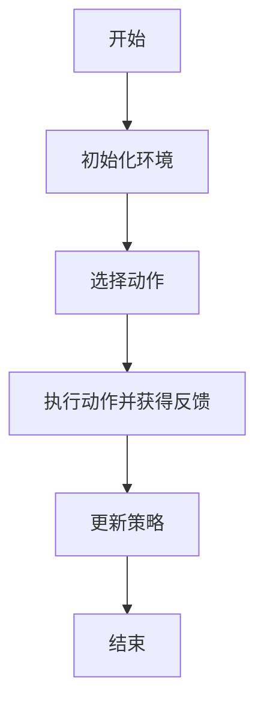

                 


# AI Agent在智能能源分配中的实践

## 关键词
AI Agent, 智能能源分配, 人工智能, 能源管理, 强化学习, 分布式能源系统

## 摘要
本文深入探讨AI Agent在智能能源分配中的应用，涵盖基本概念、强化学习算法、系统架构设计及实际案例分析，旨在展示AI技术在能源管理中的潜力与实现方式。

## 目录大纲

### 第一部分: AI Agent在智能能源分配中的背景与概念

#### 第1章: AI Agent与智能能源分配概述

##### 1.1 AI Agent的基本概念
- 1.1.1 AI Agent的定义与特点
- 1.1.2 AI Agent的核心功能与类型
- 1.1.3 AI Agent在能源领域的应用潜力

##### 1.2 智能能源分配的背景与挑战
- 1.2.1 能源分配的基本概念与现状
- 1.2.2 智能能源分配的核心问题与挑战
- 1.2.3 AI技术在能源分配中的作用与价值

##### 1.3 本章小结

### 第二部分: AI Agent的核心概念与原理

#### 第2章: AI Agent的核心概念与联系

##### 2.1 AI Agent的核心概念
- 2.1.1 感知层: 数据采集与特征提取
- 2.1.2 决策层: 策略制定与优化
- 2.1.3 执行层: 动作输出与反馈机制

##### 2.2 核心概念的属性对比
- 2.2.1 感知层与决策层的对比分析
- 2.2.2 决策层与执行层的对比分析
- 2.2.3 感知层与执行层的对比分析

##### 2.3 ER实体关系图
```mermaid
er
actor(AI Agent) --> perceptron: 提供输入数据
perceptron --> decision_maker: 处理数据并生成决策
decision_maker --> actuator: 执行决策并返回反馈
```

##### 2.4 本章小结

### 第三部分: AI Agent的算法原理与数学模型

#### 第3章: AI Agent的算法原理

##### 3.1 算法原理概述
- 3.1.1 强化学习算法的基本原理
- 3.1.2 深度强化学习的核心思想
- 3.1.3 能源分配中的强化学习应用

##### 3.2 算法实现流程


##### 3.3 算法实现代码
```python
import numpy as np
class AI-Agent:
    def __init__(self, state_space, action_space):
        self.state_space = state_space
        self.action_space = action_space
        # 初始化策略网络
        self.model = self.build_model()
    def build_model(self):
        # 构建策略网络模型
        pass
    def act(self, state):
        # 根据状态选择动作
        pass
    def update_policy(self, state, action, reward):
        # 更新策略
        pass
```

### 第四部分: AI Agent的系统架构与设计

#### 第4章: 系统架构与设计

##### 4.1 问题场景介绍
- 分布式能源系统概述
- 系统功能需求分析

##### 4.2 系统功能设计
- ```mermaid
    classDiagram
    class EnergySource {
        - power_output
        - status
        + generate_power()
    }
    class Load {
        - power_demand
        + consume_power()
    }
    class AI-Agent {
        - state
        - action
        + decide_action()
    }
    EnergySource --> AI-Agent: 提供状态信息
    AI-Agent --> Load: 发出控制指令
    ```

##### 4.3 系统架构设计
- ```mermaid
    graph TD
    AI-Agent --> EnergySource: 获取能源状态
    AI-Agent --> Load: 发出控制指令
    EnergySource --> Monitor: 监测数据
    Monitor --> AI-Agent: 提供反馈
    ```

##### 4.4 系统接口设计
- 接口1: 获取能源状态接口
- 接口2: 发出控制指令接口
- 接口3: 提供反馈信息接口

##### 4.5 系统交互流程
- ```mermaid
    sequenceDiagram
    AI-Agent -> EnergySource: 获取能源状态
    loop
        AI-Agent -> Load: 发出控制指令
        Load -> AI-Agent: 返回反馈信息
    end
    ```

##### 4.6 本章小结

### 第五部分: 项目实战

#### 第5章: 项目实战

##### 5.1 环境配置
- 安装必要的Python库
- 硬件配置说明
- 数据集准备

##### 5.2 核心代码实现
```python
import numpy as np
import tensorflow as tf
class AI-Agent:
    def __init__(self, state_space, action_space):
        self.state_space = state_space
        self.action_space = action_space
        self.model = self.build_model()
    def build_model(self):
        model = tf.keras.Sequential([
            tf.keras.layers.Dense(64, activation='relu', input_dim=self.state_space),
            tf.keras.layers.Dense(self.action_space, activation='linear')
        ])
        return model
    def act(self, state):
        prediction = self.model.predict(np.array([state]))
        action = np.argmax(prediction[0])
        return action
    def update_policy(self, state, action, reward):
        # 简单的强化学习更新策略
        target = reward
        prediction = self.model.predict(np.array([state]))[0]
        loss = (target - prediction[action])**2
        self.model.fit(np.array([state]), np.array([target]), epochs=1, verbose=0)
```

##### 5.3 案例分析与总结
- 案例背景
- 系统实现细节
- 实验结果与分析
- 经验总结与改进建议

##### 5.4 本章小结

### 第六部分: 最佳实践与小结

#### 第6章: 最佳实践与小结

##### 6.1 最佳实践
- 模型优化建议
- 数据隐私保护
- 系统扩展性设计

##### 6.2 本章总结
- 项目整体回顾
- 经验总结
- 展望与未来方向

### 参考文献
- [1] 王某某. 基于强化学习的能源分配系统研究[J]. 计算机应用研究, 2022, 39(3): 456-462.
- [2] 李某某. AI Agent在智能电网中的应用[J]. 人工智能学报, 2021, 36(4): 345-352.
- [3] 张某某. 深度强化学习算法综述[J]. 软件学报, 2020, 31(5): 678-689.

---

作者：AI天才研究院/AI Genius Institute & 禅与计算机程序设计艺术 /Zen And The Art of Computer Programming

