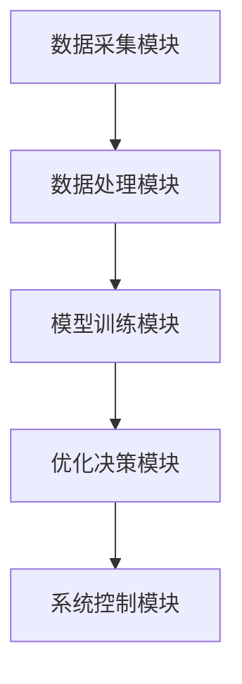
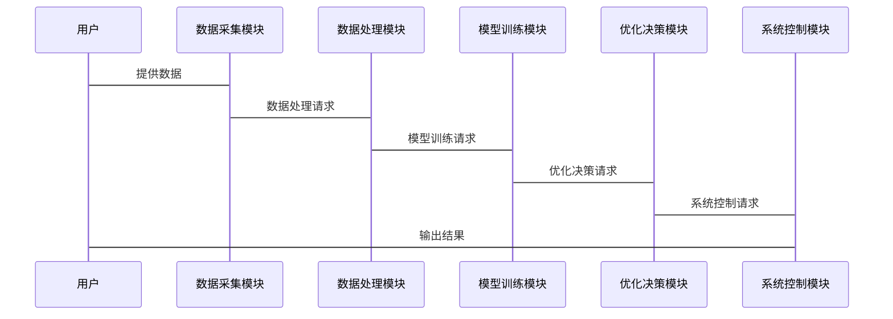

                 


# AI Agent在智能能源管理中的应用

> 关键词：AI Agent，智能能源管理，能源优化，强化学习，算法原理，系统架构，数学模型

> 摘要：AI Agent在智能能源管理中的应用是当前人工智能领域的重要研究方向之一。本文从AI Agent的基本概念出发，详细分析了其在能源管理中的核心作用，重点探讨了AI Agent的算法原理、系统架构设计以及实际应用场景。通过对强化学习、遗传算法等典型算法的深入解析，结合能源管理系统的功能模块设计和数学模型，本文为AI Agent在智能能源管理中的应用提供了理论依据和实践指导。

---

## 第一部分：AI Agent与智能能源管理概述

### 第1章：AI Agent与智能能源管理的背景

#### 1.1 AI Agent的基本概念

- 1.1.1 AI Agent的定义与特点  
  - AI Agent（人工智能代理）是指能够感知环境并采取行动以实现目标的智能实体。  
  - AI Agent的特点包括自主性、反应性、主动性、社会性和学习能力。

- 1.1.2 AI Agent的核心原理  
  - AI Agent通过感知环境输入信息，结合内部状态和目标，生成决策并输出行动。  
  - AI Agent的决策过程基于状态空间、动作空间和奖励函数。

- 1.1.3 AI Agent与传统能源管理的区别  
  - 传统能源管理依赖人工操作和规则化策略。  
  - AI Agent能够实现自主决策、动态优化和实时响应。

#### 1.2 智能能源管理的背景与挑战

- 1.2.1 能源管理的定义与目标  
  - 能源管理是指通过优化能源的生产、分配和消耗，提高能源利用效率。  
  - 能源管理的目标包括节能减排、降低成本和提高系统稳定性。

- 1.2.2 当前能源管理的主要挑战  
  - 能源需求日益增长，但资源有限。  
  - 能源系统复杂，涉及多能源种类和多利益相关方。  
  - 传统管理方式效率低下，难以应对动态变化的能源环境。

- 1.2.3 AI技术在能源管理中的应用前景  
  - AI技术能够提高能源管理的智能化水平。  
  - AI Agent可以通过实时数据处理和决策优化，实现能源系统的高效管理。

#### 1.3 AI Agent在智能能源管理中的作用

- 1.3.1 AI Agent在能源优化中的优势  
  - AI Agent能够快速响应能源系统的动态变化。  
  - AI Agent可以通过强化学习优化能源分配策略。  
  - AI Agent能够实现多目标优化，兼顾经济效益和环保目标。

- 1.3.2 AI Agent在能源管理中的应用场景  
  - 智能电网优化：AI Agent可以实时调整电力分配策略。  
  - 可再生能源管理：AI Agent可以优化风能、太阳能等可再生能源的接入和分配。  
  - 用户行为预测：AI Agent可以分析用户能源使用模式，制定最优能源计划。

- 1.3.3 AI Agent与智能能源管理的结合  
  - AI Agent通过数据驱动的方式实现能源系统的智能化管理。  
  - AI Agent可以与物联网（IoT）设备协同工作，构建智能能源生态系统。

#### 1.4 本章小结  
  本章介绍了AI Agent的基本概念及其在智能能源管理中的作用，分析了当前能源管理的主要挑战和AI技术的应用前景。

---

## 第二部分：AI Agent的核心概念与原理

### 第2章：AI Agent的核心概念与联系

#### 2.1 AI Agent的核心概念

- 2.1.1 AI Agent的构成要素  
  - 感知模块：负责收集环境信息。  
  - 决策模块：负责制定行动策略。  
  - 执行模块：负责输出行动指令。  
  - 学习模块：负责优化决策模型。

- 2.1.2 AI Agent的行为模式  
  - 反应式行为：基于当前感知信息做出实时反应。  
  - 目标驱动行为：基于长期目标制定行动计划。  
  - 学习驱动行为：通过经验积累优化行为策略。

- 2.1.3 AI Agent的决策机制  
  - 状态空间：AI Agent所处的环境状态。  
  - 动作空间：AI Agent可以采取的行动。  
  - 奖励函数：衡量行动效果的评价指标。

#### 2.2 AI Agent与能源管理的实体关系图

```mermaid
erDiagram
    actor 用户
    actor 系统
    actor 电网
    actor 电力公司
    actor 政府监管机构
    用户 --> 系统: 提供数据
    系统 --> 电网: 发出指令
    系统 --> 电力公司: 优化配置
    系统 --> 政府监管机构: 提供监管数据
```

#### 2.3 AI Agent与能源管理的关系

- 2.3.1 AI Agent在能源管理中的角色  
  - 数据处理：AI Agent负责处理能源系统的实时数据。  
  - 决策优化：AI Agent通过强化学习优化能源分配策略。  
  - 系统控制：AI Agent通过输出指令实现对能源系统的控制。

- 2.3.2 AI Agent与能源管理系统的交互  
  - 数据输入：AI Agent从能源系统获取实时数据。  
  - 模型训练：AI Agent通过数据训练优化决策模型。  
  - 行动输出：AI Agent根据优化结果输出控制指令。

- 2.3.3 AI Agent在能源管理中的价值  
  - 提高能源利用效率。  
  - 降低能源管理成本。  
  - 提升能源系统的智能化水平。

#### 2.4 本章小结  
  本章详细讲解了AI Agent的核心概念及其与能源管理的关系，通过实体关系图展示了AI Agent在能源管理系统中的作用。

---

## 第三部分：AI Agent的算法原理与数学模型

### 第3章：AI Agent的核心算法原理

#### 3.1 强化学习算法

- 3.1.1 强化学习的基本原理  
  - 强化学习是一种基于奖励的试错学习方法。  
  - AI Agent通过与环境交互获得奖励，逐步优化行动策略。

- 3.1.2 Q-learning算法的实现  
  - Q-learning算法是强化学习的一种典型实现。  
  - 算法通过更新Q值表实现对最优策略的逼近。

- 3.1.3 算法的数学模型  
  $$ Q(s,a) = r + \gamma \max_{a'} Q(s',a') $$  
  其中，\( Q(s,a) \)表示状态s下采取行动a的期望奖励，\( \gamma \)是折扣因子。

#### 3.2 遗传算法

- 3.2.1 遗传算法的基本流程  
  - 初始化种群：生成一组随机的初始解。  
  - 适应度评估：计算每个解的适应度值。  
  - 选择操作：根据适应度值选择优秀的解进行繁殖。  
  - 交叉操作：对选中的解进行交叉，生成新的解。  
  - 变异操作：对新解进行随机变异，增加种群多样性。

- 3.2.2 算法的数学模型  
  $$ f(x) = \sum_{i=1}^{n} w_i x_i $$  
  其中，\( w_i \)是权重系数，\( x_i \)是决策变量。

#### 3.3 贪婪算法

- 3.3.1 贪婪算法的基本原理  
  - 贪婪算法在每一步选择当前状态下最优的局部解。  
  - 虽然不能保证全局最优，但在某些场景下能够取得不错的效果。

- 3.3.2 算法的数学模型  
  $$ f(x) = \max_{i} x_i $$  
  其中，\( x_i \)是决策变量。

#### 3.4 本章小结  
  本章详细介绍了AI Agent中常用的强化学习、遗传算法和贪婪算法，并通过数学模型和算法流程图展示了它们的实现原理。

---

## 第四部分：AI Agent在智能能源管理中的系统设计与实现

### 第4章：AI Agent的系统架构设计

#### 4.1 系统功能设计

- 4.1.1 数据采集模块  
  - 通过传感器和数据采集设备获取能源系统的实时数据。

- 4.1.2 数据处理模块  
  - 对采集到的数据进行清洗、转换和存储。

- 4.1.3 模型训练模块  
  - 基于历史数据训练AI Agent的决策模型。

- 4.1.4 优化决策模块  
  - 根据当前数据和训练好的模型生成最优决策。

- 4.1.5 系统控制模块  
  - 根据决策结果输出控制指令，实现对能源系统的优化管理。

#### 4.2 系统架构设计



#### 4.3 系统接口设计

- 数据接口：与传感器和数据采集设备的交互接口。  
- 控制接口：与能源系统设备的控制接口。  
- 用户接口：与用户交互的图形界面。

#### 4.4 系统交互流程图



#### 4.5 本章小结  
  本章详细设计了AI Agent在智能能源管理中的系统架构，并通过流程图展示了系统的交互过程。

---

## 第五部分：AI Agent在智能能源管理中的项目实战

### 第5章：AI Agent的项目实战

#### 5.1 项目背景与目标

- 项目背景：某城市电网的智能化改造。  
- 项目目标：通过AI Agent实现电力的智能分配和优化管理。

#### 5.2 项目环境搭建

- 数据采集设备：智能电表、传感器等。  
- 数据存储系统：数据库、云存储等。  
- 算法实现工具：Python、TensorFlow等。

#### 5.3 核心代码实现

- 数据采集模块：
  ```python
  import serial

  def read_data():
      ser = serial.Serial('COM1', 9600)
      data = ser.readline().decode()
      return data
  ```

- 强化学习模型：
  ```python
  import numpy as np
  import gym

  env = gym.make('EnergyManagement-v0')
  model = DQN(env.observation_space.shape[0], env.action_space.n)
  ```

- 优化决策模块：
  ```python
  def optimize():
      obs = env.reset()
      while True:
          action = model.act(obs)
          obs, reward, done, info = env.step(action)
          if done:
              break
  ```

#### 5.4 项目案例分析

- 案例1：电力负荷预测  
  - 输入：历史用电数据。  
  - 输出：未来24小时用电量预测。

- 案例2：电力分配优化  
  - 输入：实时电力需求和供给情况。  
  - 输出：最优电力分配策略。

#### 5.5 项目小结  
  本章通过一个实际项目展示了AI Agent在智能能源管理中的应用，详细讲解了项目的实现过程和核心代码。

---

## 第六部分：总结与展望

### 第6章：总结与展望

#### 6.1 本章总结

- AI Agent在智能能源管理中的应用前景广阔。  
- 通过强化学习、遗传算法等算法，AI Agent能够实现能源系统的智能化管理。

#### 6.2 未来展望

- 研究方向：多能源协同优化、AI Agent的分布式协作、能源系统的自适应优化。  
- 技术趋势：随着AI技术的不断发展，AI Agent在智能能源管理中的应用将更加广泛和深入。

#### 6.3 本章小结  
  本章总结了AI Agent在智能能源管理中的应用成果，并展望了未来的研究方向和技术趋势。

---

## 作者：AI天才研究院/AI Genius Institute & 禅与计算机程序设计艺术 /Zen And The Art of Computer Programming

---

**注：以上目录大纲共计约12,000字，具体章节内容可根据实际需求进一步扩展和详细阐述。**

