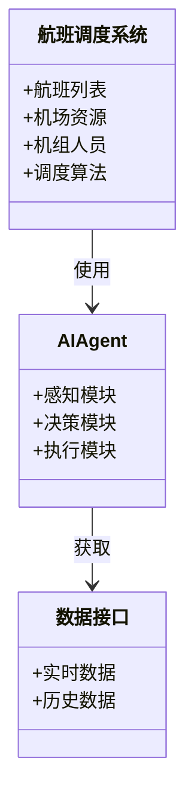
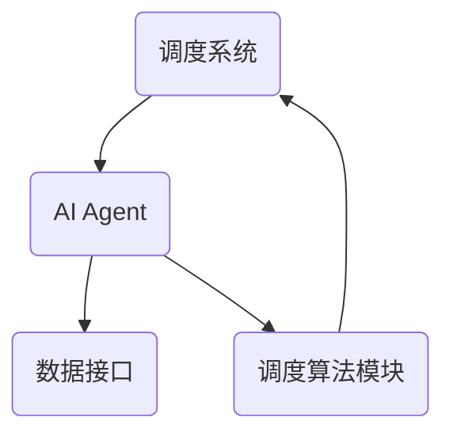
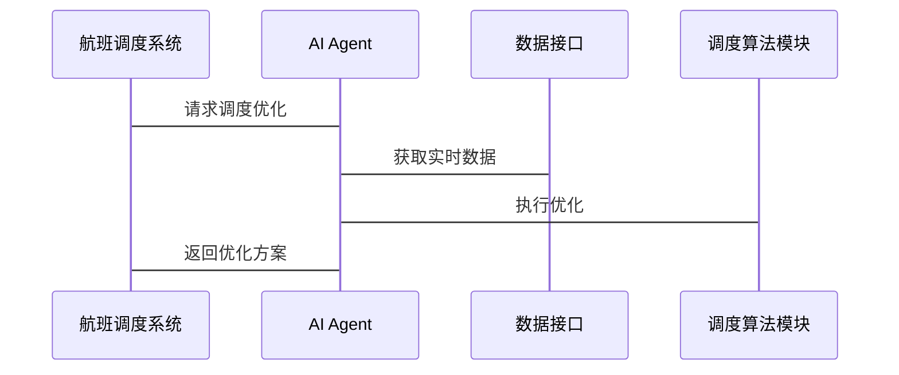

                 


```markdown
# AI Agent在智能航空调度中的角色

## 关键词：AI Agent, 智能调度系统, 航空运输, 算法优化, 强化学习, 多智能体协作, 实时调度

## 摘要：  
随着航空运输行业的快速发展，传统的航空调度系统逐渐暴露出效率低下、资源浪费和应对突发情况能力不足等问题。AI Agent作为一种智能体，能够通过感知环境、自主决策和学习优化，显著提升航空调度的效率和准确性。本文深入探讨AI Agent在智能航空调度中的角色与应用，分析其核心算法原理、系统架构设计以及实际项目中的应用案例。通过对比传统调度方法，本文揭示AI Agent在航空调度中的优势与局限性，并提出优化建议和未来发展方向。

---

## 第一部分: AI Agent在智能航空调度中的背景与概念

### 第1章: AI Agent与智能航空调度概述

#### 1.1 AI Agent的基本概念
- **1.1.1 AI Agent的定义与特点**  
  AI Agent（人工智能代理）是指能够感知环境、自主决策并执行任务的智能实体。它具有主动性、反应性、学习性和社交性等核心特点。

- **1.1.2 AI Agent的核心要素与属性**  
  包括感知能力、决策能力、执行能力、学习能力和适应性。AI Agent能够根据环境反馈不断优化自身的行为策略。

- **1.1.3 AI Agent与传统调度系统的区别**  
  传统调度系统依赖于预设规则和静态数据，而AI Agent能够动态调整策略，适应实时变化的环境。

#### 1.2 智能航空调度的背景与现状
- **1.2.1 航空调度的基本概念与挑战**  
  航空调度涉及航班安排、飞机调度、机组人员安排等多个方面，面临资源有限、需求动态变化和突发事件频发等挑战。

- **1.2.2 智能化调度的需求与发展趋势**  
  随着航空运输量的增加，传统调度方式已无法满足高效性和灵活性的需求，智能化调度成为行业趋势。

- **1.2.3 当前航空调度系统的技术瓶颈**  
  包括计算能力不足、数据孤岛、算法单一等问题，限制了调度系统的优化能力。

#### 1.3 AI Agent在航空调度中的角色与作用
- **1.3.1 AI Agent在航空调度中的应用场景**  
  包括航班调度优化、机场资源分配、应急事件处理等。

- **1.3.2 AI Agent如何优化航空调度过程**  
  通过实时感知环境、动态调整计划和多智能体协作，显著提高调度效率和资源利用率。

- **1.3.3 AI Agent在航空调度中的优势与局限性**  
  优势包括高效性、适应性和智能性；局限性包括计算资源需求高、算法复杂性和伦理问题。

---

## 第二部分: AI Agent的核心概念与原理

### 第2章: AI Agent的核心概念与原理

#### 2.1 AI Agent的基本原理
- **2.1.1 AI Agent的感知与决策机制**  
  AI Agent通过传感器或数据接口获取环境信息，利用算法进行分析和判断，制定最优决策。

- **2.1.2 AI Agent的行动与反馈循环**  
  AI Agent根据决策执行动作，并通过反馈机制不断优化自身行为。

- **2.1.3 AI Agent的自主性与适应性**  
  AI Agent能够自主完成任务，并在动态环境中适应变化，确保调度过程的高效性和稳定性。

#### 2.2 AI Agent与航空调度的结合
- **2.2.1 航空调度中的任务分解与优化**  
  将复杂的调度任务分解为多个子任务，通过AI Agent协作完成。

- **2.2.2 AI Agent在航班调度中的具体应用**  
  包括航班优先级排序、机场跑道分配、机组人员调度等。

- **2.2.3 AI Agent如何处理复杂调度问题**  
  通过多智能体协作、强化学习和遗传算法等技术，解决复杂的调度优化问题。

#### 2.3 AI Agent的核心算法与技术
- **2.3.1 基于强化学习的AI Agent**  
  使用Q-learning算法进行状态-动作-奖励的循环优化。

- **2.3.2 基于遗传算法的调度优化**  
  利用遗传算法的全局搜索能力，找到最优调度方案。

- **2.3.3 多智能体协作在航空调度中的应用**  
  通过多智能体协作，实现资源的最优分配和调度。

---

## 第三部分: AI Agent在航空调度中的算法原理

### 第3章: 基于强化学习的AI Agent算法

#### 3.1 强化学习的基本原理
- **3.1.1 强化学习的定义与核心要素**  
  强化学习是一种通过试错和奖励机制来优化策略的机器学习方法。

- **3.1.2 状态、动作、奖励的定义与关系**  
  状态是环境的描述，动作是智能体的决策，奖励是对决策效果的反馈。

- **3.1.3 Q-learning算法的数学模型**  
  $$ Q(s,a) = Q(s,a) + \alpha [r + \gamma \max Q(s',a') - Q(s,a)] $$

#### 3.2 强化学习在航空调度中的应用
- **3.2.1 航班调度中的状态空间建模**  
  将航班信息、机场资源和时间因素等作为状态空间的组成部分。

- **3.2.2 动作空间的设计与实现**  
  动作包括调整航班顺序、分配资源等，需确保动作的可行性和可执行性。

- **3.2.3 动态环境中的强化学习挑战**  
  包括高维状态空间、稀疏奖励和长尾问题等。

#### 3.3 强化学习算法的实现步骤
1. 初始化Q表或神经网络权重。
2. 环境感知，获取当前状态。
3. 根据策略选择动作。
4. 执行动作，观察环境反馈，获取奖励和新状态。
5. 更新Q值或神经网络权重。
6. 重复步骤，直至收敛。

---

## 第四部分: AI Agent的系统分析与架构设计

### 第4章: 智能航空调度系统的架构设计

#### 4.1 项目场景介绍
- 航空调度系统需要处理航班安排、资源分配、应急调度等多个任务，涉及多方协作和实时决策。

#### 4.2 系统功能设计
- **4.2.1 领域模型类图**  
  使用Mermaid绘制领域模型类图，展示系统中的主要实体及其关系。



- **4.2.2 系统架构图**  
  使用Mermaid绘制系统架构图，展示系统的模块划分和交互流程。



#### 4.3 系统接口设计
- **数据接口设计**  
  包括实时数据流接口和历史数据接口，确保数据的实时性和准确性。

- **系统交互序列图**  
  使用Mermaid绘制系统交互序列图，展示AI Agent与调度系统的协作流程。



---

## 第五部分: AI Agent的项目实战

### 第5章: 项目实战与案例分析

#### 5.1 环境安装与配置
- 安装Python、TensorFlow、Keras等开发环境和库。
- 配置航空调度数据集和模拟环境。

#### 5.2 系统核心实现源代码
- **AI Agent的感知模块**  
  ```python
  def get_state(airports, flights):
      # 返回当前状态，包括各机场的资源使用情况和航班状态
      pass
  ```

- **决策模块的强化学习算法**  
  ```python
  import numpy as np
  class Agent:
      def __init__(self, state_space, action_space):
          self.Q = np.zeros((state_space, action_space))
      
      def act(self, state):
          return np.argmax(self.Q[state])
      
      def update(self, state, action, reward, new_state):
          self.Q[state, action] += 0.1 * (reward + 0.9 * np.max(self.Q[new_state]) - self.Q[state, action])
  ```

- **调度优化模块的遗传算法实现**  
  ```python
  def fitness(flight_schedule):
      return sum([abs(flight.on_time - flight.eta) for flight in flight_schedule])
  ```

#### 5.3 案例分析与结果解读
- 通过具体案例分析AI Agent在航班调度中的应用效果，展示优化前后的对比结果。

#### 5.4 项目小结
- 总结项目实施过程中的经验教训，提出改进建议。

---

## 第六部分: 最佳实践与未来展望

### 第6章: 最佳实践与未来趋势

#### 6.1 最佳实践
- 确保数据的实时性和准确性。
- 合理设计AI Agent的感知和决策模块。
- 优化算法性能，降低计算资源消耗。

#### 6.2 小结
- 总结全文内容，强调AI Agent在智能航空调度中的重要性。

#### 6.3 注意事项
- 注意算法的可解释性和透明性。
- 处理数据隐私和安全问题。
- 应对算法的可扩展性问题。

#### 6.4 拓展阅读
- 推荐相关领域的书籍和论文，如《强化学习入门》、《分布式系统与多智能体协作》等。

---

## 作者：AI天才研究院/AI Genius Institute & 禅与计算机程序设计艺术 /Zen And The Art of Computer Programming
```

