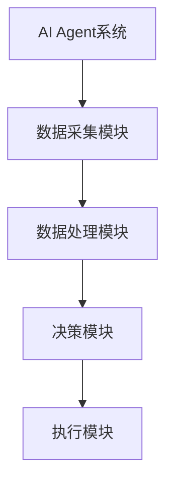

                 

# AI Agent在智能营销自动化中的应用

## 关键词：AI Agent、智能营销、自动化营销、机器学习、自然语言处理、强化学习、推荐系统

## 摘要：
本文深入探讨了AI Agent在智能营销自动化中的应用，分析了其在客户画像、精准营销、推荐系统等关键环节的优势。结合算法原理、系统架构和实际案例，揭示了AI Agent如何通过强化学习、监督学习等技术优化营销流程，提升效率和客户体验。

---

## 第一部分: AI Agent基础

### 第1章: AI Agent概述

#### 1.1 AI Agent的基本概念

##### 1.1.1 什么是AI Agent
AI Agent（人工智能代理）是能够感知环境并采取行动以实现目标的智能体。在营销领域，AI Agent能够自动化决策和执行任务，如客户互动、数据处理和策略优化。

##### 1.1.2 AI Agent的核心特征
- **自主性**：能够独立决策和行动。
- **反应性**：实时感知环境并做出响应。
- **目标导向**：通过优化目标实现最大化效果。
- **学习能力**：通过数据和经验不断优化性能。

##### 1.1.3 AI Agent的分类与应用场景
- **基于规则的AI Agent**：根据预定义规则执行任务。
- **基于模型的AI Agent**：利用机器学习模型进行决策。
- **混合型AI Agent**：结合规则和模型的混合策略。

#### 1.2 AI Agent与传统营销自动化
##### 1.2.1 传统营销自动化的局限性
传统营销自动化依赖固定规则，难以应对复杂多变的市场环境，缺乏灵活性和深度分析能力。

##### 1.2.2 AI Agent如何提升营销自动化能力
AI Agent通过机器学习和大数据分析，实时优化营销策略，提供个性化服务，显著提升效率和客户满意度。

##### 1.2.3 AI Agent在智能营销中的优势
- **精准决策**：基于数据驱动的分析，做出最优决策。
- **实时响应**：快速适应市场变化，提供即时反馈。
- **持续优化**：通过学习不断提升性能和效果。

#### 1.3 AI Agent的技术基础
##### 1.3.1 机器学习基础
AI Agent依赖机器学习算法，如监督学习、无监督学习和强化学习，进行模式识别和预测。

##### 1.3.2 自然语言处理（NLP）基础
NLP技术帮助AI Agent理解文本数据，进行情感分析和意图识别，提升客户互动能力。

##### 1.3.3 强化学习在AI Agent中的应用
强化学习通过奖励机制，训练AI Agent在复杂环境中做出最优决策，提升策略执行效果。

### 第2章: AI Agent在智能营销中的应用

#### 2.1 智能营销自动化的核心要素
##### 2.1.1 数据采集与处理
AI Agent通过多渠道采集客户数据，进行清洗和特征提取，为后续分析提供高质量数据。

##### 2.1.2 客户画像与行为分析
AI Agent构建客户画像，分析行为模式，识别潜在需求和偏好，指导个性化营销策略。

##### 2.1.3 智能决策与执行
基于分析结果，AI Agent制定优化决策，并通过自动化流程执行营销活动，实时监控效果并进行调整。

#### 2.2 AI Agent在客户画像中的应用
##### 2.2.1 客户画像的构建过程
AI Agent整合多源数据，利用聚类分析和因子分析，构建详细的客户画像，识别目标客户群体。

##### 2.2.2 AI Agent如何优化客户画像
通过实时数据更新和深度学习模型，AI Agent不断优化客户画像，提升准确性。

##### 2.2.3 客户画像的动态更新与维护
AI Agent持续收集和分析新数据，动态更新客户画像，保持画像的实时性和准确性。

#### 2.3 AI Agent在精准营销中的应用
##### 2.3.1 精准营销的核心策略
精准营销通过细分市场，针对不同客户群体制定个性化策略，提高转化率和客户忠诚度。

##### 2.3.2 AI Agent如何实现精准营销
AI Agent利用机器学习模型预测客户行为，制定个性化营销策略，实现精准触达和高效转化。

##### 2.3.3 精准营销的案例分析
案例分析展示了AI Agent如何帮助某电商企业实现精准营销，提升销售额和客户满意度。

#### 2.4 AI Agent在智能推荐系统中的应用
##### 2.4.1 推荐系统的原理与分类
推荐系统基于用户行为和偏好，推荐相关产品或内容，分为协同过滤和基于内容的推荐两种类型。

##### 2.4.2 AI Agent如何优化推荐系统
通过深度学习和强化学习，AI Agent提升推荐系统的准确性和实时性，提高客户满意度。

##### 2.4.3 智能推荐系统的实际案例
案例分析展示了AI Agent如何优化推荐系统，显著提升用户参与度和购买转化率。

#### 2.5 AI Agent在营销自动化中的应用
##### 2.5.1 营销自动化的流程与挑战
营销自动化涉及多个环节，AI Agent通过自动化流程减少人工干预，提高效率和准确性。

##### 2.5.2 

---

## 第二部分: AI Agent的核心算法与实现

### 第3章: 强化学习在AI Agent中的应用

#### 3.1 强化学习的基本原理
强化学习通过奖励机制，训练AI Agent在环境中做出最优决策。环境、状态、动作、奖励和策略是强化学习的核心要素。

#### 3.2 强化学习的数学模型
强化学习涉及状态值函数、动作值函数和策略函数，通过Q-learning算法实现最优策略。

#### 3.3 强化学习在营销中的应用
AI Agent利用强化学习优化营销策略，如动态定价和广告投放，实现收益最大化。

### 第4章: 监督学习在AI Agent中的应用

#### 4.1 监督学习的基本原理
监督学习通过训练数据，学习输入与输出之间的关系，用于分类和回归任务。

#### 4.2 监督学习在客户画像中的应用
AI Agent利用监督学习进行客户分类和预测，帮助识别高价值客户群体。

#### 4.3 监督学习在精准营销中的应用
通过监督学习，AI Agent预测客户响应，制定精准营销策略。

### 第5章: 推荐系统的算法实现

#### 5.1 推荐系统的原理与分类
推荐系统分为协同过滤和基于内容的推荐，结合深度学习提升推荐准确性。

#### 5.2 基于深度学习的推荐系统
利用神经网络模型，如神经协同过滤，提升推荐系统的个性化和实时性。

#### 5.3 推荐系统的优化策略
通过实时反馈和模型迭代，优化推荐系统，提高客户满意度和转化率。

---

## 第三部分: AI Agent的系统架构与设计

### 第6章: 系统架构设计

#### 6.1 系统模块划分
AI Agent系统通常分为数据采集模块、数据处理模块、决策模块和执行模块，各模块协同工作。

#### 6.2 系统架构的mermaid图

#### 6.3 接口设计
AI Agent与第三方系统如CRM和广告平台通过API接口交互，确保数据流和任务执行的顺畅。

#### 6.4 交互流程
AI Agent通过传感器接收环境数据，处理后生成决策，通过执行器采取行动，形成闭环反馈系统。

---

## 第四部分: 项目实战

### 第7章: 环境安装与核心代码实现

#### 7.1 环境配置
安装必要的库，如TensorFlow和Scikit-learn，配置Python环境和相关工具。

#### 7.2 核心代码实现
实现AI Agent的基本功能，如数据处理、模型训练和决策执行，提供可扩展的代码结构。

#### 7.3 代码解读与分析
详细解读关键代码，分析其功能和实现逻辑，帮助读者理解AI Agent的内部机制。

#### 7.4 案例分析
通过具体案例，展示AI Agent在实际项目中的应用，分析其效果和优化方向。

#### 7.5 项目小结
总结项目成果，讨论可能的改进方向和未来的发展趋势。

---

## 第五部分: 最佳实践与注意事项

### 第8章: 最佳实践

#### 8.1 实践中的注意事项
在实施AI Agent时，需注意数据隐私、模型可解释性和系统稳定性，确保合规性和安全性。

#### 8.2 小结
AI Agent在智能营销自动化中的应用前景广阔，但需结合实际需求，合理选择技术和工具。

#### 8.3 注意事项
在实际应用中，需关注数据质量、模型性能和系统维护，确保AI Agent的有效性和可靠性。

#### 8.4 拓展阅读
推荐相关书籍和论文，供有兴趣的读者深入研究AI Agent和智能营销的前沿技术。

---

## 作者：AI天才研究院 & 禅与计算机程序设计艺术

---

以上是《AI Agent在智能营销自动化中的应用》的技术博客文章的详细目录和部分正文内容，涵盖了AI Agent的核心概念、算法实现、系统架构和实际应用，为读者提供了全面而深入的分析和指导。

