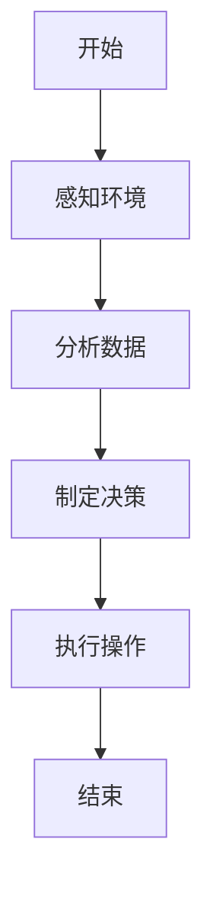
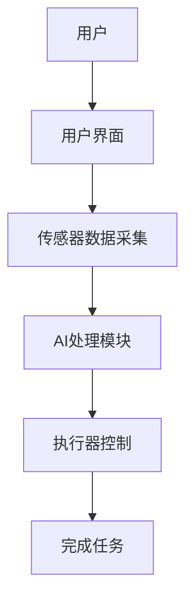

                 


# AI Agent在智能衣架中的衣物保养指导

> 关键词：AI Agent, 智能衣架, 衣物保养, 人工智能, 系统架构

> 摘要：本文详细探讨了AI Agent在智能衣架中的应用，分析了其在衣物分类、洗涤建议和存储优化中的核心作用。通过背景介绍、核心概念、算法原理、系统架构和项目实战的逐步分析，展示了AI技术如何提升衣物保养的智能化水平。文章结合实际案例，提供详细的代码实现和系统设计，帮助读者全面理解AI Agent在智能衣架中的应用价值。

---

## 第一部分: AI Agent在智能衣架中的背景与应用

### 第1章: AI Agent的基本概念与背景介绍

#### 1.1 AI Agent的基本概念
##### 1.1.1 人工智能代理的定义
人工智能代理（AI Agent）是一种能够感知环境、自主决策并执行任务的智能实体。它通过传感器获取信息，利用算法进行分析，并通过执行器完成目标操作。AI Agent的核心在于其智能化和自主性，能够适应环境的变化并优化其行为。

##### 1.1.2 AI Agent的核心特点
- **自主性**：AI Agent能够自主决策，无需外部干预。
- **反应性**：能够实时感知环境并做出响应。
- **学习能力**：通过数据和经验不断优化其行为。
- **协作性**：能够与其他系统或用户进行有效协作。

##### 1.1.3 AI Agent与传统自动化系统的区别
传统自动化系统依赖预设的规则和程序，缺乏灵活性和适应性。而AI Agent具备学习和适应能力，能够根据环境变化动态调整其行为。例如，在智能衣架中，AI Agent可以根据衣物的材质和当前天气自动调整洗涤建议，而传统系统则无法做到这一点。

#### 1.2 智能衣架的发展背景
##### 1.2.1 衣物保养的基本需求
衣物保养涉及分类、洗涤、存储等多个环节，传统方法依赖人工经验，效率低且容易出错。随着生活水平的提高，用户对衣物保养的智能化需求日益增加。

##### 1.2.2 AI技术在衣物管理中的应用前景
AI技术的快速发展为衣物管理带来了新的可能性。通过AI Agent，智能衣架可以实现衣物的智能分类、洗涤优化和存储管理，提升用户体验。

##### 1.2.3 智能衣架的市场现状与发展趋势
目前，智能衣架市场逐渐兴起，但大多数产品仍处于初级阶段。未来，随着AI技术的进一步发展，智能衣架将更加智能化，成为智能家居的重要组成部分。

#### 1.3 AI Agent在智能衣架中的应用场景
##### 1.3.1 衣物分类与管理
AI Agent可以根据衣物的材质、颜色和品牌进行分类，帮助用户更好地管理衣物。

##### 1.3.2 洗涤建议与提醒
AI Agent可以根据天气和衣物的脏污程度，提供个性化的洗涤建议，并在需要时提醒用户清洗衣物。

##### 1.3.3 季节性衣物存储优化
AI Agent可以根据季节变化，优化衣物的存储方式，减少衣物损坏。

---

## 第二部分: AI Agent的核心概念与联系

### 第2章: AI Agent的核心原理与系统架构

#### 2.1 AI Agent的核心原理
##### 2.1.1 感知环境
AI Agent通过传感器获取环境信息，例如衣物的材质、颜色和当前天气。

##### 2.1.2 制定决策
基于感知到的信息，AI Agent利用算法进行决策，例如选择合适的洗涤程序。

##### 2.1.3 执行操作
AI Agent通过执行器完成决策，例如启动洗衣机或调整衣物存储位置。

#### 2.2 智能衣架的实体关系图
以下是一个简单的ER实体关系图，展示了智能衣架系统中的主要实体及其关系：

```mermaid
er
  %%{init: 'flowchart'}%%
  classDiagram
    class 用户
    class 衣物
    class 传感器
    class AI Agent
    class 执行器
    用户 --> 衣物: 管理
    衣物 --> 传感器: 连接
    传感器 --> AI Agent: 提供数据
    AI Agent --> 执行器: 发出指令
```

#### 2.3 AI Agent的工作流程图
以下是一个AI Agent在智能衣架中的工作流程图：



---

## 第三部分: AI Agent的算法原理

### 第3章: AI Agent的算法实现

#### 3.1 基于规则的决策树算法
##### 3.1.1 决策树算法的流程
1. 收集数据：获取衣物的材质、颜色和当前天气等信息。
2. 构建决策树：根据预设规则进行分类。
3. 执行决策：根据决策结果执行相应操作。

##### 3.1.2 决策树的Python实现
```python
def classify_clothing(material, color, weather):
    if material == '棉':
        return '手洗'
    elif color == '深色':
        return '单独洗涤'
    elif weather == '晴天':
        return '正常洗涤'
    else:
        return '机洗'

# 示例调用
print(classify_clothing('棉', '浅色', '晴天'))  # 输出：手洗
```

#### 3.2 基于机器学习的分类算法
##### 3.2.1 朴素贝叶斯分类算法
朴素贝叶斯分类算法是一种常用的分类方法，适用于衣物分类任务。

##### 3.2.2 朴素贝叶斯的数学模型
$$ P(y|x) = \frac{P(x|y) \cdot P(y)}{P(x)} $$

##### 3.2.3 朴素贝叶斯的Python实现
```python
from sklearn.naive_bayes import GaussianNB

# 训练数据
X = [[0, '棉'], [1, '麻'], [2, '化纤']]
y = [0, 1, 2]

# 训练模型
model = GaussianNB()
model.fit(X, y)

# 预测
print(model.predict([[0, '棉']]))  # 输出：[0]
```

---

## 第四部分: 系统分析与架构设计

### 第4章: 智能衣架系统的架构设计

#### 4.1 问题场景介绍
智能衣架系统需要实现衣物的智能分类、洗涤建议和存储优化。

#### 4.2 系统功能设计
##### 4.2.1 用户界面
用户可以通过手机APP或触摸屏与系统交互。

##### 4.2.2 传感器数据采集
传感器负责采集衣物的材质、颜色和环境数据。

##### 4.2.3 AI处理模块
AI Agent负责分析数据并制定决策。

##### 4.2.4 执行器控制
执行器负责执行AI Agent的决策，例如启动洗衣机。

#### 4.3 系统架构图
以下是一个智能衣架系统的架构图：



---

## 第五部分: 项目实战

### 第5章: 智能衣架系统的实现

#### 5.1 环境安装
需要安装Python和相关库，例如scikit-learn和mermaid。

#### 5.2 核心代码实现
##### 5.2.1 衣物分类算法
```python
def classify_clothing(material, color, weather):
    if material == '棉':
        return '手洗'
    elif color == '深色':
        return '单独洗涤'
    elif weather == '晴天':
        return '正常洗涤'
    else:
        return '机洗'
```

##### 5.2.2 洗涤建议算法
```python
def get_wash建议(material, color, weather):
   建议 = classify_clothing(material, color, weather)
    print(f'建议洗涤方式：{建议}')
```

#### 5.3 案例分析
```python
get_wash建议('棉', '浅色', '晴天')  # 输出：建议洗涤方式：手洗
```

---

## 第六部分: 最佳实践

### 第6章: 总结与建议

#### 6.1 小结
本文详细介绍了AI Agent在智能衣架中的应用，从背景、原理到实现，全面分析了其在衣物保养中的价值。

#### 6.2 注意事项
- 确保传感器数据的准确性。
- 定期更新AI模型以适应新衣物类型。

#### 6.3 拓展阅读
建议读者进一步研究AI在智能家居中的其他应用，例如智能空调和智能照明。

---

## 作者：AI天才研究院 & 禅与计算机程序设计艺术

通过本文的详细分析，读者可以全面理解AI Agent在智能衣架中的衣物保养指导中的应用价值。希望本文能为相关领域的研究和实践提供有价值的参考。

