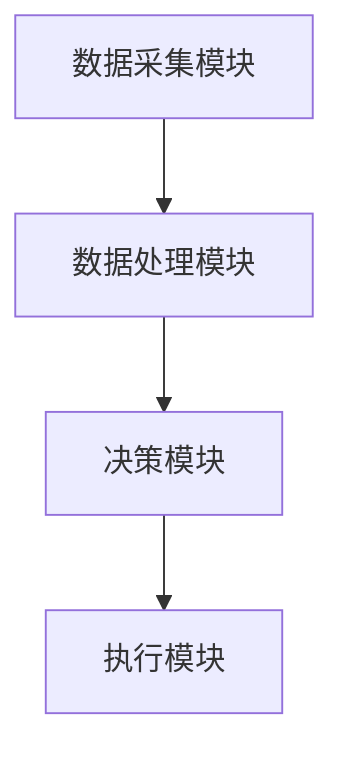
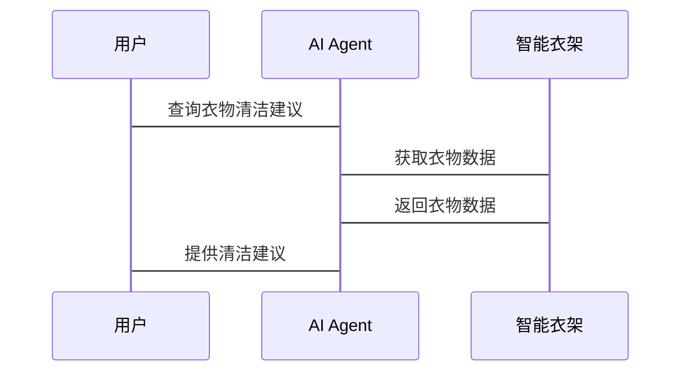

                 


# AI Agent在智能衣架中的衣物清洁建议

## 关键词：AI Agent，智能衣架，衣物清洁，算法原理，系统架构，项目实战

## 摘要：  
本文探讨了AI Agent在智能衣架中的应用，特别是如何通过AI技术优化衣物清洁建议。文章从AI Agent的基本概念出发，逐步分析其在智能衣架中的核心原理、数学模型、系统架构，并通过实际案例展示AI Agent在衣物清洁建议中的应用场景。通过本文，读者将深入了解AI Agent如何通过数据采集、分析、决策和执行等步骤，为用户提供智能化的衣物清洁建议。

---

## 第一部分: AI Agent在智能衣架中的背景与概念

### 第1章: AI Agent与智能衣架概述

#### 1.1 AI Agent的基本概念
##### 1.1.1 AI Agent的定义
AI Agent（人工智能代理）是指能够感知环境、做出决策并执行任务的智能实体。它通过接收输入数据、分析信息、制定策略并执行操作来实现特定目标。

##### 1.1.2 AI Agent的核心特点
- **自主性**：能够自主决策，无需外部干预。
- **反应性**：能够实时感知环境变化并做出响应。
- **目标导向**：所有行为都以实现特定目标为导向。
- **学习能力**：通过数据和经验不断优化自身的决策能力。

##### 1.1.3 AI Agent与传统自动化的区别
| 特性 | AI Agent | 传统自动化 |
|------|----------|------------|
| 决策能力 | 高度智能，可自适应 | 基于固定规则，不可自适应 |
| 学习能力 | 具备学习能力 | 无学习能力 |
| 灵活性 | 高度灵活，适用于复杂场景 | 灵活性较低，适用于简单场景 |

#### 1.2 智能衣架的应用背景
##### 1.2.1 衣物清洁的传统方式与挑战
传统衣物清洁方式依赖人工经验，存在以下问题：
- 清洁效果不稳定，容易因操作人员的经验不足而出现问题。
- 清洁效率低，人工操作耗时耗力。
- 清洁剂使用不当，可能导致衣物损坏或清洁不彻底。

##### 1.2.2 智能衣架的定义与目标
智能衣架是一种结合了物联网（IoT）和AI技术的衣物管理设备，能够通过传感器和AI算法实现衣物的智能分类、清洁建议和维护管理。

##### 1.2.3 AI Agent在智能衣架中的角色
AI Agent在智能衣架中的主要角色是：
- **数据采集**：通过传感器获取衣物的重量、材质、颜色等信息。
- **数据分析**：分析衣物的使用情况，判断是否需要清洁。
- **决策制定**：基于数据分析结果，为用户提供清洁建议。
- **执行指令**：通过与智能清洁设备的联动，实现自动清洁。

#### 1.3 本章小结
本章介绍了AI Agent的基本概念及其在智能衣架中的应用背景，强调了AI Agent在衣物清洁建议中的重要性。

---

## 第二部分: AI Agent的核心概念与原理

### 第2章: AI Agent的核心原理

#### 2.1 AI Agent的基本原理
##### 2.1.1 信息感知与数据采集
AI Agent通过传感器、摄像头等设备采集环境数据。例如，在智能衣架中，AI Agent可以通过重量传感器感知衣物的重量变化，通过颜色传感器识别衣物的颜色。

##### 2.1.2 数据处理与分析
AI Agent将采集到的数据进行预处理（如去噪、归一化）后，通过机器学习算法进行分析。例如，使用聚类算法对衣物进行分类，使用回归算法预测衣物的使用频率。

##### 2.1.3 决策与执行
AI Agent根据分析结果制定决策，并通过执行模块（如智能清洁设备）完成任务。例如，AI Agent可以决定何时启动清洁程序，并选择合适的清洁剂。

#### 2.2 AI Agent的算法原理
##### 2.2.1 基于规则的AI Agent
基于规则的AI Agent通过预定义的规则进行决策。例如，当衣物的使用天数超过7天时，AI Agent会建议进行清洗。

##### 2.2.2 基于机器学习的AI Agent
基于机器学习的AI Agent通过训练模型进行决策。例如，使用支持向量机（SVM）对衣物的材质进行分类。

##### 2.2.3 基于强化学习的AI Agent
基于强化学习的AI Agent通过与环境的交互不断优化决策策略。例如，AI Agent可以通过试错学习，找到最优的清洁时间安排。

#### 2.3 AI Agent的实现步骤
##### 2.3.1 数据采集与预处理
- 数据采集：通过传感器获取衣物的重量、颜色、材质等数据。
- 数据预处理：对数据进行去噪、归一化处理，确保数据质量。

##### 2.3.2 模型训练与优化
- 选择合适的算法：根据具体任务选择机器学习或强化学习算法。
- 训练模型：使用训练数据对模型进行训练，优化模型性能。

##### 2.3.3 模型部署与应用
- 部署模型：将训练好的模型部署到智能衣架中。
- 应用模型：通过AI Agent调用模型进行决策和执行。

#### 2.4 本章小结
本章详细讲解了AI Agent的核心原理，包括信息感知、数据处理、决策制定和执行等关键步骤。

---

## 第三部分: AI Agent的数学模型与算法实现

### 第3章: AI Agent的数学模型

#### 3.1 基于规则的AI Agent模型
##### 3.1.1 规则的表示方法
基于规则的模型通常使用条件语句进行表示。例如：
```python
if 使用天数 > 7:
    建议清洗
else:
    不建议清洗
```

##### 3.1.2 规则的匹配与执行
基于规则的模型通过匹配条件语句进行决策。例如，当衣物的使用天数超过7天时，AI Agent会触发清洗程序。

##### 3.1.3 规则的优化与调整
规则的优化可以通过增加更多条件或调整权重来实现。例如，可以将规则扩展为：
```python
if (使用天数 > 7) and (衣物材质 == "棉质"):
    建议清洗
elif (使用天数 > 10) and (衣物颜色 == "深色"):
    建议清洗
else:
    不建议清洗
```

#### 3.2 基于机器学习的AI Agent模型
##### 3.2.1 机器学习的基本原理
机器学习通过训练数据，学习输入与输出之间的关系。例如，使用支持向量机（SVM）对衣物材质进行分类。

##### 3.2.2 常见的机器学习算法
- 线性回归
- 支持向量机（SVM）
- 随机森林
- 神经网络

##### 3.2.3 算法的选择与优化
算法的选择取决于具体任务。例如，对于分类任务，SVM和随机森林是较好的选择；对于回归任务，线性回归和神经网络是较好的选择。

#### 3.3 基于强化学习的AI Agent模型
##### 3.3.1 强化学习的基本原理
强化学习通过试错学习，优化决策策略。例如，AI Agent可以通过不断尝试不同的清洁时间安排，找到最优策略。

##### 3.3.2 常见的强化学习算法
- Q-Learning
- Deep Q-Networks（DQN）
- 策略梯度法（Policy Gradient）

##### 3.3.3 算法的实现与应用
强化学习算法的实现通常需要定义状态、动作和奖励。例如：
- 状态：衣物的使用天数、衣物的污渍程度。
- 动作：建议清洗或不建议清洗。
- 奖励：如果建议清洗，奖励为1；如果不建议清洗，奖励为0。

#### 3.4 本章小结
本章详细讲解了AI Agent的数学模型，包括基于规则、机器学习和强化学习的模型及其应用。

---

## 第四部分: AI Agent的系统架构与设计

### 第4章: 智能衣架系统架构设计

#### 4.1 系统功能模块划分
##### 4.1.1 数据采集模块
- 功能：通过传感器采集衣物的重量、颜色、材质等数据。
- 输入：衣物放置在衣架上。
- 输出：衣物的重量、颜色、材质等数据。

##### 4.1.2 数据处理模块
- 功能：对采集到的数据进行预处理和分析。
- 输入：衣物的重量、颜色、材质等数据。
- 输出：衣物的分类结果、清洁建议。

##### 4.1.3 决策模块
- 功能：基于分析结果制定决策。
- 输入：衣物的分类结果、清洁建议。
- 输出：是否需要清洗的决策。

##### 4.1.4 执行模块
- 功能：根据决策执行相应的操作。
- 输入：决策结果。
- 输出：启动或停止清洁程序。

#### 4.2 系统架构设计
##### 4.2.1 分层架构设计


##### 4.2.2 系统交互设计


#### 4.3 本章小结
本章详细讲解了智能衣架系统的架构设计，包括功能模块划分和系统交互设计。

---

## 第五部分: AI Agent的项目实战

### 第5章: 项目实战

#### 5.1 环境安装
- **Python环境**：安装Python 3.8及以上版本。
- **机器学习库**：安装Scikit-learn、TensorFlow等。
- **可视化工具**：安装Matplotlib、Seaborn等。

#### 5.2 系统核心实现
##### 5.2.1 数据采集与预处理
```python
import pandas as pd
import numpy as np

# 数据采集
data = pd.read_csv('clothes_data.csv')
# 数据预处理
data.dropna(inplace=True)
data['使用天数'].fillna(data['使用天数'].mean(), inplace=True)
```

##### 5.2.2 模型训练与优化
```python
from sklearn.svm import SVC
from sklearn.model_selection import train_test_split

# 数据分割
X = data[['重量', '颜色', '材质']]
y = data['是否需要清洗']
X_train, X_test, y_train, y_test = train_test_split(X, y, test_size=0.2)

# 模型训练
model = SVC()
model.fit(X_train, y_train)
```

##### 5.2.3 模型部署与应用
```python
# 模型预测
y_pred = model.predict(X_test)
# 模型评估
print("准确率：", model.score(X_test, y_test))
```

#### 5.3 案例分析与详细解读
##### 5.3.1 案例分析
假设我们有以下衣物数据：
| 衣物ID | 使用天数 | 重量(g) | 颜色 | 材质 |
|--------|----------|---------|------|------|
| 1      | 8        | 200     | 白色 | 棉质 |
| 2      | 5        | 150     | 黑色 | 涤纶 |

##### 5.3.2 模型预测
AI Agent会根据模型预测结果，为衣物1提供清洗建议，为衣物2不建议清洗。

#### 5.4 本章小结
本章通过实际案例展示了AI Agent在智能衣架中的应用，从环境安装到模型训练，再到模型部署，详细讲解了项目的实现过程。

---

## 第六部分: 总结与展望

### 第6章: 总结与展望

#### 6.1 本章总结
本文详细探讨了AI Agent在智能衣架中的应用，从基本概念到数学模型，再到系统架构和项目实战，全面分析了AI Agent在衣物清洁建议中的作用。

#### 6.2 未来展望
未来，AI Agent在智能衣架中的应用将更加智能化和个性化，可能的发展方向包括：
- 更精准的衣物分类与清洁建议。
- 更高效的算法优化与模型训练。
- 更智能的设备联动与用户交互。

#### 6.3 最佳实践 tips
- 在实际应用中，建议结合具体场景选择合适的算法。
- 数据采集和预处理是模型训练的关键步骤，需要特别注意数据质量。
- 模型部署后，需要定期监控和优化，确保系统的稳定性和准确性。

#### 6.4 本章小结
本章总结了全文的主要内容，并展望了AI Agent在智能衣架中的未来发展方向。

---

## 作者：AI天才研究院/AI Genius Institute & 禅与计算机程序设计艺术 /Zen And The Art of Computer Programming

