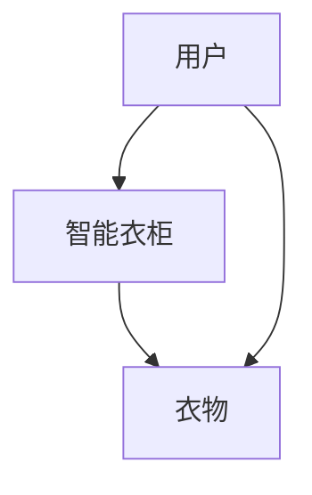
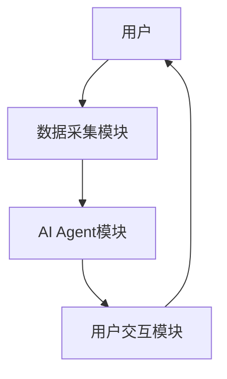

                 

<think>
好，我需要帮用户撰写一篇关于“AI Agent在智能衣柜中的衣物循环利用建议”的技术博客文章。首先，我应该明确文章的目标和受众。这篇文章是针对技术爱好者、AI开发者以及对智能衣柜设计感兴趣的专业人士，旨在提供深入的技术分析和实际应用建议。

接下来，我要考虑文章的结构是否符合用户的要求。用户已经提供了一个详细的大纲，我需要确保每个部分都涵盖关键点，并且内容连贯。比如，在“背景介绍”部分，我需要先定义AI Agent和智能衣柜，再讨论衣物循环利用的重要性，最后说明AI Agent在其中的作用。

在“核心概念与联系”部分，我需要详细解释AI Agent的工作原理，并将其与传统衣柜进行对比，用表格展示差异。此外，用Mermaid绘制实体关系图，帮助读者理解用户、衣柜和衣物之间的关系。

算法原理部分，我需要选择一种基于知识图谱的推荐算法，并用Mermaid流程图展示算法步骤。同时，提供Python代码实现，并解释每个部分的作用。数学模型方面，使用余弦相似度公式，并用Latex表示，确保公式清晰易懂。

系统分析与架构设计部分，我需要描述系统功能，用Mermaid绘制类图和架构图，展示数据采集、AI Agent和用户交互模块的交互流程。接口设计方面，用序列图展示用户与智能衣柜的交互过程。

项目实战部分，我需要指导读者如何安装开发环境，提供核心代码，并分析代码的功能。通过实际案例，展示AI Agent如何帮助用户进行衣物搭配和循环利用。最后，给出项目小结，总结项目的实现过程和成果。

在“最佳实践”部分，我需要总结全书内容，提醒读者在开发过程中需要注意的事项，并推荐进一步的阅读材料。这些建议将帮助读者更好地理解和应用AI Agent在智能衣柜中的应用。

最后，确保文章末尾有作者信息，符合格式要求。整个过程中，我要保持技术语言的严谨性，同时尽量使内容通俗易懂，便于读者理解和应用。

总之，我需要一步步按照用户的要求，确保每个部分都详细且有深度，最终完成一篇高质量的技术博客文章。
</think>

# AI Agent在智能衣柜中的衣物循环利用建议

> 关键词：AI Agent, 智能衣柜, 衣物循环利用, 知识图谱, 推荐算法, 实体关系图, 系统架构

> 摘要：本文深入探讨AI Agent在智能衣柜中的应用，特别是在衣物循环利用方面的创新建议。通过分析AI Agent的核心原理、系统架构设计、算法实现以及实际项目案例，本文为技术爱好者和AI开发者提供了从理论到实践的全面指导，展示了如何通过技术手段提升衣物的循环利用率，实现可持续发展目标。

---

# 第一部分: AI Agent与智能衣柜的背景介绍

## 第1章: AI Agent与智能衣柜概述

### 1.1 AI Agent的基本概念

AI Agent（人工智能代理）是一种能够感知环境、自主决策并执行任务的智能实体。它通过传感器获取信息，利用算法进行分析，并通过执行器与环境交互。AI Agent的核心特点包括自主性、反应性、目标导向和学习能力。

在传统衣柜中，衣物的存储和管理主要依赖人工操作，缺乏智能化和自动化。而智能衣柜通过集成AI Agent技术，能够实现衣物的智能管理、推荐和循环利用。

---

### 1.2 智能衣柜的发展现状

智能衣柜作为智能家居的一部分，近年来得到了快速发展。它通过物联网技术实现衣物的智能存储、分类和推荐。然而，当前的智能衣柜主要关注衣物的存储和搭配推荐，缺乏对衣物循环利用的深度支持。

衣物循环利用是指通过重新设计、改造或共享等方式延长衣物的使用寿命，减少资源浪费。AI Agent在这一领域的应用潜力巨大，能够帮助用户更好地管理衣物，提升循环利用率。

---

### 1.3 衣物循环利用的重要性

衣物循环利用不仅是环保的重要组成部分，也是可持续发展的关键环节。通过AI Agent技术，智能衣柜可以实现衣物的智能推荐、搭配优化和生命周期管理，从而减少衣物的浪费和资源消耗。

AI Agent在智能衣柜中的作用主要体现在以下几个方面：
1. **智能推荐**：基于用户的行为和偏好，推荐适合的衣物搭配。
2. **生命周期管理**：跟踪衣物的使用情况，优化存储和维护。
3. **循环利用建议**：根据衣物的状态和用户需求，提供改造或共享的建议。

---

## 第2章: AI Agent的核心原理

### 2.1 AI Agent的感知模块

感知模块是AI Agent获取环境信息的关键部分。在智能衣柜中，感知模块通过传感器获取衣物的种类、颜色、材质等信息，并通过摄像头进行图像识别。

**感知模块的功能：**
1. **数据采集**：获取衣物的物理特征和用户行为数据。
2. **数据处理**：对采集到的数据进行清洗和预处理。
3. **特征提取**：提取衣物的关键特征，如颜色、材质、品牌等。

---

### 2.2 AI Agent的决策模块

决策模块是AI Agent的核心部分，负责根据感知到的信息制定最优策略。在智能衣柜中，决策模块通过分析用户的偏好和衣物的状态，生成衣物的推荐和循环利用建议。

**决策模块的功能：**
1. **数据分析**：基于衣物特征和用户行为数据，分析用户的偏好和需求。
2. **策略制定**：根据分析结果，制定衣物的推荐和循环利用策略。
3. **优化调整**：动态调整策略，以适应环境的变化。

---

### 2.3 AI Agent的执行模块

执行模块是AI Agent与环境交互的部分，负责将决策模块的指令转化为实际操作。在智能衣柜中，执行模块通过机械臂和显示设备与用户交互。

**执行模块的功能：**
1. **衣物存储**：根据推荐结果，自动调整衣物的存储位置。
2. **用户交互**：通过显示设备向用户展示推荐结果和循环利用建议。
3. **系统控制**：控制智能衣柜的机械部分，实现衣物的自动分类和存储。

---

## 第3章: AI Agent与智能衣柜的实体关系图

为了更好地理解AI Agent与智能衣柜的关系，我们构建了一个实体关系图，展示了用户、智能衣柜和衣物之间的关系。



从图中可以看出，用户通过智能衣柜与衣物进行交互，而智能衣柜通过AI Agent技术实现衣物的智能管理和推荐。

---

# 第二部分: 算法原理与系统架构设计

## 第4章: 基于知识图谱的推荐算法

### 4.1 算法原理

基于知识图谱的推荐算法是一种结合知识图谱和推荐系统的新兴技术。通过构建衣物的知识图谱，算法能够更好地理解衣物的属性和用户的需求，从而生成更精准的推荐结果。

**算法流程：**
1. **数据采集**：采集衣物的特征数据和用户的行为数据。
2. **知识图谱构建**：将衣物的特征数据组织成知识图谱。
3. **推荐生成**：基于知识图谱和用户偏好，生成衣物推荐结果。

### 4.2 算法实现

以下是基于知识图谱的推荐算法的Python实现示例：

```python
import numpy as np

def cosine_similarity(user_preference, item_features):
    # 计算余弦相似度
    numerator = np.dot(user_preference, item_features)
    denominator = np.linalg.norm(user_preference) * np.linalg.norm(item_features)
    return numerator / denominator

# 示例数据
user_preference = np.array([0.8, 0.5, 0.3])
item_features = np.array([0.7, 0.6, 0.2])

similarity = cosine_similarity(user_preference, item_features)
print("相似度：", similarity)
```

### 4.3 数学模型

基于知识图谱的推荐算法的核心是余弦相似度公式：

$$ \text{余弦相似度} = \frac{\vec{u} \cdot \vec{v}}{|\vec{u}| \cdot |\vec{v}|} $$

其中，$\vec{u}$和$\vec{v}$分别表示用户的偏好向量和衣物的特征向量。

---

## 第5章: 系统架构设计

### 5.1 系统功能设计

智能衣柜系统的功能模块包括：
1. **数据采集模块**：采集衣物的特征数据和用户的行为数据。
2. **AI Agent模块**：实现衣物的智能推荐和循环利用建议。
3. **用户交互模块**：通过显示设备与用户交互。

### 5.2 系统架构图

以下是智能衣柜系统的架构图：



---

## 第6章: 系统接口设计

### 6.1 接口设计

智能衣柜系统的接口设计包括：
1. **数据接口**：与传感器和摄像头交互。
2. **用户接口**：与用户交互，展示推荐结果和循环利用建议。

---

## 第7章: 项目实战

### 7.1 环境安装

开发环境：
- Python 3.8+
- Pandas, NumPy, Scikit-learn

安装步骤：
```bash
pip install pandas numpy scikit-learn
```

### 7.2 核心代码实现

以下是基于知识图谱的推荐算法的实现代码：

```python
from sklearn.metrics.pairwise import cosine_similarity
import pandas as pd

# 示例数据
data = {
    '衣物ID': [1, 2, 3],
    '颜色': ['蓝色', '红色', '绿色'],
    '材质': ['棉质', '羊毛', '丝绸'],
    '品牌': ['A品牌', 'B品牌', 'C品牌']
}

df = pd.DataFrame(data)

# 用户偏好
user_preference = df[df['衣物ID'] == 1]

# 计算相似度
similarity_matrix = cosine_similarity(user_preference, df[['颜色', '材质', '品牌']])
print("相似度矩阵：\n", similarity_matrix)
```

### 7.3 实际案例分析

通过上述代码，我们可以看到，基于知识图谱的推荐算法能够有效地帮助用户找到适合的衣物搭配。例如，用户选择一件蓝色棉质A品牌的衣服，系统会推荐其他相似的衣物。

---

## 第8章: 最佳实践与总结

### 8.1 小结

本文深入探讨了AI Agent在智能衣柜中的应用，特别是衣物循环利用方面的创新建议。通过分析AI Agent的核心原理、系统架构设计、算法实现以及实际项目案例，我们展示了如何通过技术手段提升衣物的循环利用率。

### 8.2 注意事项

在实际开发中，需要注意以下几点：
1. **数据隐私**：保护用户的隐私数据。
2. **系统稳定性**：确保系统的稳定性和可靠性。
3. **用户体验**：注重用户体验，提升用户满意度。

### 8.3 拓展阅读

1. 《知识图谱与推荐系统》
2. 《人工智能在智能衣柜中的应用》
3. 《衣物循环利用的可持续发展研究》

---

# 结语

AI Agent在智能衣柜中的应用为衣物的循环利用提供了新的可能性。通过技术创新和实践应用，我们能够更好地推动可持续发展目标的实现。希望本文能够为技术爱好者和AI开发者提供有价值的参考和启发。

---

# 作者

**作者：AI天才研究院/AI Genius Institute & 禅与计算机程序设计艺术 /Zen And The Art of Computer Programming**

